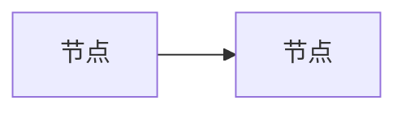

# 学习总结与面试题整理

将学习内容（框架教程、示例代码）转化为两份产出：**SUMMARY.md**（知识点学习总结）与 **INTERVIEW.md**（行业面试题库），并在后续对话中持续维护面试题库。

## 功能概览

| # | 功能 | 产出 | 触发方式 |
|---|------|------|---------|
| 1 | 知识点总结 | `SUMMARY.md` | 用户明确要求"整理知识点/总结学习" |
| 2 | 面试题整理 | `INTERVIEW.md` | 用户明确要求"整理面试题/求职准备" |
| 3 | 面试题收录维护 | 追加到 `INTERVIEW.md` | 用户提技术问题时自动判断 |

---

## 功能一：知识点总结（SUMMARY.md）

### 目标读者

面向「初步上手但尚未熟练掌握」的初学者，知识点要**细致**，让读者能据此复习、查漏补缺。

### 执行步骤

1. **确定范围**：用户会指定多个目录（如某个框架/版本的教程目录）。**按用户指定的顺序**逐个目录阅读所有源码文件。
2. **提取知识点**：逐个文件提取语法点、API 用法、设计模式，而非只列文件名。要覆盖到「函数/参数/返回值的具体用法」这一层。
3. **归纳组织**：按「框架 → 主题 → 知识点」三级组织。每个知识点配一个精简可运行的最小代码片段。
4. **额外补充标记**：正文内容来自源码，是对用户已有内容的归纳；额外补充的背景原理/易错点/最佳实践，统一用 `⚠️ 额外补充` 标记，让用户能区分「自己整理的」和「额外补充的」。
5. **输出**：保存为 `SUMMARY.md`（默认放在总结范围的根目录，与待总结目录同级）。

### 语言与格式

- 中文解释，代码标识符/技术术语/文件路径保留英文，不给英文术语加中文引号或翻译。
- 用表格承载「多属性对比」类内容，减少长段落。
- 每个知识点附最小可运行代码片段（标明 `python`）。

---

## 功能二：面试题整理（INTERVIEW.md）

### 行业与目标企业识别

根据整理出的知识点，自动识别其所属行业（如互联网、金融、制造、医疗、自动驾驶、芯片等），再定位该行业内的头部企业，搜索这些企业的最新面试题。行业与企业不固定，随知识点变化，不预设任何特定行业。

### 题目分级（必须严格三级）

| 级别 | 定位 | 典型主题 |
|------|------|---------|
| **高频** | 几乎必考，倒背如流 | 该领域最基础、最核心的概念与原理 |
| **低频** | 进阶有深度，社招/资深岗常问 | 该领域的进阶机制、优化手段、工程难点 |
| **少数了解** | 拔高/专家向，加分项 | 该领域的前沿方向、专家级内容 |

### 题目覆盖范围（两类都要有）

1. **大场景设计题**（主章节）：刻意偏向**生产环境真实场景**——高并发、大规模、成本、稳定性、合规，绑定该行业的真实业务痛点。**不能局限于小场景**，题目场景要大而复杂，给用户充足准备空间。
2. **具体知识点题**（**单独一个章节**）：考察具体语法/API（如语言基础、框架 API、关键机制等，随知识点领域而定），因为一面和基础面会考具体知识点。这类题不特定某家企业，标 `通用`。

### 每题五部分结构（ALWAYS 遵循，顺序固定）

1. 🎯 **考点**：题目的考察重点 + 生产环境核心关键点（一句话点破考什么、卡在哪）
2. 📌 **知识点**：分点 1/2/3/4，`**关键词** —— 一句话简介`，让用户一眼扫出核心骨架
3. 💡 **类比**：生动形象的比喻/类比，帮助快速理解要点间的联系与作用
4. 🖼️ **图**：Mermaid 图，一眼看清知识点间的关系
5. 🗣️ **话术**：可直接临场口述的完整回答（先结论、再分点展开）

### 画图规范（🖼️ 图）

- 用 Mermaid（`flowchart` 为主，交互场景用 `sequenceDiagram`），markdown 原生渲染。
- 图要**详细、一眼能看到大部分信息**：
  - 用 `subgraph` 分区（如离线/在线、不同分支）
  - 用虚线 `-.->` 标注「核心思路/口诀」等非主流程信息
  - 用 `{ }` 判断节点表达决策/路由
  - 节点文字精炼成「**关键词 + 一句话**」
- 优先用 `flowchart TB`（上→下）或 `LR`（左→右），按内容选方向。

### 题目五部分结构模板

````markdown
### QN. 题目（企业）

🎯 **考点**：一句话点破考察重点 + 生产环境关键点

📌 **知识点**：
1. **关键词** —— 一句话简介
2. **关键词** —— 一句话简介
3. **关键词** —— 一句话简介

💡 **类比**：一句话生动比喻

🖼️ **图**：


🗣️ **话术**：先结论、再分点展开的完整口述回答
````

### 执行步骤

1. 阅读目标目录源码，提炼可考察的知识点。
2. 用 WebSearch 搜索该行业头部企业的最新面试题与技术热点，确保「行业最新面试会出现」。
3. 按三级分类，覆盖大场景 + 具体知识点两类，逐题按五部分结构撰写。
4. 每题标注「常见考察企业」，具体知识点题标 `通用`。
5. 保存为 `INTERVIEW.md`（默认与 SUMMARY.md 同目录）。

---

## 功能三：新问题收录判断（持续维护）

当用户在对话中提出技术问题时，**先正常回答问题**，再判断是否收录进 `INTERVIEW.md`：

| 判断结论 | 处理方式 |
|---------|---------|
| **日常琐碎问题**（改 typo、查天气、无关闲聊） | 不理会，正常回答即可 |
| **太简单的问题**（基础到不足以进面试题，如「什么是变量」） | 回答完后，**询问用户**「要不要收录到面试题 md 中」 |
| **很有价值的问题**（行业最新面试会出现、有生产深度） | **自动收录**到 `INTERVIEW.md` 对应级别位置 |

### 收录执行规范

1. **识别级别**：按「高频/低频/少数了解」标准判断该题属于哪一级。
   - 高频：几乎人人被问的基础/核心机制
   - 低频：进阶有深度、有经验才被深入问
   - 少数了解：前沿架构/拔高加分项
2. **放到对应位置**：插入 `INTERVIEW.md` 对应级别的小节；若需在已有小节间插入新小节，同步更新目录、顺延后续题目编号。
3. **按五部分结构撰写**：考点 / 知识点 / 类比 / Mermaid 图 / 话术，缺一不可。
4. 若与已有题目主题重复，优先补充到已有题目中而非新建。

---

## 展示原则

- 终端输出精炼：只报「产出了什么、放哪了、覆盖范围摘要」，完整内容让用户看文件。
- 数据/对比优先用表格。
- 结论先行（BLUF），不铺垫背景。
- 每次维护后，明确告知「新增/修改了哪些题、编号如何顺延」。
