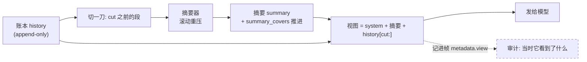
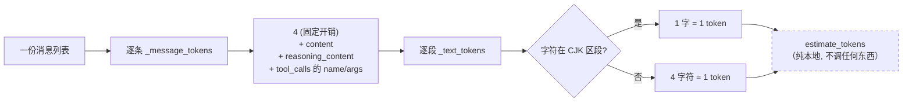
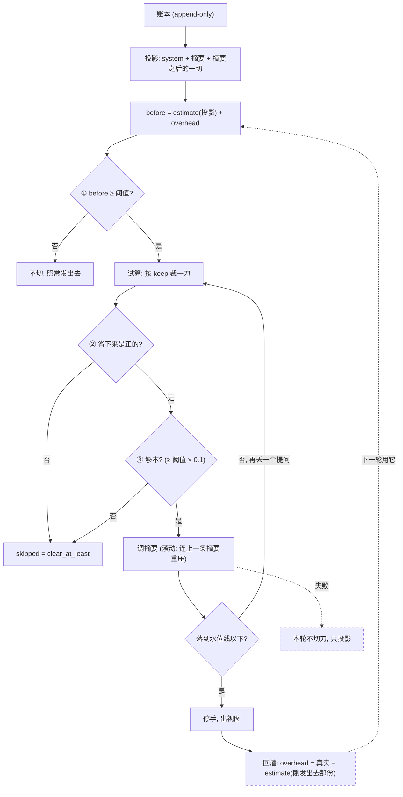
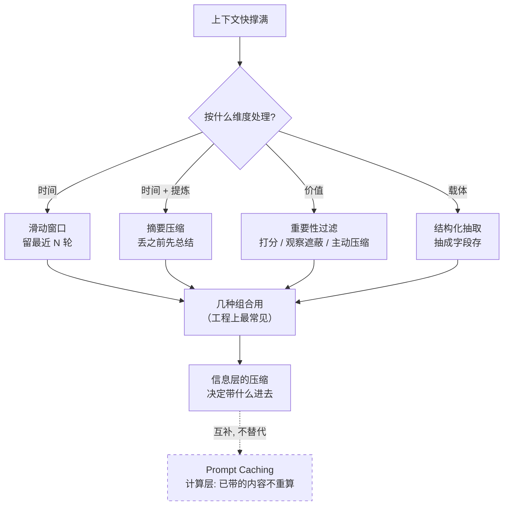
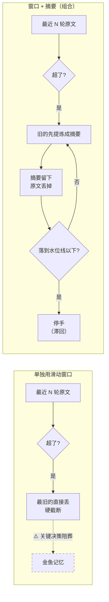
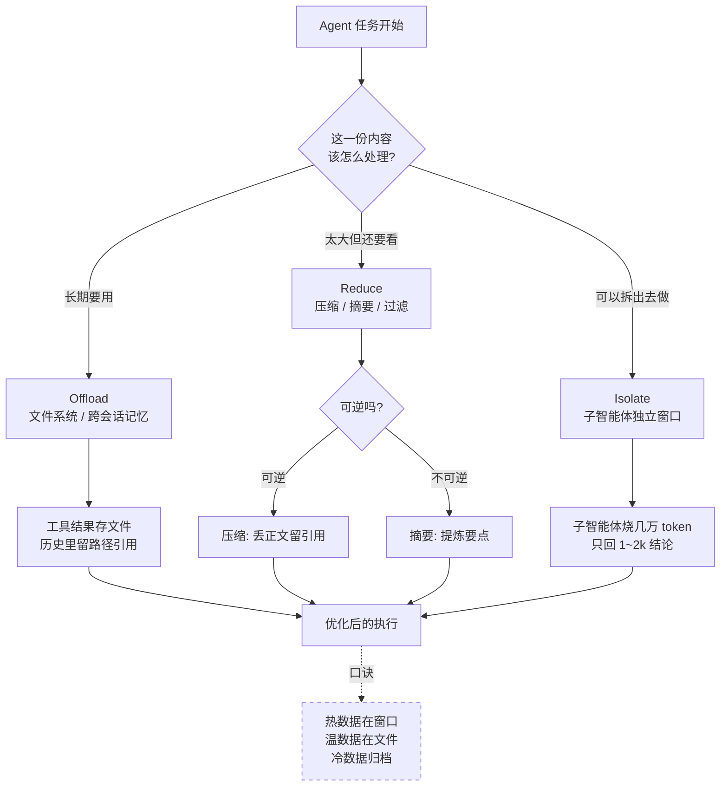
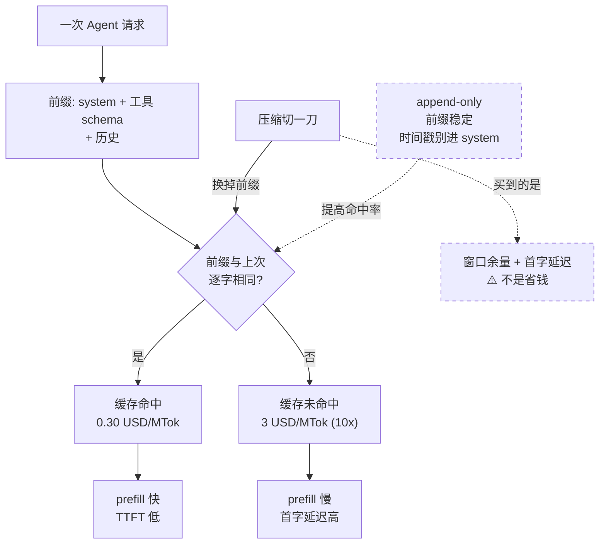
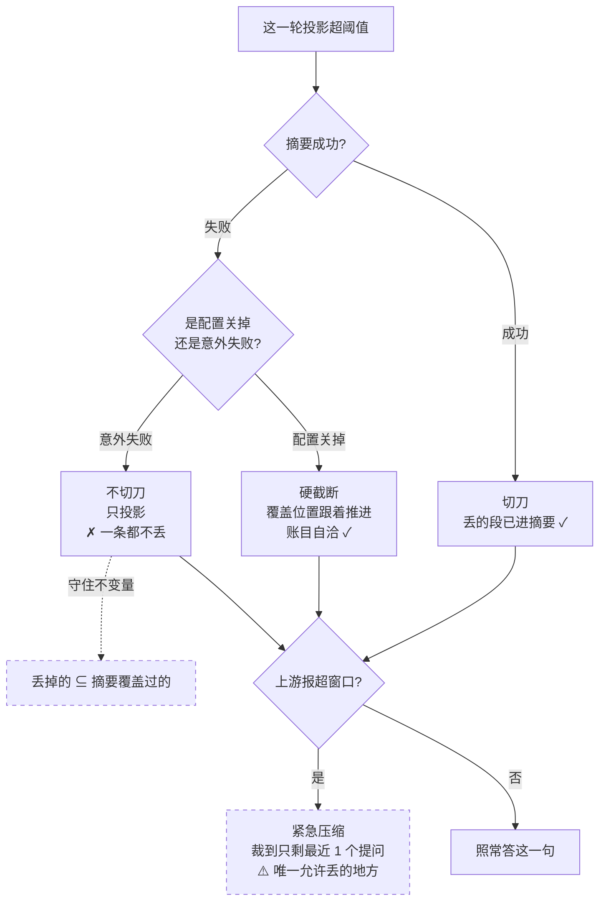
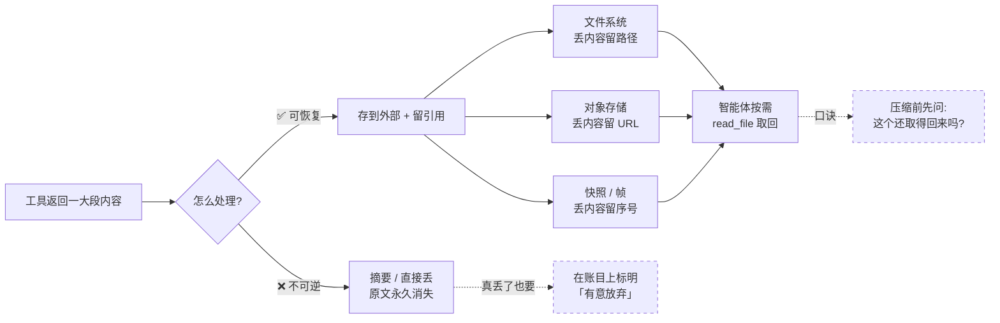
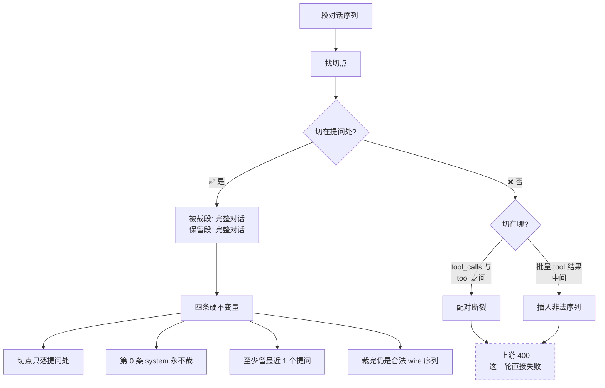

# 上下文压缩 · 专题底稿

> **本目录共五份专题底稿**：[01 上下文压缩](./01-context-compaction.md) · [02 可观测](./02-observability.md) · [03 人机确认](./03-hitl-approval.md) · [04 无状态化与 graceful drain](./04-stateless-and-drain.md) · [05 多智能体](./05-multiagent.md)。
> 覆盖：CharAgent 的压缩层（账本 / 视图分离 + 滚动摘要 + 工具结果截断），对应 `CharAgent/docs/DESIGN.md` #7；决策记录 **ADR-0008 / 0011 / 0012 / 0013**；`CharApp` 侧的装配参数。
> 代码锚点（行号按 2026-10-08 工作区记）：[`CharAgent/agent/compaction.py`](../../../CharAgent/agent/compaction.py) · [`CharAgent/agent/utils/messages.py`](../../../CharAgent/agent/utils/messages.py) · [`CharAgent/agent/loop.py`](../../../CharAgent/agent/loop.py) · [`CharApp/minimall/config.py`](../../../CharApp/minimall/config.py)。
> 行业侧只引**一手**（官方文档 / 官方博客 / 官方源码），原文摘录统一放在 [§8](#8-行业一手来源原文摘录)。

---

## 0. 五分钟版

### 0.1 一句话

**压缩不是「删历史」，是「投影」** —— 账本 append-only 一字不改，每次调用前从账本切出一份要发出去的视图；触发判据量的是**投影**（这一轮真要发的那份），压完必须落到水位线以下才停手。

### 0.2 七个问题的一条线

| # | 问题 | 一句话答案 | 层 |
|---|------|-----------|----|
| Q1 | 对话快把上下文撑满了怎么办 | 四方法版图（窗口 / 摘要 / 重要性过滤 / 结构化抽取）+ **Prompt Caching 是计算层补充，不是替代** | 高频 |
| Q2 | 为什么摘要和滑动窗口要一起用 | 互补：窗口管总长、摘要管「丢弃前的提炼」；单独用窗口 = 硬截断，单独用摘要 = 无界 + 丢细节 | 高频 |
| Q3 | 生产级 Agent 的上下文治理怎么设计 | 三层：**Offload**（搬去文件系统）/ **Reduce**（压缩 + 摘要 + 过滤）/ **Isolate**（子智能体只回结论） | 低频 |
| Q4 | 压缩的代价是什么 | 压缩切一刀就换前缀，新前缀按**未命中价**重付 —— 它买的是窗口余量与首字延迟，**不是省钱**；KV-cache 命中率是第一指标 | 低频 |
| Q5 | 摘要调用失败了怎么办 | **不切刀**，退到「只投影」；只有上游明确报超窗口才允许硬截断 | 低频 |
| Q6 | 怎么让压缩「可恢复」 | 丢正文留引用（URL / 路径 / 快照序号），让模型按需取回 —— 一般实现与生产级实现的**分水岭** | 少数了解 |
| Q7 | 切点为什么不能落在 `tool_calls` 与 `tool` 之间 | wire 协议的硬约束：配对断裂不是「信息少了」，是整个请求被上游 **400** | 具体知识点 |

### 0.3 硬数字（都有出处，见 §8）

- **10×**：Claude Sonnet 的缓存价差 —— 命中输入 \$0.30/MTok vs 未命中 \$3/MTok；而 Agent 的平均输入输出比约 **100:1**，prefill 是绝对大头。
- **95%**：Claude Code 触发压缩的窗口占用比例，压缩后保留**最近 5 个访问过的文件**。
- **32000 / 0.7 / 0.1**：`CharApp` 生产装配 —— 阈值 32000 token、水位线比例 0.7（目标 22400）、`clear_at_least` 比例 0.1；摘要输入上限 8000，保留最近 6 个提问（`CharApp/minimall/config.py:107-111`）。
- **≈ 3600 token**：固定开销的实测来源之一 —— 17 个工具 schema 的估算（2026-09 实测；工具数现已增至 **22 个**，该值未重测，见 §5）。
- **1739** 用例：CharAgent 当前测试总数（默认跑 1594）。

### 0.4 这专题最值钱的三句话

1. **「压缩不是删历史，是投影。」** —— 账本 append-only 一字不改，压缩只影响这一次请求发出去的视图；帧里还记着「那一轮真发出去的那份」（`metadata.view`），事后答得出「当时它看到了什么」。
2. **「触发判据量的是投影，不是账本。」** —— 账本只增不减，拿它判的话压完一次就永远超线、每轮都切一刀；量投影之后，水位线的滞回是自然长出来的。
3. **「摘要失败不切刀。」** —— 守住一条硬不变量：丢掉的段必须**已经被摘要覆盖过**（`dropped ⊆ summary_covers`）。失败时退到「只投影」，一条消息都不丢。

---

## 1. 行业全景

### 1.1 面试侧的两套主流框架

| 框架 | 分类 | 关键提醒 |
|------|------|---------|
| 四方法（中文面经里最常引） | 滑动窗口 · 摘要压缩 · 重要性过滤 · 结构化抽取 | **Prompt Caching 是「计算层」补充，不是替代** —— 主动点出这层区别是加分项 |
| Offload / Reduce / Isolate | 卸载（文件系统 / 脚本化 / 渐进披露）· 精简（压缩 / 摘要 / 过滤）· 隔离（子智能体） | 三策略解决三个不同问题：放哪儿、留什么、谁来做 |

### 1.2 企业侧的关键做法（一手来源）

| 来源 | 做法 | 对本项目的意义 |
|------|------|--------------|
| **Anthropic**《Effective context engineering for AI agents》（2025-09-29） | compaction（Claude Code 95% 触发，保留最近 5 个访问过的文件）+ structured note-taking + multi-agent 三件套；**「先最大化 recall，再优化 precision」**；最轻量的压缩是 **tool result clearing** | 「先 recall 后 precision」是调摘要 prompt 的方法论；tool result clearing = 我的 `tool_result_limit` |
| **Anthropic context editing API** | `clear_tool_uses_20250919`：`trigger` / `keep`（保几个 tool_uses）/ **`clear_at_least`**（至少清这么多，否则不清）/ `exclude_tools`；`clear_thinking_20251015`（按 `thinking_turns` 保最近 N 轮） | `clear_at_least` 我照做了（取 `threshold × 0.1`）；thinking 清理我做成 `reasoning_keep_turns` 开关（默认关） |
| **Manus**《Context Engineering for AI Agents》 | **KV-cache 命中率是第一指标**（缓存价差 10×，agent 输入输出比 100:1）；context **append-only**；**压缩必须可恢复**（丢正文留 URL / 路径）；**mask don't remove**（mask logits 而不是动态增删工具）；**保留错误**（失败留在上下文里，模型才会调整先验）；recitation（todo.md 把目标顶到注意力末端） | append-only 与「压缩必须可恢复」是本项目最缺的两条：前者做到了（账本一字不改），后者只做到「数据还在」而**模型不知道** |
| **LangChain `SummarizationMiddleware`**（本地 1.3 源码核对） | `keep` 默认 20 条；`trim_tokens_to_summarize` 默认 **4000**（摘要输入本身有上界）；摘要以消息放回；**切点走 `_find_safe_cutoff` —— 会向前找匹配的 `AIMessage`，保 AI/Tool 配对**（`summarization.py:747`）；`allow_partial=True` 只出现在「摘要素材的裁剪」里（`:850`），不作用于切点 | 与我**同向**的新版本行为：它也保配对了。仍不同在两点：① 它 `before_model` 里用 `RemoveMessage(REMOVE_ALL_MESSAGES)` **重写 `state["messages"]`**，历史不可回溯；② 无水位线滞回、无 `clear_at_least` 门槛 |
| **DeepAgents `SummarizationMiddleware`**（本地 0.7.5 源码核对） | **与 CharAgent 的设计同源**（不碰 `state["messages"]`，摘要记在私有字段）；多三件：淘汰内容**写入后端文件**（`/conversation_history/{thread_id}.md`）+ 摘要嵌路径 + 模型可 `read_file` 取回（内联媒体也搬到 `conversation_history/media/` 留路径引用）、摘要前先截大工具参数（`truncate_args_settings`）、**`ContextOverflowError` 兜底重试** | 第三件（超限兜底）是我补上的；第一件（可恢复引用）是我明确没做的那片（见 §5） |

### 1.3 这个方向的分水岭

**「压掉的东西能不能取回来」是分水岭。** 一般实现只做到「省了上下文」，Manus / DeepAgents / Anthropic 更进一步做到「省了但取得到」—— 摘要里留引用（URL / 路径 / 序号），模型可以按需重新打开。后者才是生产级的默认答案。

### 1.4 企业怎么做 vs 本项目怎么做

| 能力 | 企业主流做法 | 本项目 | 差在哪 / 为什么 |
|------|------------|--------|----------------|
| 压缩载体 | 中间件在 `before_model` 里**重写消息列表**（LangChain 走 `RemoveMessage(REMOVE_ALL_MESSAGES)`） | **账本 / 视图分离**（= DeepAgents 的 non-mutating 设计）：账本 append-only，压缩只改这一次请求的视图 | 同一族设计，本项目与 DeepAgents 都选「不改历史」；LangChain 那条路历史不可回溯 |
| 切点 | 新版 LangChain 也保 AI/Tool 配对（`_find_safe_cutoff`）；部分实现仍允许从消息中间切 | 切点**只落在提问处**（四条硬不变量），配对永远同进同出 | 同向；本项目更保守（只落提问处，不落任意安全点） |
| 水位线 / 门槛 | 多数实现只有「触发线」一条；Anthropic API 有 `clear_at_least` | 触发线 + 水位线滞回（阈值 × 0.7）+ `clear_at_least`（阈值 × 0.1） | **多两道**：压完落到线下才停手、省不够本就不压 |
| 摘要失败 | 多数实现降级为「纯裁剪」 | **不切刀**（退到只投影）；只有上游报超窗口才硬截断 | 「纯裁剪」会静默吞信息（§4.2），本项目把它当缺陷修掉 |
| 摘要输入上界 | LangChain `trim_tokens_to_summarize=4000` | `summary_input_limit=8000`（发送前裁到上界） | 同向，数值不同 |
| 可恢复性 | DeepAgents：淘汰内容写后端文件 + 摘要嵌路径 + `read_file` 取回；Anthropic：tool result clearing 配 memory tool | **数据在**（快照 append-only、`summary_covers` 可切回、帧记 `metadata.view`），但**模型不知道能取** —— 没有指针、没有取回工具 | **最大的差距**（§5 第 1 条）：这一步只对人 / 审计可用 |
| 缓存 | 前缀稳定 + append-only + 显式缓存断点是共识 | 账本一字不改（天然 append-only）；不主动标缓存断点 | 同向；差异在服务端缓存策略，本项目只记录 `cache_hit_ratio` 诊断值 |

---

## 2. 本项目实现

### 2.1 骨架：账本 / 视图分离

一段对话在系统里有**两份表示**（ADR-0008）：

| 表示 | 在哪 | 性质 | 给谁看 |
|------|------|------|--------|
| **账本**（history） | 快照 + 会话记录库 | append-only，**一字不改** | 审计、水合、被压缩时切回 |
| **视图**（view） | 每轮现算，从不落库 | 易变 | 发给模型的那一份 |

压缩做的事只有一件：**在账本上推一个切点，算出这一轮要发出去的视图**。账本本身不动，所以「压掉的内容」永远能切回来（按 `summary_covers` —— 摘要覆盖到第几条）。

一次压缩涉及三个协作者：



### 2.2 四条硬不变量与切点

压缩有**四条硬不变量**（任何一条破坏都是 bug）：

1. **切点只落在「提问」处** —— 以 user 消息为分界，被裁段与保留段各自都是完整对话；
2. **第 0 条 system 永不裁**；
3. **至少保留最近 1 个提问**（裁到只剩 system 等于把这段对话删了）；
4. **裁完仍是合法 wire 序列** —— `assistant.tool_calls` 与对应 `tool` 消息不许拆散，批量工具结果不许插消息。

切点由 `_cut_index` 算：取倒数第 N 条 user 消息的下标，带两条守卫（切完不能只剩 system；被裁段里至少有一次完整决策）。另外**正在回答的那个提问不截断工具结果** —— 模型正拿着它答这一句，截了就是答非所问。

**为什么第 4 条是硬约束**：OpenAI 兼容协议里，`assistant` 消息的每个 `tool_call` 必须有 `tool` 消息用 `tool_call_id` 关联。切点落错位置不是「信息少了」，是整个请求被上游 **400**，用户这一句直接失败。

### 2.3 数字链路：估算 → 校准 → 触发

> 这一节把「数字从哪来、跟谁比、什么时候动手」讲透。所有的数字来自真实帧或源码常量。

#### 2.3.1 先分清三个数

| 数 | 谁给的 | 用来干什么 | 能不能当账单 |
|---|---|---|---|
| **真实** `usage.input_tokens` | 上游 API 返回 | 跟供应商对账；回灌去校准估算 | ✅ **只有它能** |
| **估算** `estimate_tokens(messages)` | 本地纯函数，不调任何东西 | 判阈值、判水位线 | ❌ 只是猜 |
| **校准** `overhead` | 从上一个真实值反推出来的常量 | 把估算拉回真实附近 | ❌ 它是个修正项 |

所有「要不要压」的决定都建立在**估算 + 校准**上，而**权威值永远只有上游那份 usage** —— 框架刻意不让估算参与记账（ADR-0005「`total_tokens` 是账单，不是指标」）。

#### 2.3.2 估算：四层往下拆

```python
def estimate_tokens(messages):
    return sum(_message_tokens(message) for message in messages)
```

**第 2 层 · 一条消息 = 固定开销 + 每个字段的文本**

```python
MESSAGE_OVERHEAD_TOKENS = 4          # role 标记与结构分隔符, 上游一定会算

def _message_tokens(message):
    total = MESSAGE_OVERHEAD_TOKENS
    if isinstance(message.get("content"), str):
        total += _text_tokens(message["content"])
    if isinstance(message.get("reasoning_content"), str):
        total += _text_tokens(message["reasoning_content"])   # 思维链同样占输入
    for call in message.get("tool_calls") or []:
        total += _text_tokens(function["name"])               # 工具名
        total += _text_tokens(function["arguments"])          # 参数 (JSON 字符串)
    return total
```

两处容易被忽略的：**思维链计入**（它按契约要回填进账本，每轮都占输入，而 reasoner 的思考常比正文长数倍）；**工具参数计入**（一次调用带了什么参数，上游也要读）。

**第 3 层 · 一段文本 = 中文一字一 token，其余四字符一 token**

```python
def _text_tokens(text):
    cjk = sum(1 for char in text if _is_cjk(char))
    return cjk + (len(text) - cjk + 3) // 4
```

`_is_cjk` 只认三个 Unicode 区段 —— `U+3000–303F`（中文标点）、`U+4E00–9FFF`（汉字）、`U+FF00–FFEF`（全角字母数字标点）。所以**全角的「？」「，」按一字一 token 算**，不是按四字符一 token。

**第 4 层 · 一个手算例子**（真机里那句用户提问）：

```
{"role": "user", "content": "我那个订单的订单号是多少？顺便说说它现在是什么状态"}
                                   └───────────── 25 个字符, 全部落在 CJK 区段 ─────────────┘

_text_tokens       = 25 + (25 - 25 + 3) // 4 = 25
_message_tokens    = 4 + 25                 = 29
```

**为什么不上真分词器**：中文分词器算中文同样不准，多一个依赖只换来假精度；估算的职责只有「判阈值」—— 要精确，等上游返回 usage 就行。真接上分词器时，校准项记 0 即可，调用点一处都不用动。



#### 2.3.3 校准：把估算拉回真实附近

**问题**：每次请求里都有一大坨**不在任何一条 message 里**的东西 —— 工具 schema（22 个工具）+ 身份说明的模板部分。纯启发式算不到它们，于是每次请求都被估小一大截。

**办法**：从上一个真实值反推一个常量。

```python
def note_usage(self, usage, *, sent):        # sent = 这一次**真发出去**的那份列表
    self._overhead = usage.input_tokens - estimate_tokens(sent)

def count(self, messages):
    return estimate_tokens(messages) + self._overhead
```

- **调用时机**：每轮 `generate` 返回之后，loop 回灌（`note_usage(response.usage, sent=view)`，`CharAgent/agent/loop.py:937` 附近）。
- **为什么传 `sent` 而不是账本**：那个真实值对应的就是**刚发出去的那一份**。传账本会得到一个错的校准项 —— 压缩过之后视图与账本条数不等，同一份视图能算出两个差很远的值（历史上实测 415 vs 真实 8000，见 §4.2）。
- **它主要装着什么**：工具 schema + 身份说明模板（常量）+ 一部分比例偏差（中文实际 token/字与「一字一 token」的差）。

**代价**：校准项会漂 —— 它是「真实 − 估算」的差，比例偏差被吸进来一部分，随列表大小轻微漂移。帧里的 `estimate_drift`（估算 − 真实）就是在量这件事。

#### 2.3.4 怎么比、怎么触发

**比较只有一个式子，但「跟哪一份比」是坑**：

```python
projected, _, _ = self._view(history, cut=max(summary_covers, 1), trim_old_content=False)
before = counter.count(projected)             # ← 量的是**投影**
if before < self.threshold_tokens:
    return unchanged
```

**为什么量投影而不是账本**：账本是 append-only、只增不减。拿它判的话，压完一次就**永远**超线 → 每轮都切一刀、每轮都烧一次摘要调用。而投影才是真正要发出去的东西，它因为上一刀推过切点而变小 —— **滞回**就是这么来的。

**超阈值之后还有三道闸，缺一不压**：

| 闸 | 判据 | 为什么要有 |
|---|------|-----------|
| ① | `before ≥ threshold_tokens` | 投影确实大了 |
| ② | `count(projected) - count(试算视图) > 0` | 压完得**是正的** —— 视图里会多出摘要那条，账本小的时候它可能比裁掉的还大 |
| ③ | 差 `≥ threshold × clear_at_least_ratio` | 还得**够本** —— 花一次摘要调用只省几百 token 不划算（Anthropic 的 `clear_at_least` 是同一条规矩） |

闸②的基线必须是**投影**，不能是账本 —— 账本里含着上一次已经裁掉的段，拿它当基线会把那些段**重复计**成这一次的节省。

**水位线：试算循环定切点**

```python
target = threshold_tokens * watermark_ratio          # CharApp: 32000 × 0.7 = 22400
for keep in range(keep_recent_questions, 0, -1):     # 从「留 N 轮」往下丢
    cut = 第 keep 个提问的下标                          # 刀口只落在**提问**处
    trial = 切一刀之后的视图（**预置一个摘要槽**）
    if counter.count(trial) <= target:
        break                                        # 落到水位线以下, 停手
    # 到不了就再丢一个提问, 一路丢到只剩最近 1 个
```

两个细节：**摘要槽必须预置**（压完摘要那条一定会在视图里，试算时漏掉它，水位线就会卡在边上）；**至少留 1 个提问**（`range` 的下界是 1，不设 0）。

**整条决策链**：



#### 2.3.5 拿真机那两帧算一遍（2026-09-24 那次真机的参数：阈值 6000 / 水位线 0.7 / keep=2）

**第一次（重启后第一句）**

| 步骤 | 数 |
|---|---|
| 账本 40 条，`covers=0` → 投影 = **全量账本** | `estimate ≈ 6000+`（校准项还是 0，这一 run 首次调用） |
| `before ≥ 6000` | ✅ 触发 |
| `_choose_cut`：keep=2 试算 > 4200 → keep=1 仍 > 4200 → 取最后一刀 | `cut = 36` |
| `dropped = cut - 1` | **35** |
| 摘要成功，`summary_covers` 推进到 36 | ✅ |
| 视图 = `[摘要, 用户最后那句]` | **2 条** |
| 回灌算出新的校准项 | `overhead ≈ 6137` |

**第二次（紧接着下一句）**

| 步骤 | 数 |
|---|---|
| `covers=36` → 投影 = `[摘要] + history[36:]`（8 条） | `estimate ≈ 2000` |
| `before = 2000 + 6137 ≈ 8100` | ✅ 仍 ≥ 6000，**又触发** |
| keep=2 → keep=1 都到不了 4200（**地板 6137 > 目标 4200**） | `cut = 41` |
| `dropped = 40`，压后 `estimated_tokens = 6484` | ⚠️ **仍在阈值之上** |

**这次「压完还超」不是规则错，是阈值被调得比固定开销还小** —— 那个 6137 是工具 schema + 身份说明，**压不掉**。生产值 32000 时它只占 ~19%，水位线轻松可达。（生产参数已改为阈值 32000 / keep 最近 6 个提问，见 §0.3。）

### 2.4 与记忆层的关系

压缩层与长期记忆**是两套并列的机制、边界清晰**：

| | 压缩层（本份主题） | 长期记忆（C12/C13/C30 落地） |
|---|---|---|
| 管什么 | **单次请求**别太大 —— 这一段对话怎么裁 | **跨会话**记得住 —— 用户事实（episodic / semantic / style / nickname 四类） |
| 谁触发 | 框架自动（阈值 + 水位线） | 模型显式调 `remember` / `recall` / `forget` |
| 存什么 | 摘要 + 快照账本（append-only） | `charagent_memories` 表（`(tenant_id, user_id)` 强制过滤、软删、时间衰减 + 容量淘汰） |
| 关系 | **互不引用**：压缩不写记忆、摘要里不含记忆 | 记忆不是「被裁掉的历史」的替代 —— `recall()` 只读记忆表，不返回被裁消息 |

**「重要性过滤 / 结构化抽取」这类方法落在记忆这一层**：模型在对话中把「值得长期留的」显式存成事实；压缩这一层只按时间裁（窗口 + 摘要），不替模型判断重要性。

**边界（明写在 `compaction.py` 的模块 docstring）**：压缩只解决「这一次请求别太大」；长期记忆与按需检索是另一个组件的事 —— 免得把「上下文里看不见」误当成「已经不存在了」。

---

## 3. 面试题演练

### 一、高频

#### Q1. Agent 的对话越来越长，上下文快撑满了怎么办？（通用）

🎯 **考点**：能不能说出**完整的方案版图**，而不是只知道「滑动窗口」或「摘要」。面试官在这里分辨「调包侠」与「懂上下文工程的人」—— 卡点在于：只说一种方法，等于没回答「怎么选」。

📌 **知识点**：
1. **滑动窗口（Sliding Window）** —— 只保留最近 N 轮，最省、零额外调用，但本质是**硬截断**：三周前确认的关键决策和昨天的一句闲聊被同等对待
2. **摘要压缩（Summarization）** —— 丢之前先让模型提炼一遍；单独用时通常配合窗口（旧的压成摘要、近的保持原文）
3. **重要性过滤（Importance Filtering）** —— 打破时间顺序，按**价值**筛选；含 observation masking（当前任务无关的历史在构造 prompt 时选择性隐藏，不真删）与主动压缩（读完大结果立刻压成要点）
4. **结构化抽取（Structured Extraction）** —— 换载体：把「用户偏好 Python / 预算 5 万 / 已确认方案 B」抽成字段存起来，信息密度远高于对话文本，但开发成本最高
5. **Prompt Caching 是「计算层」的补充，不是替代** —— 它不决定哪些内容留在历史里，只是让已决定要带的内容不必重算。**主动点出这层区别是加分项**

💡 **类比**：四种方法像整理一间越堆越满的仓库 —— 滑动窗口是「只留最近搬进来的箱子」；摘要是「把旧箱子里的东西写成一页清单，箱子扔掉」；重要性过滤是「按东西还有没有用决定去留，不看什么时候买的」；结构化抽取是「干脆不存箱子，把里面的信息录进数据库」。而 Prompt Caching 不是整理仓库，是**给仓库门口装了个缓存闸机**——东西还在里面，只是进出更快更便宜。

🖼️ **图**：


🗣️ **话术**：上下文管理有四个维度的方法，工程上通常组合使用。**第一是按时间截**——滑动窗口，只留最近 N 轮，实现最简单，但它的问题是硬截断：三周前确认的关键决策和昨天的一句闲聊被同等对待。**第二是摘要压缩**——丢弃之前先让模型把这段提炼成摘要，比硬截断强，代价是摘要本身会丢细节。**第三是重要性过滤**——不按时间按价值，包括观察遮蔽和主动压缩。**第四是结构化抽取**——把「用户偏好、已确认事项」这类信息抽成字段，信息密度最高，但要预先定义什么是重要字段。实际工程里最常见的是**滑动窗口 + 摘要**的组合：窗口控总长，摘要放在被丢弃之前。另外要区分一层：**Prompt Caching 是计算层的优化**，它不决定带什么进去，只让已经决定要带的内容减少重复计算——两者互补，不是替代。

**我项目里的做法**：`CharAgent` 的压缩策略是三件套，正好落在这个版图的三个点上 —— **窗口裁剪**（切点只落在「提问」的位置）、**工具结果截断**（老工具正文截到阈值，对应 Anthropic 的 tool result clearing，但我只截短不清空 —— 因为它还支撑「省略 N 字」这句可操作提示，模型读到才知道需要全文要再查一次）、**滚动摘要**（连上一条摘要一起重压，而不是只压新掉的那段 —— 后者会让更早的信息被逐次稀释）。**没覆盖的是**重要性过滤、结构化抽取和分层摘要 —— 我把「值得长期留的」交给记忆那一层（`remember`/`recall`/`forget` 三个工具），压缩这一层只按时间裁。

---

#### Q2. 为什么摘要压缩和滑动窗口要一起用？单独用的缺陷是什么？（通用）

🎯 **考点**：理解两种方法的**互补性**与各自的失效模式。卡点在「单独用摘要会怎样」——答不出「摘要会漂移/丢细节」就说明没真跑过。

📌 **知识点**：
1. **窗口单独用 = 硬截断** —— 信息按时间一刀切，越往前越模糊，俗称「金鱼记忆」
2. **摘要单独用 = 模糊化 + 无界** —— 每轮都压的话，摘要会随对话滚动增长；而摘要按「自认为的重要性」取舍，当时看着不重要的细节后来可能正好需要
3. **组合的分工** —— 窗口负责控制**总长度上限**，摘要负责在丢弃之前**提炼一次**，于是「既有长度控制，又不是直接截断」
4. **进阶：层级式摘要** —— 最近 10 轮原文、10~50 轮中期摘要、50 轮之前长期摘要。像会议纪要体系：今天的逐条记录、上个月的要点、去年的关键决策备忘
5. **压缩要留「滞回」** —— 压完必须落到阈值以下（水位线），否则下一次调用立刻又超线，于是每次调用都压一次、每次都花钱

💡 **类比**：窗口 + 摘要就像**办公桌 + 档案柜**。桌面（窗口）只放最近在用的东西，清理桌面（截断）之前先把要留的整理成一页备忘（摘要）放进柜子。只清桌面不留备忘，扔掉的东西就真没了（硬截断）；只留备忘不清桌面，桌子很快就没地方工作了（摘要无界增长）。

🖼️ **图**：


🗣️ **话术**：两种方法解决的是同一问题的两半，所以工程上几乎总是一起用。**滑动窗口单独用的问题是硬截断**：它按时间切，不管内容价值 —— 三周前用户确认的订单号和昨天的一句寒暄，超出窗口就一起没了。**摘要单独用有两个问题**：一是摘要会随对话滚动增长，最终还是要面对长度上限；二是它会丢细节，模型按自己判断的重要性取舍，当时略过的细节后来可能正好要用。**组合起来分工很清楚**：窗口管总长度，摘要管「丢弃之前的提炼」。再进一步可以做**层级式摘要**：最近几轮保持原文，中期压成一份摘要，更早的再压成更精炼的长期摘要，就像会议纪要体系。还有一条容易忽略的工程细节：**压缩必须有水位线（滞回）**—— 压完要落到阈值以下才停手，否则下一次调用立刻又超线，于是每次调用都压一次，每次都白花一次摘要调用的钱。

**我项目里的做法**：`TrimAndSummarize` 就是窗口 + 摘要 + 工具截断。水位线是 `threshold × 0.7`（CharApp 配的），压完落到线下才停手；到不了就再丢一个提问，一路丢到只剩最近 1 个。这里有个实际踩到的坑值得说：**「触发判据量的是哪一份」很关键**——量账本（append-only，只增不减）的话，压完一次就永远超线，每轮都切一刀、每轮都烧一次摘要；改量「这一轮的投影」之后，滞回才自己长出来。

---

### 二、低频

#### Q3. 一个跑几十轮工具调用的生产级 Agent，上下文治理怎么设计？（通用）

🎯 **考点**：能不能把上下文治理讲成**分层架构**，而不是零散技巧。生产环境的关键点是：**长任务里每一轮都要重发全量历史**，成本与首字延迟随轮数线性上涨 —— 而工具返回往往是大头。

📌 **知识点**：
1. **Offload（卸载）** —— 把上下文从窗口搬到外部存储：文件系统持久化（Claude Code 的记忆文件 / Manus 的沙箱 / DeepAgents 的 `/conversation_history/`）、脚本化执行（把复杂操作从工具描述移到脚本，减少工具数量与描述开销）、渐进式披露（Skills 那种按需加载）
2. **Reduce（精简）** —— 压缩（工具结果存文件、历史里只留**引用**，完全可逆）、摘要（不可逆，需精心设计）、过滤（自动拦掉过大的工具结果）
3. **Isolate（隔离）** —— 子智能体各有独立窗口，只把 1000~2000 token 的结论回给主智能体；主智能体专注编排
4. **文件系统是「终极上下文」** —— 无限大、天然持久、智能体自己能读写；压缩策略应当**设计成可恢复的**（网页丢正文留 URL，文档丢内容留路径）
5. **别过度工程** —— 先用「文件系统 + 最小工具集 + 必要摘要」，再按数据驱动增量优化；大模型升级常带来质变，定期回看能不能删减策略

💡 **类比**：像一个**研究员带几个助手**。研究员桌上（主窗口）只放当前在看的资料；查过的长篇报告归档到文件柜（Offload），桌上只留一张写着路径的便签；助手（子智能体）各自埋头读几十万字，回来只给一页结论（Isolate）；实在要压缩时，丢掉的是「报告的复印件」而不是「报告放在哪」（可恢复压缩）。

🖼️ **图**：


🗣️ **话术**：我会把它拆成三层。**第一层是 Offload**：把不参与推理的内容搬到文件系统 —— 工具返回的大结果存成文件，历史里只留路径；复杂操作封装成脚本，减少工具数量和描述开销；长文档按需加载而不是一次塞进去。**第二层是 Reduce**：真正要留在窗口里的东西，按可逆性分两类处理 —— 可逆的做**压缩**（丢正文留引用，比如网页丢内容留 URL，随时能取回）；不可逆的做**摘要**（提炼要点，代价是丢细节）。还有一道过滤，防止单个超大工具结果把窗口一口吃掉。**第三层是 Isolate**：把需要大量探索的子任务丢给子智能体，它烧几万 token，但只回一两千字的结论 —— 详细的搜索上下文留在它的窗口里，主智能体专注综合。**设计原则一句话**：热数据在窗口，温数据在文件，冷数据归档；而且压缩策略要**设计成可恢复的**，因为任何不可逆的压缩都有风险。最后一条经验：**别过度工程**，先用「文件系统 + 最小工具集 + 必要摘要」跑起来，再按实际瓶颈加。

**我项目里的对标**：`CharAgent` 覆盖了 **Reduce** 那一层（窗口裁剪 + 工具截断 + 滚动摘要），外加 **Offload 的跨会话记忆这一支**（`remember`/`recall`/`forget` 把用户事实存到 `charagent_memories`，跨会话取回）。**没做的是**文件系统 offload（工具结果不落文件）与 Isolate（子智能体在另一个子项目里 —— `project/deep_search` 的 DeepAgents 多 subagent 架构）。给自己划的边界：压缩这一层只解决「这一次请求别太大」，长期记忆与按需检索是另一个组件的事，边界写在模块 docstring 里，免得把「上下文里看不见」误当成「已经不存在了」。

---

#### Q4. 压缩会带来什么代价？为什么说 KV-cache 命中率是生产环境第一个指标？（通用）

🎯 **考点**：有没有**成本意识**。多数人能说出「压缩省 token」，但答不出「压缩在什么情况下反而更贵」—— 卡点就在缓存。

📌 **知识点**：
1. **KV-cache 命中率是第一指标** —— 它直接决定延迟（TTFT）与成本；Claude Sonnet 上缓存命中输入 \$0.30/MTok vs 未命中 \$3/MTok，**差 10 倍**；而 Agent 的平均输入输出比约 **100:1**，prefill 是绝对大头
2. **前缀必须稳定** —— 哪怕一个 token 不同，从那个 token 起缓存全失效。常见错误：在 system prompt 开头放精确到秒的时间戳
3. **上下文要 append-only** —— 不改动之前的 action / observation；序列化要确定（很多语言不保证 JSON key 顺序稳定）
4. **压缩在换前缀** —— 压掉旧历史之后，新前缀要**按未命中价重付一次**。所以压缩真正买的是**窗口余量与首字延迟**，不是钱
5. **缓存与压缩是两个层次** —— 缓存是计算层（已带的内容不重算），压缩是信息层（决定带什么）。同时用，不是二选一

💡 **类比**：KV-cache 像**图书馆的借阅台**。头一次借一本书要现场检索、登记（全价 prefill）；如果下次借的还是同一批书（前缀相同），馆员直接把上次那一摞推给你（缓存命中，1/10 价）。压缩相当于**把借过的书还回去、换一批新的**—— 这批新书第一次借还是要走全套流程。所以「书少了」确实省地方（窗口余量），但不代表省了登记的钱。

🖼️ **图**：


🗣️ **话术**：如果只选一个指标看生产级 Agent，我会选 **KV-cache 命中率** —— 它同时影响延迟和成本。给个具体数字：Claude Sonnet 上缓存命中的输入是 \$0.30/MTok，未命中是 \$3/MTok，**差 10 倍**；而 Agent 的输入输出比大概 100:1，prefill 是绝对大头。提高命中率有三条实践：**前缀保持稳定**（别在 system prompt 开头放精确到秒的时间戳）、**上下文 append-only**（不改动之前的 action 和 observation，序列化要确定）、需要时**显式标缓存断点**。**压缩的代价正好在这里**：它切一刀就换掉了前缀，新前缀要按未命中价重付一次 —— 所以压缩真正买的是**窗口余量与首字延迟**，不是省钱。这个认知很重要，否则你会为了「省 token」把压缩调得太勤，结果账单反而涨了。另外要分清层次：**缓存是计算层**（已决定要带的内容不重算），**压缩是信息层**（决定带什么进去），两者互补。

**我项目里的做法**：这条在 ADR-0005 的结尾就写明了 ——「压缩的理由是窗口与首字延迟，不是省钱」。另外我把两个诊断值记进了每一帧：`estimate_drift`（估算与上游真实 input_tokens 的差）和 `cache_hit_ratio`（命中 / 命中+未命中）。加后者正是因为「压缩花掉的钱」只有这条曲线答得出来。

---

#### Q5. 摘要模型调用失败了，这一轮怎么处理？（通用）

🎯 **考点**：**降级设计**。这题最能区分「写过 demo」与「上过生产」—— 卡点是：多数人会说「降级成纯裁剪」，而那恰恰是错的。

📌 **知识点**：
1. **摘要失败是常态** —— 上游超时、报错、模型被思考吃掉 `max_tokens` 导致正文为空、被 `length` 截断（半截摘要不能用）
2. **「降级成纯裁剪」是个陷阱** —— 切点一旦推进，`[已覆盖位置, 切点)` 那段的原文**既不在摘要里也不在视图里**，凭空消失
3. **正确做法：不切刀** —— 摘要失败就退到「只投影」：视图仍带旧摘要、仍按旧覆盖位置裁，这一轮**一条消息都不丢**
4. **把「允许丢」的权力交给一个罕见且明确的触发条件** —— 只有上游明确回报「输入超窗口」时才允许硬截断（紧急压缩：裁到只剩最近 1 个提问）
5. **降级要留痕但不能撒谎** —— 失败时不该发「压缩过了」的事件（什么都没压），原因挂在帧的诊断字段上，事后查得出来

💡 **类比**：像**搬家时的打包**。你把旧东西装箱贴上清单（摘要），然后才能把箱子封走。如果打包工人没来（摘要失败），正确的做法是**这一箱先别封**（不切刀）—— 而不是「反正箱子要走了，直接扔了吧」（纯裁剪）。真正可以「直接扔」的只有一个场景：**房子马上要塌了**（上游报超窗口），那时保命要紧。

🖼️ **图**：


🗣️ **话术**：先给结论：**摘要失败时不该继续切刀，应该退到「只投影」。** 原因是压缩有一条硬不变量——切点推进之后，被裁掉的那段必须**已经被摘要覆盖**。摘要没生成出来（上游超时、报错、正文为空、被 length 截断都算），覆盖位置就没推进；这时如果切点照推，`[旧覆盖位置, 新切点)` 那段的原文就**既不在摘要里也不在视图里**，凭空消失。而且下一轮还会接着推，最后的表现是「每轮只看得见最后一个问答，永远没有摘要」—— 用户问「我刚才说的订单号」，模型不知道。**「降级成纯裁剪」听着无害，实际上是静默丢信息。** 正确的设计是把「允许丢信息」的权力交给一个**罕见且明确**的触发条件：只有上游明确回报「输入超出窗口」时才走紧急压缩（不问阈值也不问水位线，裁到只剩最近一个提问），而且丢掉的段要在账目上记成「有意放弃」，事后查得出来。另外两条细节：**配置关掉摘要**（用户选的硬截断）与**意外失败**必须分开处理，前者账目自洽、后者不切刀；**降级要留痕但不能撒谎**——失败时不该发「压缩过了」的事件，因为什么都没压。

**我项目里的做法**：这正是 ticket 26 批① 修的东西。修之前的行为叫「降级为纯裁剪」，最小复现跑出来是：账本 17 条、摘要不可用 → `dropped=14` 而 `summary_covers=0`，`history[1:15]` 那 14 条既不在摘要也不在视图里；下一轮 `dropped=16`。测试只钉了账目那一半（covers 不推进），**没钉视图那一半（cut）**—— 测试与实现共享同一个盲区。修法是「摘要失败不切刀」，配 ADR-0012。

---

### 三、少数了解

#### Q6. 怎么让上下文压缩「可恢复」？（通用）

🎯 **考点**：拔高题。有没有想过「压掉的东西还能不能拿回来」—— 这是 Manus / DeepAgents 与一般实现的**核心分野**。

📌 **知识点**：
1. **Manus 的立场：压缩必须可恢复** —— 从逻辑上讲，任何不可逆的压缩都有风险，因为你无法可靠预测哪个 observation 十步之后会变关键
2. **具体做法** —— 网页内容丢了但 URL 留着；文档内容省了但沙箱里的路径还在；「用文件系统当终极上下文」
3. **DeepAgents 的做法** —— 被淘汰的消息**追加到后端文件**（`/conversation_history/{thread_id}.md`），摘要里嵌这个路径，智能体可以用 `read_file` 重新打开；内联媒体也搬到后端、摘要里留引用
4. **Anthropic 的配套** —— tool result clearing 配合 memory tool：清除之前模型可以先把关键信息写进记忆文件，清完还能从记忆里取
5. **不可逆的那一半要留账** —— 真丢了的段（紧急压缩）至少要在结构里标明「这里被有意放弃了」，别让后来的人以为是 bug

💡 **类比**：像**办公室的文件归档制度**。真正的做法不是「把旧文件碎掉」，而是「装箱贴标签放进库房」—— 桌上只留一张写着箱号的卡片。真到需要那天，凭卡片能把箱子调回来。把文件直接碎掉的那种「压缩」，省下的是同样的地方，但从此再也找不回来了。

🖼️ **图**：


🗣️ **话术**：核心原则一句话：**压缩前先问「这个还取得回来吗」**。Manus 的立场很明确——压缩必须设计成可恢复的，因为任何不可逆的压缩都有风险：你无法可靠预测哪个 observation 在十步之后会变成关键。他们的做法是「丢正文留引用」：网页内容可以丢，URL 留着；文档内容可以省，沙箱里的路径还在。DeepAgents 更彻底一点：被淘汰的消息**追加写到一个后端文件**里，摘要里直接嵌那个路径，智能体需要时用 `read_file` 重新打开。Anthropic 那边是 tool result clearing 配 memory tool —— 清除之前模型可以先把关键信息写进记忆文件。**工程上还有一层**：真的不可逆的那部分（比如紧急压缩丢掉的段），至少要在结构里标明「这里被有意放弃了」，否则后来查问题的人会以为是 bug。

**我项目里的做法**：我这一层做的是「账本 / 视图分离」—— **账本 append-only 一字不改，压缩只影响这一次请求发出去的视图**。所以「压掉的内容」在快照里一直在，按 `summary_covers`（摘要覆盖到第几条）就能切回来；帧的 `metadata.view` 还记着「那一轮真发出去的那份」，含 `dropped` 计数。**但有个差距要认**：模型自己**不知道**原文还能取回来——摘要里没有「去哪找」的指针，也没有一个 `recall_history` 之类的工具给它按需取回（`recall` 只读长期记忆表，不返回被裁消息）。这是这套实现与 Manus / DeepAgents 最实质的差距，单列在 §5。

---

### 四、具体知识点

#### Q7. 压缩切点为什么不能落在 `assistant(tool_calls)` 与它的 `tool` 结果之间？（通用）

🎯 **考点**：知不知道 wire 协议上的**硬约束**。多数人只从「信息完整性」角度想压缩，忽略了「序列合法性」—— 这条破坏之后上游直接 400。

📌 **知识点**：
1. **配对是硬约束** —— `assistant` 消息里的每个 `tool_call` 必须有对应的 `tool` 消息（用 `tool_call_id` 关联），中间插别的消息或拆散都非法
2. **切点要落在「提问」处** —— 以 user 消息为分界，切点只取 user 的位置，于是被裁段与保留段各自都是完整对话
3. **批量工具结果中间不许插消息** —— 并行调 3 个工具时，3 条 `tool` 消息必须连续
4. **后果是静默的** —— 配对破坏不是「信息少了」，是**整个请求被上游拒绝**（400），用户这一句直接失败
5. **不同框架的态度在收敛** —— 新版 LangChain `SummarizationMiddleware` 的 `_find_safe_cutoff` 也会向前找匹配的 `AIMessage`（保配对）；但它的 `before_model` 仍以 `RemoveMessage(REMOVE_ALL_MESSAGES)` 重写消息列表，历史态度与本项目不同

💡 **类比**：像**一对一的问答记录**。「我问了三个问题」和「对方回了三条答案」是一个整体；你可以在两次对话之间画一条线把它们分开归档，但**不能**把「问了三个问题」归档到 A 箱、「三条答案」归档到 B 箱 —— 那样两边都读不懂。

🖼️ **图**：


🗣️ **话术**：因为这是 wire 协议上的硬约束，**破了不是信息少了，是整个请求被拒**。OpenAI 兼容协议里，`assistant` 消息的每个 `tool_call` 必须有对应的 `tool` 消息用 `tool_call_id` 关联；并行调多个工具时那几条 `tool` 消息之间还不能插别的消息。所以压缩的切点**只能落在「提问」的位置**（user 消息处）—— 这样被裁掉的那段和保留的那段各自都是完整对话，配对永远同进同出。我把它实现成四条硬不变量：切点只落提问处、第 0 条 system 永不裁、至少保留最近 1 个提问完整、裁完仍是合法的 wire 序列。**值得一提的**：LangChain 新版中间件也加了保配对的切点逻辑（`_find_safe_cutoff`，向前找匹配的 `AIMessage`）—— 这说明「配对不能拆」在业界是有共识的；差别在它仍会**重写消息列表**（`RemoveMessage(REMOVE_ALL_MESSAGES)`），而手写实现一般把「账本一字不改」当硬不变量。

**我项目里的做法**：切点由 `_cut_index` 算 —— 取倒数第 N 条 user 消息的下标，并有两条守卫（切完不能只剩 system、被裁段里至少有一次完整决策）。另外「正在回答的那个提问不截断工具结果」—— 模型正拿着它答这一句，截了就是答非所问。这条有专门的回归测试（`test_the_kept_question_survives_an_unmatched_call`：保留段里有「欠着结果的调用」时原样留着，压缩不替它补一条也不删一条）。

---

## 4. 能讲深的设计

### 4.1 三个真踩过的坑（面试上最值钱的部分）

三条都有最小复现与 ADR —— 面试里「我遇到过什么问题、怎么修的」比「我知道什么概念」更有说服力：

| 坑 | 症状（最小复现） | 根因 | 修法 | 记录 |
|---|---|---|---|---|
| **压缩的视图每隔一轮失效** | 八轮模拟里 2 压 3 跳、4 压 5 跳，单请求 token 一半的轮次跳回全量 | 「投影」与「切刀」合成一句话：切过之后投影又变回全量 | 两件事分家 —— 投影每轮都做，阈值只管「要不要再切」 | ticket 23 / ADR-0008 |
| **估算器的坐标在源头就不一致** | 同一份视图量出 415，真实 8000；账本量出 13291，自己的启发式只有 6520 | 校准项从**账本**反推（而不是从「真发出去的那份」），压缩后视图与账本条数不等 | 锚式退役，改「启发式 + 固定开销校准」；触发判据从账本改成投影 | ticket 26 批① / ADR-0011 |
| **「降级为纯裁剪」会静默吞掉对话** | 摘要不可用时 `dropped=14` 而 `covers=0`，14 条消息既不在摘要也不在视图，且下一轮继续推 | 摘要失败被当成「可以继续切」 | 摘要失败**不切刀**；只有上游报超限才允许硬截断 | ticket 26 批① / ADR-0012 |

**展开第三个（最能讲的那个）**：修之前的行为叫「降级为纯裁剪」，最小复现是——账本 17 条、摘要不可用 → `dropped=14`、`summary_covers=0`，`history[1:15]` 那 14 条**既不在摘要里也不在视图里**，凭空消失；下一轮 `dropped=16`，继续推。当时测试只钉了账目那一半（covers 不推进），**没钉视图那一半（cut）** —— 测试与实现共享同一个盲区。修法是一条不变量：**丢掉的段必须已经被摘要覆盖过**（`dropped ⊆ summary_covers`）；摘要失败时退到「只投影」，这一轮一条消息都不丢。

### 4.2 共同点（可以升华的一句话）

三个坑的共同结构是：**「账目与视图各走各的」** —— 账目对了，视图错了，而没有任何一处把两者的差记下来。所以批③ 加了两个诊断值，让「估得准不准」这件事从此答得出来：

- **`estimate_drift`**（估算 − 真实）：校准项漂移的显式读数。首次拿到数据：19 帧里 13 帧为负、最大 −3011 —— 方向上是**危险**的那一侧（低估 → 压缩触发得更晚）。
- **`cache_hit_ratio`**（命中 / 命中 + 未命中）：直接对应 Manus 那条「第一指标」，同时让「压缩花掉的钱」这条曲线第一次有得画。

---

## 5. 边界与欠账

**「你哪里没做好」的标准答案** —— 按差距排序，每条有归属、没有「待定」：

| # | 缺什么 | 谁有 | 现状 / 为什么 |
|---|--------|------|--------------|
| 1 | **可恢复引用**（摘要里嵌「原文在哪」+ 模型可按需取回） | Manus / DeepAgents / Anthropic memory tool | **最大的差距**：数据都在（快照 append-only、`summary_covers` 可切回、帧记 `metadata.view`），但**模型不知道能取** —— 摘要里没有指针、没有 `recall_history` 类工具。`recall` 只读长期记忆表（用户事实），不返回被裁消息。牵动「记忆」那一层的边界，单开后续片 |
| 2 | **分层摘要**（近期原文 / 中期摘要 / 长期摘要） | 面试框架里的进阶答案 | 只做了一层；做分层要动 `summary_covers` 的账目结构 |
| 3 | **重要性过滤 / 结构化抽取** | 面试四方法的后两个 | 已落地的记忆层是**用户事实四类**（episodic / semantic / style / nickname），不是对话级重要性过滤；压缩这一层只按时间裁 |
| 4 | **Isolate（子智能体隔离）** | Anthropic multi-agent / DeepAgents | 在另一个子项目里做过（`project/deep_search` 的 Supervisor + 私有记忆）；主线不做（判据在 `.scratch/Charlotte/PLAN.md` §5） |
| 5 | **文件系统 offload**（工具结果落文件、历史留路径） | DeepAgents `/conversation_history/` | 未做 —— 工具结果只有静态截断（`tool_result_limit`）；**跨会话记忆这一支已做**（`remember`/`recall`/`forget`） |
| 6 | **主动压缩**（读完大结果立刻压要点） | 面试框架里的 proactive compression | 只有静态阈值；主动压缩要模型自己判断，属于工具设计那一层 |
| 7 | **固定开销的实测值** | —— | 工具数已从 17 增至 **22 个**，schema 开销（原实测约 3600 token）未重测；阈值必须显著大于固定开销，否则水位线不可达（§6 误解②） |

---

## 6. 可能被追问

**Q：为什么不直接上 tiktoken 之类的真分词器？**
A：项目里的取舍写在 `utils/messages.py`：中文分词器算中文同样不准，多一个依赖只换来假精度。而且估算只用来**判阈值**，权威值永远是上游返回的 `input_tokens`——用它反推一个校准项（`overhead = 真实 − 估算`），比换分词器便宜得多。真接上分词器时，把 `overhead` 记 0 即可，协议与调用点都不用动。

**Q：压缩会不会让模型变笨？**
A：会，如果压得太狠。Anthropic 的原话是「过度激进的压缩会丢掉那些重要性后来才显现的微妙上下文」。所以默认是**先最大化 recall 再优化 precision**（摘要指令里写死「保留什么、丢掉什么」），并且有一条硬不变量兜底：投影只丢**摘要已经覆盖过**的那段。另外 `clear_at_least` 挡掉「省得不够本」的压缩——花一次摘要调用只省几百 token，不值当。

**Q：如果上游根本不报 `context_overflow` 这种语义错误码呢？**
A：那就要靠字符串匹配，这是这份设计里唯一一处「猜」。判据写死在解析层一处（`parse.classify_error`），加一种上游写法就是加一行；认不出来时 `kind` 记 `unknown`，行为退化成「照旧上抛」—— 保守的那一侧。

**Q：为什么不干脆用超大窗口的模型？**
A：窗口变大不解决两个问题：**成本**（每轮都要重发全量，线性上涨）与**注意力**（Anthropic 引的研究叫 context rot：token 越多，模型从那堆上下文里准确回忆的能力越差）。所以「等窗口变大就不用管了」这个想法在两头都不成立。

**Q：你这套与 LangChain / DeepAgents 的中间件比，优势在哪？**
A：三点。**一，账本一字不改**——LangChain 的 `SummarizationMiddleware` 在 `before_model` 里用 `RemoveMessage(REMOVE_ALL_MESSAGES)` 重写 `state["messages"]`，历史就此不可回溯；我这边压缩只影响这一次请求的输入。**二，水位线滞回 + `clear_at_least` 门槛**——触发线之外多两道闸（LangChain 没有）。**三，帧里记「这一轮真发出去的视图」**——可审计性是多数生产系统答不出的。反过来说我缺 DeepAgents 版有的那样东西：**后端 offload + 可恢复引用**（淘汰内容写进文件、摘要嵌路径、`read_file` 取回），我没做，那是 §5 第 1 条。另外注意新版 LangChain 也补了保配对的切点（`_find_safe_cutoff`）——「配对不拆」这点上它与我同向。

**Q：摘要 prompt 怎么调？**
A：Anthropic 给的方法是**先最大化 recall，再优化 precision**：一开始让摘要什么都留（宁可啰嗦），在复杂 agent trace 上跑，看哪些信息真的被后续用到了，再逐步删冗余。我的摘要指令里明确列了两组：保留「用户目标与约束 / 已确认的事实（订单号、金额、结论、时间）/ 做过的决定与原因 / 还没做完的事」；丢掉「寒暄与重复表述 / 工具返回里的格式噪音」。另外摘要是**滚动**的——上一条摘要要连新裁掉的段一起重压，否则更早的信息会被逐次稀释到消失。

**Q：跳过摘要那一步，只裁剪行不行？**
A：行，而且有一个 `summarize` 开关专门给这件事（CharApp 的 `CHARAPP_CONTEXT_SUMMARY`）。关掉之后压缩这一步**一次模型调用都不发**，纯裁剪 + 工具截断。这不是降级——摘要只为「压得更狠」而存在，它每压一次就要花一次钱，花不花由业务按自己的账单决定。注意与「摘要失败」区分：那是**意外**，我选择不切刀（见 ADR-0012）。

**三个常见误解（都是真踩过的）**：

① **「`estimated_tokens` 比视图里那些消息的内容大得多，是不是算错了？」** —— 不是。它量的是「这份视图作为一次请求大概多大」，里面含校准项（固定开销：工具 schema + 身份说明）。真机那次视图只有 2 条、内容约 100 token，而 `estimated_tokens = 6484` —— 差值就是那些看不到的东西。

② **「阈值调小一点，压缩更早发生，不是更好吗？」** —— **有下限**。阈值必须显著大于固定开销，否则水位线（阈值 × 比例）落到地板之下，**永远达不到** —— 表现是每轮都压到只剩一个提问、工具结论被反复丢，而框架不报任何错。CharApp 默认 32000 是照这个算出来的，不是随手定的。

③ **「估算既然不准，为什么不干脆每轮都问一次上游？」** —— 上游**不提供**「只数 token 不生成」的办法；而估算的职责只是判阈值，它错了的代价是「压得早一点或晚一点」，不是「答错」。真要精确，等 usage 回来（那正是校准项的来源）。

---

## 7. 一页速记

```
压缩的四种方法    滑动窗口 / 摘要 / 重要性过滤 / 结构化抽取
                  + Prompt Caching 是计算层, 不是替代
生产三策略        Offload(文件系统/记忆) / Reduce(压缩+摘要+过滤) / Isolate(子智能体)
三个硬约束        前缀稳定(缓存) · 配对不拆(tool_calls) · 至少留 1 个提问
三条不变量        丢了必须进摘要(⊆ summary_covers) · system 不裁 · 切点只落提问处
三个数字          缓存价差 10x · agent 输入输出比 100:1 · Claude Code 95% 触发
估算              4 (每条固定) + 中文一字一 token + 其余四字符一 token
校准              overhead = 真实 − estimate(刚发出去那份); 每轮回灌
比较              before = estimate(投影) + overhead —— 量投影, 不量账本
三道闸            超阈值 / 省下来是正的 / 够本 (阈值 × 0.1)
水位线            压到阈值 × 0.7 以下才停手; 试算预置摘要槽; 至少留 1 个提问
一条铁律          估算只用来做决定, 账单永远看 usage
一句心法          压掉的东西能不能取回来 —— 这是分水岭 (本项目最大的欠账)
```

---

## 8. 行业一手来源（原文摘录）

> 2026-10-08 抓取 / 本地核对。**Anthropic 与 Manus 为官方博客在线抓取；LangChain 1.3 与 DeepAgents 0.7.5 的引用取自本项目 `.venv` 里安装的源码**（逐行可核，路径写在条目里）。

### A1. Anthropic · Effective context engineering for AI agents（2025-09-29）

链接：<https://www.anthropic.com/engineering/effective-context-engineering-for-ai-agents>

关于 **context rot**（为什么「窗口够大就行」不成立）：

> Studies on needle-in-a-haystack-style benchmarking have uncovered the concept of context rot: **as the number of tokens in the context window increases, the model's ability to accurately recall information from that context decreases.** […] Context, therefore, must be treated as a finite resource with diminishing marginal returns.

关于 **compaction 的取舍**：

> The art of compaction lies in the selection of what to keep versus what to discard, as **overly aggressive compaction can result in the loss of subtle but critical context whose importance only becomes apparent later.** For engineers implementing compaction systems, we recommend carefully tuning your prompt on complex agent traces. **Start by maximizing recall** to ensure your compaction prompt captures every relevant piece of information from the trace, **then iterate to improve precision** by eliminating superfluous content.

关于 **tool result clearing** 与 Claude Code 的做法：

> An example of low-hanging superfluous content is clearing tool calls and results – once a tool has been called deep in the message history, why would the agent need to see the raw result again? **One of the safest lightest touch forms of compaction is tool result clearing.**

> In Claude Code, for example, we implement this by passing the message history to the model to summarize and compress the most critical details. The model preserves architectural decisions, unresolved bugs, and implementation details while discarding redundant tool outputs or messages. The agent can then continue with this compressed context **plus the five most recently accessed files**.

### A2. Manus · Context Engineering for AI Agents: Lessons from Building Manus（2025-07-18）

链接：<https://manus.im/blog/Context-Engineering-for-AI-Agents-Lessons-from-Building-Manus>

**KV-cache 命中率是第一指标**（10× 价差的出处）：

> If I had to choose just one metric, I'd argue that **the KV-cache hit rate is the single most important metric for a production-stage AI agent.** It directly affects both latency and cost. […] In Manus, for example, **the average input-to-output token ratio is around 100:1.** […] with Claude Sonnet, for instance, **cached input tokens cost 0.30 USD/MTok, while uncached ones cost 3 USD/MTok—a 10x difference.**

**append-only** 与**前缀稳定**：

> 1. Keep your prompt prefix stable. Due to the autoregressive nature of LLMs, **even a single-token difference can invalidate the cache from that token onward.** A common mistake is including a timestamp—especially one precise to the second—at the beginning of the system prompt. […]
> 2. **Make your context append-only.** Avoid modifying previous actions or observations. Ensure your serialization is deterministic. Many programming languages and libraries don't guarantee stable key ordering when serializing JSON objects, which can silently break the cache.

**压缩必须可恢复**：

> **Our compression strategies are always designed to be restorable.** For instance, the content of a web page can be dropped from the context as long as the URL is preserved, and a document's contents can be omitted if its path remains available in the sandbox. This allows Manus to shrink context length without permanently losing information.

以及它的理由（为什么不可逆压缩有风险）：

> **an agent, by nature, must predict the next action based on all prior state—and you can't reliably predict which observation might become critical ten steps later. From a logical standpoint, any irreversible compression carries risk.**

**Mask, don't remove**（为什么不在运行中动态增删工具）：

> 1. In most LLMs, tool definitions live near the front of the context after serialization […] So **any change will invalidate the KV-cache for all subsequent actions and observations.**
> 2. When previous actions and observations still refer to tools that are no longer defined in the current context, **the model gets confused.** […] this often leads to schema violations or hallucinated actions.

**保留错误**（与「压缩丢信息」相互印证的一条）：

> one of the most effective ways to improve agent behavior is deceptively simple: **leave the wrong turns in the context.** When the model sees a failed action—and the resulting observation or stack trace—it implicitly updates its internal beliefs. This shifts its prior away from similar actions, reducing the chance of repeating the same mistake.

### A3. LangChain 1.3 · `summarization.py`（本项目 `.venv` 安装的源码）

路径：`.venv/Lib/site-packages/langchain/agents/middleware/summarization.py`

**切点保 AI/Tool 配对**（`_find_safe_cutoff`，:747）：

> """Find safe cutoff point that **preserves AI/Tool message pairs.** Returns the index where messages can be safely cut without separating related AI and Tool messages. […] This is aggressive with summarization - if the target cutoff lands in the middle of tool messages, **we advance past all of them** (summarizing more)."""

**`allow_partial=True` 只作用于「摘要素材的裁剪」**（`_trim_messages_for_summary`，:850）：

> ```python
> return trim_messages(messages, max_tokens=self.trim_tokens_to_summarize,
>                      token_counter=self.token_counter, start_on="human",
>                      strategy="last", allow_partial=True, include_system=True)
> ```
> （这段裁的是**要喂给摘要模型的素材**，不是保留窗口的切点。）

**历史不可回溯**（`before_model`，:370）：

> ```python
> return {"messages": [RemoveMessage(id=REMOVE_ALL_MESSAGES), *new_messages, *preserved_messages]}
> ```
> （整份消息列表被重写 —— 与「账本 append-only」是两种历史观。）

### A4. DeepAgents 0.7.5 · `middleware/summarization.py`（本项目 `.venv` 安装的源码）

路径：`.venv/Lib/site-packages/deepagents/middleware/summarization.py`

**淘汰内容写后端 + 摘要嵌路径 + `read_file` 取回**（模块 docstring）：

> Offloaded messages are stored as markdown at `/conversation_history/{thread_id}.md`. […] The model consuming the summary can call `read_file` on the referenced path if it needs to inspect the media. […] Inline media are uploaded separately under `<artifacts_root>/conversation_history/media/` and referenced by path from the markdown, so the history file stays text-only。

**摘要前先截大工具参数**（`truncate_args_settings` 的 docstring，:161）：

> Typical large arguments include `write_file` content, `edit_file` patches […] （超过阈值的工具参数在压缩前先截掉。）

**`ContextOverflowError` 兜底**（import 与 `_overflow_clip`，:88/:97）：

> `from langchain_core.exceptions import ContextOverflowError` —— 摘要中间件对这一类错误有专门的裁剪兜底路径（对应本项目的「紧急压缩：裁到只剩最近 1 个提问」）。

---

## 附：本份与其它几份的接口

| 相关主题 | 在哪一份里更深 |
|---------|--------------|
| Offload / Reduce / **Isolate** 三层与子 agent 的关系 | [05 多智能体](./05-multiagent.md)（Isolate 就是它的第一性价值） |
| 快照 / 断点续跑（压缩结果的落点）· drain | [04 无状态化与 graceful drain](./04-stateless-and-drain.md) |
| 长期记忆（与压缩并列的另一套机制） | `CharAgent` 的 `tool/memory.py`；票据 C12 / C13 / C30 |
| 成本口径与 `cache_hit_ratio` 的出处 | [02 可观测](./02-observability.md)（成本那一节） |
| 挂起-恢复（压缩与恢复的交界：恢复段重新装配视图） | [03 人机确认](./03-hitl-approval.md) |
