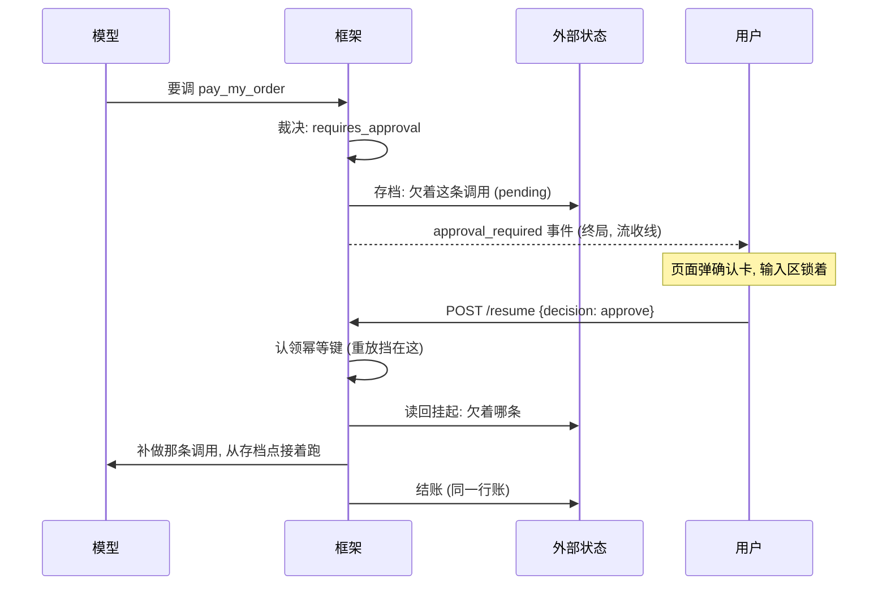
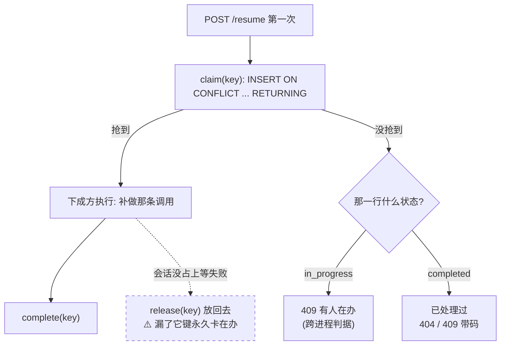
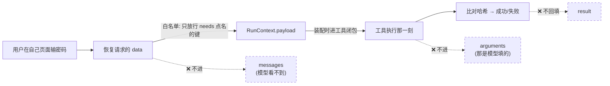
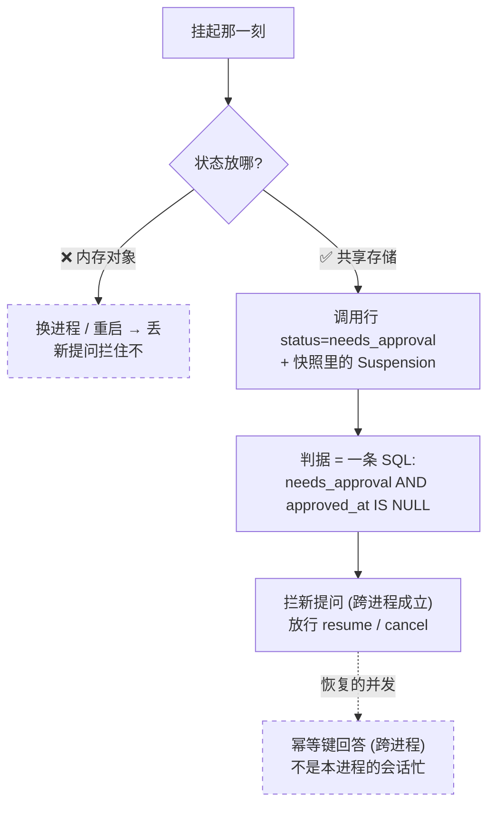
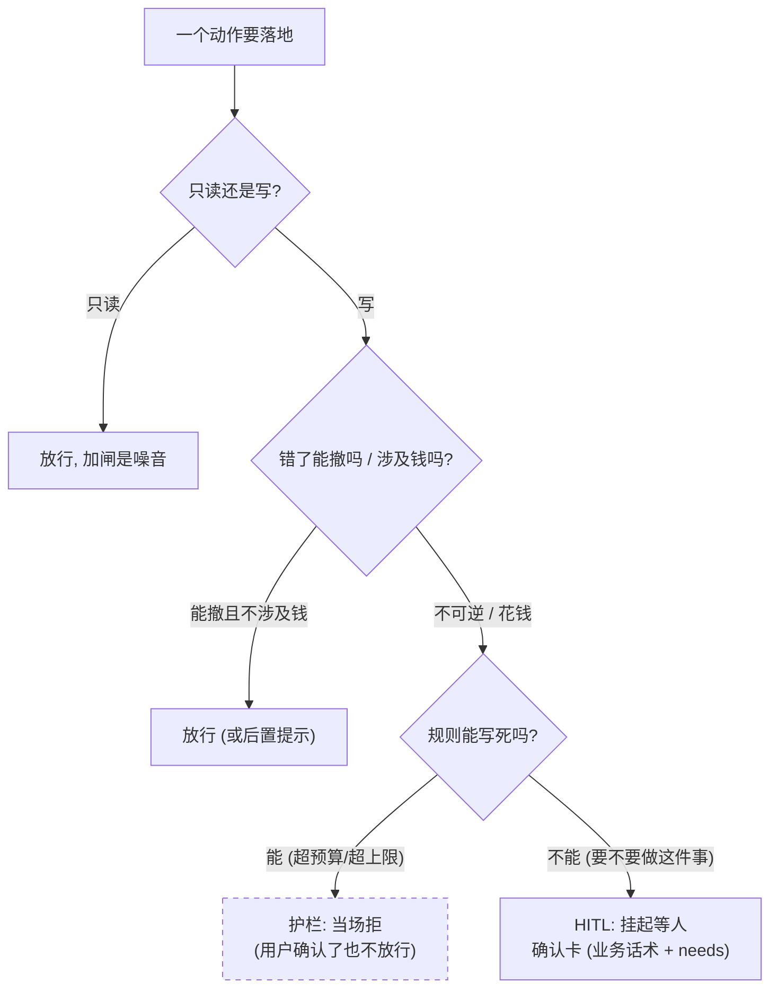

# 人机确认 · 专题底稿

> **本目录共五份专题底稿**：[01 上下文压缩](./01-context-compaction.md) · [02 可观测](./02-observability.md) · [03 人机确认](./03-hitl-approval.md) · [04 无状态化与 graceful drain](./04-stateless-and-drain.md) · [05 多智能体](./05-multiagent.md)。
> 覆盖：**L3b**（issues 32–38，2026-09-25/26 落地并真机验收）—— 挂起-恢复 / 幂等持久化 / 代付 / 确认卡 / 下单前确认。决策记录：**ADR-0014 / 0015 / 0017**。
> 代码锚点（行号按 2026-10-08 工作区记）：[`CharAgent/hooks/utils/types.py`](../../../CharAgent/hooks/utils/types.py) · [`CharAgent/hooks/registry.py`](../../../CharAgent/hooks/registry.py) · [`CharAgent/agent/loop.py`](../../../CharAgent/agent/loop.py) · [`CharAgent/retry/idempotency.py`](../../../CharAgent/retry/idempotency.py) · [`CharAgent/db/repositories/idempotency.py`](../../../CharAgent/db/repositories/idempotency.py) · [`CharAgent/server/app.py`](../../../CharAgent/server/app.py) · [`CharApp/minimall/tools.py`](../../../CharApp/minimall/tools.py) · [`app/minimall/views_bff.py`](../../../app/minimall/views_bff.py) · [`templates/minimall/agent.html`](../../../templates/minimall/agent.html)。
> 行业侧只引**一手**（官方文档 / 官方源码），原文摘录统一放在 [§8](#8-行业一手来源原文摘录)。

---

## 0. 五分钟版

### 0.1 一句话

**L3b 是 L3 里唯一有「新机制」的一半 —— 让一次运行能停在半路等人，人给结论后从存档点接着跑，而那条欠着的调用只补做一次。**

七片分成四块，**顺序不能换**：

| 块 | 片 | 一句话 |
|----|----|--------|
| **地基** | **32** | 幂等持久化：`charagent_idempotency_keys` 表 + `PgIdempotencyStore`（重放要挡得住） |
| | **33** | `resume()` 记账：续跑段落的帧不再脱离账本（不修这条，恢复段的成本与轨迹当场断链） |
| **机制** | **34** | HITL 挂起-恢复：`Decision` 第三值 + `approval_required` 终局事件 + `POST /runs/{id}/resume` |
| **业务** | **35** | 助手代付：支付内部端点 + `pay_my_order` 工具（schema 里**没有**密码） |
| | **36** | BFF 转发 + 前端确认卡（含刷新恢复、未决期间锁输入区） |
| | **37** | 下单前确认（纯是非卡）+ prompt 改写 |
| **收口** | **38** | 真机验收 + **五条否定断言** + 欠账清点 + 文档同步 |

### 0.2 为什么这一阶段值得做（一句话版本）

> **「模型可以决定要做什么，但不能单方面决定把用户的钱花掉。」**

前四个阶段（L1a / L1b / L2 / L2.5 / L3a）做的是「让它能干活、能改数据、能记住、能看见」；L3b 做的是**在「能改数据」和「钱」之间插一道人的闸**。

而 PRD 早在规划期就把这条路线的**三个阶段**写清了：

| 阶段 | 做法 | 实现了吗 |
|------|------|---------|
| 第一阶段 | 靠提示词（在系统提示里要求模型下单前问一句） | ❌ **从来没有实现过** —— `git log -S"确认吗"` 全仓只在 PRD 的计划里搜得到（issue 37 核实） |
| 第三阶段 | **框架级**：工具执行前的挂载点返回「需要确认」，整个运行**暂停并存档**，用户确认后从存档点继续 | ✅ **本阶段走通的是这条** |

> **说明（如实记）**：那条 prompt 层路线从未被实现过 —— 所以「prompt 层 vs 框架级」那次对照**没有实测数据**。要补那个数，得先真写一版带那句话的提示词（记为 L4 的候选）。

### 0.3 真机验收的硬数字（面试可以直接报）

| 场景 | 实际 |
|------|------|
| **代付**：说「帮我把这单付了」 | 页面弹**密码卡**（不是模型在对话里问一句）→ 本人输六位 → 订单变 `paid`、余额 **19505.00 → 19406.00**（恰是 99.00）；库里 `pay_my_order [succeeded] approved_by=10 approved_at=16:10:23` |
| **下单前确认**：说「下单吧」 | 卡上**输入框 0 个**、按钮 `[确认, 取消]` → 确认 → 订单下成（`202609261603140000102499`）；**模型全表七个场景里一次都没有反问「要不要下 / 确认吗」** |
| **取消** | `failed` + `approval_prompt='确认要下这一单吗?'`，模型答复「没有下成，车里那件还在」—— 不是静默失败 |
| **超 5000 元的下单** | **0 张卡**，直接拒（库里 `approval_prompt` 是 **NULL** = 压根没挂起过） |
| **幂等**：同一个 `resume` 重放两次 | 两次都 **404 `run_not_found`**，余额仍是 19406.00、`pay_my_order` 行数 = **1** —— 两次都被挡在工具执行**之前** |
| **重启**：挂着卡 → 重启服务 → 直接 POST `chat/` | **502 `thread_suspended`** —— 判据在 PG 不在内存 |

**五条否定断言**（这才是收口的重点 —— 「没发生的事」才是证据）：

| # | 断言 | 结论 |
|---|------|------|
| 1 | 会话历史里搜不到密码原文 | ✅ 全库**能按 `run_id` join 回来的列**（后来随 `runs.usage_by_model` 与 `memories.source_run_id` 又多了两组）扫下来，`payment_password` 这个名字**只**出现在 `charagent_tool_calls.approval_needs`（那是「要问什么」的清单，**不是值**）；DOM 与 `sessionStorage` **0 命中** |
| 2 | `charagent_tool_calls.arguments` 里没有密码 | ✅ 那一行就是 `{"order_no": "202609261603140000102499"}` —— **没有第二个参数** |
| 3 | `resume` 重放两次只扣一次钱 | ✅ 见上表（挡在工具执行之前） |
| 4 | 两侧日志里搜不到密码原文 | ✅ 字段名 **0 次**；**正对照**：`POST /minimall/agent/resume/` 四条 200 + 两条 404 都在日志里（说明那几行真的记了这次请求，只是没有 body） |
| 5 | 进程重启后未决挂起仍拦得住 | ✅ 判据在 PG（`status = needs_approval AND approved_at IS NULL`） |

> **第 4 条的「正对照」是要点**：**「搜不到」这个断言必须配一个「搜得到」的对照**，否则你不知道是「真的没记」还是「搜错了地方」。

### 0.4 这阶段最值钱的三句话

1. **「挂起不建审批表。」**（ADR-0014）—— 一次挂起的全部状态由 `charagent_tool_calls` 那一行 + 快照里的 `Suspension` 表达。见 §4.1。
2. **「密码走一次性载荷，永不进模型看得见的地方。」**（ADR-0015）—— 而且**工具 schema 里永远不出现 `payment_password` 这个参数**，这是前三条「永不」的前提。见 §4.2。
3. **「幂等先做、工具超时推后 —— 因为依赖方向是单向的。」**（ADR-0017）—— 这条设计判断的判据改写见 §4.3。

---

## 1. 行业全景：企业级的人机确认长什么样

### 1.1 三个框架级形态（agent 框架 / 工作流引擎各一家）

**① LangGraph · interrupts（图框架的代表）**

链接：<https://docs.langchain.com/oss/python/langgraph/interrupts>

机制：节点里调 `interrupt(payload)` 暂停，**checkpointer 存下整个图状态**，`thread_id` 是「拼回去的指针」（`config={"configurable": {"thread_id": ...}}`），恢复用 `Command(resume=value)` —— resume 值成为 `interrupt()` 的返回值。

三条规则最能说明这个机制的边界（都是官方原文，见 §8 A1）：

1. **恢复时节点从头部重跑**（"the runtime restarts the entire node from the beginning—it does not resume from the exact line"）—— 于是**副作用必须幂等**：「Side effects called before `interrupt` must be idempotent」；
2. **`interrupt()` 调用不许重排、不许条件跳过**（匹配是严格按 index 的）—— 也别用 `while True` 包验证循环（每次恢复会把之前每一轮都重放一遍，指数级）；
3. **不许裸 `try/except` 包 `interrupt()`**（它靠抛一个特殊异常暂停，会被 except 抓住）；传的值要 JSON 可序列化。

**② OpenAI Agents SDK · Human-in-the-loop（agent SDK 的代表）**

链接：<https://openai.github.io/openai-agents-python/human_in_the_loop/>

机制：工具用 `needs_approval=True`（或一个**按次判断的 callable**）声明；一旦需要批准，**执行暂停**，`RunResult.interruptions` 浮出待批准项；`result.to_state()` 序列化成 `RunState`（可存盘 / 换进程），`state.approve(...)` / `state.reject(...)` 后 resume。

四条值得记的设计（原文见 §8 A2）：

1. **fail closed**：callable 判断规则**在参数无法安全解析时一律要求人工批准**（参数缺失 / 空 / 全空白 / 畸形 JSON / 不是对象 / 含 `NaN` 这类非标准常量 —— 都不调 callable，直接挂起）；
2. **粘性决定**：`always_approve` / `always_reject` 存进 run state，跨序列化存活；**只按「工具身份」粘**（hosted MCP 里还要求 server label 非空 —— 同名工具在另一个 server 不等于批过）；
3. **部分决议**：一批挂起不要求一次全批 —— 只批准一部分时，已决的继续、未决的留在 `interruptions` 里再次暂停；
4. **服务端审批的安全要求**（这一节最值钱）：序列化的 `RunState` **不认证**快照与提交者 —— 官方列了四条服务端必须做的事：**认证审批人**（「Do not take the reviewer's identity from the approval request body」）· **授权**（「Possession of a run ID or decision ID is not authorization」）· **校验提交的标识**（只认服务端自己那份挂起清单）· **原子过渡防重放**（"use an atomic owner-checked transition before starting resumed execution"）。还有一条工程提醒：**审批可能停留很久 → 与序列化状态一起存一个版本标记**（模型 / prompt / 工具定义变了要能路由到对应代码路径）。

**③ AWS Step Functions · Wait for Callback（工作流引擎的代表）**

链接：<https://docs.aws.amazon.com/step-functions/latest/dg/connect-to-resource.html>（`waitForTaskToken` 一节）

机制：任务里带上一个 **task token** 发出去（如塞进 SQS 消息），外部系统做完事拿 token 回 `SendTaskSuccess` / `SendTaskFailure`；状态机在那一步**等**。原文说这个「等」**最长等到一年服务配额** —— 为了避免卡死，可以配 **`HeartbeatSeconds`**：超时未回，任务以 `States.Timeout` 失败。另有一条边界：**task token 只在同一 AWS 账号内有效**。

> 三个形态的共同骨架：**把状态存到外部（checkpointer / RunState / 状态机历史），把一个「拼回去的凭据」交出去（thread_id / RunState 快照 / task token），回来时凭它恢复。** 差别在凭据的形态与谁来保存。

### 1.2 企业级审批的通用清单（从三个形态 + 通用工程实践提炼）

| # | 问题 | 通行答案 |
|---|------|---------|
| 1 | **挂起载体** | 外部持久化（图状态 / 序列化 run state / 状态机历史）—— 挂起必须能被**另一个进程**接上 |
| 2 | **恢复凭据** | 一个指针（thread_id / 快照 / token），且**凭据 ≠ 授权**（OpenAI 文档明确强调） |
| 3 | **审批粒度** | 到「一次调用」级（per tool call / per interrupt）—— 而不是整个 agent 批一次 |
| 4 | **幂等** | 恢复可能被重放（双击 / 重发）→ 框架要求「挂起前的副作用必须幂等」，业务要求「恢复本身幂等」 |
| 5 | **超时** | 引擎侧给兜底（Step Functions 的 `HeartbeatSeconds`）；框架侧通常**无限等**，等多久是应用的事 |
| 6 | **幂等 / 重放的存储** | 需要一张「认领表」或原子过渡，防止同一个挂起被恢复两次 |
| 7 | **审批人身份** | 从**服务端会话**取，不从请求体取（OpenAI 文档点名） |
| 8 | **多角色 / 升级** | 真人组织的多级审批、转交、超时升级 —— 到那个量级审批单才需要独立生命周期 |
| 9 | **版本化** | 挂起可能跨很久（模型 / prompt / 工具定义会变）→ 快照要带版本标记 |

### 1.3 三个形态怎么做 vs 本项目怎么做

| 维度 | 行业形态 | 本项目（L3b） | 差在哪 / 为什么 |
|------|---------|--------------|----------------|
| **审批载体** | 独立机制：checkpointer / `RunState` 序列化 / task token | **不建审批表**（ADR-0014）：挂起态就是那次工具调用行（`status = needs_approval` + `approved_by`/`approved_at`）+ 快照里的 `Suspension.pending` | 本项目「审批单没有独立生命周期」—— 它是二元事实（批没批、谁批的），天然宿主是那次调用。**判据**：何时该建表 —— 「审批单开始有自己的生命周期」（多级 / 意见 / 转交）时 |
| **恢复凭据** | `thread_id` / 序列化快照 / token | **`run_id` + 幂等键**（恢复端点的 body 里甚至不带 run_id —— 由服务端现问未决挂起） | 同向：凭据只用于**找到**挂起，授权由服务端会话回答 |
| **审批粒度** | 一次调用级 | 一次调用级，且**一次挂起只挂一条**（同一批里第二条要批的以「先处理前一条」回填） | 比框架更严：为了「一次确认配一份一次性载荷」的归属无歧义 |
| **幂等** | LangGraph：要求「挂起前的副作用幂等」；SDK：粘性决定 + 原子过渡 | **幂等键（三列）+ `claim` 一条 SQL**：重放挡在**工具执行之前**；认领后失败**放回**键 | 本项目把幂等做成了**第一等公民**（专门的表与存储），不只是「要求业务幂等」 |
| **挂起超时** | Step Functions 有 `HeartbeatSeconds`（超时 `States.Timeout`） | **明确不做**（记账在路线图）：不做的理由是「加超时要先答『超时了怎么办』」；改用**显式取消**（`cancel` 扩到挂起中） | 形态差异：无服务器函数有成本与并发压力，挂起必须兜底；本项目挂着不花钱、用户可取消 |
| **审批人身份** | OpenAI 文档：从服务端认证中间件取，**不从请求体取** | **同一条**：BFF 从浏览器 session 取身份；`data` 走白名单（只放行 `needs` 点名的键） | 同一纪律的两次独立抵达 —— 本项目那次是**代码评审揪出来的真漏洞**（§4.4） |
| **重放防护** | 「原子 owner-checked transition」 | `INSERT ... ON CONFLICT DO UPDATE WHERE expires_at <= now RETURNING`（一条 SQL 同时解决并发 / 过期 / 旧结果不冒充） | 同一条思路的两种实现 |
| **版本化** | 快照带版本标记（模型 / prompt / 工具定义变化时路由） | `runs.prompt_version` 记了（现为 `system/v8`），但**没有**「挂起快照带版本路由」这一层 | **认下的差距**：本项目挂起里没有「等太久之后定义变了」的兼容问题（演示尺度），记为后续片 |
| **多角色审批** | 真人组织的多级审批 | **不适用**（DESIGN #25 那条「发起方不得审批自己发起的」）：发起方是**模型**，确认人是**买家本人**，不存在「自己批自己」 | 换真人多角色那天才需要（§5.1） |
| **审计** | 合规级审计（能证明没被改过） | `approved_by` / `approved_at` 两列（谁批的、什么时候） | 认证有了，「防篡改的审计」没有 —— 记为后续片（§5.4） |

> **这张表的用法**：被问「HITL 你怎么做的、和框架比怎么样」时，**先给对方三个形态的共同骨架**（外部状态 + 恢复凭据 + 凭据≠授权），再落到本项目的两个不同（**不建审批表**与**幂等做成一等公民**），最后主动认差距（版本化路由 / 合规审计）。

---

## 2. 本项目实现

### 2.1 起点：三头都在，中间断了

issue 34 规划期核实的现状表（这是「一片要先量清楚」的样板）：

| 环节 | 状态 |
|------|------|
| 拦截点 | ✅ `HookPoint.BEFORE_TOOL_EXECUTE` 是六个点里唯一的**裁决类** |
| 裁决语义 | ⚠️ `Decision` **只有 `allow` / `reject`** 两值。它的 docstring 原话：「为什么**只**有放行 / 拒绝两值（P0/P1 不做「需要确认」）：那是另一种机制 …… **#25 HITL 落地时再加**」 |
| 挂起数据结构 | ✅ `Suspension(reason, pending, approval_id)` 在 `checkpoint/utils/types.py` |
| **产生挂起帧** | ❌ **`agent/loop.py` 里 `Suspension` 零命中** —— `_save_checkpoint` 拼 `CheckpointState` 时**根本没传 `suspension`**，永远落 `None`。全仓唯一的挂起帧生产者是**测试** |
| 补做欠账 | ✅ `pending_tool_calls` / `resume()` / `_complete_pending_turn` 三道护栏齐 |
| 审批事件 | ❌ `EventType` 里**名字早就预留了**（注释：「HITL 挂起会再追加 `approval_required`」）但没接 |
| 运行状态 | ⚠️ `RunStatus.WAITING_USER` **已存在但没有任何路径能走到它** |
| 幂等兜底 | ❌ `retry/idempotency.py` 零生产调用方 |

> **所以这一片的形状是清楚的：两头都在，中间断成三截。**

**「预留的接口没人用过」这件事本身就是规划期的一等公民**（PRD §1 批评的原话）：**「没人用过的接口，等于没设计过。」** —— 而 L3b 正是把三个预留件（`Decision` 的第三值、`Suspension` 的落帧、`idempotency_keys` 表）**第一次接上真实调用方**。

```python
# CharAgent/hooks/utils/types.py:51 (Verdict) / :69 (Decision)
class Verdict(StrEnum):
    """裁决点上插件能表的三种态 (对应 Decision.verdict).

    - ALLOW: 放行 —— 工具照常执行 (与「不表态」等价).
    - REJECT: **当场有结论** —— 工具不跑, 原因当作这条调用失败的文本回填给模型,
      模型下一轮自己换个说法接着答 (一次普通的工具失败).
    - REQUIRES_APPROVAL: **等着别人给结论** —— 工具先不跑, 整次运行就此**停在
      半路**存档等人 (挂起, #25 HITL); 人给了结论才从存档点接着跑.

    后两者都让工具不执行, 区别在**这个结论由谁、在哪一刻给** (见 Decision).
    """

    ALLOW = "allow"
    REJECT = "reject"
    REQUIRES_APPROVAL = "requires_approval"


@dataclass(frozen=True, slots=True)
class Decision:
    """拦截点的裁决: 放行 / 拒绝 / 需人工确认 三选一."""

    verdict: Verdict
    reason: str | None = None
    prompt: str = ""
    needs: tuple[str, ...] = ()
```

> **`Decision.__post_init__` 的那三条校验是这段的看点**：**「挂起必有话术 / 拒绝必有原因 / 放行不许夹带」在构造那一刻就报错** —— 于是 loop 拿到 `Decision` 时**不必再判空**。
>
> 这是全仓反复出现的一条形状：**把校验放到构造期，下游就不用写防御代码**（`PeakRule` 验时区、`PgIdempotencyStore` 验 TTL、`RetryPolicy` 验退避参数，都是同一个手法）。

```python
# CharAgent/hooks/registry.py:188 (节选)
async def decide(self, point: HookPoint, **kwargs: Any) -> Decision:
    """请某点的插件裁决 (注册顺序), 返回放行 / 拒绝 / 需人工确认 —— 裁决类点用."""
    handlers = self._handlers.get(point)
    if not handlers:
        return Decision.allow()
    # 两个位置各记「第一个」: 拒绝与挂起分开收, 最后按优先级取 —— 合成一个
    # 变量就又要靠顺序决定, 而那正是这条改动要消掉的东西
    rejection: Decision | None = None
    approval: Decision | None = None
    ...
```

> **`_verdict(...)` 那一层还守着 fail-closed**：`decide()` 的契约是「返回值有语义」，而**认不出来的返回值一律当成拒绝** —— 与 OpenAI SDK 文档那条「参数无法安全解析时 fail closed 到人工批准」是同一个取向：**认不出的那一侧，选保守的**。

**裁决落地的那三行**（`CharAgent/agent/loop.py:501` 附近，`_execute_one` 里）：

```python
    decision = await self._hooks.decide(
        HookPoint.BEFORE_TOOL_EXECUTE, turn=turn, call=call, tool=tool
    )
    if decision.verdict is Verdict.REJECT:
        # 被拒 = 这次工具调用失败, 走现成的「工具错误」通道回填
        return ToolExecution(tool_name=call.name, ok=False, error=decision.reason)
    if decision.verdict is Verdict.REQUIRES_APPROVAL and not approved:
        # 要人批: 这一条不执行, 把裁决原样交出去 (由调用方决定挂起谁)
        return ApprovalRequest(
            call=call, prompt=decision.prompt, needs=decision.needs, turn=turn
        )
    return await execute_tool(tool, arguments=call.arguments)
```

> **注意 `and not approved` 这半句**：恢复那一段传进去的 `approved` 集合**只抵消「需人工确认」这一种裁决** —— **护栏的拒绝照常生效**（真机验过，两条各有用例）。

### 2.2 issue 32 · 幂等持久化

#### 2.2.1 起点：协议与内存实现都在，持久化与调用方都不在

| 零件 | 位置 | 状态 |
|------|------|------|
| `IdempotencyKey` | `retry/idempotency.py` | 构造即校验：长度上限 + 字符白名单 `^[A-Za-z0-9][A-Za-z0-9._:-]*$` |
| `IdempotencyStore` 协议 | 同上 | 三个方法：`claim(key)` / `complete(key, result)` / `release(key)` |
| `ClaimStatus` / `ClaimResult` | `retry/utils/types.py` | 三态 `CLAIMED` / `IN_PROGRESS` / `COMPLETED` |
| `InMemoryIdempotencyStore` | `retry/idempotency.py` | 纯 dict，**无 TTL / 无持久化 / 跨实例失效** |
| **PG 实现** | —— | **零** |
| **生产调用方** | —— | **零**（本片也不产生 —— 那是 34） |

#### 2.2.2 认领的原子性靠数据库，不靠「先查后插」

> **一条贯穿全仓的纪律**：`db/schema.py` 里那条注释原文就是为这件事写的 ——「应用层先查后插有并发窗口，**唯一约束才是真正不会漏的那道闸**」。

```sql
INSERT ... ON CONFLICT (key) DO UPDATE ... WHERE expires_at <= <now> RETURNING key
```

插进去（或改写了过期行）的才是抢到的那一个；没抢到的再读那一行：`completed` 回结果、其余一律回「**有人在办**」—— **安全的那一侧**（不会让调用方再执行一次）。

```python
# CharAgent/db/repositories/idempotency.py:97 (节选)
async def claim(self, key: IdempotencyKey) -> ClaimResult:
    """认领 (#17): 首次拿到执行权, 重复请求被挡回在途 / 已完成状态.

    一整行 `claim` 的判定都压在那条 `ON CONFLICT` 上 —— 应用层不查、不判断,
    于是两个人同时来也只有一个人能拿到 `CLAIMED`.
    """
```

**这条 SQL 只有一行，但它同时解决了三件事**：

1. **并发**：两个请求同时来，只有一个能 `RETURNING`；
2. **过期**：`WHERE expires_at <= now` 恰好是「`NULL` 或未来时刻」的**补集** —— 永不过期的与还没到期的，行一动不动；
3. **旧结果不冒充新结果**：认领时把整行改写成新操作（状态在途 / 结果清空 / 有效期从头算）—— 尤其不能留下上一手的结果，否则后来者会把它当成自己的。

> 这一条与 OpenAI SDK 文档里那句「use **an atomic owner-checked transition** before starting resumed execution」是同一个要求 —— 只是它们说原则，这边给出了一条具体 SQL。

#### 2.2.3 键的形态：三列，不是两列

`(run_id, message_id, tool_call_id)` 三列拼起来，落在白名单里（uuid 的 hex 与 `:` / `-` / `.` 都合法）。

**为什么必须是三列**（这条在 L3a 就讲过，这里是它的第二次应用）：

> 真实上游**每轮都从 `call_0` 重新编号** —— 同一个 run 里会出现好几条「call_0」，所以真正唯一的身份是「**哪条 assistant 消息发起的这一次调用**」。

真机上那把键长这样：`resume:{run_id}:{message_id}:{tool_call_id}`。

#### 2.2.4 三处刻意的取舍

| 取舍 | 理由 |
|------|------|
| **不做后台清理** | 清理是运维动作，与「能挡住重放」无关；将来表真涨起来，加一条 `DELETE ... WHERE expires_at < now()` 即可，**表结构不用改** |
| **默认不过期**（`ttl_seconds=None`） | 内存实现也没有 TTL —— 默认值短命会让「换成持久化实现」变成**保护范围被悄悄改小** |
| **`ttl_seconds <= 0` 构造期报错** | 0 与负数会让每把键认领完立刻可再认领，即**这个存储装上了却什么都挡不住，且不报任何错** |

> **一条对票据措辞的澄清**（值得学）：票据说 `status` 列是「`ClaimStatus` 三值」，实际落库的只有**两值** —— `claimed` 是**本次认领成功的答复**，不是存下来的状态（认领成功写下来的是 `in_progress`）。**票据写错了，改的是注释不是代码，并把这件事记下来。**

#### 2.2.5 真机（本片没有调用方，能验的是「直连真库」）

```
① 首次认领          -> claimed      (claimed=True)
② 同一条请求再来一次 -> in_progress  (claimed=False)      ← 重放被挡住的那一刻
③ 动作做完 + 认领   -> completed    结果={'payment_id': 'p-1', 'amount': '19.90'}
④ 认领后 release     -> 再认领 = claimed                   ← 失败后放行合法重试
⑤ ttl=1 秒, 真等 1.3 秒 -> 再认领 = claimed                ← 过期后可重新认领
```

#### 2.2.6 两条并发用例是「真验过」的（不是跑绿就算）

> **把实现临时改坏，看它红不红**：

| 临时改法 | 结果 |
|---------|------|
| 去掉 `ON CONFLICT ... WHERE expires_at <= ...` 那条条件 | **8 条红** |
| 换成「先查后插」 | **并发用例红**，报 `UniqueViolation` —— 而**第一版并发用例抓不到它**：同一个事件循环里 `gather`，而 `session.execute` 是同步的，两条语句根本插不到一起；**改成各起线程 + 各起事件循环之后才真正并行** |

> **这一条是面试上很值钱的**：**「我的第一版并发用例是假绿 —— 它测的不是并发。同一个事件循环里根本插不到一起，得各起一个循环。」**

### 2.3 issue 33 · `resume()` 记账：从「欠账」升级为「前置」

#### 2.3.1 两种 resume 不是一回事（本片最容易做错的一处）

| | 谁在用 | 语义 | 账目 |
|---|---|---|---|
| **CLI `--resume`** | 命令行 `--resume` | 「这段会话我接着聊」 | **新的一次运行** |
| **HITL 恢复** | `POST /runs/{id}/resume` | 「**同一次运行**的第二段」 | **沿用原来那一行账**（`loop_id` 与 `run_id` 都不变） |

**修法是给 `resume()` 加一个可选的 `run_id`**：

- **不传** → 与 `ask()` 同构地开一行新账
- **传了** → 同一次运行的续段：`runs` 行**不新建**，`LoopState.run_id` 直接用它

> **为什么是参数而不是「`resume()` 一律沿用」**：CLI 那条如果也沿用，`--resume` 一次会在同一天里往同一行账上叠三段互不相干的对话，「这次运行花了多少」**当场失去意义**。**判据是「是不是同一次运行的第二段」，只有 HITL 知道答案，所以由调用方给。**

这条与 issue 22 的拆分是同一个形状：

> `loop_id` 沿用是**结构事实**（同一次循环执行接着跑）；`run_id` 沿用是**业务选择**（同一次运行的第二段）—— 后者必须是**显式传入**的。

```python
# CharAgent/client/session.py:453 (签名) + :528 (主体, 节选)
async def resume(
    self, *, run_id: str | None = None, approval: Approval | None = None
) -> LoopResult | None:
    """从最新一帧快照接着跑; 没有可恢复的快照时返回 None.

    **两种「接着跑」不是一回事** (这是本方法最要紧的一处, ticket 33):

    - **不传 `run_id`** (命令行的 `--resume`): 这是**新的一次运行** —— 新的一段
      「从提问到答复终止」, 只是从旧快照起跑. 于是照 `ask` 的样子开一行新账
      (`_begin_run` → 跑 → `_record`), 帧与消息都指向那一行.
    - **传 `run_id`** (HITL 的审批恢复, issue 34): 这是**同一次运行的第二段**
      —— 那一行**不新建**, 而收尾那一笔照常写上去 (它记的是这一段的结局:
      跑完了 / 上游中断 / 又挂起了一次). 这一段落的帧与消息全部指回那一行.
    """
```

> **`finish_run = run_id is None` 这一行本身就是设计**：它是评审「一个开关三种写法」之后收成的样子 —— 「调用方没给 `run_id`」与「这一段的账归我收」是**同一件事**，所以用一句话说清，而不是三个变量。

#### 2.3.2 除了票据点名的四件，还补了两处（不做就是半截账）

| 补的 | 为什么 |
|------|--------|
| **`record_unfinished` 的 `question` 变成可选** | 续跑段不是提问触发的，而失败那一轮也要落一条「这一轮没答完」。不补的话，命令行 `--resume` 一旦失败，**它自己刚建的那一行运行会永远停在 `running`**。**不编那句提问**：编一条 `user` 行会让记录撒谎（「只有真由用户输入产生的消息才是 user」是这一层立着的硬规矩） |
| **`RunSettlement`（收尾那一笔）打包** | 状态 / 账目 / 金额 / 最后一帧这四样必须同进同出，打包之后「这一段不收尾」也只要说一次（传 None）—— `_write` 的签名因此从 11 个参数降到 8 个 |

```python
# CharAgent/db/recorder.py:527 (节选) —— 「这一段收不收尾」决定了那一笔给不给
    # 不结账 (HITL 续跑的第二段) 时这一笔整个不给: 状态 / 账目 / 金额 / 最后一帧
    # 都不写, 也不去算钱 —— 算了也没地方放 (见 RunSettlement)
    settlement: RunSettlement | None = None
    if finish_run:
        ...
```

> **「挂起那一段照样算钱」这条也是想清楚了的**：钱确实花了（那一轮真问过模型），所以挂起那一段**照常**把金额写上去；而恢复那一段收尾时**按累计用量重算覆盖**（C23/C24 之后是逐模型拆账、整份覆盖）—— `runs.settle` 的既定语义：**重算不是累加**（那几列是累计值）。

**而底下那一层（`RunsRepository.settle`）还守着两条**：

```python
# CharAgent/db/repositories/runs.py:117 附近 (节选)
    if status not in SETTLEABLE_RUN_STATUSES:
        raise DataConfigError(
            f"一段运行的结局只能是 ({allowed}), 实际: {status.value!r}"
            " —— 过程态 (waiting_tool / retrying) 说的是「正在做什么」, "
            "不是「最后成了什么样」"
        )
    ...
    if status in TERMINAL_RUN_STATUSES:
        # 只有真结束的那一次写它: 挂起那一段留空
        values["finished_at"] = stamp
```

#### 2.3.3 「一个开关三种写法」的评审发现

```
continuation  →  not continuation  →  not finish_run
```

改成开头一句 `finish_run = run_id is None` —— **少一层否定**。

> 这是很典型的「命名决定了你要写多少否定」：**当变量名本身是正向的（`finish_run`），判断就只需要一次**。

#### 2.3.4 真机

会话 `cli-resume-33b`：先问一句，再单独跑一次 `--resume`。

| | 运行行 | 轮数 / token | 帧 | 消息行 |
|---|---|---|---|---|
| 第一段 | `077e55b7…` `finished` | 1 / 1844 | 指着 `077e55b7…` | user + assistant |
| **续跑段** | `ebbed262…` `finished` | **2 / 3735**（累计口径） | 指着 `ebbed262…` | **assistant（从前这一段一条都没有）** |

`trace` 查得到：`状态 finished · 累计 3735 token · 金额 ¥0.001489 (valley)` —— **一次运行的账在「两段」之后仍然是一条完整的账**。

**两条真验过**（改坏看红）：

| 临时改坏 | 结果 |
|---------|------|
| 记录员忽略 `finish_run`（照样结账） | 用例红：`- running` / `+ finished` |
| 会话不把 `run_id` 交给 loop | 两条真库用例红，报的正是本片要修的症状：帧的 `run_id` 是 `None` |

---

### 2.4 issue 34 · HITL 挂起-恢复（框架侧的核心）

#### 2.4.1 `Decision` 加第三值 —— 为什么不新增一个平行类型

> **理由**：`decide()` 的契约是「返回值有语义」，而 `_verdict` 现在对**认不出来的返回值一律 fail-closed 拒绝**。多一个平行的返回类型意味着「新类型要显式登记才算数」，而**登记漏了就会被静默当成拒绝**。加在同一个类型上则相反：**第三种状态是显式的**。

```python
Decision.allow()                            # 放行（今天就有）
Decision.reject("为什么不行 / 该怎么改")      # 当场有结论（今天就有）
Decision.requires_approval(                 # 挂着等人
    prompt="这一单要付款了，需要你输一次支付密码",
    needs=("payment_password",),            # 机器可读：还缺什么（框架只透传，不解释）
)
```

**与 `reject` 的分野要能背**：**拒绝是「当场有结论」，挂起是「等着别人给结论」。** 前者把原因当工具结果回填、模型立刻换个说法接着答；后者模型这一轮**不继续**。

#### 2.4.2 「拒绝优先于挂起」—— 一条不看注册顺序的语义

加了第三种值之后，「非放行」有两种，于是**注册顺序会决定用户体验**：业务侧同时挂「护栏（超预算就拒）」与「需确认」两条规则时，确认排在前面会让一个**会超预算**的操作先弹确认卡、用户确认完才被拒。

**改成**：遍历全部 handlers，任一 `reject` 直接生效；一个都没有时才看有没有 `requires_approval`。（§2.1 的 `decide()` 代码里那「两个位置各记第一个」正是这件事。）

> **为什么不靠注册顺序**：**顺序是「装配的偶然事实」，而「该不该做」应当是「内容决定」的。**

**挂起那一条不回填**（`CharAgent/agent/loop.py:1155` 附近节选）：

```python
    for call, result in zip(response.tool_calls, held, strict=True):
        if isinstance(result, ApprovalRequest):
            if result is not suspended:
                # 同一批里第二条要批的: 不挂起它, 按普通工具失败回填
                result = ToolExecution(
                    tool_name=call.name, ok=False, error=APPROVAL_ALREADY_PENDING_TEXT
                )
            else:
                results.append(result)
                # 结果欠着: 不 append tool 消息, 也不发 tool_result 事件 ——
                # 「那一条还没有结果」是这次挂起的全部内容
                continue
```

**恢复时怎么把欠着的那条找回来**（`CharAgent/checkpoint/utils/pending.py:50`）：

```python
def pending_tool_calls(messages: Sequence[ModelMessage]) -> list[ModelToolCall]:
    """找出历史末尾「已请求、还没有结果」的工具调用 (顺序即模型给出的顺序).

    读法: 从前往后扫一遍, 手里始终只有「最近一批没拿到结果的调用」:
    - 遇到带 tool_calls 的 assistant 消息 -> 换一批
    - 遇到 tool 消息 -> 按 tool_call_id 从当前批里划掉一个
    - 其他消息 -> 不动
    """
```

> **模块头里那句「为什么不能按 id 建字典」值得单独讲**：`tool_call_id` 会在不同轮次里重复（上游每轮从 `call_0` 重编号），所以「按 id 建字典、后面覆盖前面」的写法在这里是**错的**。
>
> **同一个坑在这个项目里出现了三次**（轨迹表主键三列、幂等键三列、这里的扫描算法）—— **「`call_0` 每轮重编号」是这个项目里最容易被忽视的一条上游事实。**

**没有结论就不补做**（`CharAgent/agent/loop.py:788` 附近节选）：

```python
        pending = pending_tool_calls(state.history)
        if pending:
            if approval is None:
                # **没有人的结论就不补做** (DESIGN #25 的「绝不自动执行」):
                # 欠着的那条调用可能正是「给这一单付款」, 而补做就是把它真的
                # 执行掉 —— 框架绝不替人按这个确认键. 拦在这里, 命令行那条
                # `--resume` 就不会把一次挂起悄悄变成一次执行
                raise LoopConfigError(...)
```

`_complete_pending_turn` 的两条路（**批了 → 照常执行；拒了 → 一条都不执行**）：

```python
    if approval.approved:
        # 批过了: 这几条不再因为「需人工确认」停下 (人已经给过结论), 照常执行
        results = await self._execute_parallel(
            pending, turn=turn, approved=frozenset(c.id for c in pending)
        )
    else:
        # 拒了: 一条都不执行, 拒绝原因当作每条调用的失败结果回填
        results = [
            ToolExecution(tool_name=call.name, ok=False, error=approval.reason)
            for call in pending
        ]
```

> **补做有一条容易被忽略的口径**：**它不受 guard 影响** ——「那是上一轮已经决定、只差一份结果的工作（预算判定排在它之后）—— 欠的活先干完，该不该继续问模型才轮到刹车说话」。**且补做那一轮没有「执行前那一拍」**（那条 assistant 行与调用行在上一段就写过库了，状态 `needs_approval`），只有收尾那一拍按 `message_index` 推进原来那一行。

#### 2.4.3 一次挂起只挂一条（ADR-0014 的边界）

裁决粒度是**一条调用**，而 `_execute_parallel` 并行跑同一 assistant 消息发出的一批。所以：

- 遇到**第一条** `requires_approval` → 停，把它放进 `Suspension.pending` 挂起
- **同一批里其余需要审批的调用** → 以「请先处理前一条」的理由回填拒绝

**理由**：`Suspension.pending` 是列表（形状允许一批），但「**一次确认配一份一次性载荷**」要求载荷归属无歧义。（对比 OpenAI SDK：官方明确支持一次部分决议、未决的留着再次暂停 —— 那是另一条路，本项目选的是「一次只挂一条」。）

#### 2.4.4 `LoopOutcome.SUSPENDED` 与 `RunStatus.WAITING_USER`

**不复用现有值**：下游要能区分「这一轮答完了」与「这一轮挂着等人」—— 前者该收尾、后者不该。

```python
RUN_STATUS_FOR_OUTCOME: dict[LoopOutcome, RunStatus] = {
    LoopOutcome.FINISHED: RunStatus.FINISHED,
    ...
    # 挂起等人 (#25 HITL): 不是失败也不是完成 —— 这一段的结局就是「停在这儿等人」,
    # 那一次运行还开着 (恢复沿用同一个 run_id)
    LoopOutcome.SUSPENDED: RunStatus.WAITING_USER,
}
```

**配套的新常量 `SETTLEABLE_RUN_STATUSES = TERMINAL_RUN_STATUSES | {WAITING_USER}`** —— 它的用途是回答「这一行**能不能收尾**」：终态能，`waiting_user` **也能**（那一段的收尾写的是「在等人」，而不是终态），而 `running` 不能。

> **这一条很巧妙**：挂起那一段**自己也要写库**（写 `waiting_user`），否则「它现在在等人」在库里没有落点；而「还没结束」由 **`finished_at IS NULL`** 表达。**一个状态列 + 一个时刻列，两件事各自有位。**

#### 2.4.5 `approval_required` 是**终局事件**

这次 HTTP 请求到此结束，前端据此渲染确认卡并保持输入框禁用。**三处同步改**：

| 处 | 位置 |
|---|---|
| 框架的事件类型与终局集 | `stream/utils/types.py` 的 `EventType` 与 `TERMINAL_TYPES`；`RunStream.push` 的 `_closed` 判定（C26–C29 之后 `EventType` 共 9 个成员，**终局集仍是 3 个**：`final` / `error` / `approval_required`） |
| BFF 的终局集 | `views_bff.py` 的 `TERMINAL_EVENTS` |
| 前端的渲染表 | `agent.html` 的 `RENDERERS`（现 9 项） |

事件载荷（**框架只搬运，语义由业务定**）：`tool_call_id` / `tool_name` / `prompt` / `needs`（+ `turn`，与其它事件同一条惯例）。

```python
# CharAgent/agent/utils/events.py:176 (节选)
async def emit_terminal(bus: EventBus, result: LoopResult) -> None:
    """run 的单一终局出口: 从 LoopResult 派生**恰好一个**终局事件.

    正常结束 → final; 其余 → error; **挂起等人 → approval_required**
    (那一轮的答复还没发生, 所以既不是 final 也不是 error). 三种都是**终局**.
    """
```

**注意它读的是 `result.approval` 而不是 `result.outcome`** —— 「这一轮停在谁那儿」是那张确认卡的直接来源，而 `outcome` 只是 `SUSPENDED` 这个分类。

```python
# CharAgent/agent/utils/events.py:116
def approval_required_data(approval: ApprovalRequest) -> dict[str, Any]:
    """一次挂起 → `approval_required` 事件载荷.

    四样是前端重建一张确认卡要的全部: **哪一条**调用要批、**问什么**（`prompt`）、
    **缺什么**（`needs` —— 含 `payment_password` 就渲染一个密码框, 空就只给两个按钮）。
    """
```

> **这四样与 `GET /history` 的 `pending_approval` 是同一份形状**（框架侧两处同源）—— 这正是「刷新恢复」那条路能用**同一个渲染函数**的原因（§2.6.4）。

#### 2.4.6 `POST /runs/{run_id}/resume`

与 `POST /runs` 同构：返回一条 SSE 流。

- body：`{decision: "approve" | "reject", data: {...}}`
- **一个端点，不拆 approve / reject 两个** —— **拒绝也要恢复**：把拒绝原因当**工具结果**回填，模型据此继续（与 OpenAI SDK 的 `state.reject(...)` 同构：拒绝进的是同一个恢复流，还有 `rejection_message` 可自定义话术）
- **幂等不是兜底，是主线**：恢复是 HTTP 端点，双击 / 重发 / 前端重试都会产生第二次，**而重放的是「给这一单付款」**

七步（**顺序有讲究**）：认证 → 读 body → 查未决 → **认领幂等键** → 组载荷 → 占会话 → 起任务/流成 SSE。

> **为什么「先认领键、后占会话」**：这样**并发那一相由键来回答**（`409 approval_in_progress`，跨进程），而不是被本进程的「会话忙」顺带答一句。

```python
# CharAgent/server/app.py:808 —— 键怎么算
def _approval_key(row: ToolCall) -> IdempotencyKey:
    """一条未决的挂起 → 它那把幂等键.

    键是**三列**: 运行 + 发起它的那条 assistant 消息 + 模型给的那次调用编号.
    少一列在多轮之间会撞 —— 上游每轮都从 `call_0` 重新编号.
    """
    return IdempotencyKey(f"resume:{row.run_id}:{row.message_id}:{row.tool_call_id}")
```

```python
# CharAgent/server/app.py:505 附近 —— 认领在前, 占会话在后
    # 认领在前, 占会话在后: 「这一次审批有人在办」该由**那一把键**回答
    # (它是跨进程的判据), 而不是由「会话忙不忙」顺带答一句. 代价是认领之后
    # 还有可能失败 (会话忙 / 装配出错) —— 那一笔必须**放回去**, 否则这把键
    # 永久卡在「在办」, 用户既恢复不了也不知道为什么 (见下面的 except)
    keys = tuple(_approval_key(row) for row in pending)
    claimed: list[IdempotencyKey] = []
    try:
        for key in keys:
            await _claim_or_refuse(replay_guard, key)
            claimed.append(key)
        entry = await registry.acquire(context, resuming=True)
    except BaseException:
        await _release_claims(replay_guard, claimed)
        raise
```

```python
# CharAgent/server/app.py:841 附近 —— 抢不到键的两种答复
    if result.status is ClaimStatus.CLAIMED:
        return
    if result.status is ClaimStatus.COMPLETED:
        raise ApprovalAlreadyHandledError(
            "这次的审批已经处理过了 … 刷新页面对一下最新状态",
            code="approval_already_applied",
        )
    raise ApprovalAlreadyHandledError(
        "这次的审批正在处理中 … 请等这一次跑完, 不要重复提交",
        code="approval_in_progress",
    )
```

> **`except BaseException` 里那次 `_release_claims` 是这一段最容易被漏的地方**：**认领成功了、但会话没占上** —— 如果不把键放回去，它就**永久卡在「在办」**，用户既恢复不了、也不知道为什么。有一条用例专盯这个（伪证里也是逐条都红）。

#### 2.4.7 三种「第二次 resume」的时相分工（这一条很能讲）

| 时相 | 谁挡住 | 答什么 |
|------|--------|--------|
| **第一次还在跑**（真并发 / 双击） | **幂等键** | `409 approval_in_progress` —— 它管的正是「有人在办」，而且是**跨进程**的那一个（重启之后内存里的「忙」早没了） |
| **已经跑完** | 那一行已推进成终态 → 查到的是「没有未决挂起」 | `404 run_not_found`（与「压根没这回事」同一条回答） |
| **进程死在恢复的半路** | 键卡在「在办」 | `409 approval_in_progress`（同一把键的跨进程语义） |

**三种都不重放**，差别只是前端的话术。

#### 2.4.8 `SessionRegistry` 的闸门：判据必须落 PG

**问题**：挂起时 run 会 `release(thread_id)`，于是挂起期间会话「不忙」—— 用户可以发新消息，而新 run 从最新快照起跑，**当场撞上那个未决的 `Suspension`**。

**修法**：`_busy` 的语义从「运行中」扩成「运行中 **或** 有未决挂起」，**而判据是 ADR-0014 定的那一条**：

```sql
charagent_tool_calls.status = 'needs_approval' AND approved_at IS NULL AND run_id 属于本会话
```

- `acquire` 在有未决挂起时抛 `ThreadSuspendedError`（409，码与「会话忙」**分开**）—— 前端要能区分「在跑」和「等人」
- `evict_idle` **不该淘汰**有未决挂起的会话
- **拒绝新提问，但必须放行 `resume` 与 `cancel`**

> **为什么不能只靠内存集合**：`sessions.py` 自己写明部署是**单进程**、**重启后内存集合清空** —— 只靠内存拦不住。真机验过：**重启之后那一发照样 502 `thread_suspended`**。

#### 2.4.9 挂起帧：`CheckpointSource.APPROVAL`

`_save_checkpoint` 要传 `suspension`（此前漏了它），而帧的 `source` 不能用现成的 `SUSPENSION` —— 那个标签的注释写的是「**补做**挂起时欠下的工具调用, 因此落下的那一帧」，那是**恢复时**的帧。于是**新增一个枚举值 `APPROVAL`**。

`Suspension.reason` 用短标签 `"needs_approval"`（面向机器判断，不是给用户看的文案 —— 用户看的在 `Decision.prompt` 里）；`approval_id` **保持 `None`**（ADR-0014：本项目永远不给它接线）。

```python
# CharAgent/checkpoint/utils/types.py:125 / :138 (节选) —— 两个词是挂起的两头
    SUSPENSION = "suspension"  # 补做挂起时欠下的工具调用, 因此落下的那一帧
    # 一次人工审批的**挂起点**那一帧 (工具还没执行, 等人给结论 #25 HITL).
    # 与上面那个 SUSPENSION 是**两头**: 那个是「欠的活补做完了」, 这个是「刚开始
    # 欠」—— 两个都叫 suspension 会让人读反, 所以这一个用「审批」这个更窄的词
    APPROVAL = "approval"
```

```python
# CharAgent/agent/loop.py:1619 附近 (节选) —— 挂起写进帧的进度
    suspension=(
        None
        if state.approval is None
        else Suspension(
            reason=SUSPENSION_REASON_APPROVAL,
            pending=[state.approval.call],
            approval_id=None,
        )
    ),
```

> **「两个都叫 suspension 会让人读反」这句话是命名课的素材**：`SUSPENSION` 与 `APPROVAL` 不是「一个东西的两个名字」，而是**同一件事的开头与结尾** —— 前者说「欠的活补做完了」，后者说「刚开始欠」。**取名字时先问「读的人会不会把它读反」。**
>
> **顺带一个边界**：`Suspension.pending` 是**列表**（形状允许一批），而本项目**永远只装一条**（ADR-0014 的「一次挂起只挂一条」）。**形状留了余地、语义钉死了。**

#### 2.4.10 「谁批的」为什么是一条独立的语句

```python
# CharAgent/db/repositories/tool_calls.py:330 (节选)
async def record_decision(
    self, run_id: str, message_id: str, tool_call_id: str, *, decided_by: str
) -> bool:
    """记下**谁在什么时候给了一次挂起的结论** (#25); 状态一个字都不碰.

    与 `set_status` 的分工: 那个推进的是「这条调用现在到哪一步了」, 这个是
    「人什么时候拍的板」. 两者**刻意分开**, 因为它们的时刻不同.

    ADR-0014 把「批了没有」定成一对列 (`approved_at IS NULL` = 还没批), 而
    「还有没有未决挂起」的判据是 `status = needs_approval AND approved_at IS
    NULL` —— 于是这一笔同时是**闸门**: 写下去之后, 那次挂起就不再拦新提问了.
    """
```

**它的唯一调用点在收尾任务里**（`CharAgent/server/app.py:1227` 附近）：

```python
    applied = task.cancelled() is False and task.exception() is None
    ...
        if applied and bookkeeping.decided_by:
            # 批过了而且真的做完了: 记下「谁在什么时候拍的板」(ADR-0014 的那一对列).
            # 闸门问的正是这一对 —— 于是它到这里才打开, 而**不是**在前一步
```

> **「闸门在后头打开」这件事是刻意的**：先记「做成了」、再开闸 —— 顺序反过来，就会出现「闸门开了但活还没干完」的窗口。
>
> **而拒绝时 `decided_by=None`**：**拒绝不写 `approved_by`** —— 那一列的字面意思是「谁**批**的」，而没有人批准过它；拒绝本身记在**状态与结果**里。

**同一条纪律还有第二处**：取消一次挂起时也要写那一对列（`set_status(..., CANCELLED, approved_by=...)`）—— 因为**闸门问的正是它**，写完新提问才放行。

#### 2.4.11 `needs_approval` 与那两列「问什么」是在哪一拍写的

**先纠正一个容易想错的点**：**挂起那条不是「执行前那一拍」写成 `needs_approval` 的** —— 那一拍写的是 `pending`（裁决还没发生）。真正的时刻是**同一轮收尾那一拍**：

```python
# CharAgent/agent/loop.py:268 附近 (节选) —— 裁决结果变事实
    for call, result in zip(calls, results, strict=True):
        if isinstance(result, ApprovalRequest):
            # 没执行的第三条去路 (前两条是成功与失败): 它在等人批. 状态直接是
            # needs_approval —— 那是**结论**而不是过程 (「模型刚发起」那一拍早写
            # 过了), 而话术与缺失项一起带上, 于是库里那一行自己就够前端重建卡片
            facts.append(
                ToolCallFact(
                    message_index=index,
                    tool_call_id=call.id,
                    tool_name=call.name,
                    arguments=call.arguments,
                    outcome=ToolCallOutcome.NEEDS_APPROVAL,
                    approval_prompt=result.prompt,
                    approval_needs=result.needs,
                )
            )
```

```python
# CharAgent/db/recorder.py:937 附近 (节选) —— 先建 pending 行, 再推进终态
        await self._calls.set_status(
            run_id, message_id_for(run_id, fact.message_index), fact.tool_call_id,
            tool_call_status_for_outcome(fact.outcome),
            result=fact.result, duration_ms=fact.duration_ms,
            # 要人批的那一条把「问什么」带上 (挂起那一刻就落库): 刷新页面之后
            # 前端靠这两列重建确认卡, 而**只能在这一笔写**
            approval_prompt=fact.approval_prompt or None,
            approval_needs=fact.approval_needs or None,
        )
```

**四列的分工**（`schema.py:465-495` 的列注释）：

| 列 | 管什么 |
|----|--------|
| `approved_by` / `approved_at` | **批没批、谁批的**（`approved_at IS NULL` = 还没批 —— **闸门问的正是这一对**） |
| `approval_prompt` / `approval_needs` | **问什么**（挂起时给用户看的那句话 + 还缺什么） |

> **两组列合起来才够前端重建一张卡**：**「批没批」决定这张卡该不该在，「问什么」决定卡上写什么、要不要渲染输入框。** 而它们**都在那一行上** —— 这就是 ADR-0014 那句「挂起态的家就是那次调用自己」的物理兑现。

#### 2.4.12 真机跑了三遍，第三遍才发现的那个缺陷（本节最值钱）

> **症状**：**取消一次挂起之后再问一句话，模型 API 回 400**（`assistant message with 'tool_calls' must be followed by tool messages`）。

**根因**：取消只改了库，而**会话内存**里那份历史仍停在「欠着那条调用的结果」的半路上 —— 那种形状在 `MockLLM` 面前**看不出来**（它不校验配对），**只有真上游会当场拒**。

**修法**：`POST /runs/{id}/cancel` 收掉挂起时把这段会话从登记表里**丢掉**（`SessionRegistry.forget`），下一次提问重新装配并从快照水合 —— 那时会给那条调用补一条「结果未知」的回填，请求又是配对的。

**补了一条离线用例盯「发给模型的那份历史是否配对」** —— 而**旧用例只断状态码，它一直是绿的**。

> **这一条能讲三层**：① **测试替身与真上游的差距**（`MockLLM` 不校验消息配对，所以它漏掉了这个 bug）；② **「状态对了」不等于「数据对了」**（取消把库里改对了，内存里那份是坏的）；③ **前两遍真机没发现它**（我把那条 traceback 当成了上一次尝试的残留）。

#### 2.4.13 除八件交付物外还补的三处

| 补的 | 为什么（不做就是半截账） |
|------|------------------------|
| **`charagent_tool_calls` 加两列**（`approval_prompt` / `approval_needs` + 迁移 0005） | 票据要的「够前端重建确认卡」四个字段里，`prompt` 与 `needs` 在库里**没有落点**。而挂起态的家就是那一行（ADR-0014）——**`approved_at` 管「批没批」，这两列管「问什么」** |
| **恢复会重新装配一次会话** | ADR-0015 的密码通路是「`data` → `RunContext.payload` → **装配时**进工具闭包」，而会话是按 thread 缓存的 —— 复用旧会话等于把那份一次性载荷丢掉 |
| **`resume()` 缺人的结论就报错** | 命令行 `--resume` 撞上一帧挂起点时原先会**直接补做**那条调用 —— 而它可能就是「给这一单付款」。DESIGN #25 写着「**绝不自动执行**」，于是没有 `approval` 就不补做 |

#### 2.4.14 一处「零改判」与一处「改了说法」

- **零改判**：票据要求「恢复时人批的抵消、护栏的拒绝照常生效」—— 实现时发现**它天然成立**（恢复段重新装配，护栏账本是新的，而人批只是一个 `approved` 集合）。
- **改判**：issue 33 的「第二段不碰那一行」→「**第二段写这一段的结局**」—— 挂起那一段自己也要写（写的是 `waiting_user`，不是终态），否则「它现在在等人」在库里没有落点。唯一例外是**失败/取消那一段不碰**（那一次运行还开着，写 `failed` 会把还能恢复的运行判死）。

#### 2.4.15 十三条伪证

> **「把实现改坏，看用例红不红，逐条都红」** —— 这一片列了 13 条：挂起帧不写 `suspension` · 恢复时不再抵消「需人工确认」（又挂了一次）· 没有结论也照常补做 · 恢复端不再认领幂等键 · 挂起那条事实写成 `pending` · 状态映射改成 `finished` · 闸门失效 · 批完不记「谁批的」· 拒绝也去执行工具 · 认领之后失败不再把键放回去 · 取消挂起不再写那一行 · 幂等存储的 `claim` 直接放行 · **取消挂起不再丢掉那份会话缓存**（真机那个 400 的回归）。

**伪证的副产物**：撞见一处**死代码** —— `_write_calls` 原先在建行那一拍也写「要问什么」，而建行那一拍**永远拿不到**它（裁决还没发生，事实是 PENDING）。删掉。

---

### 2.5 issue 35 · 代付：端点 + 工具（schema 里没有密码）

#### 2.5.1 核心约束：工具签名里只有 `order_no`

**这是本片的核心约束，也是 ADR-0015 的前提。**

```python
# CharApp/minimall/tools.py:687 (节选)
def _pay_my_order(
    client: MinimallClient, user_id: int, one_shot: Mapping[str, str] | None
) -> Tool:
    """代付工具: 签名里只有订单号, 密码从闭包 (`one_shot`) 里取."""

    @tool(annotations={WRITE_ANNOTATION_KEY: True})
    async def pay_my_order(order_no: str) -> str:
        """给**当前买家自己**的一笔**待付款**订单付款 (从余额里扣), 返回订单与
        付款之后的余额. 买家说「帮我付了这单」「把这单钱付了」时使用.
        **不要向买家索要支付密码**: 他会在自己的页面上输一次, 这一步会停下来等他
        确认 —— 你只要照工具给的话说下去就好.
        """
        password = (one_shot or {}).get(PAYMENT_PASSWORD_FIELD)
        if not password:
            raise ToolActionableError(_NO_AUTHORIZATION_TEXT)
        ...
```

> **只要 `payment_password` 出现在 wire schema 里，模型就会自己编一个填进去**，而编出来的值会走 `arguments` 落库 —— ADR-0015 那三个「永不」当场失效。

**密码从闭包取**：`build_tools(client, user_id, *, one_shot=None)`，`MinimallToolProvider.provide` 从 `ctx.payload` 里取。

**「密码缺失」那段文案本身也是一份设计**（它是给**模型**看的，不是说给用户听）：

```
"这次付款没有拿到买家的授权 (没拿到支付密码), 所以**没有执行**: … 请如实告诉
买家这一步没做成, 并让他重新说一次要付款 … 不要重试这次调用, 也不要向他要密码."
```

**「密码错」那句更有意思**（ADR-0015 点名要写死的）：

```
"不要让买家重试这一次付款, 也不要再调 pay_my_order: 支付密码是一次性的,
重试撞的还是同一个结果. 让他重新说一次要付款, 再输一次密码"
```

> **注意这两段文案的写法**：**它们不是「报错信息」，是「给模型的处置指令」** —— 「不要重试」「让他重新说一次」「不要向他要密码」，每一条都在阻止模型走一条错误的下一步。**给模型的错误文案与给人看的错误文案是两个读者、两种写法。**

**而这条「抛而不是返回」的取舍值得记**：返回的话框架把这次执行记成**成功**，而页面上出现的是「这一单付好了」—— 可这一单根本没付。**抛出去才走失败那条路。**

**工具列表的接法**（代付**接在最后**，不走 `_BUILDERS` 表）—— 与记忆工具同一条纪律（C12/C13 引入的 `remember` / `recall` / `forget` 也接在最后，且**不打 `writes` 注解、不占 `WRITE_BUDGET`**）。

#### 2.5.2 密码缺失 / 过期时的行为

- 闭包里没有密码 → 工具**不执行**，返回一句「这次付款没有拿到授权」。**绝不**用空密码去撞（那会白烧一次业务侧的失败路径，还可能把账号锁进某种风控）
- **密码错 = 本次失败收场**：把 `PaymentError` 翻成一句面向模型的话，**明说不要重试**（重试拿的是同一个已消失的载荷）
- **实现是「抛」不是「返回」**：见上（返回会被记成成功）

#### 2.5.3 回执只加一个字段

票据说「带 `status` / `status_display` / `balance_returned` 一类的字段，让模型答得出**付了多少、余额还剩多少**」——

> **「付了多少」就是同一份体里的 `total_amount`**（付款付的正是整单金额）。**两个字段报同一个数只会让模型犹豫念哪一个**；真出现部分付款那天它才值得单列。

#### 2.5.4 「零改判」：票据要求登记的三条错误码

`PaymentError` / `InsufficientBalanceError` / `InvalidOrderStatusError` —— 它们**在 issue 11 就登记好了**，本片一行没加，只是**终于有了入口**。

> 这正好呼应 §2.1 那句：**预留的接口没有调用方时，你无法判断它够不够用。**

#### 2.5.5 真机（22 个真工具 + 真护栏 + 真商城）

> （当时是 18 个工具；此后 C09 的知识检索与 C12/C13/C30 的记忆三工具接上，现为 **22 个**。）

| 步 | 期望 | 实际 |
|---|---|---|
| 说「帮我把这单付了吧」 | 停在确认卡 | 事件 `reasoning → thinking → tool_call → approval_required` |
| **挂起时真商城收到过付款请求吗** | 一次都没有 | 订单还是 pending、余额一分没动 |
| 输密码 + 点确认 | 真的付掉 | **订单 `paid`**；余额 **19703.00 → 19604.00**（正好 −99.00）；调用行 `succeeded` + `approved_by=10` |
| 手抖再点一次确认 | 不重放 | HTTP 404，余额不变 |
| **错密码** | 拒掉且不重试 | 事件以 `final` 收尾；那一单还是 pending；**那次运行只发起过一次付款调用** |
| 三个「永不」 | 一处都不漏 | 消息与推理 **0 处**、`arguments`/`result` **0 处**、存档帧 **0 处**、应用日志 **0 处**（正对照：扫到 90 行消息 / 18 行调用 / 27 条日志） |

> **验收第 4 条的方法改了**（值得学）：票据写「用 `MockLLM` 断言只调一次」，而**「模型会不会重试」是模型自己的行为 —— `MockLLM` 是脚本化的，它只会照脚本发牌，断言不出这件事**。离线保留的是**能断言的那半边**（文案里明写「不要重试」），「真的没重试」由真机负责。**要离线断言这一类，得引 L4 的评估集。**

#### 2.5.6 一处顺手修掉的真缺陷：ASGI 下的首次请求

**缺陷**：`apps.py` 的 `_warmup_on_first_request(sender, environ, **kwargs)` 把预热挂在 `request_started` 上，而那个信号**两种处理器递的字段不一样** —— WSGI 递 `environ`，**ASGI 递 `scope`**。于是真按 ASGI 部署时**第一个请求必 500**，而**只有第一个请求**会撞上（之后 `_warmed` 已是 True，症状自己消失）。

**修法**：签名改成 `(sender, **kwargs)` —— 不是「两个字段都收下」，而是**都不收**：这个函数关心的是「来了一次请求」，不是「那次请求长什么样」。

**证据三层**（这个形状值得抄）：

| 层 | 做法 | 结果 |
|---|---|---|
| 用例 | 真走一次 ASGI 处理器（`ASGITransport` + `get_asgi_application()`）断言**不是 500** | 3 passed |
| **伪证** | 把签名改回 `(sender, environ, **kwargs)` 再跑 | **3 条全红**，报的就是真机那条 `TypeError` |
| 真机 | 把脚本里那段绕行**删掉**，重跑 | 全过 |

> **「只有第一个请求会撞上」这类缺陷特别阴**：它自己会消失，所以「再试一次就好了」——**没有断言就永远抓不到**。

---

### 2.6 issue 36 · BFF 转发 + 前端确认卡

#### 2.6.1 请求体为什么不是票据写的那样

票据说 `{conversation_id, run_id, decision, password?}`，实际落成 `{conversation_id, decision, tool_call_id, data}` —— **两个字段都换了**：

| 票据 | 实际 | 为什么 |
|------|------|--------|
| **`run_id`** | ❌ **不要** | 框架里有**两个**运行编号：页面上那个（`X-Run-Id` / 事件载荷里的）是**这一次 HTTP 请求**的进程内编号，而恢复端点要的是**记录层那一行**。带错了换来的是一次 404（"已经处理过了"），**而用户什么都没做**。于是「哪一次运行」由**唯一知道答案的那一方**回答：**BFF 现问一句 `/history`** |
| **`password`** | ✅ 改成 **`data`** | `data` 是框架那边同一个字段名，本层因此**不必认识凭据的名字** —— 键名只有前端（它按 `needs` 渲染那个框）与业务装配知道。**少一处写死凭据名的地方** |

> **这一段是「接口该由谁回答」的绝佳素材**：**页面上那个编号叫 `run_id`，但它是另一个东西的同名者** —— 同名不同物是分布式系统里最容易出的一类错，而修法是**让唯一知道答案的那一方回答**，代价是多一次上游读。

#### 2.6.2 `data` 只转发 `needs` 点过名的键（**这一片唯一一处安全修补**）

**漏洞**（代码评审逮到的）：本层原先把浏览器给的 `data` **原样**转发，而框架把 `data` **并进**运行上下文、且是 `{**payload, **data}` —— `data` 在后，**覆盖得掉已有的键**。而那份载荷里装着这一趟运行的**身份**（业务侧取买家 ID 正是从载荷里读的）。

> 于是：**一个买家在自己那次挂起上带一个 `data={"user_id": 别人的}`，恢复那一段就以别人的身份查订单与余额，答复还流回他自己页面上** —— 而**本层是挡住这条路唯一的门**（浏览器够不着助手服务）。

**修法**：`pending_approval` 顺带把挂起声明的 `needs` 拿回来；新增 `one_shot_payload(resume, needs)` —— **白名单**（只放行挂起声明缺的那几个键）。

> **这一段与 OpenAI SDK 文档那几个安全要求是同一个问题的两面**（§1.1 ②）：它们的场景是「客户端拿着序列化快照来恢复」，本项目是「客户端拿着 `data` 来恢复」—— 两边的结论一样：**提交者给的东西一律不能信**，只认服务端自己那份挂起清单（本项目的 `needs` 就是那份清单）。（SDK 还多两条本项目没有的：认证审批人身份、原子防重放 —— 前者本项目由 BFF session 回答，后者由幂等键回答。）

**证据三处**：

1. 用例：请求体里塞 `user_id` 与 `tenant_id`，断言转过去的只有 `payment_password`；
2. 真机：拿页面自己的 `fetch` 直接 POST `resume/` 并注入 `data={"user_id": 1}` → 恢复照常跑完，下成的订单**属主仍是 `user=10`** —— 而 `user_id=1` 这个买家**压根不存在**（没筛的话那一趟只可能以「买家不存在」失败、不会有订单）；
3. 框架那一侧的根因：合并顺序改成 **`{**data, **context.payload}`（只增不覆盖）** —— 一次性的东西只该**补上缺的那些**，已有的键一律以本次运行为准。

**BFF 那道筛子**（`app/minimall/views_bff.py:1375`）：

```python
def one_shot_payload(resume: Resume, needs: tuple[str, ...]) -> dict:
    """浏览器给的那一袋 `data` → **这一次挂起真的缺的那几个键** (其余一律丢掉).

    为什么必须筛: 框架把 `data` **并进**运行上下文, 而且是 `{**payload, **data}`
    —— `data` 在后, 覆盖得掉已有的键. 而这份载荷里装着这一趟运行的**身份** …
    """
    if resume.decision != APPROVE_DECISION:
        return {}
    return {key: resume.data[key] for key in needs if key in resume.data}
```

**框架侧那一行**（`CharAgent/server/app.py`）：

```python
    # 一次性的东西只该**补上缺的那些** —— 已有的键 (谁 / 哪一段会话) 一律以本次
    # 运行为准. 改之前是 {**payload, **data}: 客户端的 data 能顶掉运行上下文里
    # 已有的键, 而身份就在里面
    payload={**data, **context.payload},
```

**还有一处小但重要的形状**（`CharApp/minimall/provider.py:89`）——业务侧也筛了一遍，但**筛的理由不同**：

```python
def one_shot_payload(context: RunContext) -> dict[str, str]:
    """从运行上下文里挑出**这一次运行才有的一次性凭据** (今天只有支付密码).

    为什么是「挑」而不是整个载荷照搬: 载荷是业务自己的口袋, 将来会装下别的东西
    (语言 / 页面来源 / 权限), 而那些东西工具一个都用不上 —— 只把凭据交出去,
    闭包里就永远不会多出一份没人管的数据.
    """
```

> **同一个名字、同一个手法，出现了两次，但防的是两件事**：
> - **BFF 那道**（`:1375`）防的是**浏览器往里塞**（安全边界）；
> - **provider 这道**（`:89`）防的是**闭包里多出没人管的数据**（职责边界）。
>
> **面试时这个区分很好用**：**「同样一个白名单，我在两处各写了一次 —— 但它们不是重复，它们防的是两个方向上的问题。」**

> **这一条能讲三层**：① **「白名单 vs 黑名单」** —— 转发用户可控的载荷时，白名单是唯一安全的形状；② **「数据流里藏着身份」** —— 这个漏洞的本质不是「注入了参数」，是「**注入了身份**」；③ **「同一份修复要在两侧都做」** —— 业务侧筛、框架侧改合并顺序，**两道都做了才叫修好**。

#### 2.6.3 前端：一张卡，两种形态

```
┌─────────────────────────────────────────┐
│ ⚠ 这一单要付款了，需要你输一次支付密码     │   ← prompt（业务给的话术，前端原样显示）
│  支付密码  [••••••]                      │   ← needs 含 payment_password 时才渲染
│         [ 确认 ]      [ 取消 ]            │
└─────────────────────────────────────────┘

┌─────────────────────────────────────────┐
│ ⚠ 确认要下这一单吗?                        │   ← needs=() → 零个输入框
│         [ 确认 ]      [ 取消 ]            │
└─────────────────────────────────────────┘
```

**同一套挂起-恢复，两种形态**，而**框架侧一行没改** —— 这证明的是机制本身的通用性，不是「给付款打了个补丁」。

**表单的配方照订单页抄**：`type="password"` + `inputmode="numeric"` + `maxlength="6"`；确认按钮 `disabled` 直到满 6 位。

**提交后立刻清空密码**：输入框的值置空、卡片换成「已提交」的静态态。**密码不留在这个页面的 DOM 里**。

**手写 DOM，不引框架** —— `agent.html` 是零构建的原生模块，这条不能破。

```javascript
// templates/minimall/agent.html:1437 附近 (节选) —— 请求体里没有运行编号, 密码立刻离开页面
async function decide(ui, decision, data) {
  // 两道防重复: 按钮当场禁用 (体验) + 服务端那把幂等键 (事实). 少了后面那道,
  // 双击的第二下重放的可是「给这一单付款」.
  ui.ok.disabled = true;
  ui.no.disabled = true;
  // **密码立刻离开页面** (ADR-0015: 一次性凭据): 值已经进了这一次请求, 页面这份
  // 不再需要 —— 之后无论成功还是失败, 要再提交一次都得重新输.
  if (ui.box) ui.box.value = '';

  // 请求体里**没有运行编号**: 哪一次运行由服务端现问 (/history 的未决挂起).
  const outcome = await postStream('/minimall/agent/resume/', {
    conversation_id: conversationId,
    decision: decision,
    tool_call_id: ui.toolCallId,
    data: data,
  });
```

**卡片两种形态在请求体上就分得开**（真机原文）：

```json
// 下单那张 (needs=()) —— data 是空的
{"conversation_id": "…", "decision": "approve", "tool_call_id": "…", "data": {}}
// 付款那张 —— 带着载荷
{"conversation_id": "…", "decision": "approve", "tool_call_id": "…",
 "data": {"payment_password": "……"}}
```

> **「同一套挂起-恢复，两种形态，在这两行 body 上看得见」** —— 这句话很值钱。

#### 2.6.4 刷新恢复（最容易被漏掉的一条）

**前端读的是记录（Transcript），而挂起态在 `charagent_tool_calls` 那一行 —— 两者不在同一条读取路径上。**

> **不补这一条，刷新页面后确认卡就消失了，用户永远没法完成那次代付。**

修法：`GET /history` 的响应带一个 `pending_approval`（含 `tool_call_id` / `tool_name` / `prompt` / `needs`，够前端**重建**那张卡），`loadHistoryBody` 末尾一句 `showApprovalCard(...)`。**不新建表、不新建端点** —— 判据就是 `status = needs_approval AND approved_at IS NULL`。

**真机**：`location.reload()` 之后卡片重新出现（来源只能是 `/history`），输入区仍锁着。

#### 2.6.5 未决期间禁用输入 —— 两条都要有

> **前端禁用只是体验，不是闸门** —— 后端也必须拒（`ThreadSuspendedError` → 409 翻成用户看得懂的话）。**只做前端等于没有。**

真机：无障碍快照里 `textbox [disabled]` / `发送 [disabled]`；**绕过前端直接 `fetch('/minimall/agent/chat/')`** → **502 + `thread_suspended`**。

**前端这一半的实现**（`agent.html:344` 附近）—— 挂在 L3a 那个「唯一开关出口」上：

```javascript
let pendingApproval = null;

function syncComposer() {
  const locked = !finished || historyLoading || pendingApproval !== null;
  ...
}
```

> **`syncComposer` 的第三个条件就是这一片加的**（L3a 那两份条件在前）—— **加一个新锁源，只动了这一个函数**。这就是「状态开关只留一个出口」那条纪律的回报，**跨阶段兑现了两次**。

**直播那一路的入口**（`agent.html:1010` 附近）：

```javascript
function approval_required(data) {
  // 这一次运行**停在半路等人**. 它同样是终局事件 (流到此收线),
  // 但输入区**不放开**: 这张卡没处理完, 这一段会话就不该再问下一句.
  turn.waiting.remove();
  showApprovalCard(data, true);
}
```

**「它也算终局」那一行也必须有**：

```javascript
  // `approval_required` 也算终局 (框架的契约: 一条流恰好一个终局事件) —— 少了它,
  // 用户会在一张等着他确认的卡片底下看到「回答中途断开了, 请重新问一次」.
  if (name === 'final' || name === 'error' || name === 'approval_required') {
    sawTerminal = true;
  }
```

> **这一行漏了的症状很具体**：**卡片底下多一句「回答中途断开了，请重新问一次」** —— 用户刚被要求确认，转头被告知「答复断了」。**这是「三处同步改」那张表（§2.4.5）为什么必须三处都改的活例子。**

#### 2.6.6 收尾后按用户决定补修的四条

| 决定 | 落在哪 |
|------|--------|
| **框架 `data` 只增不覆盖** | 恢复端点 `payload={**data, **context.payload}` |
| **卡片过期直接作废，不许锁着输入区** | 新增 `ui.void`：摘卡 + 清 `pendingApproval` + 放开输入区，只在流里留一句说明 |
| **卡片必须校验是同一张** | 前端把 `tool_call_id` 一起送；BFF 对不上就按「卡过期」回 404 |
| 清开发库 | 先导出到 Temp 再删 |

> **「卡片过期」这条的来源**：原先是「卡片留在原地 + 一句提示，输入区仍然锁着」—— 用户改成**当场作废**，理由是**「一张按不动的卡摆在页面上只会让人以为『点了没反应』」**。**这是从用户视角出发的取舍，不是技术判断。**

**真机补验**：拿页面自己的 `fetch` 送一个**别的** `tool_call_id` → 404（卡与输入区都不动）→ 从服务端把那条挂起撤掉（页面不知情）→ 输密码点确认 → **404 → 页面当场作废**。

#### 2.6.7 前端「点不动」的缺陷（评审逮到的）

**症状**：纯是非的卡（没有密码框）提交失败一次之后，**「确认」永远是灰的** —— 因为 `refresh()` 只在 `if (box)` 里动那颗按钮，而失败复位走的正是它。

**修法**：`ok.disabled = Boolean(box) && box.value.length !== PASSWORD_LENGTH` —— **一处判、两种形态共用一个出口**。

> 这与 L3a 的 `syncComposer` 是同一条纪律的两次应用：**状态开关只留一个出口。**

---

### 2.7 issue 37 · 下单前确认 + prompt 改写

#### 2.7.1 一片只加一条裁决、删一句 prompt

**它是纯复用**：`Decision.requires_approval`（34）、确认卡（36）、恢复端点（34/36）三样都在了。

```python
if tool.name == PLACE_ORDER_TOOL:
    return Decision.requires_approval(
        prompt="确认要下这一单吗？",
        needs=(),                          # 纯「是 / 否」，不要用户补任何数据
    )
```

**`needs=()` 是关键**：确认卡据此渲染成**只有两个按钮、没有输入框**。

#### 2.7.2 三次「票据说的和实体对不上」（这一节全是在纠正计划）

| # | 票据说的 | 实体里是什么 |
|---|---------|-------------|
| 1 | 「`place_order` 会被**两条业务规则**看，于是注册顺序决定体验」 | **实体里只有一个插件** —— 两条规则都在 `WriteGuardrail.__call__` 里。所以「注册顺序」在本业务里**根本不存在**，做法是**同插件内的先后**（预算 → 金额 → 挂起）**加上**框架那条跨插件的优先级 |
| 2 | 「删掉 v2 里『下单前问一句确认吗』那类要求」 | **v2 里并不存在那句话** —— `git log -S"确认吗"` 全仓只在 PRD 的**计划**里出现过。于是这一条落成的是**正向指令**：不许在对话里再问一句、「卡替他问过了」、**示例按新流程改写**（示例是行为最强的锚） |
| 3 | 「直接把草稿搬进 v3」 | 实际做的是**合并重写**（付款与下单合并成第 1 条禁则 / 删掉草稿里点名的工具名 / 示例补了「取消之后」那条分支） |

> **第 3 条带来一个连带后果**：因为示例改了，**验收第 4 条的证据必须重跑**。这是「改了什么就要重验什么」的典型。

#### 2.7.3 prompt 改了什么

v3 = v2 全文 + **六处改写**（抬头 / 下单那一行 / 付款那一行 / 先说清 / **第 1 条禁则** / 术语末条 / 两条示例）。

**最要紧的是第 1 条禁则的改写**：

> v2 写的是「**不能替买家付款** …… 你没有、也不该有他的支付密码」。代付做出来之后，**这句话已经与事实相反** —— 模型读到它就会拒绝付款。

改成的意思是：**付款由买家本人点头 —— 你可以发起（调 `pay_my_order`），但那一单会停下来等他本人输一次密码；不要向他要密码，也不要在对话里再问一句「要付吗」。**

> **这一条被标为「计划缺口」**：issue 35 收尾时才发现的 —— **原票据只点了「删掉下单确认那句」，没点这句**。发现后**补进了 37 的票据**，免得它跟着 35 一起翻篇。

**后续版本**（现为 `system/v8`）：L4 的评估把基线推到 v4；此后 C09（知识检索）/ C10（引用）/ C11（注入防护）/ C13（记忆工具）各推一版，**C30 定「不做 v9」**。

#### 2.7.4 一条要记的连带后果

`runs.prompt_version` 逐版记录 —— **相邻版本的跑分不可直接比较**（v2 保留不删，正是留给「prompt 层确认 vs 框架级确认」那次 A/B 的对照；要补那个对照，得先真写一版带「下单前问一句」的提示词）。

#### 2.7.5 真机七条

| # | 验收项 | 实际 |
|---|--------|------|
| 1 | 说「下单吧」→ 卡（无输入框）→ 确认 → 下单成功 | **输入框 0 个**、按钮 `[确认, 取消]` |
| 2 | **模型没有额外问一句** | 它说的是「正在下单」这一句陈述 —— **全表七个场景里一次都没有出现「要不要下 / 确认吗」这类反问** |
| 3 | 点取消 → 模型告知没下单 | 库里那行 `failed`，模型答复「…车里那件还在…」 |
| 4 | 说「帮我把刚才那单付了」→ **能走到确认卡** | **v2 在这一点上会答「我没有你的支付密码」** —— 所以这条正是付款那一节改写的证据 |
| 5 | 超 5000 元的下单：直接拒 | 车里凑到 8099.00 元 → **0 张卡**、库里 `approval_prompt` 是 **NULL**（= 压根没挂起过） |
| 6 | 预算用完时的第 9 次写：直接拒 | **0 张卡**，`approval_prompt` NULL |
| 7 | `runs.prompt_version` 记的是当版 | 本片 11 次运行的 `prompt_version` **全部**是 `system/v3` |

**五条伪证**（改坏看红）：`_order_decision` 直接挂起不判金额 → 7 条红 · 挂起排在判金额**之前** → 超限那条红（**顺序确实是它钉着的**）· 摘掉挂起 → 4 个参数化 + 挂起 + 金额优先 + fail closed 红 · 不记那一笔 → 额度那两条红 · **新断言拿去对 v2 跑 → 五条新判据一条都不成立** —— **断言不是空转**。

#### 2.7.6 顺手撞出来的两件事

- **顺序做 9 次写、走不到第 9 次**：模型一步一次的话，第 8 次之后**框架的 token 预算**先到了。所以 `WRITE_BUDGET = 8` **拦的是「同一条回复里并发的多次写」**（那正是它设计时防的形态）。
- **模型的两次拒绝都很在理**：并行同字段的 8 次改量、以及「同一条回复里发 9 个调用」，它都拒了并说清理由（**「改的是同一个字段, 并行等于互相覆盖, 最后剩几件是随机的」**）。

---

### 2.8 issue 38 · 收口

#### 2.8.1 收口要证明的不是「功能能跑」，而是三条**否定**断言

见 §0.3 那张表。**「没发生的事」才是这个机制值得做的理由。**

#### 2.8.2 一处自我失误（写下来免得再犯）

为了抓「恢复请求长什么样」，在页面上**装了两层 `fetch` 钩子**：第二层做了掩码（`payment_password` 的值换成 `<masked>`），**第一层没做** —— 于是**用户本人输的那个值被第一层记进了这次的工具结果里**。

> **教训**：**钩子要么只装一层，要么第一层就掩码；「记下请求形状」这件事不该顺手把 body 原样带出来。**
> 这一处只影响**记录卫生**，不影响 ADR-0015 的三条保证（那三条管的是密码不进消息 / 不进轨迹 / 不进日志）。

#### 2.8.3 两条「核实后不做」（记录「不做」与记录「要做」同样重要）

| 项 | 为什么不做的理由 |
|---|---|
| **挂起超时** | 挂起的 run 就挂着，用户可以用 `POST /runs/{run_id}/cancel` 收掉。加超时要先有「超时了怎么办」的答案（降级？自动拒绝？），而那需要真实场景 —— 与 ADR-0017 对 #15 的处置同一条理由（对照面：Step Functions 有 `HeartbeatSeconds` —— 无服务器那边挂着有成本压力，兜底是刚需） |
| **角色分离**（DESIGN #25 的「发起方不得审批自己发起的挂起项」） | 本项目的发起方是**模型**，确认人是**买家本人** —— **不存在「自己批自己」**。换成真人的多角色审批时才需要 |

#### 2.8.4 欠账清点：没有一条「待定」

归属只有几档：`已结` · `按设计` · `不做` · `备查` · `L4` · `单开一片` · `DESIGN #38`。

**先结掉从 L3a 传下来、点名给 L3b 的四条**：

| L3a 的欠账 | 本片核实的结果 |
|-----------|---------------|
| 工具执行中被取消会留一行永不推进的 `pending` | **实测 0 例**（整库 `pending`/`running` 行 = 0）→ 归 **备查**，触发条件是「真出现一次」 |
| `resume()` 补做的调用不属本次 run 时被外键拦下 | **已结**（33 定案：HITL 恢复沿用挂起那次运行的编号） |
| 挂起那条初始状态先 `pending` 再推 | **按设计**（「结论」不该是一行的第一个状态） |
| 问答路撞上「上游咽气那一瞬」 | **已结**：32 的幂等键把它盖住了 |

**一处「故意不勾」**：L4 开工前提第 3 条「`trace` 能按时间段 / 按工具聚合」—— **核实后判定不成立，故意不勾**（勾了就成了「已具备」，而它正是 L4 要补的那一片；后来 `trace --summary` 补上了工具聚合这半边）。

> **「故意不勾一个验收框」这个动作值得讲**：验收清单是给自己看的，**勾错一个比不勾更糟** —— 它会让下一个人以为那件事已经具备。

#### 2.8.5 收口片的纪律

> **别在收口片里顺手改机制** —— 发现的问题记进欠账表。**L3b 的机制一旦收口，它的形状就是 L4 的测量基线；收口之后改它，前面测的数就白测了。**

---

## 3. 面试题演练

### 一、高频

#### Q1. human-in-the-loop 怎么实现？把挂起-恢复的完整机制讲一遍（通用）

🎯 **考点**：能不能把「暂停等人」讲成一条**完整的状态轨道**（挂起 → 存档 → 恢复 → 结算），而不是「让模型问一句」。卡点：答不出「挂起的时候状态存在哪、恢复靠什么找到它」。

📌 **知识点**：
1. **共同骨架**：三个主流形态（LangGraph `interrupt` / OpenAI Agents SDK 的 `needs_approval` / Step Functions 的 `waitForTaskToken`）做的是同一件事 —— **把状态存到外部，把一个「拼回去的凭据」交出去**（`thread_id` / 序列化快照 / task token），回来凭它恢复。**凭据只负责找到挂起，不负责授权。**
2. **挂起是「结论欠着」而不是「失败」** —— 被判停的那条调用**不产生结果**（不回填 tool 消息），整个运行停在半路；下游要能区分「答完了」与「挂着等人」（本项目：`RunOutcome.SUSPENDED` → `RunStatus.WAITING_USER` + `finished_at IS NULL`）。
3. **恢复 = 补做 + 记账** —— 恢复时要把「欠着的那条调用」找回来补做（本项目按「历史里最近一批没拿到结果的调用」扫）；而**同一次运行的第二段**要沿用原账（否则「这次花了多少」断链）。
4. **恢复本身是一条 HTTP 端点** → 必然被重放（双击 / 重发）→ **幂等不是兜底是主线**（见 Q2）。
5. **框架的两种态度**：LangGraph 恢复时**整个节点从头重跑**（所以要求「`interrupt` 前的副作用必须幂等」）；`interrupt()` 不许被 try/except 包、不许条件跳过（匹配按 index）。OpenAI SDK 支持**部分决议**（一批挂起可以只批一部分）；Step Functions 用 task token，超时兜底是 `HeartbeatSeconds`。

💡 **类比**：像**去银行办一笔要授权的业务**。柜员不能替你签（模型不能单方面花你的钱），于是把单据**锁进保险柜**（状态存档）、给你一张**取件码**（凭据）；你下次带着取件码回来，柜员按号把单据取出来继续办。**取件码丢了要重办、被别人拿到要挡下来**（凭据 ≠ 授权）—— 这就是恢复端点为什么必须先验身份再查挂起。

🖼️ **图**：


🗣️ **话术**：HITL 的主干是一条状态轨道。**第一，挂起**：业务在工具执行前的裁决点说「这条要人批」，框架把这条调用**停下来**（不执行、不产生结果），把「欠着哪条」写进外部状态，然后发一个**终局事件**让客户端知道这次请求到此为止。**第二，存哪**：行业里三个主流形态都是「状态存外部 + 交出一个凭据」—— LangGraph 是 checkpointer 加 `thread_id`，OpenAI SDK 是序列化的 `RunState`，Step Functions 是 task token；**凭据只负责找到挂起，不负责授权**，这是 OpenAI 文档明确强调的一条。**第三，恢复**：人给结论之后，恢复端点把欠着的那条调用找回来补做 —— 批了就照常执行，拒了就把拒绝原因当工具结果回填、模型据此继续。**第四，两个容易踩的点**：恢复是 HTTP 端点，**必然会被重放**，所以幂等要做实；以及**同一次运行的第二段要沿用原账**，不然「这次运行花了多少」当场失去意义。还有一条框架侧的差别值得提：LangGraph 恢复时节点是从头重跑的，所以它明确要求「`interrupt` 之前的副作用必须幂等」—— 这正好说明了挂起-恢复对幂等的依赖是结构性的，不是可选项。

**我项目里的做法**：`Decision` 第三值（`requires_approval`）+ 挂起帧（`CheckpointSource.APPROVAL`）+ `approval_required` 终局事件 + `POST /runs/{id}/resume` 一条流走通；恢复段沿用原 `run_id`（issue 33 的记账），且**挂起那一段与恢复那一段各写各的结局**（`waiting_user` → 终态）。**没有人的结论就不补做**（命令行 `--resume` 撞上挂起点会被拦住，而不是把「付款」自动做掉）。

---

#### Q2. 用户确认后重放，怎么保证不重复执行？（通用）

🎯 **考点**：知不知道该防的不只是「用户手抖双击」，而是**恢复动作本身天然会重放**。卡点：只说「前端按钮禁用」。

📌 **知识点**：
1. **前端禁用只是体验，事实要靠服务端** —— 恢复是 HTTP 端点：双击、网络重发、客户端重试都会产生第二次，**而重放的是「给这一单付款」**。
2. **幂等键 + 原子认领** —— 键要能唯一定位「这一次要做的动作」（本项目三列：运行 + 发起它的消息 + 调用编号）；认领靠**一条原子的 SQL**（`INSERT ... ON CONFLICT DO UPDATE ... WHERE expires_at <= now RETURNING`），而不是「先查后插」—— 后者有并发窗口，**唯一约束才是真正不会漏的那道闸**。OpenAI 文档管这个原则叫 "atomic owner-checked transition"。
3. **挡住的位置要在「副作用之前」** —— 键认领成功才允许往下;两次重放都被挡在**工具执行之前**（真机：两次都 404，余额一分没多扣）。
4. **认领后失败要把键放回去** —— 否则键永久卡在「在办」，用户既恢复不了也不知道为什么。
5. **三种「第二次」要说得出各自的答复**：第一次还在跑（键在办 → 409）· 已经跑完（挂起已终态 → 404）· 进程死在半路（键卡在办 → 409）—— **三种都不重放**，差别只是前端话术。

💡 **类比**：像**取号机 + 叫号**。取号机只认「这个号被取走没有」—— 两个窗口同时按，只有一个能取到（原子性靠的是机器本身，不是柜员的眼睛）。而且号一旦取走，**下一件事不是「再确认一次」，是把活干完**（认领后失败要放号 —— 相当于叫号作废重新取）。

🖼️ **图**：


🗣️ **话术**：先纠正一个常见的天真答案：「前端把按钮禁掉」——**那只是体验，不是事实**。恢复是一个 HTTP 端点，双击、网络重发、客户端重试都会产生第二次，而且第二次重放的动作可能就是「给这一单付款」。正确的做法是**幂等键 + 原子认领**：键要能唯一定位这一次动作；认领必须是一条原子 SQL（我们用的是 `INSERT ... ON CONFLICT DO UPDATE ... WHERE` 加 `RETURNING`），**而不是先查后插** —— 先查后插有并发窗口，唯一约束才是真正不会漏的那道闸，OpenAI 的文档管这条原则叫 atomic owner-checked transition。两个细节：**认领成功才允许往下走**，于是所有重放都被挡在副作用**之前**；**认领之后如果失败，必须把键放回去**，否则它永久卡在「在办」，用户既恢复不了也不知道为什么。最后要把「第二次」的三种时相答全：第一次还在跑、已经跑完、进程死在半路 —— 三种都不该重放，答复不同只是给前端的话术。

**我项目里的做法**：`charagent_idempotency_keys` 表 + `PgIdempotencyStore`；键是三列 `resume:{run_id}:{message_id}:{tool_call_id}`（三列的原因：上游每轮从 `call_0` 重编号，少一列会撞）；认领压在那条 `ON CONFLICT` 上；`except BaseException` 里 `_release_claims` 放键。真机战绩：同一个 `resume` 重放两次，**两次都被挡在工具执行之前**（404），余额一分没多扣、`pay_my_order` 只执行过 1 行。还踩过一个测试坑：**第一版并发用例是假绿** —— 同一个事件循环里根本插不到一起，得各起线程与事件循环才是真并发。

---

### 二、低频

#### Q3. 密码这类敏感值，怎么处理才不进模型上下文？（通用）

🎯 **考点**：知不知道该防的不是「模型会不会说出去」，而是**从结构上让模型看不到、也改不了**。卡点：想到「在 prompt 里要求模型别泄露密码」。

📌 **知识点**：
1. **prompt 约束是最弱的一道** —— 只要那个参数出现在**工具的 wire schema** 里，模型就会按参数说明自己编一个值填进去，而编出来的值会走 `arguments` 落库。所以**第一条是结构性的：schema 里永远不出现这个参数**。
2. **运行时凭据走「参数表之外」的通道** —— 本项目是 `RunContext.payload`（业务装配时塞进工具闭包），模型从头到尾不知道有密码这回事；行业同构的做法是 OpenAI SDK 的「审批人身份从服务端会话取，**不从请求体取**」。
3. **三个「永不」要能各自说清靠什么成立**：不进 messages（模型没看见）· 不进 `arguments`（那是模型填的参数，密码是运行时注入 —— **两件事结构上不在同一个地方**）· 不进 `result`（返回「成功 / 密码错」，原文不回填）。
4. **一次性**：恢复那一刻由用户本人输入，**提交后立刻离开页面**、不留 DOM、不做「记住 X 分钟」的便捷口子（一个「演示时跳过密码」的开关是安全反模式）。
5. **白名单转发** —— 客户端提交的载荷只放行「这次挂起声明缺的那几个键」；框架侧合并顺序必须「只增不覆盖」（否则载荷里的**身份**字段会被客户端顶掉 —— 这是本项目真实抓到的漏洞）。用户可控的载荷里可能装着**身份**，这才是它比「参数注入」更危险的地方。

💡 **类比**：像**保险箱的两把钥匙**。业务需要明文经手密码（要拿它去比对哈希），这条无法回避 —— 但可以做的是「让需要它的那一瞬间才交出来」：密码不进对话（模型看不到）、不进任务单（不写进参数）、用完即焚。**在 prompt 里写「不要泄露密码」，相当于在保险箱上贴一张「请勿打开」的纸条。**

🖼️ **图**：


🗣️ **话术**：我会先说清一个事实：业务侧**必须明文经手**这个值（要拿它比对哈希），所以目标不是「让它不存在」，而是**让模型看不见、改不了**。第一道也是最要紧的一道是**结构性的**：工具的参数 schema 里**永远不出现**这个字段 —— 因为只要它出现在 schema 里，模型就会按说明书自己编一个填进去，而编出来的值走参数落库，后面所有保证当场失效。第二道是**通道**：运行时凭据走「参数表之外」的通道（我们是从运行上下文的载荷里、在装配时注入工具闭包），模型从头到尾不知道有密码这回事；行业里同构的一条是「审批人身份从服务端会话取，不从请求体取」。第三道是**一次性**：由用户本人在页面上输、提交后立刻离开页面，不做「记住几分钟」的便捷口子 —— 一个长活的东西比一个一次性载荷难守得多。最后还有一层容易漏的：**客户端提交的载荷要按白名单转发**，因为用户可控的载荷里可能装着身份字段，而框架把它并进运行上下文时如果允许「覆盖已有键」，那就等于让浏览器改身份 —— 这是我们代码评审真实抓到并修掉的漏洞。

**我项目里的做法**：就是上面这套（ADR-0015）。三个「永不」的真机验证：全库能 join 回来的列扫下来，`payment_password` 这个名字**只**出现在「要问什么」的清单列里（不是值）；`arguments` 那行就是 `{"order_no": ...}` 没有第二个参数；两侧日志字段名 0 次（**配了正对照** —— 那几条 resume 请求的 200/404 都在日志里，说明搜索真的有效）。

---

#### Q4. 挂起状态存在哪？进程重启、多实例怎么办？（通用）

🎯 **考点**：**状态外置**的纪律 —— 挂起跨的不只是请求，可能跨进程、跨天。卡点：把挂起状态放在内存里（「运行中的对象上挂个字段」）。

📌 **知识点**：
1. **挂起必须能被另一个进程接上** —— 三个主流形态都把状态放外部：checkpointer / 序列化状态 / 状态机历史。**内存里的「有人在办」重启即失效。**
2. **判据要落在共享存储上** —— 本项目「有没有未决挂起」的判据是一条 SQL：`status = needs_approval AND approved_at IS NULL`（外加 run 归属本会话）。真机验证：挂着卡重启服务，新提问照样被 502 `thread_suspended`。
3. **闸门要拦在正确的粒度上** —— 挂起期间该拒绝的是**新提问**，而 `resume` 与 `cancel` 必须放行（不然挂起就成了死结）。
4. **恢复的并发由幂等键回答**（跨进程），而不是由「本进程的会话忙不忙」顺带答一句 —— 这是"判据落在哪里"的又一处。
5. **框架文档里最值钱的一条警告**：序列化状态**不认证**提交者 —— OpenAI 文档明确说「Only deserialize snapshots from trusted storage」，且「Possession of a run ID or decision ID is not authorization」；**审批可能停很久 → 快照要带版本标记**（模型 / prompt / 工具定义会变）。

💡 **类比**：像**医院的病历**。你不能把患者的检查结果记在医生脑子里（换班就丢）；要写进病历本（共享存储），任何一位医生接班都能接着看。而且病历本要**带版本**（哪种检查、哪个标准）—— 否则三个月后换个医生看旧记录会误读。

🖼️ **图**：


🗣️ **话术**：一句话原则：**挂起状态必须外置 —— 它跨的不只是请求，可能跨进程、跨重启、甚至跨天。** 内存里挂一个「等待中」的字段是撑不住的：重启就丢、换一个进程就找不到。做对要三件事。**第一，状态载体**：行业三个形态都把状态放外部（图框架的 checkpointer、SDK 的序列化 run state、工作流引擎的状态机历史）；我们这边是「挂起态就挂在**那次工具调用**自己那一行上」—— `status = needs_approval` 加「谁批的、什么时候批的」两列，再加快照里一份「欠着哪条调用」的记录。**第二，判据落共享存储**：判断「这段会话有没有未决挂起」是一条 SQL（`needs_approval` 且未批准），所以进程重启也拦得住 —— 真机验过。**第三，闸门的方向要正确**：挂起期间拦的是**新提问**，`resume` 和 `cancel` 必须放行，不然挂起变死结。另外两条边界值得主动说：恢复的并发由**幂等键**回答而不是本进程的「会话忙」；框架文档也提醒**序列化状态不认证提交者、恢复凭据不是授权** —— 审批还可能停留很久，所以快照应该带版本标记（这一条我们没做，记在欠账里）。

**我项目里的做法**：挂起判据在 PG（`charagent_tool_calls` 那两列），`SessionRegistry.acquire` 在有未决挂起时抛 `ThreadSuspendedError`（409，与「会话忙」不同的码）；真机：重启服务后直接 POST `chat/` → **502 `thread_suspended`**。**没做**的是「快照版本化路由」（审批跨很久、模型或 prompt 变了怎么办）—— 演示尺度用不到，记为后续片。

---

### 三、少数了解

#### Q5. 哪些操作值得加人工闸？哪些不该加？（通用）

🎯 **考点**：**判断力题**。会不会「什么都加确认」（用户被烦死）或「什么都不加」（不可逆的事造成损失）。卡点：答不出**判据**。

📌 **知识点**：
1. **判据一：不可逆 / 花钱** —— 写操作、外部副作用、金钱相关（下单、付款、发邮件、退款）值得加；**只读查询一律不加**（加了纯属噪音）。
2. **判据二：错的代价 vs 挡的代价** —— 加闸的成本是「每次都要人点一下」，所以只对「错了难以挽回」的动作加。**「连续第 N 次写」这种量级约束用预算（护栏拒绝）比用 HITL 更对** —— 它需要的是「到此为止」，不是「问一句要不要继续」。
3. **护栏（拒）与 HITL（挂起）是两种机制** —— 拒绝是**当场有结论**（模型换个说法继续答）；挂起是**等着别人给结论**（这一轮不继续）。**该拒的直接拒**（超预算、超金额上限），不要弹给用户（用户点了确认也不该放行）。
4. **prompt 层 vs 框架级** —— 「在系统提示里要求模型先问一句」是 prompt 层；「工具执行前挂载点返回需确认」是框架级。prompt 层便宜但不可靠（模型可能忘）、且**无法作为任何保证**；框架级是**结构性**的，模型多聪明都绕不过。
5. **确认卡的信息量要做对** —— 卡上应该显示「要做什么」的话术（业务给），需要用户补的数据才渲染输入框（`needs` 为空就是纯是非卡）—— **别把确认卡做成第二个表单**。

💡 **类比**：像**公司里的审批制度**。买台几千块的显示器不用 CEO 签字（只读 / 小额）；动用预算外的大额支出要人签（不可逆 / 花钱）；而直接违反制度的（超预算）**不是找人签，是当场驳回** —— 找谁签都不该放行。**把「违规的事」做成「请人确认」，等于把制度问题丢给用户背。**

🖼️ **图**：


🗣️ **话术**：判据是**两条**。第一条：**不可逆或涉及钱的动作才值得加闸** —— 写操作、外部副作用、金钱相关的（下单、付款、退款、发消息）；只读查询不加，加了只是噪音。第二条：**错的代价大于挡的代价** —— 加闸的成本是每次都要人点一下，所以只对难以挽回的动作加；像「连续第 N 次写」这种量级约束，用预算直接拒比问一句更对，它需要的是「到此为止」不是「要不要继续」。还有一个区分要讲清：**护栏（拒）和 HITL（挂起）是两种机制** —— 拒绝是当场有结论，模型换个说法继续答；挂起是等着别人给结论，这一轮不继续。所以我们把「超预算」交给护栏**直接拒**（用户点了确认也不该放行），把「要不要下这一单 / 要不要付这笔钱」交给 HITL 问本人。最后值得主动对比的一层：**prompt 层还是框架级** —— 在系统提示里要求模型「下单前问一句」是最便宜的做法，但它不可靠、也**不能作为任何保证**；框架级（工具执行前的挂载点返回需确认）是结构性的，模型再聪明也绕不过去。我们规划过 prompt 层那条线，后来核实发现**从来没实现过** —— 这件事如实记着，要补那个对照得先真写一版。

**我项目里的做法**：三条闸落在 `BEFORE_TOOL_EXECUTE` 一个点上 —— 预算拒（护栏）、超 5000 元拒（护栏）、下单 / 付款挂起（HITL）；优先级是「拒绝优先于挂起」（内容决定，不看注册顺序）。真机：超 5000 元的下单**0 张卡**（压根没挂起过，直接拒）；下单与付款两种卡在同一个机制上渲染出「零输入框」与「一个密码框」两个形态 —— **框架一行没改**。

---

## 4. 能讲深的设计

### 4.1 挂起不建审批表：一次工具调用的状态就是审批单

**怎么讲（先给「审批单本来该长什么样」的直觉）**：

一般人说「要审批」，脑子里是一张**单据**：它有编号、有状态（待审 / 已审 / 已驳回）、有审批人、有意见、可能要转交、可能要多级。

**而这个项目里，审批单没有独立生命周期。** 它就是一个**二元事实**：「这一次工具调用，批了没有、谁批的、什么时候」。而这个事实的**天然宿主是那次工具调用自己**。

**决定**：HITL 的挂起**不引入任何新表**，全部状态由两处既有结构表达：

| 状态 | 落在哪 |
|------|--------|
| 挂了什么（哪次调用、什么工具、什么参数） | `charagent_tool_calls` 那一行（`status = needs_approval`） |
| 谁批的 / 什么时候批的 | 同一行的 `approved_by` / `approved_at`（`approved_at IS NULL` = 还没批） |
| 欠着哪几条没做（恢复时补做哪一个） | 快照里的 `Suspension.pending` |

`Suspension.approval_id` **保持 `None`** —— **这不是「暂时留空」，是这条决定的结论**。

**为什么再开一张表是错的**（这一段要能背）：

> **两份必然漂移** —— 一种最可能的漂移是工具调用行活在事务里、审批行活在另一个事务里，于是「**库里有审批单、但调用行还是 `needs_approval`**」这种状态迟早出现，**而它没有任何一条路径能自愈**。

**面试官可能问**：

- *「那将来要多级审批怎么办？」* → **判据是「审批单开始有自己的生命周期」**（多级 / 审批意见 / 转交 / 超时升级），**不是「审批次数变多了」**。缝合点就是那个一直留着的 `approval_id` + 一张业务侧的表。（对照：Step Functions 的 `HeartbeatSeconds`、OpenAI SDK 的粘性决定与部分决议 —— 那些是「审批开始有生命周期」之后才需要的形态。）
- *「为什么不用快照里的 `Suspension` 就够了？」* → 挂起态就成了**快照内部的私有数据**：**查不到、聚合不了**（「上周挂起了几次」要解 JSONB），而 `needs_approval` 这个状态值在表里**本来就是为它留的**。
- *「为什么不记在 `runs` 上？」* → 挂起是**每条调用**的粒度不是每次运行的：一轮里可以有一条退款在等批、另一条查询已经跑完。**记在 run 上会把粒度弄丢。**

### 4.2 密码走一次性载荷：三个「永不」+ 一个前提

**怎么讲（先给「不可调和的矛盾」）**：

`Profile.check_payment_password()` 要**明文经手**（`check_password(raw, hash)`）—— 这意味着密码必须在某个进程里以明文存在一瞬，**无法回避**。而核心纪律是「**身份不进参数表，模型看不见也改不了**」。

> **这两条不可调和 —— 但结论不是「所以助手不能代付」，而是「把密码放在『参数表之外』的载荷里」。**

**三个「永不」**：

| # | 保证 | 靠什么成立 |
|---|------|-----------|
| 1 | 密码**不进 messages** | 模型从头到尾没看见它 —— 它只在恢复那一刻的 `payload` 里 |
| 2 | 密码**不进 `arguments`** | 那一列装的是**模型填的参数**（原样 JSON）；模型给的是 `{"order_no": ...}`，密码是**运行时注入**的 —— **两件事在结构上就不在同一个地方** |
| 3 | 密码**不进 `result`** | 工具返回的是「支付成功」或「支付密码不正确」，原文不回填 |

**而前提是第四条**：

> **`pay_my_order` 的工具 schema 里永远不出现 `payment_password` 这个参数。** 这一条是前三条的**前提**而不是同义反复：**只要它出现在 wire schema 里，模型就会自己编一个填进去**，而编出来的值会走 `arguments` 落库 —— 于是第 2 条当场失效，还附赠一条「模型以为自己知道密码」的假象。

**它复用的是既有通道**：`user_id` 走 `RunContext.payload` 而永不进工具的函数签名，所以永不出现在 wire schema 里 —— **「诱导模型查他人订单」这条路径天然不存在**。密码是**第二个走这条路的运行时凭据**，机制不用新造。

**代价也如实说**：

- **BFF 与 CharApp 的 HTTP body 里有明文密码** —— 这在信任域内，但它意味着**请求日志绝不能记 body**（落进验收：两侧日志搜不到密码原文）；
- **没有「免密支付」这种便捷口子**，也不做「记住密码 X 分钟」—— **一个「演示时跳过密码」的开关是安全反模式**（与 ADR-0003 拒绝「演示开关」同一条理由）；
- **密码错 = 本次代付失败收场，不自动重试** —— 重试拿的是**同一个已消失的载荷**，只会撞第二次。

**面试官可能问**：

- *「为什么不直接把密码当第二个参数传？」* → 最直观，也最错：**它进 wire schema → 模型会编值 → 编的值进 `arguments` 落库**。而且「身份不进参数表」这条纪律会**当场破一个口子，先例一开就没法讲清楚边界在哪**。
- *「Django 侧自己校验、自己扣款，CharApp 只收一个『已确认』信号不行吗？」* → **支付动作就绕过了 agent** —— 而 HITL 的恢复路径正是「**补做那条欠着的工具调用**」，绕过等于把这条路径空掉，**挂起机制失去唯一的真实场景**。
- *「密码存会话里不行吗？」* → 一个**长活的东西**比一个一次性载荷难守得多：要定义生命周期、要防泄漏、要处理「会话被软删了密码还在」。**而它换来的只是「不用重输」。**

### 4.3 幂等先做、工具超时推后 —— 依赖方向是单向的

**怎么讲（核心就一句）**：

`DESIGN.md` §② 里 #15（工具超时）与 #17（幂等）原本被写成「要么一起做、要么都不做」，理由是「超时造成『结果未知』，而『结果未知』必须先靠幂等或先查状态解决」。

**而这句话只对了一半**：

> 它说的是「**超时需要一个幂等的存储来解决自己的问题**」，即 **#15 依赖 #17**。**它从头到尾没有说 #17 依赖 #15。**

**而 #17 缺的从来不是「超时」这个调用方，是「任何」调用方** —— 框架里此前不存在「同一个动作被执行两次」这条路径：

> 重试只包**模型调用**；工具执行是「跑一次 → 失败文本回填 → **模型自己决定要不要再发一次**」，而**模型重发是一次新的调用，不是同一个动作的重放**。

**HITL 的恢复正是它等的第一个调用方** —— 而且**恢复被触发两次不是理论风险**：

> `POST /runs/{run_id}/resume` 是 HTTP 端点，**双击、网络重发、前端重试都会产生第二次，而第二次重放的是「给这一单付款」**。

**面试官可能问**：

- *「改判的依据是什么？」* → **判据变了**：原文的判据是「两个都没做」（那是当时的事实），而 HITL 让幂等有了真实调用方。**「两个都没做」不是一条恒久的理由。**（两个框架的文档也印证了这个依赖方向：LangGraph 明确「`interrupt` 前的副作用必须幂等」—— 是挂起机制**依赖**幂等，不是反过来。）
- *「持久化为什么不能推后？」* → 因为**两次恢复跨进程**（两次 HTTP 请求可能落在同一个进程，也可能不是；用户关掉浏览器隔天再点也不是没有可能），**内存实现在跨进程这个场景下等于没有**。
- *「改判要落在几处？」* → **两处**：`DESIGN.md` 的 #17 段，以及 `retry/idempotency.py` 的模块 docstring（它末尾抄了同一段话）。**两处不同步比不改更糟** —— **读代码的人会相信 docstring**。

### 4.4 那次安全修补：转发用户可控的载荷 = 转发身份

**怎么讲（时间线版）**：

1. 需求是「把浏览器输的密码转发给客服服务」；
2. 最自然的写法：**把 `data` 原样转发**（毕竟这一层不该认识凭据的名字 —— 这是自己刚写下的理由）；
3. 评审时发现：框架把 `data` **并进**运行上下文，而合并顺序是 `{**payload, **data}` —— **`data` 在后，覆盖得掉已有的键**；
4. 而那份载荷里装着**这一趟运行的身份**（业务侧取买家 ID 正是从 `payload["user_id"]` 读的）；
5. 于是：**买家在自己那次挂起上带一个 `data={"user_id": 别人的}`，恢复那一段就以别人的身份查订单与余额**；
6. 而**本层是挡住这条路唯一的门** —— 浏览器够不着助手服务。

**修法**：**白名单**（只放行挂起声明的 `needs` 里点过名的键）+ 框架侧合并顺序改成**只增不覆盖**。

**面试官可能问**：

- *「为什么是白名单不是黑名单？」* → 黑名单要求你枚举所有**危险**的键，而危险键的集合随业务长大；白名单只要求你枚举**这一个挂起声明缺的东西**，**它天然是短的、且由服务端给出**（对照 OpenAI SDK 文档那条：服务端只该向审批人暴露「他有权看的」+「不透明的标识」—— 同一个形状）。
- *「怎么证明修好了？」* → 用例（塞 `user_id` / `tenant_id`，断言只转过去 `payment_password`）+ 真机（注入 `data={"user_id": 1}`，下成的订单属主仍是 `user=10` —— **而 `user_id=1` 这个买家压根不存在**）。**「不存在的那个人」是最强的对照**：没筛的话那一趟不可能成功。
- *「为什么框架侧也要改？」* → 因为**两侧各有一半责任**：业务侧决定「放行哪些键」，框架侧决定「这些键能不能盖住已有的」。**只改一侧，另一边迟早被绕过。**

---

## 5. 边界与欠账

### 5.1 两条「核实后不做」（这一节本身就是答案）

| 项 | 为什么不做的理由要说全 |
|---|---|
| **挂起超时** | 挂起的 run 就挂着，用户可以用 `POST /runs/{run_id}/cancel` 收掉（本片把它扩到「挂起中」那一种）。加超时要先有「超时了怎么办」的答案（降级？自动拒绝？），而那需要真实场景 —— **与 ADR-0017 对 #15 的处置同一条理由**。（对照面：Step Functions 用 `HeartbeatSeconds` 兜底 —— 无服务器那边挂着有成本与并发压力；本项目挂着不花钱、且给用户留了取消） |
| **角色分离** | DESIGN #25 提过「发起方不得审批自己发起的挂起项」。**本项目的发起方是模型，确认人是买家本人 —— 不存在「自己批自己」。** 换成真人的多角色审批时才需要 |

> **面试时的说法**：**「这两条我写进了路线图，而不是留在心里 —— 记录『不做』与记录『要做』同样重要，否则下一次读规划的人会以为漏了。」**

### 5.2 一条要如实讲的「翻车」（§2.4.12）

**取消挂起后提问 → 模型 API 回 400**。根因是**会话内存**里那份历史停在「欠着那条调用的结果」的半路上，而 `MockLLM` **不校验消息配对**，所以它漏掉了这个 bug。

> 这条要讲三层：**测试替身与真上游的差距** / **「状态对了」不等于「数据对了」** / **真机跑三遍不是浪费**（前两遍把那条 traceback 当成了上一次尝试的残留）。

### 5.3 一处自我失误（§2.8.2）

**记请求形状时，第一层 `fetch` 钩子没做掩码，把用户本人输的密码记进了工具结果。**

> 教训：**钩子要么只装一层，要么第一层就掩码。**

### 5.4 明确留给 L4 的（收口时点名要的）

| # | 项 | 为什么收不了 |
|---|----|-------------|
| 1 | **`trace` 的聚合入口**（按时间段 / 按工具） | 它是**新能力**不是欠账 —— 数据都在表里，**缺的是入口**（后来 `trace --summary` 补上了按工具聚合这半边，时间窗与告警仍缺） |
| 2 | **框架 CLI 跑完打一次 `run_id`** | 要动 `ChatSession` 的对外面 —— 后来兑现（`last_run_id`，完成行能看到编号） |
| 3 | **评估集（golden set + badcase 回流）** | 这是 L4 的**主体交付物**；本片真机只跑通几条路，够当第一批 seed |
| 4 | **prompt A/B 与「prompt 层确认 vs 框架级确认」** | v2 时期**没有**实测数据（那条路线从未实现）—— 要对比得**先真写一版带「下单前问一句」的提示词**当对照 |
| 5 | **工具数量 A/B** | 要上面三条都齐 |
| 6 | **`#15` 工具超时** | 触发场景至今没出现过（真机跑了几十次，没有一次工具卡住）—— 后来（C06）按「超时即中断本次运行」落了地 |
| 7 | **系统代理绕一跳** / **Django 访问日志写订单号** | 两条都是「一行改法 + 一个需要单独定的取舍」（L3a 记的） |
| 8 | **前端迁移**（`agent.html` 已 **2020 行**） | 收口片不改机制。**注意顺序**：L4 的评估要跑真页面，**迁移与评估别同时开工** |

### 5.5 一条「故意不勾」的验收框

L4 开工前提里「`trace` 能按时间段 / 按工具聚合」—— **核实后判定不成立，故意不勾**。

> **勾了就成了「已具备」，而它正是 L4 要补的那一片。** 验收清单是给自己看的，**勾错一个比不勾更糟**。

### 5.6 对照行业形态仍缺的（复核 OpenAI SDK 文档之后新增的一节）

| # | 缺什么 | 谁有 | 现状 / 为什么 |
|---|--------|------|--------------|
| 1 | **快照的版本化路由**（审批停留很久、模型 / prompt / 工具定义变了） | OpenAI SDK 文档明确建议「与序列化状态一起存版本标记」（"Versioning pending tasks"） | **未做**：演示尺度里挂起不会跨版本停留；`runs.prompt_version` 只记了版本，没有「按版本路由反序列化」那一层 |
| 2 | **审批的部分决议**（一批挂起只批一部分，其余留在下次） | OpenAI SDK 支持 | **没这个场景**：本项目「一次挂起只挂一条」（ADR-0014），不存在部分决议 |
| 3 | **审批人身份 / 防篡改审计** | 合规级要求 | `approved_by` / `approved_at` 有了（谁批的、什么时候）；「能证明没被改过」没有 —— 真接外部用户时要重看（同 ADR-0016 的触发条件） |
| 4 | **粘性决定**（「这个工具以后都批准」） | OpenAI SDK 的 `always_approve` | **刻意不做**：一次性载荷的立场是「每次都问」；粘性决定会带来「什么时候失效」的复杂问题 |

---

## 6. 可能被追问的问题与答法（速查）

| 问题 | 一句话答法 |
|------|-----------|
| **你怎么知道模型不会自己把密码编出来？** | 因为它**根本不知道有密码这回事** —— `pay_my_order` 的 wire schema 里只有 `order_no`。**这是设计出来的，不是提示词要求的**：只要那个参数出现在 schema 里，模型就会编一个填进去，而编出来的值会走 `arguments` 落库。有一条用例守着「schema 里搜不到密码」。 |
| **用户点了两次确认会扣两次钱吗？** | 不会。**两道**：前端按钮当场禁用（体验）+ 服务端那把**幂等键**（事实）。认领靠一条 `INSERT ... ON CONFLICT DO UPDATE WHERE expires_at <= now RETURNING`。真机验过：同一个 `resume` 连发两遍，两次都被挡在工具执行之前，余额一分不多扣。 |
| **为什么不用一张审批表？** | **因为审批单在这个项目里没有独立生命周期** —— 它就是一个二元事实（批了没有、谁批的、什么时候），而天然宿主是那次工具调用自己。再开一张表等于把同一件事存两份，**两份必然漂移**，而漂移没有任何路径能自愈。 |
| **挂起之后用户不管了呢？** | **不做超时**（记在路线图，理由是「加超时要先答『超时了怎么办』」，而那需要真实场景）。用户可以用取消按钮收掉它 —— 本片专门把 `cancel` 扩到「挂起中」那一种。**记录「不做」与记录「要做」同样重要。** |
| **你怎么保证「绝不自动执行」？** | 三道：① 挂起那条**不 append tool 消息、不发 `tool_result` 事件**（「那一条还没有结果」就是挂起的全部内容）；② 恢复**必须带人的结论**，没有就 `LoopConfigError`（于是命令行 `--resume` 撞上挂起点**会被拦住**，而不是自动补做）；③ 恢复段只在 `approved` 集合里抵消「需人工确认」，**护栏的拒绝照常生效**。 |
| **挂起期间用户能不能问别的？** | **不能**，而且是**两侧**都拦：前端锁输入区（体验），后端 `ThreadSuspendedError` → 409（事实）。**判据落在 PG**（`status = needs_approval AND approved_at IS NULL`），所以**进程重启也拦得住** —— 真机验过：挂着卡重启服务，直接 POST `chat/` 拿到 502 `thread_suspended`。 |
| **为什么恢复端点不拆成 approve / reject 两个？** | **因为拒绝也要恢复** —— 把拒绝原因当**工具结果**回填，模型据此继续答（「这一单没有付款，你在确认卡上点了取消，所以没有扣钱」）。这与「当场拒绝」（不恢复，模型立刻换个说法）是两条路。**一个端点、两种结论。**（OpenAI SDK 同构：拒绝走同一个 resume 流，还能自定义拒绝话术。） |
| **「你说你验过搜不到密码」——怎么证明你搜对了地方？** | 靠**正对照**：同一个订单号在 `content` 里搜到 3 次、在 `arguments` 里 1 次 —— **搜索本身有效**；而 `payment_password` 这个名字只出现在 `approval_needs` 那一列（那是「要问什么」的清单，不是值）。日志同理：那几条 `resume` 请求的 200 / 404 都在日志里，只是没有 body。 |
| **`needs=()` 落库是 NULL 还是 `[]`？** | **NULL**（`approval_needs or None`）—— 空元组与「没记」在库里分不开。行为本身是对的（前端与 BFF 都把 NULL 当「无缺失项」），但**要做「两种卡占比」这类统计时得知道这件事**。已记为备查。 |
| **和 LangGraph / OpenAI SDK 的 HITL 比，你们差在哪、像在哪？** | **像**：都是「外部状态 + 恢复凭据」的骨架；都是每次调用级粒度；都认识到「恢复会重放」这件事（他们要求幂等 / 原子过渡，我们做成了一等公民的表）。**不同**：① 载体 —— 他们用框架的 checkpointer / 序列化 RunState，我们**不建审批表**、挂起态就在工具调用行上；② 粒度 —— 他们支持部分决议 / 粘性决定，我们**一次挂一条**、每次都问；③ 服务端审批的安全要求他们写成了文档条款（认证 / 授权 / 防重放），我们是**在真机上抓到同类漏洞并修掉**（载荷白名单 + 只增不覆盖）。**差**：快照版本化路由、合规级审计（§5.6）。 |
| **这功能上生产还缺什么？** | 三样：**真实支付网关**（现在是站内虚拟余额；网关的令牌化流程通常要求密码只在它自己页面里输，那时「密码经 CharApp 一段」要重新论证）· **多角色审批**（现在发起方是模型、确认人是买家本人）· **合规级审计**（谁批的一对列有了，「能证明没被改过」是另一件事）。 |
| **为什么要给挂起单独一个 `runs` 状态？** | 因为下游要能区分「这一轮答完了」与「这一轮挂着等人」—— 前者该收尾、后者不该。而「还没结束」由 **`finished_at IS NULL`** 表达：**一个状态列 + 一个时刻列，两件事各自有位。** |
| **`agent.html` 为什么不用框架？** | 它是**零构建的原生模块**（`sessionStorage` + 手写 DOM），这条从 L1b 立到现在没破过。代价是它已经 **2020 行** —— 前端迁移押给 L4 了，而且**迁移与评估不能同时开工**（评估要跑真页面）。 |

---

## 7. 一页纸速记（面试前 5 分钟看这个）

```
L3b（人工确认）= issues 32–38，2026-09-25/26 落地，09-26 真机验收
ADR-0014（挂起不建审批表）· ADR-0015（密码走一次性载荷）· ADR-0017（幂等先做）

32 幂等        charagent_idempotency_keys（6 列）+ PgIdempotencyStore
              claim 一条 SQL: INSERT ... ON CONFLICT DO UPDATE WHERE expires_at <= now RETURNING
              键 = (run_id, message_id, tool_call_id) 三列（call_0 每轮重编号）
              不做后台清理 / 默认不过期 / ttl<=0 构造期报错

33 记账        resume(run_id=None): 命令行=新运行 / HITL=同一次运行第二段
              finish_run = run_id is None（一次否定说清一件事）
              挂起段照常算钱, 恢复段按累计用量重算覆盖（重算不是累加）

34 挂起-恢复   Decision 第三值 requires_approval（拒绝=当场有结论/挂起=等着别人给结论）
              拒绝优先于挂起（内容决定, 不看注册顺序）
              挂起帧 CheckpointSource.APPROVAL; LoopOutcome.SUSPENDED → WAITING_USER
              approval_required 是第三类终局事件（三处同步改）
              恢复端点: 认证 → 查未决 → 认领键 → 占会话 → SSE
              一次挂起只挂一条; 没有结论就不补做; 恢复时人批抵消、护栏拒绝照常

35 代付        pay_my_order 签名只有 order_no; 密码从闭包(one_shot)取
              schema 里没有 payment_password = 三个「永不」的前提
              密码缺失不执行 / 密码错不重试（文案是给模型的处置指令）

36 确认卡      BFF: data 走白名单（needs 点名的键）+ 框架侧只增不覆盖（安全修补）
              刷新恢复走 /history 的 pending_approval（与事件同一形状）
              未决期间锁输入: 前端（体验）+ 后端 409（事实）

37 下单确认    needs=() 的纯是非卡; prompt v2「不能替买家付款」已与事实相反 → 改写
              真机: 全表七个场景模型一次都没反问「要不要下」

38 收口        五条否定断言（密码 0 处 + 正对照）/ 欠账清点无「待定」
              故意不勾一条验收框（勾错比不勾更糟）

三句话：挂起不建审批表 / 密码走一次性载荷 / 幂等先做

—— 行业侧的锚（被追问时用）——
• LangGraph: interrupt() + checkpointer + Command(resume=); 恢复时节点从头重跑
  → 官方要求「interrupt 前的副作用必须幂等」（幂等是挂起机制的依赖, 不是可选项）
• OpenAI Agents SDK: needs_approval 标记工具; 参数无法安全解析时 fail closed 到人工
  → RunState 序列化 + approve/reject + 粘性决定; 「Possession of a run ID is not authorization」
  → 服务端四件事: 认证审批人 / 授权 / 校验提交标识 / 原子 owner-checked transition 防重放
• AWS Step Functions: waitForTaskToken + SendTaskSuccess; HeartbeatSeconds 兜底 → States.Timeout
• 共同骨架: 状态存外部 + 交一个拼回去的凭据; 凭据负责找到挂起, 不负责授权
```

---

## 8. 行业一手来源（原文摘录）

> 2026-10-08 抓取。全部为官方文档，原文英文；「没抓到」的如实标注。

### A1. LangGraph · Interrupts

链接：<https://docs.langchain.com/oss/python/langgraph/interrupts>

机制总述：

> "Interrupts allow you to pause graph execution at specific points and wait for external input before continuing. […] When an interrupt is triggered, LangGraph saves the graph state using its **persistence** layer and waits indefinitely until you resume execution."
>
> "**`thread_id` is your pointer**: set `config={"configurable": {"thread_id": ...}}` to tell the checkpointer which state to load."

**恢复时节点从头重跑**（这条决定了幂等要求）：

> "The node restarts from the beginning of the node where the interrupt was called when resumed, so **any code before the `interrupt` runs again**."

**副作用必须幂等**（与 ADR-0017 直接呼应）：

> "**Side effects called before `interrupt` must be idempotent** […] As an example, you might have an API call to update a record inside of a node. If `interrupt` is called after that call is made, **it will be re-run multiple times when the node is resumed**, potentially overwriting the initial update or creating duplicate records."

三条「不要」（规则即设计约束）：

> "**Do not wrap `interrupt` calls in try/except**"（它靠抛特殊异常暂停）/ "**Do not reorder `interrupt` calls within a node**"（匹配是 **strictly index-based**）/ "**Do not return complex values in `interrupt` calls**"（要 JSON 可序列化）。
>
> 以及验证人输入的正确形状："call `interrupt()` **once per node invocation** […] **Avoid `while True` + `interrupt()` loops inside a single node**"（否则每次恢复会把之前每一轮重放，指数级重放）。

### A2. OpenAI Agents SDK · Human-in-the-loop

链接：<https://openai.github.io/openai-agents-python/human_in_the_loop/>

机制总述：

> "Use the human-in-the-loop (HITL) flow to **pause agent execution until a person approves or rejects sensitive tool calls**. Tools declare when they need approval, run results surface pending approvals as interruptions, and `RunState` lets you **serialize paused runs and resume them after decisions are made**."

**fail closed**（参数无法安全检查时强制人工）：

> "Callable approval rules **fail closed** when the SDK cannot safely inspect the arguments. If the arguments are missing, empty, contain only whitespace, are malformed JSON, are valid JSON but not an object […] or contain non-standard constants such as `NaN`, `Infinity`, or `-Infinity`, the callable is not invoked and **the call requires manual approval**."

**服务端审批的安全要求**（本节最值钱的一段）：

> "Serialized `RunState` contains execution state […] The SDK restores this state; `RunState.from_json()` and `RunState.from_string()` **do not authenticate the snapshot or the person submitting it**. Only deserialize snapshots from trusted storage […]
>
> When a decision arrives, the server must:
> 1. **Authenticate the reviewer** […] Do not take the reviewer's identity from the approval request body.
> 2. **Authorize that reviewer** to act on the stored run […]. **Possession of a run ID or decision ID is not authorization.**
> 3. Validate the submitted decision identifiers […] against the pending requests stored on the server. […] **do not accept replacement tool calls, arguments, approval records, or serialized state from the client.**
> 4. Apply `state.approve(...)` or `state.reject(...)` […] **use an atomic owner-checked transition before starting resumed execution.**"

**版本化待办**：

> "If approvals may sit for a while, **store a version marker for your agent definitions or SDK alongside the serialized state.** You can then route deserialization to the matching code path to avoid incompatibilities when models, prompts, or tool definitions change."

**粘性决定与部分决议**：

> "Per-call approvals are scoped to the specific call ID; pass `always_approve=True` or `always_reject=True` to **persist the same decision** for future calls to the same tool identity during the rest of the run." / "**You do not need to resolve every pending approval in the same pass.** […] unresolved ones remain in `interruptions` and pause the run again."

### A3. AWS Step Functions · Wait for a Callback with Task Token

链接：<https://docs.aws.amazon.com/step-functions/latest/dg/connect-to-resource.html>

> "**Wait for a Callback with Task Token** — Call a service with a task token and have Step Functions **wait until that token is returned with a payload**."
>
> "A task might need to wait for a **human approval**, integrate with a third party, or call legacy systems. […] The task will pause until it receives that task token back with a `SendTaskSuccess` or `SendTaskFailure` call."
>
> "**A task that is waiting for a task token will wait until the execution reaches the one year service quota** […] To avoid stuck executions you can configure a heartbeat timeout interval […] If the waiting task doesn't receive a valid task token within that 10-minute period, **the task fails with a `States.Timeout` error name**."
>
> 一条边界："You must pass task tokens from principals **within the same AWS account**. The tokens won't work if you send them from principals in a different AWS account."

---

## 附：本份与其它几份的接口

| 相关主题 | 在哪一份里更深 |
|---------|--------------|
| 挂起帧与压缩视图（恢复段重新装配时的视图重算） | [01 上下文压缩](./01-context-compaction.md) |
| 轨迹表（挂起的 `needs_approval`、`approved_by` 两列住在哪张表） | [02 可观测](./02-observability.md)（§2.1 四拍） |
| 幂等键与无状态化（恢复跨进程、单进程前提） | [04 无状态化与 graceful drain](./04-stateless-and-drain.md) |
| 子 agent 要人工确认时挂哪儿（多 agent 的 HITL 交界） | [05 多智能体](./05-multiagent.md) |
| ADR-0014 / 0015 / 0017 的原文 | `CharApp/docs/adr/` |
