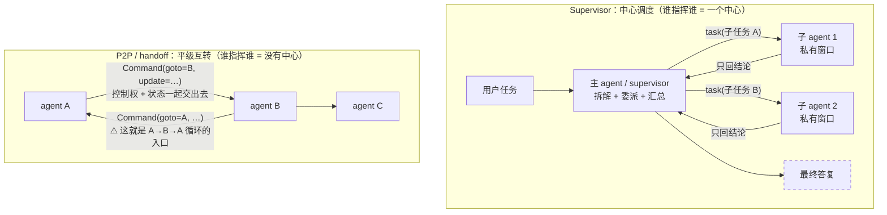
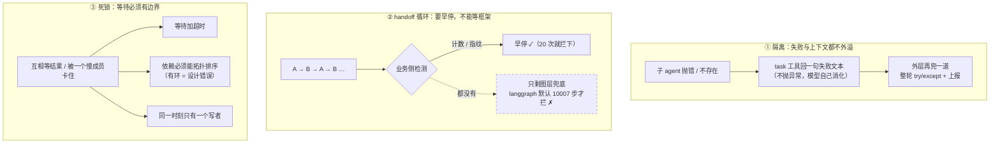
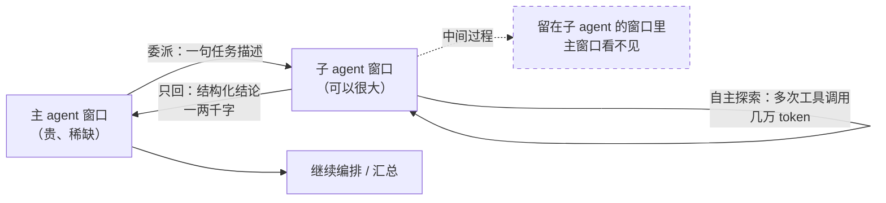
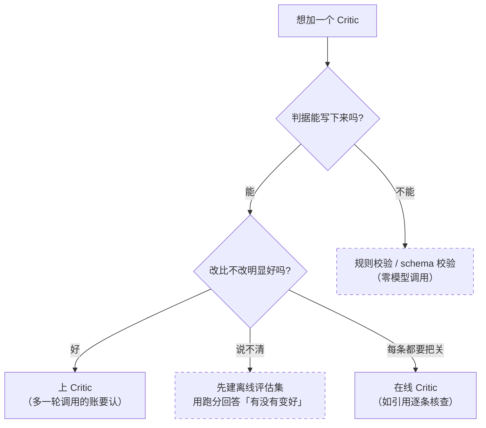
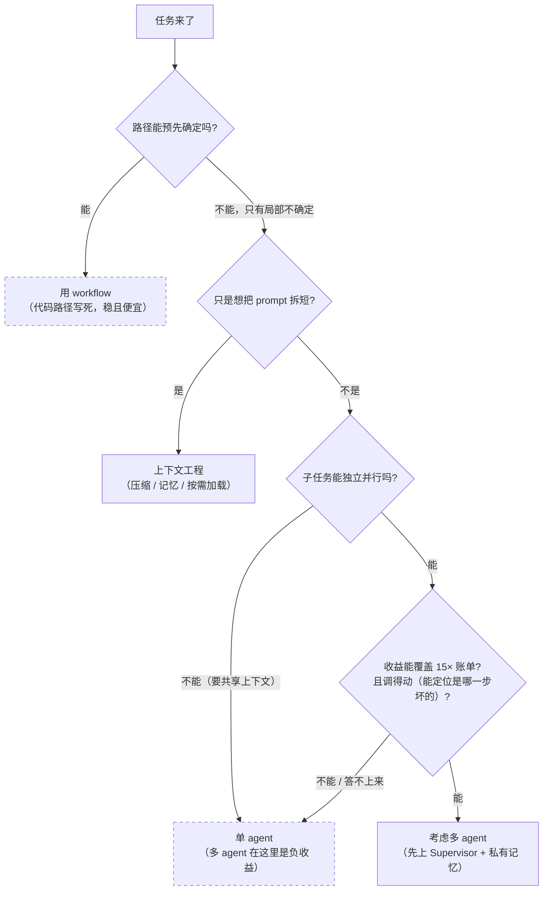
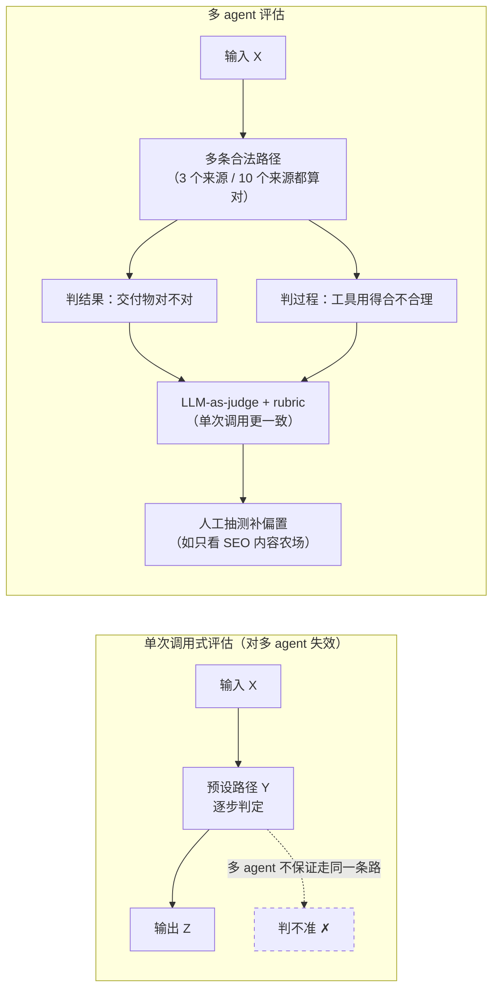

# 多智能体 · 专题底稿

> **本目录共五份专题底稿**：[01 上下文压缩](./01-context-compaction.md) · [02 可观测](./02-observability.md) · [03 人机确认](./03-hitl-approval.md) · [04 无状态化与 graceful drain](./04-stateless-and-drain.md) · [05 多智能体](./05-multiagent.md)。
> **本份与 [04](./04-stateless-and-drain.md) 是「只讲不做」的原理底稿**。区别在本份**有真素材可指** —— `project/deep_search` 用 DeepAgents 真跑过 subagent，`project/charplot` 里有一次「**主动不用 subagent**」的取舍（§4）。
> 上游：`CharAgent/docs/DESIGN.md` §4 ⑦ 的多 agent 三册（拓扑与状态共享 / 协作与纠错 / 控制流风险）+ §4 ⑩ 的 #56「Workflow vs Agent」（`DESIGN.md:314-325`）· `.scratch/Charlotte/PLAN.md` §5 的「明确不做」表。
> 代码锚点（行号按 2026-10-08 的工作区、以及**本地装的库源码**记）：[`project/deep_search/agent/`](../../../project/deep_search/agent/) · [`project/charplot/agents/`](../../../project/charplot/agents/) · [`project/charplot/pipeline/`](../../../project/charplot/pipeline/) · `.venv/Lib/site-packages/deepagents/middleware/subagents.py`（deepagents 0.7.5）· `.venv/Lib/site-packages/langgraph/`（langgraph 1.2.9）。
> 行业侧只引**一手**：Anthropic 两篇工程博客 · DeepAgents 官方文档 · **本项目实际安装的 deepagents / langgraph 源码**（逐行可核）。原文摘录统一在 [§8](#8-行业一手来源原文摘录)。
> **一处没抓到，如实记**：LangGraph 官方「多 agent / supervisor / handoff」文档页没取到（站点改版、原 URL 已 404，抓取额度同时用尽）。所以本份讲 handoff 与循环兜底时，用的是**本地安装的 langgraph 源码**（`Command` 原语、`recursion_limit` 默认值）——一手性更强，但少了官方那段「什么场景用哪种拓扑」的正面清单。

---

## 0. 五分钟版

### 0.1 一句话

**多智能体买的是「并行度 + 上下文隔离」，付的是「一层不确定性 + 一层通信开销 + 一条新的失败路径」——所以它从来不是「更先进的架构」，而是一笔要算得过来的账。**

### 0.2 六个问题的一条线

| # | 问题 | 一句话答案 | 层 |
|---|------|-----------|----|
| Q1 | 拓扑与状态共享怎么选（#42） | **两个独立决策**：拓扑决定「谁指挥谁」（Supervisor / P2P / 层级），状态共享决定「各自看到什么」（共享黑板 / 私有记忆）—— 别捆在一起选 | 高频 |
| Q2 | 三条控制流风险怎么处理（#44） | 子 agent 隔离（失败与上下文都不外溢）· handoff 循环（计数 / 指纹 / 上限）· 死锁（**等待必须有超时**，依赖有环就是设计错） | 高频 |
| Q3 | 子 agent 最大的价值是什么 | **上下文隔离** —— 它烧几万 token 做探索，只回一两千字结论；DeepAgents 的官方叫法是 **context quarantine** | 高频 |
| Q4 | Critic 模式什么时候值得（#43） | 两条判据（Anthropic 的 evaluator-optimizer）：**判据能写下来**、且**改比不改明显好**；否则那次调用买的是噪声 | 低频 |
| Q5 | 什么时候**不该**用多智能体 | 任务线性 → workflow · 只想拆短 prompt → 那是上下文工程 · 模型能力不足 → 换模型更便宜 · **没有可并行的独立子问题 → 别上** | 低频 |
| Q6 | 怎么评估与观测一个多 agent 系统 | 判**结果**不判**步骤**（同一目标允许不同路径）· LLM-as-judge 配评分表 · 人工测试补自动化看不见的偏置 | 少数了解 |

### 0.3 三个数字（都有出处，见 §8）

- **15×**：Anthropic 的实测 —— agent 比 chat 多烧约 4 倍 token，**多 agent 系统比 chat 多烧约 15 倍**。
- **90.2%**：Anthropic 内部研究评估上，「Opus 主 + Sonnet 子」的多 agent 相对单 agent Opus 的提升（同一家的自测，不是通用结论）。
- **10007**：本地 langgraph 1.2.9 的 `DEFAULT_RECURSION_LIMIT`（`_internal/_config.py:32`）—— **图层面那道「防无限循环」的兜底，阈值其实很松**（见 Q2）。

---

## 1. 行业全景

### 1.1 两类一手来源的坐标（短引 + 链接，长摘在 §8）

| 来源 | 一句话 | 对本专题的意义 |
|------|--------|--------------|
| **Anthropic**《Building effective agents》（2024-12） | workflow 与 agent 的**界线**：「workflows 由**预先写好的代码路径**编排，agents 由 **LLM 动态决定**自己的过程与工具使用」；建议「**找到最简单的解法**，只在确有必要时加复杂度」 | Q5 判据的源头；#56「workflow 做骨架、局部才用 agent」的出处 |
| **Anthropic**《How we built our multi-agent research system》（2025-06） | **orchestrator-worker** 模式；「**搜索的本质是压缩**」；**15× token** 与 **90.2%** 两个数字；「升级模型比翻倍 token 预算更划算」；「**需要所有 agent 共享同一上下文的域不适合多 agent**」；同步执行的瓶颈（「整个系统可能被一个正在搜索的子 agent 卡住」）；**emergent behaviors** 与 rainbow deployment；评估判结果 + rubric + 人工补偏置 | 几乎所有问题（Q2/Q3/Q5/Q6）的主来源 |
| **DeepAgents 官方文档 · Subagents** | 子 agent 适合 **context quarantine**；解决 **context bloat problem**（「主 agent 只收到最终结果，不收到产出它的那几十次工具调用」）；**❌ 清单**里赫然写着「**开销大于收益**」；`mode=isolated`（默认，只看到被委派的任务）/ `fork`（继承父对话）；`response_format` 让父收到 JSON | Q3 的官方定性；「不用」的官方背书 |
| **deepagents 0.7.5 源码**（`.venv`） | 委派就是一个叫 `task` 的**工具**；「私有记忆」的实现 = 「复制父状态 → `messages` 换成一条任务描述」；**同步**（`subagent.invoke`）；子 agent 不存在时**返回文本不抛异常** | Q1/Q2 落到机制层的一手依据 |
| **langgraph 1.2.9 源码**（`.venv`） | handoff 的底层原语是 `Command(goto=..., update=...)`；`DEFAULT_RECURSION_LIMIT = 10007` —— **防死循环，不防浪费** | Q2 的「框架兜底很松」有实测 |

### 1.2 两条值得先记住的设计原则

1. **界线在「决策权」**：workflow vs agent 的差别**不在用没用多个模型**，而在「下一步走哪儿，是代码定的还是模型定的」。所以正确的形态常常是**混的** —— workflow 做骨架（路径写死）、**只有局部不确定的环节**才交给模型（#56 的原话）。
2. **隔离就是压缩**：Anthropic 的原话「The essence of search is compression」—— 子 agent 的第一性价值不是「分工」，是**用自己的窗口替主窗口消化细节**。从主 agent 视角看这是上下文治理（Isolate），从系统设计视角看这就是多智能体。**同一件事的两面。**

### 1.3 企业怎么做 vs 本项目为什么不做

| 维度 | 企业 / 官方做法 | 本项目 | 差在哪 / 为什么 |
|------|---------------|--------|----------------|
| **多 agent 实现** | orchestrator-worker（Anthropic Research）/ `subagents=[...]`（DeepAgents）；子 agent 独立窗口、结构化回结论 | **主线不做**（判据见 §5）；**子项目真跑过**：`project/deep_search`（Supervisor + 私有记忆 + 同步）· `project/charplot`（workflow 骨架 + 一格 agent，且**主动退过一次**） | 主线链路里没有那个形状的问题（§5）；但「上下文隔离」与「控制流风险」两个核心问题**在子项目里有真素材** |
| **拓扑** | Supervisor / P2P-handoff / 层级；DeepAgents 用 `mode` 显式表达状态共享 | deep_search 是 Supervisor + 私有记忆；charplot 更前一步 —— 连拓扑都没有（agent 当节点） | 本项目演示的是**从「真多 agent」到「精确控制」的整条谱系** |
| **同步 / 异步** | Anthropic 现状是同步（承认「被一个慢 subagent 卡住」），方向是异步（并写明代价） | deep_search 同步（框架的 `task` 工具内部就是 `invoke`） | 同一条工程事实 |
| **成本** | 15× token；用配额档位饿死循环（「简单查询 1 个 agent，3–10 次工具调用」） | 客服演示既不需要跨十几条线索并行、也不需要跑几百轮 —— 但 15× 与「多一条失败路径」是全量支付的 | 收益看不见、账单看得见（§4.2） |
| **评估** | 判结果 + rubric + 人工补偏置 | 子项目有 `CharApp/eval/` 的离线跑分（判结果那一档）+ `deep_search/api/monitor.py` 的过程上报 | **没做**「多 agent 专属」的评估（LLM-as-judge、路径合理性）—— 没有承载对象 |
| **发布** | rainbow deployment（新旧版本同时在线、逐步切流量） | 单进程 + 断点续跑（[04](./04-stateless-and-drain.md)） | 同一个问题（部署打断运行）的两种解法：他们是并存切换，本项目是断点续跑 |

> **这张表的用法**：被问「你们做没做多 agent」，**别答「太复杂所以没做」** —— 说清「主线没有那个形状的问题（判据在 PLAN §5）；但它的两个核心问题我在子项目里真跑过，还有一次主动把 agent 换回确定性代码的取舍」。

---

## 2. 本项目实现（三个例子，两种用法，一次主动放弃）

> 这一节是这份底稿比通用资料值钱的地方：**逐条指着自己的代码说**。行号按 2026-10-08 的工作区记。

### 2.1 `project/deep_search` —— 真多 agent（Supervisor + 私有记忆 + 同步）

| 事实 | 锚点 | 说明 |
|------|------|------|
| 主 agent 装配 | `project/deep_search/agent/main_agent.py:19-40` | `create_deep_agent(..., subagents=[...], checkpointer=InMemorySaver())`；`subagents` 列表在 `:27-31` |
| 三个子 agent 的形态 | `agent/subagents/network_search_agent.py` · `database_query_agent.py` · `kownledge_base_agent.py` | 每个都是一个 dict：`name` / `description` / `system_prompt` / `tools` —— 与 DeepAgents 官方 SubAgent 规格一一对应 |
| **知识库子 agent 写了但没挂** | `main_agent.py:16` 与 `:30` 两处注释掉 | 诚实记一笔：它是**未被装配**的代码，不代表用过 |
| 子 agent 的 prompt 从哪来 | `agent/prompt.py:48`（`sub_agents_config = prompt_config_content["sub_agents"]`） | 委派说明书（description）与角色设定（system_prompt）都是配置项 |
| 记忆与会话隔离 | `main_agent.py:86-88`（`configurable.thread_id`）+ `:69-79`（ContextVar 绑定） | 每个任务一个 `thread_id`；并发请求靠 ContextVar 隔离 |
| 失败边界 | `main_agent.py:104-117`（整轮 try/except + `monitor._emit("error", …)`）+ `:119-122`（finally 重置 ContextVar） | 「失败不外溢」在**业务侧**的那一道 |
| 委派的机制（库源码） | `.venv/…/deepagents/middleware/subagents.py:599`（`name="task"`）· `:539`（子 agent 的 messages 只剩一条任务描述）· `:567`（`subagent.invoke` —— **同步**） | 「Supervisor + 私有记忆 + 同步」这三件事各自落在哪一行 |

### 2.2 `project/charplot` —— 不是多 agent，是「workflow 骨架 + 一个 agent 当节点」，而且**主动退过一次**

**这是本仓最值得讲的一处**，因为它把「该用 / 不该用」的界线画在了同一条链路上：

| 事实 | 锚点 | 说明 |
|------|------|------|
| 骨架是 workflow | `project/charplot/pipeline/graph.py:1-6` 与 `:23`（`STAGES`） | 四阶段**串行** StateGraph（parse → analyze → search → deconstruct）—— 路径写死，这是 #56 说的「workflow 做骨架」 |
| 只有一格是 agent | `project/charplot/agents/search_agent.py:42-59`（`build_search_agent`，其中 `:53-59` 是 `create_deep_agent(...)` 调用） | **注意：没有 `subagents=` 参数** —— 它是一个独立的 DeepAgents agent 被当成节点调用，拓扑上不是 subagent |
| 它只回结构化结论 | `search_agent.py:53-59` 的 `response_format=ToolStrategy(schema=SearchReport)` | 「压缩」的接口：`SearchReport`（`:33-39`）是 pipeline 唯一消费的东西；`ToolStrategy` 而非默认 ProviderStrategy 的理由写在 `:51-52`（DeepSeek 不支持 json_schema） |
| 工具是「检索源 → @tool」 | `agents/tools.py:1-4`（模块 docstring） | 工具名 = `<源名>_search`，描述来自源定义 —— 与 #68「工具描述写给没见过系统的工程师看」同一条 |
| **知识库旅程绕开 agent** | `pipeline/stages/search.py:56-58`（分支） | `kb_id` 非空时走 `_kb_overview_report`（确定性逐个检索），**完全不经过 subagent** |
| 为什么绕开（原话） | `stages/search.py:7-10` 的模块 docstring | 「知识库旅程: 不走 subagent — 骨架轮需要确定的概览资料(**subagent 是否产出报告不确定**), 对建议查询逐个确定性检索知识库」 |

### 2.3 `CharAgent` 主线 —— 为什么不做（判据在 §5）

- `CharAgent/docs/DESIGN.md` 把多 agent 三册全列成 **P2**（拓扑与状态共享 / 协作与纠错 / 控制流风险），并写明两条要害（两个独立决策、三条控制流风险）。
- 主线的实际形态（见 [04](./04-stateless-and-drain.md) §2）：单 agent 循环 + `ToolProvider` 接缝 + 快照 + HITL。**没有一处需要「多个 agent 协商」** —— CharApp 的客服链路是单用户一问一答，工具是串行调用，唯一的不确定性在「模型选哪个工具、调用几次」，那是单 agent 自己的事。
- 一句话：**框架层面的多 agent 会引入「调度」这个新组件**，而它服务的场景在本项目里不存在（§5）。

---

## 3. 面试题演练

### 一、高频

#### Q1. 多智能体的拓扑与状态共享怎么选？（#42）

🎯 **考点**：知不知道这是**两个**决策而不是一个。卡点：多数人只答「用 Supervisor」或「用 handoff」，把「谁指挥谁」和「各自看到什么」混成一句话 —— 而后者（状态共享）才是决定 token 账单与调试难度的那个。

📌 **知识点**：
1. **拓扑 = 谁指挥谁**，三种：① **Supervisor**（中心调度：一个主 agent 拆任务、派给子 agent、汇总结果）② **P2P / handoff**（平级互转：A 把控制权连同状态交给 B，B 再交给 C）③ **层级**（Supervisor 嵌套 Supervisor）。
2. **状态共享 = 各自看到什么**，两档：① **共享黑板**（所有 agent 读写同一份状态）② **私有记忆**（各自独立窗口，只交换结论）。DeepAgents 官方文档把它做成了显式开关：`mode` 取 `"isolated"`（默认，**子 agent 只看到被委派的那句任务**）或 `"fork"`（继承父 agent 的对话与 system prompt）。
3. **为什么必须拆成两个决策**：拓扑决定**成本形状**（几个 agent × 各跑几轮），状态共享决定**每个 agent 的窗口里装多少**。Supervisor + 私有记忆是最常见的一档（省 token、可并行）；共享黑板在「所有 agent 必须看到同一份事实」时才对（Anthropic 也点名这类「需要所有 agent 共享同一上下文」的域**现在不适合多 agent**）。
4. **本仓两个例子正好落在这条轴的两端**：`project/deep_search` 是 **Supervisor + 私有记忆**（`create_deep_agent(subagents=[...])`，框架替你做的正是「子 agent 只收到一句任务描述」）；`project/charplot` 连拓扑都没有 —— 它是 **workflow 骨架上的一个节点**（§2.2）。
5. **一次委派在代码里长什么样**（把抽象落到机制上）：DeepAgents 把子 agent 暴露成一个叫 `task` 的工具（`deepagents/middleware/subagents.py:599`），模型用 `subagent_type` 选人；子 agent 的初始状态是「复制父状态，**然后把 messages 整个换成一条 HumanMessage**」（同文件 `:539`）—— 这就是「私有记忆」四个字的实现，一句话就答得出来。
6. **别把「写成一个 dict」当成架构**：本仓 deep_search 的三个 subagent 就是三个 dict（`name` / `description` / `system_prompt` / `tools`），真正的架构信息在**它们被谁调用、彼此看不看得见对方的上下文**里。

💡 **类比**：**公司里的部门协作**。Supervisor 是**主管派活** —— 主管手上有全局，把活拆给几个人，各自回去干，交上来的是结论不是过程；handoff 是**同事互相转交** —— 我这块做完了顺手把单子递给隔壁，控制权跟着走，谁也没有全局视角；层级则是「总监 → 主管 → 组员」。而**状态共享**问的是另一件事：这几个人是**共用一块白板**，还是**各写各的笔记、只交换结论**？现实里很容易看到一种坏架构：拓扑是「主管派活」，但所有人盯着同一块白板 —— 结果是每个人都在读别人写到一半的字，既慢又乱。

🖼️ **图**（拓扑对比：Supervisor vs P2P / handoff）：


🗣️ **话术**：我会先把这两件事拆开。**拓扑**决定「谁指挥谁」，三种：Supervisor 是中心调度，一个主 agent 拆任务、派给子 agent、汇总；P2P 或者叫 handoff，是平级互转，A 把控制权连同状态交给 B；再往上叠就是层级。**状态共享**决定「各自看到什么」，两档：共享黑板，所有人读写同一份状态；私有记忆，各自独立窗口、只交换结论。**为什么必须拆开说**：拓扑决定成本形状，状态共享决定每个窗口里装多少 —— 这才是 token 账单和调试难度的来源。而且这两件事在框架里常常是两个不同的开关：DeepAgents 的子 agent 默认就是私有记忆（`mode="isolated"`，子 agent 只看到被委派的那句任务），想让它继承父对话得显式改成 `fork`。最后一层落到机制上：一次委派在 DeepAgents 里就是一个叫 `task` 的工具，选人靠 `subagent_type`，子 agent 的初始状态是复制父状态之后**把 messages 整个换成一条任务描述** —— 「私有记忆」就是这么实现的。

**我项目里的做法**：`project/deep_search` 用 DeepAgents 的 `create_deep_agent(subagents=[...])` —— 那是 **Supervisor + 私有记忆**，而且**同步**的（框架的 `task` 工具内部就是 `subagent.invoke(...)`）。`project/charplot` 的检索环节用的是**单个** DeepAgents agent 当图里的一个节点（没有 `subagents=` 参数）—— 它没有拓扑可言，只有「状态进、报告出」的结构化契约。

---

#### Q2. 多 agent 的三条控制流风险怎么处理？（#44 · 必答）

🎯 **考点**：**这一条是必答项** —— 加一个 agent 就是加一条失败路径，答不出「失败怎么不外溢、循环怎么断、互相等怎么办」，说明只搭过 happy path。卡点：把「框架会兜底」当答案（框架的兜底阈值可能很松，见下）。

📌 **知识点**：

**风险一：子 agent 隔离（失败与上下文都不外溢）**
1. **上下文隔离**：DeepAgents 给子 agent 的初始状态是「复制父状态 → `messages` 换成一条 `HumanMessage`」—— 它看不到父对话，父也看不到它的中间过程，只拿到最终结果。
2. **失败隔离要两道**：① **调用侧**：子 agent 不存在时，`task` 工具**返回一句文本**而不是抛异常 —— 与 `CharAgent/tool/executor.py` 那条纪律同源：**工具执行永不抛异常，失败文本回填给模型自己消化**；② **整段兜底**：本仓 deep_search 在整轮外面还有一层 try/except + 上报错误，保证异常不会炸穿到 WebSocket 层。
3. **隔离的代价**：Anthropic 那篇的原文是「minor system failures can be catastrophic for agents」「errors compound」—— 所以他们的做法是**可恢复**（从断点接着跑）而不是「希望别出错」。这一条与 [04](./04-stateless-and-drain.md) 的 checkpoint 是同一件事的两个面。

**风险二：handoff 循环（A→B→A 要检测并打破）**
4. **三种检测**：**计数**（本环内 handoff 次数硬上限）· **指纹**（把 `(源, 目标, 任务摘要)` 做 hash 存进状态，重复出现就拒绝）· **上限**（图层面兜底）。生产上三者叠加，因为前两种能**早停**，后一种只保证「不会无限」。
5. **图层面那道兜底有多松，有实测**：本地 langgraph 1.2.9 的 `DEFAULT_RECURSION_LIMIT = 10007`（`_internal/_config.py:32`）—— 拦得住死循环，但拦不住「A 和 B 来回转交 20 次」这种**浪费**。所以循环检测必须**业务自己**做，框架只兜最坏情况。
6. **更省的做法是预防而不是检测**：Anthropic 早期的实际故障是「简单查询 spawn 出 50 个子 agent」，他们的修法是**在 prompt 里写死预算档位**（简单事实查询 1 个 agent、3–10 次工具调用；直接对比 2–4 个子 agent、每个 10–15 次；复杂研究才 >10 个）—— 用**配额**把循环饿死，比事后打断便宜。

**风险三：死锁 / 互相等待**
7. **形状有两类**：① **互相等待**：A 等 B 的结论才能继续，B 等 A 的输入 —— 依赖图上是个环；② **被一个慢成员卡住**：Anthropic 自己写了这条工程事实 —— lead agent **同步**执行 subagent，「整个系统可能被一个正在搜索的子 agent 卡住」。
8. **通用解法三条**：**等待必须有超时**（本仓 `CharAgent/tool/executor.py` 的工具超时就是这道闸；超时的处置是**中断整轮**，见 ADR-0024）· **依赖关系能画出拓扑序**（画不出来就是设计错误，不是实现问题）· **同一时刻只有一个写者**（与 DESIGN #20 那条「同一个 thread 不并发写」同源）。
9. **Anthropic 给的方向是异步**（子 agent 并行、主 agent 可中途改派），但他们同时写明代价：结果协调、状态一致性、错误传播都会变难 —— 又是一次「拿复杂度换能力」的取舍。

💡 **类比**：**三个和尚抬水**。① **隔离**：一个人打水摔了，不能让整座庙没水 —— 所以每担水各自负责，摔了回一句「这趟没打上」（失败文本回填）。② **循环**：甲把桶递给乙、乙又递回甲，来回十趟井边一步没走 —— 得有人在墙上画正字（计数 / 指纹），而不是等天黑（`recursion_limit` 那种松阈值）。③ **死锁**：两个人各抱着桶的一端，都在等对方先走 —— 解法不是「更礼貌」，而是**规则**：等超过 N 分钟就先放下（超时），或者一开始就定好谁先走（拓扑序）。

🖼️ **图**（三条风险各自的形状与闸门）：


🗣️ **话术**：三条我按「会怎么坏 → 加什么闸」来答。**第一是隔离**，两层：上下文隔离 —— DeepAgents 给子 agent 的初始状态是把父状态复制过来之后、`messages` 整个换成一条任务描述，所以它看不到父对话、父也看不到它的中间过程；失败隔离 —— 框架的 `task` 工具在子 agent 不存在时返回一句文本而不是抛异常，和我们 CharAgent 里「工具执行永不抛异常、失败文本回填给模型」是同一条纪律，整轮外面还有一层 try/except 保证不炸穿到连接层。**第二是 handoff 循环**，三种手段：计数、指纹（把「从谁到谁、干什么」做 hash 存进状态，重复就拒绝）、以及图层面兜底。这里有个实测值得说：langgraph 1.2.9 的 `DEFAULT_RECURSION_LIMIT` 是 **10007**，拦得住死循环，但拦不住「来回转交 20 次」这种浪费 —— 所以循环检测必须业务自己做，框架只兜最坏情况。更省的做法是预防：Anthropic 早期真的 spawn 出过 50 个子 agent，他们后来的修法是在 prompt 里写死预算档位，用**配额**把循环饿死。**第三是死锁**，两类形状：互相等对方的结果（依赖图上有环），或者被一个慢成员卡住 —— Anthropic 自己就写明同步执行子 agent 时「整个系统可能被一个正在搜索的子 agent 卡住」。通用解法三条：等待必须有超时、依赖必须能拓扑排序、同一时刻只有一个写者。他们给的方向是异步，但代价也写明：结果协调、状态一致性、错误传播都会变难。

**我项目里的做法**：这三条在 `CharAgent` 里**只有一条半能用** —— 因为主线根本没有第二个 agent。能用的是「等待必须有超时」那一半（`tool/executor.py` 的工具超时；超时后的处置是**中断整轮**而不是让模型重试，见 ADR-0024）；以及「失败文本回填」这条纪律（`execute_tool` 永不抛异常）。真正跑过多 agent 的是 `project/deep_search`：它的 `subagents=[...]` 是同步的（`deepagents/middleware/subagents.py:567` 的 `subagent.invoke`），所以第 7 条「被慢成员卡住」就是我那个系统**实际会有的**风险。

---

#### Q3. 子 agent 最大的价值是什么？为什么它和「上下文压缩」是一回事？

🎯 **考点**：能不能把「多 agent」和「上下文工程」连起来 —— 子 agent 的第一性价值不是「分工」，是**隔离**。卡点：把多 agent 讲成「多个模型互相讨论」，那是最不重要的一种用法。

📌 **知识点**：
1. **官方定性**：DeepAgents 文档的原话是子 agent 适合 **context quarantine**（上下文隔离/检疫），解决的叫 **context bloat problem** —— 工具输出把主 agent 的窗口撑爆；子 agent 把这段细节隔离在自己窗口里，**主 agent 只收到最终结果，不收到产出它的那几十次工具调用**。
2. **Anthropic 的表述更狠**：「**搜索的本质是压缩** —— 把洞见从大语料里蒸馏出来。子 agent 用自己的窗口并行探索不同侧面，再把最重要的 token 浓缩给主 agent」，而且「每个子 agent 还带来关注点分离 —— 不同的工具、prompt、探索轨迹，降低了路径依赖」。
3. **这一条与 [01](./01-context-compaction.md) 的 Q3 直接呼应**：那一题讲上下文的 Offload / Reduce / **Isolate** 三层，Isolate 就是这里。**同一件事的两面**：从主 agent 的视角看是「上下文治理」，从系统设计视角看是「多智能体」。
4. **隔离要付出接口成本**：子 agent 的产出必须**能塞回主窗口**，所以结构化输出是关键 —— 本仓 charplot 的检索 agent 用 `ToolStrategy(schema=SearchReport)` 把产出约束成一份 Pydantic 报告；DeepAgents 文档也把 `response_format` 列为子 agent 的一个字段（「设了它，父 agent 收到的是 JSON 而不是自由文本」）。
5. **顺带一个省钱的细节**：既然子 agent 是独立的，它就可以**换模型** —— Anthropic 的实测配置是 Opus 当主、Sonnet 当子；DeepAgents 的 `model` 字段支持每种子 agent 单独指定。这是「隔离」白送的一个自由度。
6. **反面**：如果子任务之间**必须共享同一份上下文**，隔离就成了障碍 —— 每次委派都要把上下文再送一遍，token 账立刻翻倍（Anthropic 因此点名这类域「不适合多 agent」）。

💡 **类比**：**带着助手去图书馆做课题**。你自己（主 agent）桌上只放提纲和结论；助手（子 agent）钻进书库翻几十本书，回来只说「这三本有用，第 42 页这段是关键」—— 书库里翻过的那几十本**没进过你的桌子**。这就是 Isolate：**细节留在他的窗口，结论才进你的窗口**。而如果课题必须「每一步都两个人一起看同一本书」，那就不该派助手 —— 那笔账会反过来。

🖼️ **图**（子 agent 的 token 账）：


🗣️ **话术**：子 agent 的第一性价值是**隔离**，不是分工。DeepAgents 官方把它叫 context quarantine —— 解决的叫上下文膨胀问题：工具输出会把主 agent 的窗口撑爆，子 agent 把这段细节隔离在自己窗口里，主 agent 只收到最终结果，不收到产出它的那几十次工具调用。Anthropic 说得更本质：**搜索的本质是压缩**，子 agent 用自己的窗口并行探索，再把最重要的 token 浓缩给主 agent，而且带来了关注点分离 —— 不同的工具、prompt、探索轨迹。这句话和上下文工程里的 Isolate 是同一件事：从主 agent 看是上下文治理，从系统设计看就是多智能体。代价有两个：一是**接口成本** —— 子 agent 的产出必须塞得回主窗口，所以结构化输出很关键（charplot 里那份检索 agent 就是用 ToolStrategy 把产出约束成一份 Pydantic 报告）；二是**子任务必须真的可以独立** —— 如果它们必须共享同一份上下文，隔离就变成每次委派都要重送一遍上下文，token 账立刻翻倍。顺带一个白拿的好处：子 agent 独立就意味着可以**换模型**。

**我项目里的做法**：`project/deep_search` 的三个子 agent 就是三个「有自己 system_prompt 和工具集」的独立执行体（每个 9–13 行，一个 dict）；`project/charplot` 更刻意 —— 检索这一段被做成一个**带结构化契约的独立 agent**（`SearchReport`），pipeline 只消费报告，不关心中间探索。而它**最值得讲的一处是反过来的**：知识库旅程连这个 agent 都不用了（§2.2 / §4.1）。

---

### 二、低频

#### Q4. Critic 模式什么时候值得？（#43）

🎯 **考点**：能不能算出「多一轮调用」的收益边界。卡点：把 Critic 当成万能提分器 —— Anthropic 给的判据是**两条同时成立**，缺一条就不值得。

📌 **知识点**：
1. **Critic 的正式名字**：Anthropic 的 **evaluator-optimizer** 工作流 —— 一个 LLM 产出、另一个给评价与反馈，循环收敛。
2. **两条判据（原文）**：①「LLM 的产出在被人类指出问题后能明确变好」②「LLM 自己能给出这种反馈」。换句话说：**判据能写下来**、**并且改比不改明显好**。
3. **它本质上是「用调用换质量」** —— 所以第一个要问的是「这份质量差价值得再花一次调用吗」；在 agent 场景里还要乘以轮数（critic 参与的是循环，不是一次性）。
4. **更便宜的三种近似**：① **并行投票**（parallelization/voting：同一任务跑多次、按阈值取共识）—— 不需要第二个 prompt 角色；② **规则校验**（schema 校验 / 引用存在性 / 数值范围）—— 零模型调用，本项目大量用这条（charplot 的图谱解构与出题都是「裸 LLM 调用 + 结构校验」）；③ **离线评估集**（把「好」定义成可复现的指标，用跑分代替在线挑刺）—— `CharApp/eval/` 就是这条。
5. **什么时候必须上在线 Critic**：判据**无法离线复现**、且每条产出都需要把关时（例如面向用户的正式文书、要引用一手来源的报告）。Anthropic 的引用核查（CitationAgent）就是这种：引用对不对，必须逐条对着材料查。
6. **成本与收益都要留痕**：多一轮调用意味着成本上升，所以「critic 到底有没有用」也必须能用数据回答（同源的判据见 `CharApp/eval/` 的 A/B 报告：两组对照、只看差异是否跳出噪声）。

💡 **类比**：**论文的审稿人**。审稿值得的前提是：**有明确的评审标准**（能写出「哪几条不达标」）而且**作者真的会改**。如果标准说不清，或者作者拿到意见也只是换个说法，那多请一个审稿人只是多花几个月 —— 这种时候更划算的是**查重工具和格式检查**（规则校验），或者**投稿前的自查清单**（离线评估集）。

🖼️ **图**（该不该加 Critic 的决策）：


🗣️ **话术**：Critic 在 Anthropic 的框架里叫 evaluator-optimizer：一个 LLM 产出、另一个给评价和反馈，循环收敛。它的判据是**两条同时成立**：一是「LLM 的产出在被指出问题后能明确变好」，二是「LLM 自己能给出这种反馈」—— 说白了就是**判据能写下来、而且改比不改明显好**。缺一条都不值得，因为多一轮调用就是多一份成本，在 agent 里还要乘以循环轮数。所以实际工程里有三种更便宜的近似：并行投票（同一任务跑多次取共识）、规则校验（schema、引用存在性、数值范围 —— 零模型调用）、离线评估集（把「好」定义成可复现的指标）。只有一种情况必须上在线 Critic：判据无法离线复现、而且每条产出都要把关 —— 比如 Anthropic 的引用核查。最后一句：critic 有没有用，也得有数据回答，不能凭感觉。

**我项目里的做法**：`CharAgent/docs/DESIGN.md` 把 Critic 归在 #43（P2，**没做**）。替代方案在本仓有两处实打实的：**规则校验**（`project/charplot` 的出题与图谱解构：裸 LLM 调用 + 结构校验，校验不过就重试/丢弃）与**离线评估**（`CharApp/eval/` 的 20 题 6 场景 + 两组 A/B）。这条的选择理由可以正面讲：**当「好」能被写下来时，离线跑分比在线 critic 便宜、可复现、还能做 A/B**。

---

#### Q5. 什么时候**不该**用多智能体？（这一条最值钱）

🎯 **考点**：**克制**。面试里讲多 agent 的人很多，能讲清「什么时候不用」的人少 —— 而本项目恰好有一次**主动不用**的真实取舍（§4.1）。加分点：把「不用」的判断落到可检查的问题上。

📌 **知识点**：
1. **四条「不该用」**：
   - **任务本身是线性的** → 用 workflow。#56 的原话：「用 workflow 做骨架兜底，**局部**不确定环节才用 agent —— 而不是整个系统二选一」。
   - **只是想把自己的 prompt 拆短** → 那是上下文工程（压缩 / 记忆 / 按需加载），不是多 agent。拆 prompt 不需要第二个模型，只需要更好的上下文装配。
   - **模型能力不足** → 换模型比加 agent 便宜。Anthropic 的实测：升级模型带来的收益**大于**把 token 预算翻倍。
   - **没有可并行的独立子问题** → 别上。Anthropic 的原话是「需要所有 agent 共享同一上下文、或 agent 之间依赖很多的域，今天不适合多 agent」，还点名「多数编码任务真正可并行的部分比研究少，而 LLM 现在还不太会实时协调与委派」。
2. **一句话的成本口径**：**加一个 agent = 加一层不确定性 + 一层通信开销 + 一条新的失败路径**。而 Anthropic 的账单是 15× token —— 所以「值不值」必须对着**任务价值**算，不是对着「架构先不先进」算。
3. **三个自检问题**（当判据用）：
   1. 这几个子任务**能不能各自独立跑**（不共享同一份上下文、不需要来回对齐）？
   2. 这条链路的**收益**（覆盖率 / 准确率 / 吞吐）**能不能覆盖 15× 的账单**？
   3. 出了问题，**有没有手段回答「是哪一步坏的」**？（多 agent 的调试难度是超线性的 —— Anthropic 专门写了「minor changes cascade into large behavioral changes」）
   三个都答「是」才考虑上；有一个答不上来，就先做单 agent。
4. **框架文档自己也有 ❌ 清单**（DeepAgents 官方）：简单单步任务 · 需要保留中间上下文 · **开销大于收益**。「开销大于收益」这一条放在官方文档的 ❌ 里，本身就是最好的背书。
5. **「不用」也要留证据**：本项目那次取舍留下了代码注释（`pipeline/stages/search.py:7-10`，理由是「subagent 是否产出报告不确定」）—— **记录「不做」与记录「要做」同样重要**。

💡 **类比**：**三个人开会讨论一个问题**。什么时候比一个人做完更快？当问题**能切成三块、各查各的**（并行搜索、独立审阅）；什么时候更慢？当三个人必须**边看同一份材料边对齐**（共享上下文），或者只是「一个人也能做完但想显得正式」—— 后两种情况下，多出来的不是算力，是**协调成本**：三个人的时间、三次沟通、以及「谁负责」的模糊。

🖼️ **图**（该不该上多 agent 的决策树）：


🗣️ **话术**：这一条我会答得很干脆，因为它的判据很清楚。四类不该用：**任务线性** → 用 workflow，这也是项目里的原则 —— workflow 做骨架兜底，只有局部不确定的环节才用 agent，不是整个系统二选一；**只想把 prompt 拆短** → 那是上下文工程的事；**模型能力不足** → 换模型比加 agent 便宜，Anthropic 的实测是升级模型的收益大于把 token 预算翻倍；**没有可并行的独立子问题** → 别上，他们原话是「需要所有 agent 共享同一上下文、或者 agent 之间依赖很多的域今天不适合多 agent」。成本口径一句话：**加一个 agent 等于加一层不确定性、一层通信开销、一条新的失败路径**，而账单是 15 倍 token。所以我有三个自检问题：子任务能不能各自独立跑？收益能不能覆盖 15 倍账单？出问题我能不能回答「是哪一步坏的」？—— 三个都是，才考虑；有一个答不上来就先做单 agent。最后一点：**「不用」也要留证据** —— charplot 的知识库旅程就是因为「subagent 是否产出报告不确定」而改成确定性检索的，理由写在代码注释里。

**我项目里的做法**：主线 `CharAgent` / `CharApp` 不做（§5）；子项目里**做过、也主动退过一次** —— `project/deep_search` 是真多 agent，`project/charplot` 的同一个环节先做成 agent、后对知识库旅程改成确定性检索（`pipeline/stages/search.py:56-58`）。**这一对正反例是这份底稿比通用资料值钱的地方。**

---

### 三、少数了解

#### Q6. 多 agent 系统怎么评估与观测？（通用）

🎯 **考点**：知不知道「评估多 agent」和「评估单次调用」是两套方法。卡点：拿「输入 → 固定步骤 → 输出」那套离线单测的思路去套多 agent，然后发现没法写。

📌 **知识点**：
1. **判结果不判步骤**：Anthropic 的原话是 —— 传统评估假设「给定输入 X，系统走路径 Y 得到输出 Z」，而多 agent 不是这样：**同样的起点，不同的 agent 可能走完全不同的合法路径**（一个查 3 个来源、另一个查 10 个）。所以要评估的是「**是否达成了正确结果、且过程合理**」。
2. **两个抓手**：① **端到端结果评估**（只看最终状态/产出对不对，不逐步判定）；② **过程合理性**（工具用得对不对、用得是不是合理次数）。
3. **LLM-as-judge 配评分表**：Anthropic 的做法是**单次 LLM 调用 + 一份 rubric**（事实准确性 / 引用准确性 / 完整性 / 来源质量 / 工具效率），输出 0.0–1.0 与通过与否 —— 他们试过多 judge 分别打分，结论是**单次调用更一致、更贴合人类判断**。
4. **人测那一环不能省**：Anthropic 举的具体例子是 —— 人工测试发现早期 agent **偏好 SEO 内容农场**、忽略学术 PDF 这类权威但排位低的来源；于是他们在 prompt 里加了「来源质量」启发式。**这类偏置自动化评估看不见**。
5. **观测要盯「决策模式」而不只是内容**：他们监控 agent 的决策模式与交互结构（而不是对话内容，出于隐私），用来定位「为什么没找到本该找到的信息」。
6. **发布形态也被多 agent 放大**：Anthropic 用 **rainbow deployment**（新旧版本同时在线、逐步切流量）来避免「部署把正在跑的 agent 打断」—— 这一条与 [04](./04-stateless-and-drain.md) 的 drain 是同一个话题的两种解法（他们是并存切换，这边是断点续跑）。
7. **本项目的对照**：`CharApp/eval/` 的离线跑分就是「判结果」那一档（20 题 6 场景 + 两组 A/B，报告随仓库提交）；`project/deep_search` 的 `api/monitor.py` 把每一步上报到前端，是「过程可观测」那一档。

💡 **类比**：**考核一个项目组，不要考核每个人的键盘敲击次数**。看的是**交付物对不对**（结果），以及**干活的方式合不合理**（过程：有没有重复劳动、有没有用错工具）。而且评委会（LLM-as-judge）比单个领导更稳定 —— 但要给它一张**评分表**，否则它每次都能自圆其说；最后仍然要有人真的去看一次现场的活儿（人工测试），因为「只挑好看的来源」这种毛病，任何表格都写不出来。

🖼️ **图**（两套评估的差别）：


🗣️ **话术**：多 agent 的评估不能用「输入 → 固定步骤 → 输出」那套，因为同一个起点，不同的 agent 可能走完全不同的合法路径 —— 一个查三个来源、另一个查十个，都对。所以要判两件事：**结果对不对**（端到端，不逐步判定）和**过程合不合理**（工具用得对不对、次数是不是合理）。落地到方法上，Anthropic 用的是 **LLM-as-judge 配一份评分表**：事实准确性、引用准确性、完整性、来源质量、工具效率，输出分数和通过与否；他们试过多 judge 分别打分，结论是**单次调用更一致、更贴合人类判断**。然后两个不能省的：**人工测试** —— 他们靠人测发现早期 agent 偏好 SEO 内容农场、忽略权威但排位低的来源，这种偏置自动化评估看不见；**过程可观测** —— 他们监控的是决策模式和交互结构，不是对话内容，用来回答「为什么没找到本该找到的信息」。另外发布这块他们也踩到了：多 agent 系统跑得久，部署会把正在跑的 agent 打断，他们用新旧版本并存、逐步切流量来避免。

**我项目里的做法**：`CharApp/eval/` 是「判结果」的完整实例（评估集 + 跑批器 + 两组 A/B + 报告落仓）；`project/deep_search/api/monitor.py` 是过程上报。**没有做的**是「多 agent 专属」的那部分：LLM-as-judge、路径合理性检查 —— 因为主线不做多 agent（§5），这些评估手段没有承载对象。

---

## 4. 能讲深的设计

### 4.1 那次主动放弃：同一个位置按「输入的不确定性」分档

**这是本仓最值得讲的一处** —— 它把「该用 / 不该用」的界线画在了**同一条链路上**（`project/charplot` 的检索环节）：

| 输入路径 | 做法 | 为什么 |
|---------|------|--------|
| **材料输入**（URL / 文档） | **交给 agent 自主编排**（`build_search_agent`，deepagents） | 材料不完整、需要补全与交叉验证，不确定性高 —— agent 的探索能力正好用在这 |
| **知识库旅程** | **确定性逐个检索**（`_kb_overview_report`），完全不经过 subagent | 要的是「骨架轮的概览资料」，**确定性比智能更重要** —— 下一条链路要拿它去解构图谱，**拿不到报告整条就断** |

原话就在代码里（`pipeline/stages/search.py` 的模块 docstring）：

> 「知识库旅程: 不走 subagent — 骨架轮需要确定的概览资料(**subagent 是否产出报告不确定**), 对建议查询逐个确定性检索知识库」

**怎么讲这一段**（面试话术的骨架）：

> **「这不只是『有的地方用有的地方不用』，而是同一个位置按输入的不确定性分档」** —— 材料输入交给 agent（不确定 → 需要智能）；知识库旅程换回确定性代码（不确定的收益盖不过「拿不到报告」的风险）。这正是 #56 那条原则的最小可讲版本：**workflow 做骨架、局部不确定环节才用 agent**。
>
> 而它的价值还在于**「放弃」是主动做的**：不是因为 agent 做不出来，是因为**算清楚了这笔账**（agent 的产出不确定 × 下游依赖它 = 负收益）。**能讲清「我为什么放弃」比「我用过」更值钱。**

### 4.2 认识路径：先真跑一遍，再知道什么时候不用

这份底稿的立场可以一句话说清：**「多 agent 我先真跑过（deep_search），再在一个具体链路上算账退回了确定性代码（charplot）—— 所以我对它的态度不是『不敢用』，是『知道它贵在哪』。」**

| 走过的路 | 留下的东西 |
|---------|-----------|
| **真跑过**（deep_search：Supervisor + 私有记忆 + 同步） | 三条控制流风险不是纸上的（同步阻塞自己就撞）、委派落到 `task` 工具那一行的机制、失败边界的业务侧实现 |
| **算过账退回**（charplot 的 kb 旅程） | 「同一个位置按不确定性分档」的判据；一条写在代码注释里的「不做」理由 |
| **主线明确不做**（§5） | 判据与边界都写在 PLAN §5，不是「以后再说」 |

---

## 5. 边界与欠账

### 5.1 这个项目为什么不做（与 PLAN §5 一致）

`.scratch/Charlotte/PLAN.md` §5 的「明确不做」表里，这一条的原话是：

> **多智能体实现** ｜ **本项目没有多智能体的必要**。改为写原理底稿（本份）应付面试考察。

展开成三句（与 §2 的事实一一对应）：

1. **主线链路里没有那个形状的问题**：CharApp 是「一个用户在问、助手在答」，工具串行、写操作要人工确认 —— 没有可并行的独立子问题，也没有「多个角色需要对账」的场景。按 Q5 的三个自检问题，第一条就过不了。
2. **演示上看不见收益，账单却看得见**：多 agent 的收益在**覆盖面与并行度**（Anthropic 的 90.2% 是研究型任务上的自测），而客服演示里既不需要跨十几条线索并行，也不需要把某个子任务跑几百轮 —— 但 15× 的 token 与「多一条失败路径」是全量支付的。
3. **它要的东西与主线拼的图不一样**：主线拼的是「从 0 手写的运行时」—— 循环、重试、熔断、快照、HITL、评估、可观测**一个个手写**。多 agent 是**在运行时之上再加一层调度**，它衡量的不是「底层做得对不对」，而是「编排做得巧不巧」—— 把它塞进主线会稀释「手写运行时」这条主线叙事。

### 5.2 「不做」不等于「没有素材」

| 已经在的 | 它顶的是哪一册的哪一条 |
|---------|---------------------|
| `project/deep_search` 的 `subagents=[...]` | **真跑过多 agent**：拓扑（Supervisor）、状态共享（私有记忆）、同步委派 —— 都能指着代码讲（§2.1） |
| `project/charplot` 的「workflow 骨架 + 一格 agent」 | #56 那条原则的**活例**（§2.2） |
| `project/charplot` 的 kb 旅程改确定性检索 | **主动放弃 agent 的一次真实取舍**（§4.1）—— 面试里比「我用过多 agent」更值钱 |
| 工具超时（`tool/executor.py`）· 失败文本回填 · ContextVar 会话隔离 | 三条控制流风险里**能迁移过去**的那部分（Q2） |
| `CharApp/eval/` 的离线跑分 | 多 agent 评估里「判结果」那一档的底座（Q6） |

所以对外的一致说法是：**「主线不做多 agent（判据在 PLAN §5）；但它的两个核心问题 —— 上下文隔离与控制流风险 —— 我在子项目里真跑过，而且有一次主动把 agent 换回确定性代码的取舍。」**

### 5.3 对照官方清单仍缺的

| # | 缺什么 | 谁有 | 现状 / 为什么 |
|---|--------|------|--------------|
| 1 | **异步子 agent**（并行探索 + 中途改派 / 取消） | DeepAgents 有 Async subagents 页；Anthropic 的方向也是异步 | 未做：deep_search 用的是同步 `task`；异步的代价（结果协调 / 状态一致性 / 错误传播）官方写明 —— 没有真实需求时不付这笔钱 |
| 2 | **多 agent 专属评估**（LLM-as-judge / 路径合理性） | Anthropic 的 rubric + 人工补偏置 | 未做：主线不做多 agent，评估手段没有承载对象（§5.2 表末行有替代底座） |
| 3 | **handoff 循环的业务侧检测**（计数 / 指纹） | 生产必备 | 未做：deep_search 是 Supervisor（不转交控制权）+ 前端任务制，循环形状不成立 —— 真上 P2P 拓扑那天才需要 |
| 4 | **预算配额档位**（按查询复杂度定 agent 数） | Anthropic 的 prompt 内配额 | 未做：同 3 —— 没有「spawn 失控」的场景 |

---

## 6. 可能被追问的点

**Q：多 agent 与 workflow 的界线到底在哪？**
A：**决策权在谁手里**。Anthropic 的定义原话：workflow 是「LLM 与工具按**预先写好的代码路径**编排」，agent 是「LLM **动态决定**自己的过程与工具使用」。所以界线不在「用没用多个模型」，而在「下一步走哪儿，是代码定的还是模型定的」。本项目 charplot 的四阶段图是 workflow 骨架，只有检索那一格的**内部**交给模型 —— 这正是「骨架 + 局部 agent」的典型形状。

**Q：subagent 与 tool 有什么区别？**
A：三处。① **窗口**：tool 在主 agent 的窗口里执行，结果回到同一个窗口；subagent 有自己的窗口与循环，只回结论（DeepAgents 源码里就是「messages 换成一条任务描述」再 `invoke`）。② **模型**：subagent 可以换模型，tool 不能。③ **失败面**：tool 失败是一段错误文本；subagent 失败是「一个带自己 prompt 与工具集的子循环失败了」，所以要额外设计不外溢。

**Q：你们没做多 agent，那 [01 上下文压缩](./01-context-compaction.md) 里讲的 Isolate 是不是纸上谈兵？**
A：不是 —— Isolate 那层在本项目里有**非多 agent 的落地**：`project/charplot` 的检索就是一个独立 agent，带自己的窗口和结构化契约（`SearchReport`），主流程只消费报告；`CharApp` 的 RAG 检索工具则是「工具形态」的隔离（检索的多轮过程在工具内部，不进主窗口）。**「隔离」是目的，「多 agent」只是实现它的一种手段** —— 能把这句话讲清楚，比堆多 agent 更显功力。

**Q：如果让你给 CharApp 加一个 subagent，加在哪？收益是什么？**
A：加在**知识库检索**上：把「改写查询 → 多路召回 → rerank → 挑证据」这一串探索隔离出去，主 agent 只拿到「结论 + 引用」。收益假设有三条，也都能验：① 主窗口里不再出现检索的中间片段（当前检索结果是直接进窗口的）；② 检索策略可以独立调（换 prompt / 换源不影响主 agent）；③ 可以给检索单独限定模型。**但我会先说清代价**：多一次模型调用 + 一条新的失败路径（检索 agent 没产出报告怎么办 —— charplot 里那个 kb 案例就是为了这个才不用 agent 的），所以**先小样本 A/B 看结论质量与 token 账，再决定要不要留**。

**Q：多 agent 系统崩了怎么排查？**
A：按「三层」报：① **过程层**：每次委派的输入输出（谁派给谁、给了什么任务、回了什么）——`project/deep_search` 的 `api/monitor.py` 就干这个；② **决策层**：agent 的决策模式与交互结构（Anthropic 的立场：监控模式而不是对话内容，兼顾隐私）；③ **结果层**：端到端产出对不对（离线评估集）。再叠一条纪律：**多 agent 的调试难度是超线性的**（Anthropic：小改动会级联成大行为变化），所以「可复现的最小场景 + 每次委派的完整留痕」比「打个更详细的日志」有用得多。

---

## 7. 一页速记

```
两个独立决策    拓扑（谁指挥谁：Supervisor / P2P-handoff / 层级）
                状态共享（各自看到什么：共享黑板 / 私有记忆）
                —— 别捆在一起选；DeepAgents 用 mode=isolated|fork 显式表达后者
三条控制流风险  ① 隔离（上下文 + 失败，两道闸）
                ② handoff 循环（计数 / 指纹 / 上限；框架兜底很松：langgraph 默认 10007）
                ③ 死锁（等待必须有超时 · 依赖要能拓扑排序 · 同一时刻一个写者）
第一性价值      Isolate —— 官方叫 context quarantine；与上下文工程的 Isolate 是同一件事
Critic 两条判据  判据能写下来 · 改比不改明显好（否则用规则校验或离线评估集）
不该用的四类    任务线性 → workflow · 只想拆短 prompt → 上下文工程
                模型不足 → 换模型 · 没有可并行的独立子问题 → 单 agent
一个成本口径    加一个 agent = 一层不确定性 + 一层通信开销 + 一条新失败路径（15× token）
三个数字        15× token · 90.2%（Anthropic 自测）· 10007（langgraph 默认 recursion_limit）
本项目          真跑过：deep_search（Supervisor + 私有记忆 + 同步）
                活例：charplot（workflow 骨架 + 一格 agent）
                主动放弃：charplot kb 旅程改确定性检索（理由在代码注释里）
                主线不做：判据在 PLAN §5
```

---

## 8. 行业一手来源（原文摘录）

> 2026-10-08 核对。**Anthropic 两篇 + DeepAgents 官方文档为在线抓取；langgraph 1.2.9 与 deepagents 0.7.5 的引用取自本项目 `.venv` 里安装的那份源码**（逐行可核，路径写在条目里）。

### A1. Anthropic · How we built our multi-agent research system（2025-06-13）

链接：<https://www.anthropic.com/engineering/built-multi-agent-research-system>

> Our Research system uses a multi-agent architecture with an **orchestrator-worker pattern**, where a lead agent coordinates the process while delegating to specialized subagents that operate in parallel.
>
> **The essence of search is compression**: distilling insights from a vast corpus. **Subagents facilitate compression by operating in parallel with their own context windows**, exploring different aspects of the question simultaneously before condensing the most important tokens for the lead research agent. Each subagent also provides **separation of concerns**—distinct tools, prompts, and exploration trajectories—which reduces path dependency and enables thorough, independent investigations.
>
> Our internal evaluations show that multi-agent research systems excel especially for breadth-first queries […] **a multi-agent system with Claude Opus 4 as the lead agent and Claude Sonnet 4 subagents outperformed single-agent Claude Opus 4 by 90.2% on our internal research eval.**
>
> **There is a downside: in practice, these architectures burn through tokens fast.** In our data, agents typically use about 4× more tokens than chat interactions, and **multi-agent systems use about 15× more tokens than chats.** […] **upgrading to Claude Sonnet 4 is a larger performance gain than doubling the token budget on Claude Sonnet 3.7.**
>
> Further, some domains that **require all agents to share the same context or involve many dependencies between agents are not a good fit** for multi-agent systems today. For instance, most coding tasks involve fewer truly parallelizable tasks than research, and LLM agents are not yet great at coordinating and delegating to other agents in real time.
>
> **Early agents made errors like spawning 50 subagents for simple queries** […] **Scale effort to query complexity.** […] Simple fact-finding requires just 1 agent with 3-10 tool calls, direct comparisons might need 2-4 subagents with 10-15 calls each, and complex research might use more than 10 subagents.
>
> **Agents are stateful and errors compound.** […] When errors occur, we can't just restart from the beginning […] Instead, we built systems that **can resume from where the agent was when the errors occurred.**
>
> **Synchronous execution creates bottlenecks.** […] **the entire system can be blocked while waiting for a single subagent to finish searching.** […] Asynchronous execution would enable additional parallelism […] But this asynchronicity adds challenges in result coordination, state consistency, and error propagation.
>
> **Multi-agent systems have emergent behaviors** […] small changes to the lead agent can unpredictably change how subagents behave. […] we use **rainbow deployments** to avoid disrupting running agents, by gradually shifting traffic from old to new versions while keeping both running simultaneously.

评估一节：

> **we need flexible evaluation methods that judge whether agents achieved the right outcomes while also following a reasonable process** […] We used an LLM judge that evaluated each output against criteria in a rubric: factual accuracy, citation accuracy, completeness, source quality, and tool efficiency. […] we found that **a single LLM call with a single prompt outputting scores from 0.0-1.0 and a pass-fail grade was the most consistent** […] **Human evaluation catches what automation misses.** […] human testers noticed that our early agents consistently chose **SEO-optimized content farms over authoritative but less highly-ranked sources** like academic PDFs or personal blogs.

### A2. Anthropic · Building effective agents（2024-12-19）

链接：<https://www.anthropic.com/engineering/building-effective-agents>

> At Anthropic, we categorize all these variations as **agentic systems**, but draw an important architectural distinction between **workflows** and **agents**: **Workflows** are systems where LLMs and tools are orchestrated through **predefined code paths**. **Agents**, on the other hand, are systems where **LLMs dynamically direct their own processes and tool usage**, maintaining control over how they accomplish tasks.
>
> When building applications with LLMs, we recommend **finding the simplest solution possible, and only increasing complexity when needed. This might mean not building agentic systems at all.**
>
> （orchestrator-workers）This workflow is well-suited for complex tasks **where you can't predict the subtasks needed** […] the key difference from parallelization is its **flexibility—subtasks aren't pre-defined, but determined by the orchestrator**.
>
> （evaluator-optimizer，即 Critic）This workflow is particularly effective when we have **clear evaluation criteria**, and when **iterative refinement provides measurable value**. The two signs of good fit are, first, that **LLM responses can be demonstrably improved when a human articulates their feedback**; and second, that **the LLM can provide such feedback.**
>
> The autonomous nature of agents means **higher costs, and the potential for compounding errors.** […] you should consider **adding complexity _only_ when it demonstrably improves outcomes.**

### A3. DeepAgents 官方文档 · Subagents

链接：<https://docs.langchain.com/oss/python/deepagents/subagents>

> Subagents are useful for **context quarantine** (keeping the main agent's context clean) and for providing specialized instructions. This page covers **synchronous** subagents, where **the supervisor blocks until the subagent finishes.**
>
> Subagents solve the **context bloat problem.** […] **Subagents isolate this detailed work—the main agent receives only the final result, not the dozens of tool calls that produced it.**
>
> **When to use subagents:** ✅ Multi-step tasks that would clutter the main agent's context · ✅ Specialized domains that need custom instructions or tools · ✅ Tasks requiring different model capabilities · ✅ When you want to keep the main agent focused on high-level coordination
> **When NOT to use subagents:** ❌ Simple, single-step tasks · ❌ When you need to maintain intermediate context · ❌ **When the overhead outweighs benefits**
>
> （`mode` 字段）`"isolated"` | `"fork"` — Context mode. Defaults to `"isolated"`, where **the subagent only sees the delegated task.** Set to `"fork"` to **inherit the parent's conversation and system prompt** instead.
>
> （`response_format` 字段）When set, **the parent receives the subagent's result as JSON instead of free-form text.**
> （`model` 字段）Overrides the main agent's model.
> （异步子 agent 页）For long-running tasks, parallel workstreams, or cases where you need **mid-flight steering and cancellation**, see **Async subagents**.

### A4. deepagents 0.7.5 源码（本项目 `.venv` 安装的那份）

路径：`.venv/Lib/site-packages/deepagents/middleware/subagents.py`

- **委派就是一个叫 `task` 的工具**：`:599`（`name="task"`）；`:282`（`subagent_type` 字段：「Must be one of the available agent types listed in the tool description」）。
- **「私有记忆」的实现**（`:530-540`，`_validate_and_prepare_state`）：复制父状态（剔除 `_EXCLUDED_STATE_KEYS` 与各子 agent 的私有键）之后 —— `subagent_state["messages"] = [HumanMessage(content=description)]`（`:539`）。**整个 messages 被换成一条任务描述**。
- **同步阻塞**：`:567`（`result = subagent.invoke(subagent_state, subagent_config)`）；异步版在 `:595`（`await subagent.ainvoke(...)`）。
- **子 agent 不存在时不抛异常**：`:547-549`，返回一句 `"We cannot invoke subagent X because it does not exist, the only allowed types are …"`。

### A5. langgraph 1.2.9 源码（本项目 `.venv` 安装的那份）

路径：`.venv/Lib/site-packages/langgraph/`

- **handoff 的底层原语是 `Command`**（`types.py:759`）：`goto`（「Name of the node to navigate to next」/ `Command.PARENT` 指最近的父图）+ `update`（「Update to apply to the graph's state」，连同 `resume` 用于中断恢复）。**「把控制权连同状态交给另一个 agent」在 LangGraph 里就是返回一个带 `goto` 的 `Command`。**
- **循环兜底的上限**（`_internal/_config.py:32`）：`DEFAULT_RECURSION_LIMIT = int(getenv("LANGGRAPH_DEFAULT_RECURSION_LIMIT", "10007"))`；超限时报「Recursion limit of N reached…」。**默认一万步量级 —— 它防的是死循环，不是防浪费。**
- 补充：langgraph 核心包里**没有** `handoff` / `supervisor` 模块（`handoff` 是模式不是组件；`supervisor` 那套在单独的 `langgraph-supervisor` 库里，本项目未安装）。这也是本次**没能引到 LangGraph 官方多 agent 页**时的替代依据 —— 一手，但少一份官方的拓扑选型清单。

---

## 附：本份与其它几份的接口

| 相关主题 | 在哪一份里更深 |
|---------|--------------|
| Offload / Reduce / **Isolate** 三层与子 agent 的关系 | [01 上下文压缩](./01-context-compaction.md) 的 Q3（Isolate 就是这里） |
| 快照 / 断点续跑（多 agent 的「错误可恢复」底座）· drain 与 rainbow deployment 的对照 | [04 无状态化与 graceful drain](./04-stateless-and-drain.md) |
| HITL 挂起-恢复（子 agent 要人工确认时挂哪儿） | [03 人机确认](./03-hitl-approval.md) |
| 工具轨迹与成本口径（多 agent 的成本归因靠它） | [02 可观测](./02-observability.md) |
| `CharAgent/docs/DESIGN.md` 的多 agent 三册（#42–#44）与 #56 | 源码目录 `CharAgent/docs/` |
