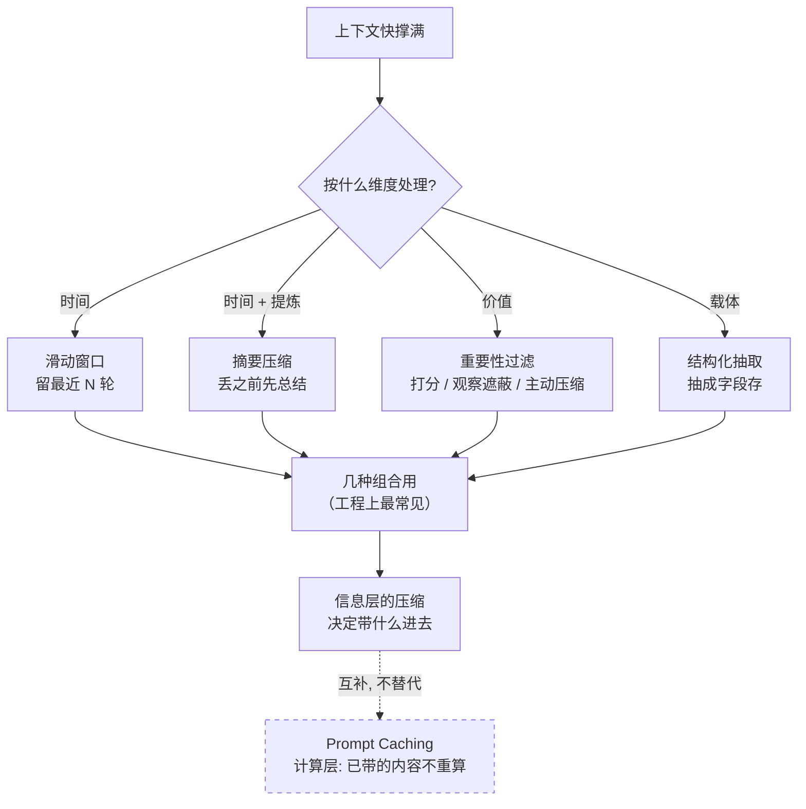
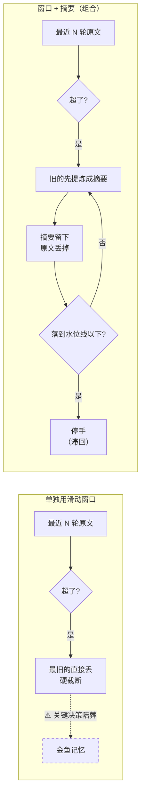
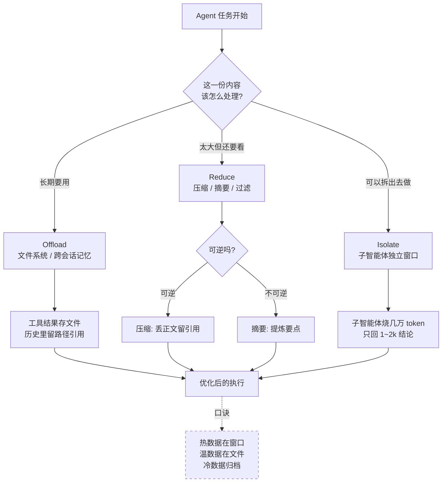
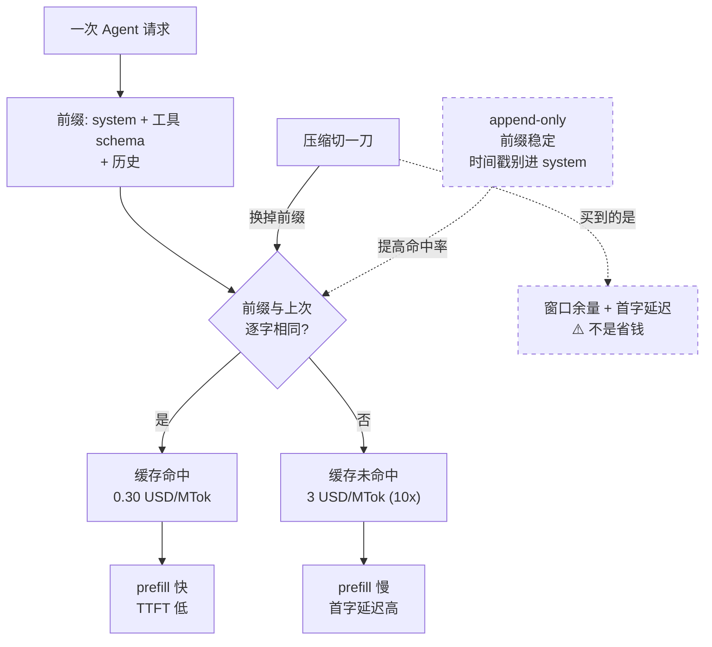
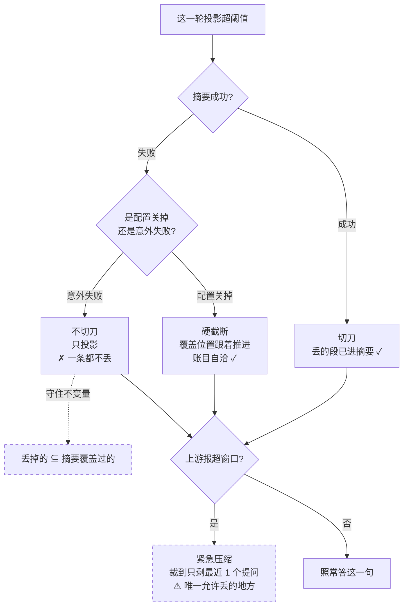
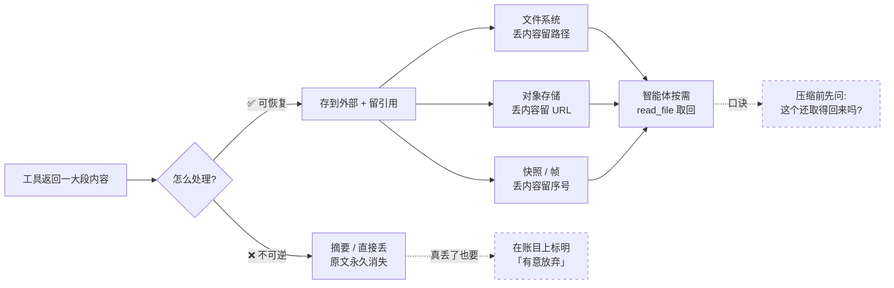
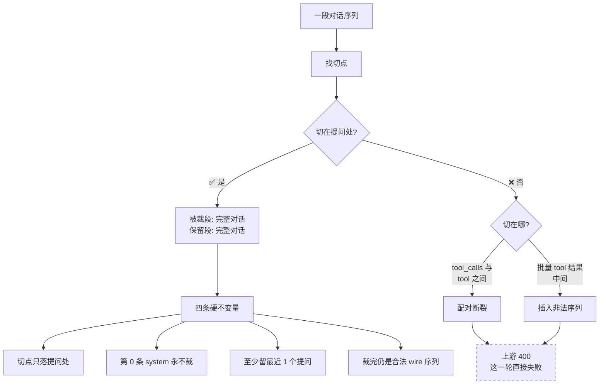

# AI Agent 上下文压缩 — 面试题库

> **行业**：AI Agent / 大模型应用（求职方向：Agent 工程 / AI 应用开发）
> **常见考察企业**：字节（豆包 / Coze）、阿里（通义 / 百炼）、腾讯（元宝 / 混元）、蚂蚁（支小宝）、美团、小红书、智谱、月之暗面、MiniMax
> **来源**：2026-09 一轮调研（Anthropic《Effective context engineering for AI agents》· Anthropic context editing API 文档 · Manus《Context Engineering for AI Agents》· LangChain `SummarizationMiddleware` / DeepAgents 文档 · 中文面经的两套主流框架）
> **本项目锚点**：`CharAgent/agent/compaction.py`（账本 / 视图分离的压缩实现）+ 三篇 ADR（0011 / 0012 / 0013）

---

## 一、高频

### Q1. Agent 的对话越来越长，上下文快撑满了怎么办？（通用）

🎯 **考点**：能不能说出**完整的方案版图**，而不是只知道「滑动窗口」或「摘要」。面试官在这里分辨「调包侠」与「懂上下文工程的人」—— 卡点在于：只说一种方法，等于没回答「怎么选」。

📌 **知识点**：
1. **滑动窗口（Sliding Window）** —— 只保留最近 N 轮，最省、零额外调用，但本质是**硬截断**：三周前确认的关键决策和昨天的一句闲聊被同等对待
2. **摘要压缩（Summarization）** —— 丢之前先让模型提炼一遍；单独用时通常配合窗口（旧的压成摘要、近的保持原文）
3. **重要性过滤（Importance Filtering）** —— 打破时间顺序，按**价值**筛选；含 observation masking（当前任务无关的历史在构造 prompt 时选择性隐藏，不真删）与主动压缩（读完大结果立刻压成要点）
4. **结构化抽取（Structured Extraction）** —— 换载体：把「用户偏好 Python / 预算 5 万 / 已确认方案 B」抽成字段存起来，信息密度远高于对话文本，但开发成本最高
5. **Prompt Caching 是「计算层」的补充，不是替代** —— 它不决定哪些内容留在历史里，只是让已决定要带的内容不必重算。**主动点出这层区别是加分项**

💡 **类比**：四种方法像整理一间越堆越满的仓库 —— 滑动窗口是「只留最近搬进来的箱子」；摘要是「把旧箱子里的东西写成一页清单，箱子扔掉」；重要性过滤是「按东西还有没有用决定去留，不看什么时候买的」；结构化抽取是「干脆不存箱子，把里面的信息录进数据库」。而 Prompt Caching 不是整理仓库，是**给仓库门口装了个缓存闸机**——东西还在里面，只是进出更快更便宜。

🖼️ **图**：

🗣️ **话术**：上下文管理有四个维度的方法，工程上通常组合使用。**第一是按时间截**——滑动窗口，只留最近 N 轮，实现最简单，但它的问题是硬截断：三周前确认的关键决策和昨天的一句闲聊被同等对待。**第二是摘要压缩**——丢弃之前先让模型把这段提炼成摘要，比硬截断强，代价是摘要本身会丢细节。**第三是重要性过滤**——不按时间按价值，包括观察遮蔽和主动压缩。**第四是结构化抽取**——把「用户偏好、已确认事项」这类信息抽成字段，信息密度最高，但要预先定义什么是重要字段。实际工程里最常见的是**滑动窗口 + 摘要**的组合：窗口控总长，摘要放在被丢弃之前。另外要区分一层：**Prompt Caching 是计算层的优化**，它不决定带什么进去，只让已经决定要带的内容减少重复计算——两者互补，不是替代。

**我项目里的做法**：`CharAgent` 的压缩策略是三件套，正好落在这个版图的三个点上 —— **窗口裁剪**（切点只落在「提问」的位置）、**工具结果截断**（老工具正文截到阈值，对应 Anthropic 的 tool result clearing，但我只截短不清空 —— 因为它还支撑「省略 N 字」这句可操作提示，模型读到才知道需要全文要再查一次）、**滚动摘要**（连上一条摘要一起重压，而不是只压新掉的那段 —— 后者会让更早的信息被逐次稀释）。**没覆盖的是**重要性过滤、结构化抽取和分层摘要，我把它归到「记忆」那一层去做，压缩这一层只按时间裁。

---

### Q2. 为什么摘要压缩和滑动窗口要一起用？单独用的缺陷是什么？（通用）

🎯 **考点**：理解两种方法的**互补性**与各自的失效模式。卡点在「单独用摘要会怎样」——答不出「摘要会漂移/丢细节」就说明没真跑过。

📌 **知识点**：
1. **窗口单独用 = 硬截断** —— 信息按时间一刀切，越往前越模糊，俗称「金鱼记忆」
2. **摘要单独用 = 模糊化 + 无界** —— 每轮都压的话，摘要会随对话滚动增长；而摘要按「自认为的重要性」取舍，当时看着不重要的细节后来可能正好需要
3. **组合的分工** —— 窗口负责控制**总长度上限**，摘要负责在丢弃之前**提炼一次**，于是「既有长度控制，又不是直接截断」
4. **进阶：层级式摘要** —— 最近 10 轮原文、10~50 轮中期摘要、50 轮之前长期摘要。像会议纪要体系：今天的逐条记录、上个月的要点、去年的关键决策备忘
5. **压缩要留「滞回」** —— 压完必须落到阈值以下（水位线），否则下一次调用立刻又超线，于是每次调用都压一次、每次都花钱

💡 **类比**：窗口 + 摘要就像**办公桌 + 档案柜**。桌面（窗口）只放最近在用的东西，清理桌面（截断）之前先把要留的整理成一页备忘（摘要）放进柜子。只清桌面不留备忘，扔掉的东西就真没了（硬截断）；只留备忘不清桌面，桌子很快就没地方工作了（摘要无界增长）。

🖼️ **图**：

🗣️ **话术**：两种方法解决的是同一问题的两半，所以工程上几乎总是一起用。**滑动窗口单独用的问题是硬截断**：它按时间切，不管内容价值 —— 三周前用户确认的订单号和昨天的一句寒暄，超出窗口就一起没了。**摘要单独用有两个问题**：一是摘要会随对话滚动增长，最终还是要面对长度上限；二是它会丢细节，模型按自己判断的重要性取舍，当时略过的细节后来可能正好要用。**组合起来分工很清楚**：窗口管总长度，摘要管「丢弃之前的提炼」。再进一步可以做**层级式摘要**：最近几轮保持原文，中期压成一份摘要，更早的再压成更精炼的长期摘要，就像会议纪要体系。还有一条容易忽略的工程细节：**压缩必须有水位线（滞回）**—— 压完要落到阈值以下才停手，否则下一次调用立刻又超线，于是每次调用都压一次，每次都白花一次摘要调用的钱。

**我项目里的做法**：`TrimAndSummarize` 就是窗口 + 摘要 + 工具截断。水位线是 `threshold × 0.7`（CharApp 配的），压完落到线下才停手；到不了就再丢一个提问，一路丢到只剩最近 1 个。这里有个我实际踩到的坑值得说：**「触发判据量的是哪一份」很关键**——我一开始量的是账本（append-only，只增不减），结果压完一次就永远超线，每轮都切一刀、每轮都烧一次摘要；后来改量「这一轮的投影」，滞回才自己长出来。

---

## 二、低频

### Q3. 一个跑几十轮工具调用的生产级 Agent，上下文治理怎么设计？（通用）

🎯 **考点**：能不能把上下文治理讲成**分层架构**，而不是零散技巧。生产环境的关键点是：**长任务里每一轮都要重发全量历史**，成本与首字延迟随轮数线性上涨 —— 而工具返回往往是大头。

📌 **知识点**：
1. **Offload（卸载）** —— 把上下文从窗口搬到外部存储：文件系统持久化（Claude Code 的记忆文件 / Manus 的沙箱 / DeepAgents 的 `memories` 目录）、脚本化执行（把复杂操作从工具描述移到脚本，减少工具数量与描述开销）、渐进式披露（Skills 那种按需加载）
2. **Reduce（精简）** —— 压缩（工具结果存文件、历史里只留**引用**，完全可逆）、摘要（不可逆，需精心设计）、过滤（自动拦掉过大的工具结果）
3. **Isolate（隔离）** —— 子智能体各有独立窗口，只把 1000~2000 token 的结论回给主智能体；主智能体专注编排
4. **文件系统是「终极上下文」** —— 无限大、天然持久、智能体自己能读写；压缩策略应当**设计成可恢复的**（网页丢正文留 URL，文档丢内容留路径）
5. **别过度工程** —— 先用「文件系统 + 最小工具集 + 必要摘要」，再按数据驱动增量优化；大模型升级常带来质变，定期回看能不能删减策略

💡 **类比**：像一个**研究员带几个助手**。研究员桌上（主窗口）只放当前在看的资料；查过的长篇报告归档到文件柜（Offload），桌上只留一张写着路径的便签；助手（子智能体）各自埋头读几十万字，回来只给一页结论（Isolate）；实在要压缩时，丢掉的是「报告的复印件」而不是「报告放在哪」（可恢复压缩）。

🖼️ **图**：

🗣️ **话术**：我会把它拆成三层。**第一层是 Offload**：把不参与推理的内容搬到文件系统 —— 工具返回的大结果存成文件，历史里只留路径；复杂操作封装成脚本，减少工具数量和描述开销；长文档按需加载而不是一次塞进去。**第二层是 Reduce**：真正要留在窗口里的东西，按可逆性分两类处理 —— 可逆的做**压缩**（丢正文留引用，比如网页丢内容留 URL，随时能取回）；不可逆的做**摘要**（提炼要点，代价是丢细节）。还有一道过滤，防止单个超大工具结果把窗口一口吃掉。**第三层是 Isolate**：把需要大量探索的子任务丢给子智能体，它烧几万 token，但只回一两千字的结论 —— 详细的搜索上下文留在它的窗口里，主智能体专注综合。**设计原则一句话**：热数据在窗口，温数据在文件，冷数据归档；而且压缩策略要**设计成可恢复的**，因为任何不可逆的压缩都有风险。最后一条经验：**别过度工程**，先用「文件系统 + 最小工具集 + 必要摘要」跑起来，再按实际瓶颈加。

**我项目里的对标**：`CharAgent` 覆盖了 Reduce 那一层（窗口裁剪 + 工具截断 + 滚动摘要），**Offload 和 Isolate 是明确没做的** —— 子智能体那块在另一个子项目里（`project/deep_search` 的 DeepAgents 多 subagent 架构）。我给自己划的边界是：压缩这一层只解决「这一次请求别太大」，长期记忆与按需检索是另一个组件的事，边界写在模块 docstring 里，免得把「上下文里看不见」误当成「已经不存在了」。

---

### Q4. 压缩会带来什么代价？为什么说 KV-cache 命中率是生产环境第一个指标？（通用）

🎯 **考点**：有没有**成本意识**。多数人能说出「压缩省 token」，但答不出「压缩在什么情况下反而更贵」—— 卡点就在缓存。

📌 **知识点**：
1. **KV-cache 命中率是第一指标** —— 它直接决定延迟（TTFT）与成本；Claude Sonnet 上缓存命中输入 $0.30/MTok vs 未命中 $3/MTok，**差 10 倍**；而 Agent 的平均输入输出比约 **100:1**，prefill 是绝对大头
2. **前缀必须稳定** —— 哪怕一个 token 不同，从那个 token 起缓存全失效。常见错误：在 system prompt 开头放精确到秒的时间戳
3. **上下文要 append-only** —— 不改动之前的 action / observation；序列化要确定（很多语言不保证 JSON key 顺序稳定）
4. **压缩在换前缀** —— 压掉旧历史之后，新前缀要**按未命中价重付一次**。所以压缩真正买的是**窗口余量与首字延迟**，不是钱
5. **缓存与压缩是两个层次** —— 缓存是计算层（已带的内容不重算），压缩是信息层（决定带什么）。同时用，不是二选一

💡 **类比**：KV-cache 像**图书馆的借阅台**。头一次借一本书要现场检索、登记（全价 prefill）；如果下次借的还是同一批书（前缀相同），馆员直接把上次那一摞推给你（缓存命中，1/10 价）。压缩相当于**把借过的书还回去、换一批新的**—— 这批新书第一次借还是要走全套流程。所以「书少了」确实省地方（窗口余量），但不代表省了登记的钱。

🖼️ **图**：

🗣️ **话术**：如果只选一个指标看生产级 Agent，我会选 **KV-cache 命中率** —— 它同时影响延迟和成本。给个具体数字：Claude Sonnet 上缓存命中的输入是 $0.30/MTok，未命中是 $3/MTok，**差 10 倍**；而 Agent 的输入输出比大概 100:1，prefill 是绝对大头。提高命中率有三条实践：**前缀保持稳定**（别在 system prompt 开头放精确到秒的时间戳）、**上下文 append-only**（不改动之前的 action 和 observation，序列化要确定）、需要时**显式标缓存断点**。**压缩的代价正好在这里**：它切一刀就换掉了前缀，新前缀要按未命中价重付一次 —— 所以压缩真正买的是**窗口余量与首字延迟**，不是省钱。这个认知很重要，否则你会为了「省 token」把压缩调得太勤，结果账单反而涨了。另外要分清层次：**缓存是计算层**（已决定要带的内容不重算），**压缩是信息层**（决定带什么进去），两者互补。

**我项目里的做法**：这条在 ADR-0005 的结尾就写明了 ——「压缩的理由是窗口与首字延迟，不是省钱」。另外我把两个诊断值记进了每一帧：`estimate_drift`（估算与上游真实 input_tokens 的差）和 `cache_hit_ratio`（命中 / 命中+未命中）。加后者正是因为「压缩花掉的钱」只有这条曲线答得出来。

---

### Q5. 摘要模型调用失败了，这一轮怎么处理？（通用）

🎯 **考点**：**降级设计**。这题最能区分「写过 demo」与「上过生产」—— 卡点是：多数人会说「降级成纯裁剪」，而那恰恰是错的。

📌 **知识点**：
1. **摘要失败是常态** —— 上游超时、报错、模型被思考吃掉 `max_tokens` 导致正文为空、被 `length` 截断（半截摘要不能用）
2. **「降级成纯裁剪」是个陷阱** —— 切点一旦推进，`[已覆盖位置, 切点)` 那段的原文**既不在摘要里也不在视图里**，凭空消失
3. **正确做法：不切刀** —— 摘要失败就退到「只投影」：视图仍带旧摘要、仍按旧覆盖位置裁，这一轮**一条消息都不丢**
4. **把「允许丢」的权力交给一个罕见且明确的触发条件** —— 只有上游明确回报「输入超窗口」时才允许硬截断（紧急压缩：裁到只剩最近 1 个提问）
5. **降级要留痕但不能撒谎** —— 失败时不该发「压缩过了」的事件（什么都没压），原因挂在帧的诊断字段上，事后查得出来

💡 **类比**：像**搬家时的打包**。你把旧东西装箱贴上清单（摘要），然后才能把箱子封走。如果打包工人没来（摘要失败），正确的做法是**这一箱先别封**（不切刀）—— 而不是「反正箱子要走了，直接扔了吧」（纯裁剪）。真正可以「直接扔」的只有一个场景：**房子马上要塌了**（上游报超窗口），那时保命要紧。

🖼️ **图**：

🗣️ **话术**：先给结论：**摘要失败时不该继续切刀，应该退到「只投影」。** 原因是压缩有一条硬不变量——切点推进之后，被裁掉的那段必须**已经被摘要覆盖**。摘要没生成出来（上游超时、报错、正文为空、被 length 截断都算），覆盖位置就没推进；这时如果切点照推，`[旧覆盖位置, 新切点)` 那段的原文就**既不在摘要里也不在视图里**，凭空消失。而且下一轮还会接着推，最后的表现是「每轮只看得见最后一个问答，永远没有摘要」—— 用户问「我刚才说的订单号」，模型不知道。**「降级成纯裁剪」听着无害，实际上是静默丢信息。** 正确的设计是把「允许丢信息」的权力交给一个**罕见且明确**的触发条件：只有上游明确回报「输入超出窗口」时才走紧急压缩（不问阈值也不问水位线，裁到只剩最近一个提问），而且丢掉的段要在账目上记成「有意放弃」，事后查得出来。另外两条细节：**配置关掉摘要**（用户选的硬截断）与**意外失败**必须分开处理，前者账目自洽、后者不切刀；**降级要留痕但不能撒谎**——失败时不该发「压缩过了」的事件，因为什么都没压。

**我项目里的做法**：这正是 ticket 26 批① 修的东西。修之前的行为叫「降级为纯裁剪」，最小复现跑出来是：账本 17 条、摘要不可用 → `dropped=14` 而 `summary_covers=0`，`history[1:15]` 那 14 条既不在摘要也不在视图里；下一轮 `dropped=16`。测试只钉了账目那一半（covers 不推进），**没钉视图那一半（cut）**—— 测试与实现共享同一个盲区。修法是「摘要失败不切刀」，配 ADR-0012。

---

## 三、少数了解

### Q6. 怎么让上下文压缩「可恢复」？（通用）

🎯 **考点**：拔高题。有没有想过「压掉的东西还能不能拿回来」—— 这是 Manus / DeepAgents 与一般实现的**核心分野**。

📌 **知识点**：
1. **Manus 的立场：压缩必须可恢复** —— 从逻辑上讲，任何不可逆的压缩都有风险，因为你无法可靠预测哪个 observation 十步之后会变关键
2. **具体做法** —— 网页内容丢了但 URL 留着；文档内容省了但沙箱里的路径还在；「用文件系统当终极上下文」
3. **DeepAgents 的做法** —— 被淘汰的消息**追加到后端文件**（`/conversation_history/{session_id}.md`），摘要里嵌这个路径，智能体可以用 `read_file` 重新打开
4. **Anthropic 的配套** —— tool result clearing 配合 memory tool：清除之前模型可以先把关键信息写进记忆文件，清完还能从记忆里取
5. **不可逆的那一半要留账** —— 真丢了的段（紧急压缩）至少要在结构里标明「这里被有意放弃了」，别让后来的人以为是 bug

💡 **类比**：像**办公室的文件归档制度**。真正的做法不是「把旧文件碎掉」，而是「装箱贴标签放进库房」—— 桌上只留一张写着箱号的卡片。真到需要那天，凭卡片能把箱子调回来。把文件直接碎掉的那种「压缩」，省下的是同样的地方，但从此再也找不回来了。

🖼️ **图**：

🗣️ **话术**：核心原则一句话：**压缩前先问「这个还取得回来吗」**。Manus 的立场很明确——压缩必须设计成可恢复的，因为任何不可逆的压缩都有风险：你无法可靠预测哪个 observation 在十步之后会变成关键。他们的做法是「丢正文留引用」：网页内容可以丢，URL 留着；文档内容可以省，沙箱里的路径还在。DeepAgents 更彻底一点：被淘汰的消息**追加写到一个后端文件**里，摘要里直接嵌那个路径，智能体需要时用 `read_file` 重新打开。Anthropic 那边是 tool result clearing 配 memory tool —— 清除之前模型可以先把关键信息写进记忆文件。**工程上还有一层**：真的不可逆的那部分（比如紧急压缩丢掉的段），至少要在结构里标明「这里被有意放弃了」，否则后来查问题的人会以为是 bug。

**我项目里的做法**：我这一层做的是「账本 / 视图分离」—— **账本 append-only 一字不改，压缩只影响这一次请求发出去的视图**。所以「压掉的内容」在快照里一直在，按 `summary_covers`（摘要覆盖到第几条）就能切回来；帧的 `metadata.view` 还记着「那一轮真发出去的那份」，含 `dropped` 计数。**但有个差距要认**：模型自己**不知道**原文还能取回来——摘要里没有「去哪找」的指针，也没有一个 `recall_history` 之类的工具给它按需取回。这是我这套与 Manus / DeepAgents 最实质的差距，我在 ticket 里把它单列成后续片，因为它牵动「记忆」那一层的边界。

---

## 四、具体知识点（通用）

### Q7. 压缩切点为什么不能落在 `assistant(tool_calls)` 与它的 `tool` 结果之间？（通用）

🎯 **考点**：知不知道 wire 协议上的**硬约束**。多数人只从「信息完整性」角度想压缩，忽略了「序列合法性」—— 这条破坏之后上游直接 400。

📌 **知识点**：
1. **配对是硬约束** —— `assistant` 消息里的每个 `tool_call` 必须有对应的 `tool` 消息（用 `tool_call_id` 关联），中间插别的消息或拆散都非法
2. **切点要落在「提问」处** —— 以 user 消息为分界，切点只取 user 的位置，于是被裁段与保留段各自都是完整对话
3. **批量工具结果中间不许插消息** —— 并行调 3 个工具时，3 条 `tool` 消息必须连续
4. **后果是静默的** —— 配对破坏不是「信息少了」，是**整个请求被上游拒绝**（400），用户这一句直接失败
5. **不同框架的态度不同** —— LangChain 的 `SummarizationMiddleware` 用 `trim_messages(allow_partial=True)`，**允许从消息中间切**；CharAgent / DeepAgents 这类手写实现则把「不拆配对」当成硬不变量

💡 **类比**：像**一对一的问答记录**。「我问了三个问题」和「对方回了三条答案」是一个整体；你可以在两次对话之间画一条线把它们分开归档，但**不能**把「问了三个问题」归档到 A 箱、「三条答案」归档到 B 箱 —— 那样两边都读不懂。

🖼️ **图**：

🗣️ **话术**：因为这是 wire 协议上的硬约束，**破了不是信息少了，是整个请求被拒**。OpenAI 兼容协议里，`assistant` 消息的每个 `tool_call` 必须有对应的 `tool` 消息用 `tool_call_id` 关联；并行调多个工具时那几条 `tool` 消息之间还不能插别的消息。所以压缩的切点**只能落在「提问」的位置**（user 消息处）—— 这样被裁掉的那段和保留的那段各自都是完整对话，配对永远同进同出。我把它实现成四条硬不变量：切点只落提问处、第 0 条 system 永不裁、至少保留最近 1 个提问完整、裁完仍是合法的 wire 序列。**值得一提的是各家态度不一样**：LangChain 的 `SummarizationMiddleware` 用 `trim_messages(allow_partial=True)`，允许从消息中间切——它赌的是「模型能容忍轻微不一致」；而手写实现一般把「不拆配对」当硬不变量，因为一次 400 就让用户这一句问不出来。

**我项目里的做法**：切点由 `_cut_index` 算 —— 取倒数第 N 条 user 消息的下标，并有两条守卫（切完不能只剩 system、被裁段里至少有一次完整决策）。另外「正在回答的那个提问不截断工具结果」—— 模型正拿着它答这一句，截了就是答非所问。这条有专门的回归测试（`test_the_kept_question_survives_an_unmatched_call`：保留段里有「欠着结果的调用」时原样留着，压缩不替它补一条也不删一条）。

---

## 附：本项目可讲的三个「真踩过的坑」

面试里「我遇到过什么问题、怎么修的」比「我知道什么概念」更有说服力。这三条都有最小复现与 ADR：

| 坑 | 症状 | 修法与记录 |
|---|---|---|
| **压缩的视图每隔一轮失效** | 八轮模拟里 2 压 3 跳、4 压 5 跳，单请求 token 一半的轮次跳回全量 | 「投影」与「切刀」分家（投影每轮都做，阈值只管要不要再切）· ADR-0008 / ticket 23 |
| **估算器的坐标在源头就不一致** | 同一份视图量出 415，真实 8000；账本量出 13291，自己的启发式只有 6520 | 锚式退役，改「启发式 + 固定开销校准」；触发判据从账本改成投影 · ADR-0011 |
| **「降级为纯裁剪」会静默吞掉对话** | 摘要不可用时 dropped=14 而 covers=0，14 条消息凭空消失，且下一轮继续推 | 摘要失败不切刀；只有上游报超限才允许硬截断 · ADR-0012 |
