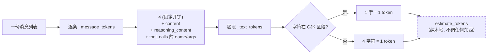
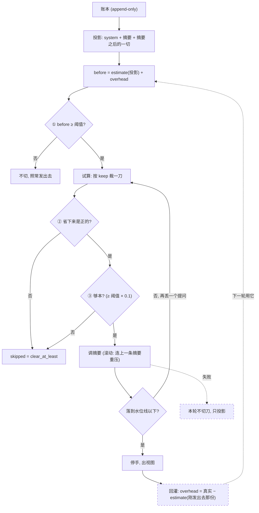

# 原理底稿：token 怎么估、怎么比、压缩怎么被触发

> `INTERVIEW.md` 是题典，`context-compaction-notes.md` 是行业素材与映射 —— 这一份是**原理**：把 CharAgent 压缩这条链路上「数字从哪来、跟谁比、什么时候动手」讲透。
> 代码位置：[`CharAgent/agent/utils/messages.py`](../../../CharAgent/agent/utils/messages.py)（估算）· [`CharAgent/agent/compaction.py`](../../../CharAgent/agent/compaction.py)（校准、比较、触发）· [`CharAgent/agent/loop.py`](../../../CharAgent/agent/loop.py)（回灌时机）。
> 本文里的数字都来自 2026-09-24 那次真机（阈值 6000 / 水位线 4200），是**真实帧**里读出来的。

---

## 一、先分清三个数，不然一切都会绕晕

| 数 | 谁给的 | 用来干什么 | 能不能当账单 |
|---|---|---|---|
| **真实** `usage.input_tokens` | 上游 API 返回 | 跟供应商对账；回灌去校准估算 | ✅ **只有它能** |
| **估算** `estimate_tokens(messages)` | 本地纯函数，不调任何东西 | 判阈值、判水位线 | ❌ 只是猜 |
| **校准** `overhead` | 从上一个真实值反推出来的常量 | 把估算拉回真实附近 | ❌ 它是个修正项 |

这条链路里所有「要不要压」的决定都建立在**估算 + 校准**上，而**权威值永远只有上游那份 usage**。框架刻意不让估算参与记账 —— 见 ADR-0005 那条「`total_tokens` 是账单，不是指标」。

## 二、估算：四层往下拆

### 第 1 层 · 一份消息列表 = 每条求和

```python
def estimate_tokens(messages):
    return sum(_message_tokens(message) for message in messages)
```

### 第 2 层 · 一条消息 = 固定开销 + 每个字段的文本

```python
MESSAGE_OVERHEAD_TOKENS = 4          # role 标记与结构分隔符, 上游一定会算

def _message_tokens(message):
    total = MESSAGE_OVERHEAD_TOKENS
    if isinstance(message.get("content"), str):
        total += _text_tokens(message["content"])
    if isinstance(message.get("reasoning_content"), str):
        total += _text_tokens(message["reasoning_content"])   # 思维链同样占输入
    for call in message.get("tool_calls") or []:
        total += _text_tokens(function["name"])               # 工具名
        total += _text_tokens(function["arguments"])          # 参数 (JSON 字符串)
    return total
```

两处容易被忽略的：**思维链计入**（它按 DeepSeek 的契约要回填进账本，每轮都占输入，而 reasoner 的思考常比正文长数倍）；**工具参数计入**（一次调用带了什么参数，上游也要读）。

### 第 3 层 · 一段文本 = 中文一字一 token，其余四字符一 token

```python
def _text_tokens(text):
    cjk = sum(1 for char in text if _is_cjk(char))
    return cjk + (len(text) - cjk + 3) // 4
```

`_is_cjk` 只认三个 Unicode 区段 —— `U+3000–303F`（中文标点）、`U+4E00–9FFF`（汉字）、`U+FF00–FFEF`（全角字母数字标点）。所以**全角的「？」「，」按一字一 token 算**，不是按四字符一 token。

### 第 4 层 · 一个手算例子

真机里那句用户提问：

```
{"role": "user", "content": "我那个订单的订单号是多少？顺便说说它现在是什么状态"}
                                   └───────────── 25 个字符, 全部落在 CJK 区段 ─────────┘

_text_tokens       = 25 + (25 - 25 + 3) // 4 = 25
_message_tokens    = 4 + 25                 = 29
```

### 为什么不上真分词器

项目里的取舍写在 `messages.py` 的注释里：**中文分词器算中文同样不准，多一个依赖只换来假精度**。而且估算的职责只有「判阈值」—— 要精确，等上游返回 usage 就行。真接上分词器时，校准项记 0 即可，调用点一处都不用动。



## 三、校准：把估算拉回真实附近

### 问题：启发式看不见「固定开销」

每次请求里都有一大坨**不在任何一条 message 里**的东西：17 个工具 schema（实测约 3600 token）+ 身份说明的模板部分（约 2600）。纯启发式算不到它们，于是**每次请求都被估小一大截**。

### 办法：从上一个真实值反推一个常量

```python
def note_usage(self, usage, *, sent):        # sent = 这一次**真发出去**的那份列表
    self._overhead = usage.input_tokens - estimate_tokens(sent)

def count(self, messages):
    return estimate_tokens(messages) + self._overhead
```

- **调用时机**：每轮 `generate` 返回之后，loop 回灌（`note_usage(response.usage, sent=view)`）。
- **为什么传 `sent` 而不是账本**：那个真实值对应的就是**刚发出去的那一份**。传账本会得到一个错的校准项 —— 这正是 ticket 26 修掉的缺陷 1（原来传的是「账本有几条」，而压缩过之后视图与账本条数不等，于是同一份视图能算出两个差很远的值：实测 415 vs 真实 8000）。
- **它主要装着什么**：工具 schema + 身份说明模板（常量）+ 一部分比例偏差（中文实际 token/字与「一字一 token」的差）。

### 代价：校准项会漂

它是「真实 − 估算」的差，比例偏差被吸进来一部分，所以**随列表大小轻微漂移**。真机上那个 `estimate_drift`（估算 − 真实）就是在量这件事 —— 2026-09-24 首次拿到数据：19 帧里 13 帧为负、最大 −3011，方向上是**危险**的那一侧（低估 → 压缩触发得更晚）。

## 四、怎么比、怎么触发

### 4.1 比较只有一个式子，但「跟哪一份比」是坑

```python
projected, _, _ = self._view(history, cut=max(summary_covers, 1), trim_old_content=False)
before = counter.count(projected)             # ← 量的是**投影**
if before < self.threshold_tokens:
    return unchanged
```

**为什么量投影而不是账本**：账本是 append-only、只增不减。拿它判的话，压完一次就**永远**超线 → 每轮都切一刀、每轮都烧一次摘要调用。而投影才是真正要发出去的东西，它因为上一刀推过切点而变小 —— **滞回**就是这么来的（从前靠「锚落到小值」提供，而那个锚本身会错位，见 ADR-0011）。

### 4.2 超阈值之后还有三道闸，缺一不压

| 闸 | 判据 | 为什么要有 |
|---|---|---|
| ① | `before ≥ threshold_tokens` | 投影确实大了 |
| ② | `count(projected) - count(试算视图) > 0` | 压完得**是正的** —— 视图里会多出摘要那条，账本小的时候它可能比裁掉的还大，压了反而更大 |
| ③ | 上面那个差 `≥ threshold × clear_at_least_ratio` | 还得**够本** —— 花一次摘要调用只省几百 token 不划算（Anthropic 的 `clear_at_least` 是同一条规矩） |

闸②的基线必须是**投影**，不能是账本 —— 账本里含着上一次已经裁掉的段，拿它当基线会把那些段**重复计**成这一次的节省（代码审查抓出来的，见 ADR-0011 的代价那一节）。

### 4.3 水位线：试算循环定切点

```python
target = threshold_tokens * watermark_ratio          # CharApp: 32000 × 0.7 = 22400
for keep in range(keep_recent_questions, 0, -1):     # 从「留 N 轮」往下丢
    cut = 第 keep 个提问的下标                          # 刀口只落在**提问**处
    trial = 切一刀之后的视图（**预置一个摘要槽**）
    if counter.count(trial) <= target:
        break                                        # 落到水位线以下, 停手
    # 到不了就再丢一个提问, 一路丢到只剩最近 1 个
```

两个细节：

- **摘要槽必须预置**：压完摘要那条一定会在视图里，试算时漏掉它，水位线就会卡在边上（「压完刚好又超一点」，下一次调用又得压）。
- **至少留 1 个提问**：`range` 的下界是 1，不设 0。裁到只剩 system 等于把这段对话删了。

### 4.4 整条决策链



## 五、拿真机那两帧算一遍

参数：阈值 **6000**、水位线 `0.7` → 目标 **4200**、`keep_recent_questions=2`。

### 第一次（重启后第一句）

| 步骤 | 数 |
|---|---|
| 账本 40 条，`covers=0` → 投影 = **全量账本** | `estimate ≈ 6000+`（校准项还是 0，这一 run 首次调用） |
| `before ≥ 6000` | ✅ 触发 |
| `_choose_cut`：keep=2 试算 > 4200 → keep=1 仍 > 4200 → 取最后一刀 | `cut = 36` |
| `dropped = cut - 1` | **35** |
| 摘要成功，`summary_covers` 推进到 36 | ✅ |
| 视图 = `[摘要, 用户最后那句]` | **2 条** |
| 回灌算出新的校准项 | `overhead ≈ 6137` |

### 第二次（紧接着下一句）

| 步骤 | 数 |
|---|---|
| `covers=36` → 投影 = `[摘要] + history[36:]`（8 条） | `estimate ≈ 2000` |
| `before = 2000 + 6137 ≈ 8100` | ✅ 仍 ≥ 6000，**又触发** |
| keep=2 → keep=1 都到不了 4200（**地板 6137 > 目标 4200**） | `cut = 41` |
| `dropped = 40`，压后 `estimated_tokens = 6484` | ⚠️ **仍在阈值之上** |

**这次「压完还超」不是规则错，是阈值被调得比固定开销还小** —— 那个 6137 是工具 schema + 身份说明，**压不掉**。生产值 32000 时它只占 19%，水位线轻松可达。

## 六、三个常见误解（都是真踩过的）

**① 「`estimated_tokens` 比视图里那些消息的内容大得多，是不是算错了？」**
不是。它量的是「**这份视图作为一次请求**大概多大」，里面含校准项（固定开销）。真机那次视图只有 2 条、内容约 100 token，而 `estimated_tokens = 6484` —— 差值就是工具 schema 那些看不到的东西。

**② 「阈值调小一点，压缩更早发生，不是更好吗？」**
**有下限**。阈值必须显著大于固定开销，否则水位线（阈值 × 比例）落到地板之下，**永远达不到** —— 表现是每轮都压到只剩一个提问、工具结论被反复丢，而框架不报任何错。CharApp 默认 32000 是照这个算出来的，不是随手定的。

**③ 「估算既然不准，为什么不干脆每轮都问一次上游？」**
上游**不提供**「只数 token 不生成」的办法；而估算的职责只是判阈值，它错了的代价是「压得早一点或晚一点」，不是「答错」。真要精确，等 usage 回来（那正是校准项的来源）。

## 七、一页速记

```
估算      4 (每条固定) + 中文一字一 token + 其余四字符一 token
校准      overhead = 真实 − estimate(刚发出去那份); 每轮回灌
比较      before = estimate(投影) + overhead, 跟阈值比 —— **量投影不量账本**
三道闸    超阈值 / 省下来是正的 / 够本 (阈值 × 0.1)
水位线    压到阈值 × 0.7 以下才停手; 试算要预置摘要槽; 至少留 1 个提问
一条铁律  估算只用来做决定, 账单永远看 usage
```
