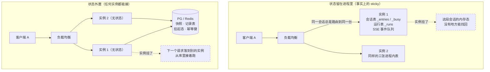
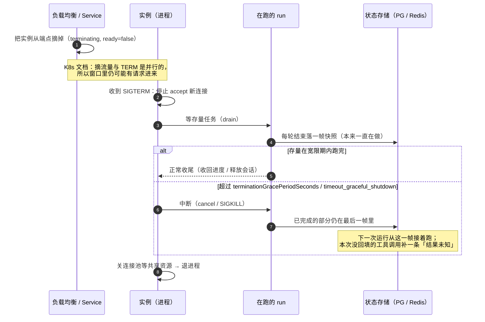
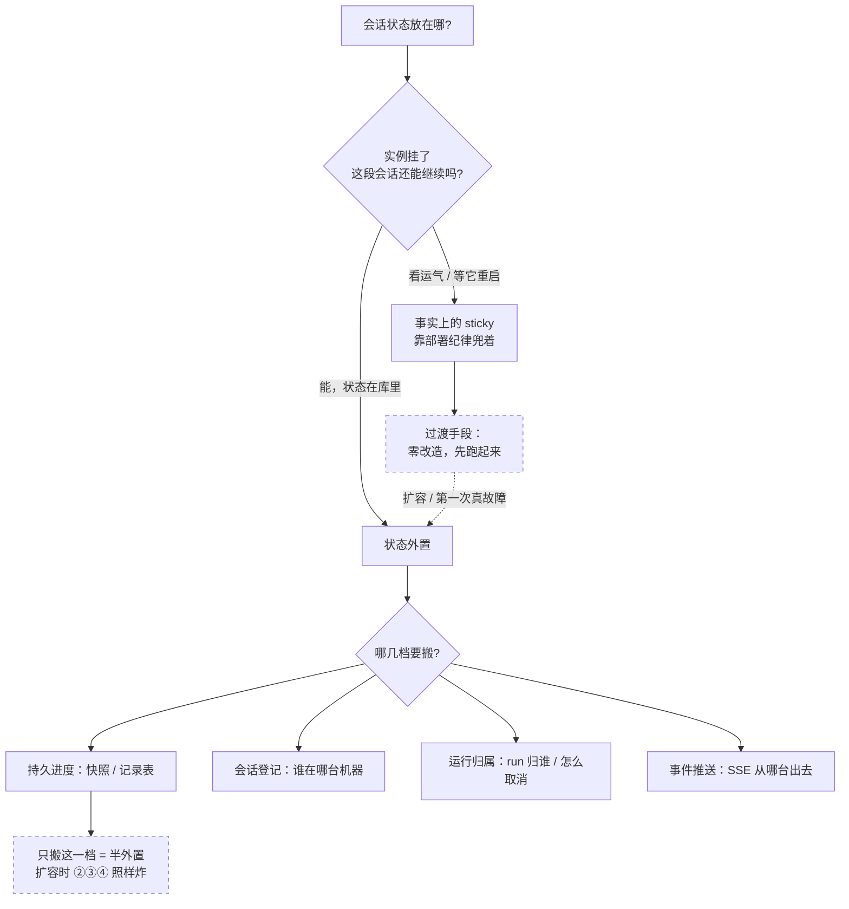
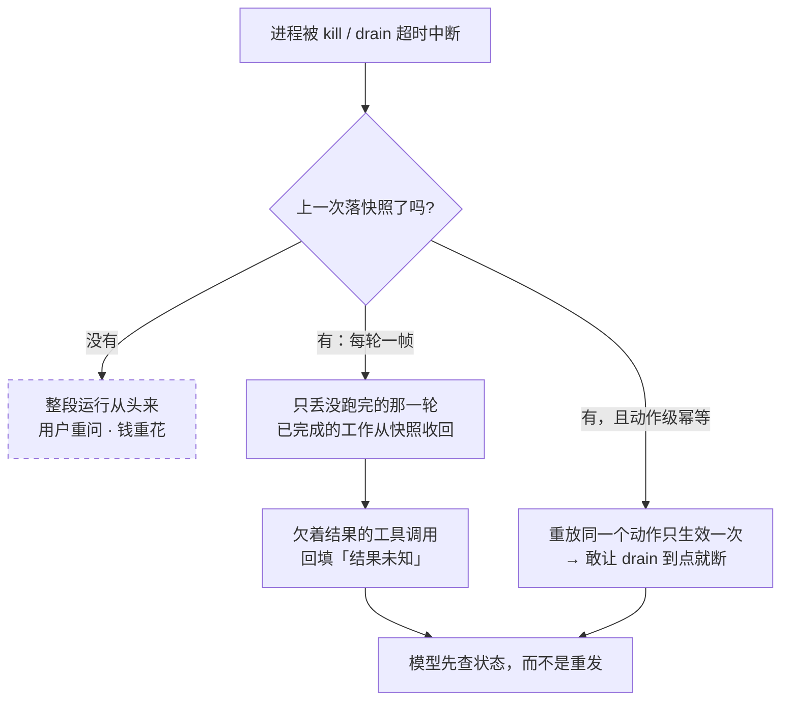
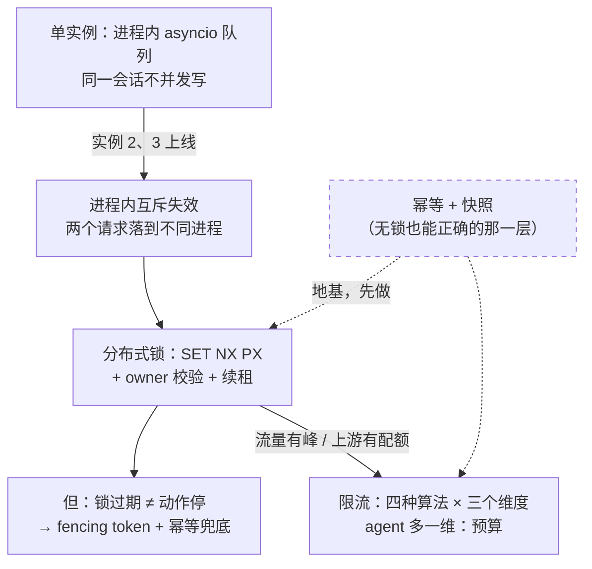
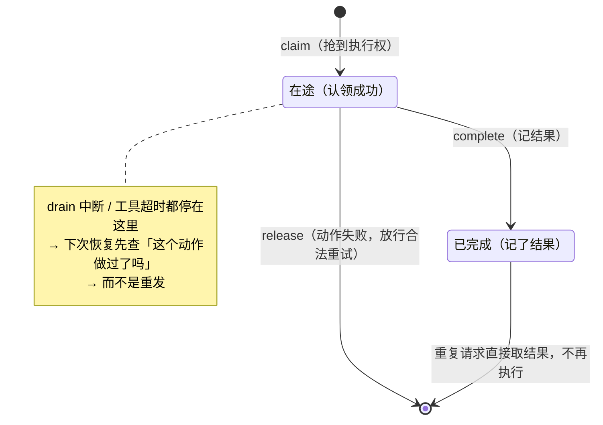
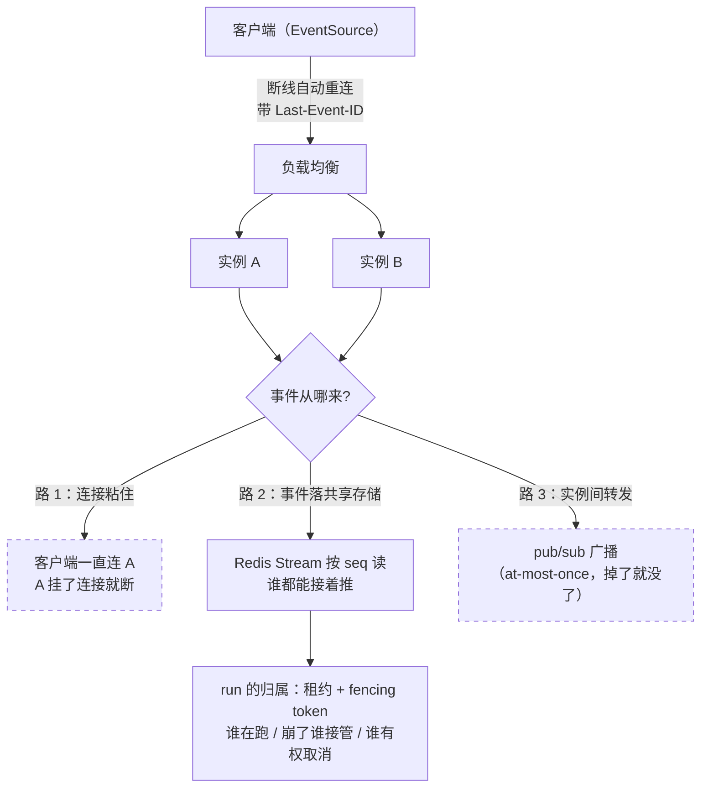

# 无状态化与 graceful drain · 专题底稿（#64 · C21）

> 本目录一共七份：`INTERVIEW.md`（题典）· `context-compaction-notes.md`（上下文压缩）· `estimator-and-trigger.md`（压缩原理）· `observability-notes.md`（L3a 可观测）· `hitl-approval-notes.md`（L3b 人机确认）· **本份**（无状态化与 graceful drain）· [`multiagent-notes.md`](./multiagent-notes.md)（#42–#44 多智能体）。
> **本份与 [`multiagent-notes.md`](./multiagent-notes.md) 是本目录里两份「只讲不做」的**：#64 明确不落实现（判据见 §5），所以它讲的是**原理 + 本项目现状 + 真要做时改哪几处**，不是实施记录。
> 上游：`CharAgent/docs/DESIGN.md` §4 ⑬ #64（`DESIGN.md:369` 的能力表、`DESIGN.md:377` 的「#64 agent 任务的特殊性」）· 关联 #5 快照 / #17 幂等 / #20 线程不并发 / #21 分布式锁 / #22 限流 · `.scratch/Charlotte/PLAN.md` §5 的「明确不做」表。
> 代码锚点（**行号按 2026-10-06 的工作区记**，代码改过之后按函数名回查）：[`CharAgent/server/sessions.py`](../../../CharAgent/server/sessions.py) · [`server/runs.py`](../../../CharAgent/server/runs.py) · [`server/sse.py`](../../../CharAgent/server/sse.py) · [`server/app.py`](../../../CharAgent/server/app.py) · [`checkpoint/`](../../../CharAgent/checkpoint/) · [`db/schema.py`](../../../CharAgent/db/schema.py) · [`db/repositories/idempotency.py`](../../../CharAgent/db/repositories/idempotency.py) · [`retry/idempotency.py`](../../../CharAgent/retry/idempotency.py) · [`CharApp/minimall/server.py`](../../../CharApp/minimall/server.py) · [`CharApp/docs/adr/0014`](../../../CharApp/docs/adr/0014-a-suspension-has-no-approval-table.md) / [`0020`](../../../CharApp/docs/adr/0020-the-bff-shares-one-upstream-client.md) / [`0025`](../../../CharApp/docs/adr/0025-the-breaker-sits-inside-retry-and-the-backup-is-another-vendor.md)
> 行业侧只引**一手**（官方文档 / 官方源码），原文摘录统一放在 [§8](#8-行业一手来源原文摘录)，正文里只给短引与链接。

---

## 0. 五分钟版

### 0.1 一句话

**普通 Web 的无状态化是「别把东西放内存」；agent 的无状态化是「把东西放内存也可以，但要保证进程随时死掉、换一个进程还能接着跑」—— 因为它的任务长到能跨天，而它做的事（下单、退款）不能重做。**

### 0.2 七个问题的一条线

| # | 问题 | 一句话答案 | 层 |
|---|------|-----------|----|
| Q1 | agent 的无状态化为什么比普通 web 难 | 请求短↔运行长、无状态↔有内存态、秒级↔能跨天（HITL）；难的不是「删掉内存」而是「挪走 + 给没挪完就死设计恢复」 | 高频 |
| Q2 | graceful drain 的完整流程 | 停止接新 → 等存量 → 超时兜底 → 退出；**四个动作四件事，最容易被跳过的是「停止接新」与「超时兜底」** | 高频 |
| Q3 | sticky session 与状态外置怎么取舍 | 连接可以粘，状态不能粘；sticky 是过渡（零改造但挂了就丢），外置是终态（贵一次改造，换扩容与故障恢复） | 高频 |
| Q4 | checkpoint 之后 drain 还需要多「完美」 | 恢复点决定中断代价：有每轮快照就敢让 drain 到点就断 —— **checkpoint 把 drain 从「必须」降级成「可选」** | 低频 |
| Q5 | 进程内队列 → 分布式队列的升级路径 | #20 的三个尺度：进程内队列（单实例）/ 分布式锁（跨进程互斥）/ 限流（保护自己与上游）；顺序上先幂等与快照，再锁与限流 | 低频 |
| Q6 | 三件配套里哪一件是「正确性」层 | 幂等（#17）—— 锁减少浪费、限流保护容量，只有幂等保证「重放不会多做一次」；HITL 的 resume 重放是它的第一个真实调用方 | 低频 |
| Q7 | SSE 的跨实例路由怎么做 | 浏览器自带 `Last-Event-ID` 重连；服务端缺的是「事件落共享存储 + 从第 N 号接着推」，以及 run 的**归属**（租约 + fencing token） | 少数了解 |

### 0.3 三个数字（都有出处，见 §8）

- **30 秒**：Kubernetes 默认的 `terminationGracePeriodSeconds`（preStop 超时还会再给 2 秒宽限）。
- **None**：uvicorn 的 `timeout_graceful_shutdown` 默认不设 —— 不设就**不限期等**存量任务跑完。对短请求是好事，对「一次跑几分钟」的 agent 是发布窗口的灾难。
- **30000 ms**：Redis 官方分布式锁示例的 TTL（`SET resource_name my_random_value NX PX 30000`）——注意那个**随机值**，它是 owner 校验的全部依据。

---

## 一、高频

### Q1. Agent 的无状态化为什么比普通 Web 难？（通用）

🎯 **考点**：能不能说出 agent 运行与普通请求在**生命周期**上的差别，以及它把无状态化从「编码习惯」变成「恢复工程」。卡点是：多数人只答「状态放 Redis 就好了」，答不出「长任务 + 内存态 + 跨天挂起」这三条合起来意味着什么。

📌 **知识点**：
1. **普通 web 请求与进程解绑**：一次请求几百毫秒到几秒，进程只提供算力；把内存当缓存用，重启就当它没来过 —— 12-Factor 的说法是「进程的内存或文件系统只能当一次事务的短暂缓存」，因为「下一次请求很可能由另一个进程服务」（英文原文见 §8 A1）。
2. **agent 运行是长任务**：一次运行串起多轮模型调用与工具调用，几十秒到几分钟；期间它**持有**一段对话历史（本项目是 `ChatSession._history`，会话长驻、不是一次请求一个对象 —— `sessions.py:9-12`）。
3. **HITL 把它拉到跨天**：挂起等人批，用户第二天回来点确认。于是「内存里那份历史」的有效期不是「这一次请求」，而是「这段会话的整个生命周期」。
4. **kill 的代价不是「慢一点」，是三种具体的错**：① 丢进度（用户白说一遍、钱白花一遍）② 半截状态（历史停在「欠着一条工具结果」的半路上，直接发给上游会被 400 拒掉）③ **静默重复**（那条工具如果是退款，下一个人接手后重发就是退两次）。
5. **所以无状态化的正确表述**是两步：**把内存里的东西挪到别人读得到的地方**（快照 / 记录表 / 幂等键），以及**给「没挪完就死」设计一条恢复路径**（下半句才是贵的）。
6. **一个例外要先说清**：并非所有进程内状态都必须外置 —— 那些「丢了只是慢一点、重算一遍就对」的（缓存、空闲登记表）可以留；判据是**重建它要付什么代价**。本项目把会话登记表当缓存（可以淘汰，因为真相在快照与记录表里，`sessions.py:45-49`），而把挂起判据放进库里（`sessions.py:22-32`）—— 一留一放，理由都是这一条。

💡 **类比**：**快递分拣中心**。包裹（任务）不绑定分拣员（实例），谁有空谁处理 —— 这就是无状态化的目标态。要做到这一点，前提是包裹上写着完整的投递信息、且中途状态记在系统里（扫一下就知道到哪一步了）；否则换个人接手就得从头问一遍。分拣员下班（进程被杀）时，正确动作是把手上的包裹**放回传送带**（落快照 / 释放租约），而不是揣兜里带走（状态留在内存）—— 后者在单人小站里看不出问题，一扩到多班次就全乱。

🖼️ **图**（状态外置前后的拓扑对比）：



🗣️ **话术**：普通 web 请求和进程是解绑的 —— 几百毫秒的事，内存当缓存用，重启就当它没来过，这正是 12-Factor 说的「进程内存只能当单次事务的缓存」。agent 不行，因为它的运行是**长任务**：一次运行串起多轮模型调用和工具调用，几十秒到几分钟，期间它**持有**一段对话历史；再叠上 HITL，一次挂起可以跨天。于是直接 kill 的代价不是「慢一点」，是三种具体的错：丢进度、历史停在半截（欠着一条工具结果，上游会拒）、以及最危险的**静默重复** —— 那条工具如果是退款，接手的人重发就是退两次。所以无状态化的正确说法是两步：**把内存里的东西挪到别人读得到的地方**，再**给「没挪完就死」设计恢复路径**；第二半才是贵的。还有一条分寸：不是所有进程内状态都要外置 —— 丢了能重算的（缓存、登记表）可以留，判据是「重建它要付什么代价」。

**我项目里的做法**：这条边界在我这儿有一留一放的实例。**留**的是会话登记表（`sessions.py:212-213` 的 `_entries` / `_busy`）—— 它被明确当成**缓存**：真相在快照（接着跑）与记录表（给人看）里，所以按空闲半小时淘汰（`sessions.py:91`、`:345`）是安全的；没有水合这一手，淘汰就是静默丢历史，两件事一起才成立。**放**的是挂起判据（`status = needs_approval AND approved_at IS NULL`，`db/repositories/tool_calls.py:365-369`）与幂等键（`charagent_idempotency_keys`，`db/schema.py:714`）—— 因为它们必须跨进程：挂起跨得了重启，恢复可能落在另一个进程。而**还没挪**的是运行表与事件队列（见 §4）。

---

### Q2. graceful drain 的完整流程是什么？为什么「超时兜底」这一步不能省？（通用）

🎯 **考点**：四个动作能不能说全、说对顺序，以及知不知道**每一步由谁负责**（编排层 / 应用层 / 状态层）。卡点：只答「等任务跑完再退出」—— 那是漏了「停止接新」与「超时兜底」，而这两步恰恰是生产事故的来源。

📌 **知识点**：
1. **四步**：`SIGTERM` → ① **停止接新**（负载均衡把实例摘出端点 + 进程自己不再 accept）→ ② **等存量任务跑完** → ③ **超时兜底**（到点还没完就中断，靠外置状态下次从断点接着跑）→ ④ 退出。
2. **①为什么必须单独做**：进程「不再接」不等于「别人不再发」。Kubernetes 官方文档写明：Pod 被标记 terminating **同时**，控制面才评估把它从 EndpointSlice 摘掉，而且端点**不是立刻移除** —— 它以 `terminating` 条件暴露、`ready=false`，负载均衡因此停止给它常规流量。这中间的窗口就是「已经发出去的请求落在准备停机的进程上」。文档还专门点了一句：「有些应用需要超出『把已有连接做完』的优雅终止，例如 **session draining and completion**」—— 说的就是 agent 这种。
3. **①的常见补丁是 `preStop`**：它在 TERM 信号**之前**跑，用来「等负载均衡把流量摘干净再开始收尾」（sleep 几秒 / 调一次注销接口）。官方文档同时提醒：preStop 跑得比宽限期还久，kubelet 会再给 2 秒然后强杀。
4. **②等的到底是什么**：对普通服务是「在飞的请求」；对 agent 是**长连接上的长任务**（SSE）—— 「等存量」实际等于「等这些 run 跑完，或者客户端主动放弃/断开」。这也是为什么排空时间会直接顶到宽限期上。
5. **③为什么不能省，也不能设成无限**：uvicorn 的 `--timeout-graceful-shutdown` **默认是 None（不设就不限期等）** —— 对短请求没问题，对「一次跑几分钟、挂起能跨天」的 agent，意味着**一次发布可能被一个 run 拖到天亮**。一设这个值，就必须承认「有任务会被中断」——这时兜底不再是「做得更优雅」，而是「靠状态外置把它们接住」。
6. **④先退什么后退什么**：先让运行结束（释放会话 / 收回进度），再关连接池与共享资源，最后退进程。反过来的话，收尾的那一步会打在已经关掉的连接上。
7. **多实例时还有一层**：一批实例同时 drain，容量会塌；所以真实集群里用 **PodDisruptionBudget** 限住「同时能停几个」（K8s 官方文档：PDB 限制的是**自愿中断**下同时不可用的副本数）。文档里那张「disruption 速率取决于什么」的清单里明确列着**「优雅关闭一个实例要多久」** —— 也就是说：**drain 的时长是容量规划的一个输入**，不是一个纯工程细节。

💡 **类比**：**医院门诊下班**。正确流程是：先**停号**（①，门口贴「今日号满」—— 对应把实例摘出负载均衡）→ 把已经在诊室里的病人**看完**（②）→ 到了下班时间还没看完的，**转诊或重约**（③，对应超时中断 + 下次从快照继续）→ 关灯锁门（④）。最容易出事的两个错：不贴停号牌就直接关门（新病人还在往里进），以及「必须看完所有病人才下班」——前者让病人白跑，后者让医院永远关不了门。而如果每个病人都建了**病历本**（快照），转诊就不需要重新问一遍病史。

🖼️ **图**（drain 时序，含超时兜底那一支）：



🗣️ **话术**：四步 —— `SIGTERM` 之后**停止接新**、**等存量跑完**、**超时兜底**、退出。第一步要单独做，是因为「进程不再接」和「别人不再发」是两件事：K8s 在标记 terminating 的**同时**才去摘 EndpointSlice，而且端点不是立刻移除、是带 `terminating` 条件且 `ready=false`；官方文档甚至专门点了一句，有些应用需要超出「把已有连接做完」的优雅终止，叫做 **session draining and completion** —— 说的就是 agent 这种。`preStop` 钩子就是用来补这一步的：在 TERM 之前先把流量摘干净。**最容易被省、也最不能省的是超时兜底**：uvicorn 的 `--timeout-graceful-shutdown` 默认是 None，也就是**不限期等**；对短请求没问题，对一次跑几分钟、挂起能跨天的 agent，就等于一次发布可能被一个 run 拖到天亮。所以你一旦设了这个值，就必须承认会有任务被中断 —— 这时候靠的不是更优雅的等待，而是**状态外置 + 断点续跑**把它们接住。最后两点容易漏：退出顺序是先结束运行、再关共享资源；多实例同时 drain 会塌容量，所以真实集群用 PodDisruptionBudget 限住同时停几个 —— K8s 官方那张「中断速率取决于什么」的清单里，明确列着「优雅关闭一个实例要多久」。

**我项目里的做法**：今天没有信号驱动的 drain。`CharApp/minimall/server.py:416` 的 `_serve` 是「起 uvicorn → 等它结束 → 关共享资源」三件事，停机靠 uvicorn 自己的机制（它保证连接收线与任务跑完，且受 `timeout_graceful_shutdown` 约束）。但 **③要用的那一半已经在了**：客户端一断连，`sse.py:99-108` 的 finally 会取消这次运行，取消会把已完成的工作收回会话历史；下次提问从快照水合（`client/session.py:667`），欠着结果的工具调用被补一条「结果未知」（`client/session.py:952`，文案见 `:949`）—— **缺的只是「由信号触发」而不是「由断连触发」**（见 §5）。

---

### Q3. sticky session 与状态外置怎么取舍？（通用）

🎯 **考点**：能不能把两条路**各自的代价**说清楚，而不是背「外置更高阶」。加分点：知道 sticky 里「连接粘住」与「状态粘住」是两回事。

📌 **知识点**：
1. **sticky 的做法与它的账**：把同一会话固定路由到同一实例（负载均衡的会话保持，如 cookie 粘性 / 按源 IP）。收益是**零改造**（进程内那些表原样能用），代价有四项：① 扩容缩容时那批会话要迁移，而内存里的东西**没有地方迁**；② 实例挂了就是真丢；③ 负载不均（长会话把某几台钉死）；④ 12-Factor 直接把它判成违规：「依赖 sticky session 违反十二要素，绝不应使用或依赖它」。
2. **外置的做法与它的账**：状态放 Redis / PG，任何实例都能接着跑。代价是：一次请求多几次 IO，而且**所有进程内状态都得先找出来并搬走** —— 搬得不彻底比不搬更糟（一半在库里一半在内存，两边各写各的）。
3. **真正的分界不是「外置与否」，而是「状态分几档」**：① **持久进度**（快照 / 记录表 —— 数据）② **会话登记**（谁在哪台机器上）③ **运行归属**（这个 run 由谁负责、怎么取消它）④ **事件推送**（SSE 从哪台机器出去）。多数团队只搬了 ①，于是扩容时 ②③④ 照样炸。
4. **混合路线是现实里最常见的**：sticky 当过渡、外置当终态；或者两者并存 —— **sticky 是为了 SSE 长连接不来回跳，外置是为了实例挂了能接**。
5. **一个区分点**：长连接（SSE / WebSocket）天然需要「连接粘住」，但那是**连接**层的粘，不是**状态**层的粘。完全可以连接粘、状态不粘：客户端连着 A，run 被 B 接管（事件靠共享存储回传）。把这两件事混成一件，是很多架构讨论里的第一个岔口。
6. **判据一句话**：如果「实例挂了之后这段会话还能不能继续」有明确答案（且答案在库里），就是外置；如果答案是「等它重启回来」或者「希望它别挂」，就是 sticky。

💡 **类比**：还是分拣中心。sticky 是「这个客户的包裹**固定给 3 号分拣员**」—— 他休假的时候，这批包裹没人认识；外置是「包裹放上传送带，谁在谁处理」。注意一个细节：客户可以**一直打同一个电话**（连接粘住），但接电话的人可以换（状态不粘）—— 这两件事分开，方案空间就大了一半。

🖼️ **图**（取舍的决策路径）：



🗣️ **话术**：两条路的账要先算清楚。sticky 是「把同一会话固定路由到同一实例」，收益是零改造 —— 进程内那些表原样能用；代价四项：扩缩容时那批会话要迁移，而内存里的东西没地方迁；实例挂了就真丢；长会话把某几台钉死、负载不均；而且 12-Factor 直接把它判成违规。外置是状态放 Redis / PG，任何实例都能接；代价是一次请求多几次 IO，而且**所有进程内状态都得先找出来搬走**，搬得不彻底比不搬更糟。**真正的分界不是「外置与否」，而是「状态分几档」**：持久进度（快照、记录表）、会话登记（谁在哪台机器上）、运行归属（这个 run 归谁）、事件推送（SSE 从哪台机器出去）—— 多数团队只搬了第一档，扩容时后三档照样炸。还有一个容易被混掉的区分：长连接需要的是**连接粘住**，不是**状态粘住**；客户端可以一直连 A，而 run 由 B 接管、事件靠共享存储回传。所以我的判据一句话：如果「实例挂了这段会话还能不能继续」有明确答案、而且答案在库里，就是外置；如果答案是「等它重启」或者「希望它别挂」，那就是 sticky。

**我项目里的做法**：现状是**事实上的 sticky + 半外置**。sticky 那一半：只有一台实例，`sessions.py:57-64` 与 `CharAgent/README.md:140` 把「部署必须单进程」写成明面纪律，`CharApp/docs/adr/0020` 还专门记了一条依赖它的决策（BFF 与服务共用一个进程级 HTTP 客户端）。外置那一半：快照三实现（内存 / Redis / Postgres）、会话记录表、挂起判据、幂等键 都在库里 —— 所以**第 ① 档已经搬完，②③④ 没搬**。这正好是 §4 那张表的由来。

---

## 二、低频

### Q4. 有了 checkpoint，drain 还需要多「完美」？（通用）

🎯 **考点**：理解「恢复点精度决定中断代价」这条换算，以及为什么 checkpoint 让 drain 的目标从「不中断」降级为「中断不出错」。卡点：答不出「中断那一刻正在跑的工具怎么办」。

📌 **知识点**：
1. **恢复点精度 × 中断的代价**：① 无快照 → 整段从头来（用户重问、钱重花）② 每轮落快照 → 只丢没跑完的那一轮 ③ 快照 + 动作级幂等 → 连「做到一半的写操作」都能对上账。**drain 的验收标准因此可以写成**：「中断不产生错误状态、也不产生静默的重复副作用」—— 而不是「中断不发生」。
2. **必须回答的那个问题**：中断那一刻**正在执行**的工具算做了还是没做？—— **结果未知**（可能已生效）。所以恢复时**不能自动重放写操作**，正确动作是回填一句「结果未知」，把模型推向**先查状态**而不是重发。本项目把这句话写成了常量：`UNKNOWN_RESULT_TEXT = "本次服务中断, 这一步的结果未知"`（`client/session.py:949`），并且明确「绝不顺手把欠着的调用执行掉」——与「高危操作绝不自动执行」是同一条纪律（`client/session.py:959-960`）。
3. **幂等是 checkpoint 的搭档**：#5 管「从哪接着跑」，#17 管「同一个动作重放只生效一次」。两者合起来才敢让 drain 超时兜底 —— 否则「不知道做没做」× 「又做一遍」= 重复下单。
4. **反过来说，没有 checkpoint 的 drain 是伪命题**：等多久都可能不够（HITL 能挂几天），而「等不到就丢」的代价又不可接受 —— 这时唯一的出路是把任务拆小或者干脆不让它长。
5. **同业对标**：LangGraph 把 checkpointer 当一等设施，官方对它的定位里写着「继续一段对话、**在一次中断之后恢复**、从故障中恢复、跨交互记住信息」；Durable Execution 那一族（工作流引擎）走得更远，把「事件历史重放」做进运行时 —— 代价是你得按它的模型写代码。这也是为什么「要不要引入工作流引擎」在 agent 项目里是个真实的选型题。

💡 **类比**：**游戏存档**。你死在哪（中断发生在哪），决定你重打多久：没有存档就从第一关开始，自动存档点就在你死的地方，那就几乎无损。而且还有一条「存档 + 任务日志」的组合：有些任务（交钱、领奖）是**不可重复**的，光有存档不够，还得有一本「这笔交易做没做过」的账 —— 那就是幂等键。

🖼️ **图**（中断的三种走向）：



🗣️ **话术**：先给换算：**恢复点的精度决定中断的代价**。没有快照就是整段从头来；每轮落一帧就只丢没跑完的那一轮；再叠上动作级幂等，连「做到一半的写操作」都能对上账。所以有了 checkpoint 之后，drain 的验收标准可以从「中断不发生」降级成「**中断不产生错误状态、也不产生静默的重复副作用**」。这里有一个必须回答的问题：中断那一刻正在跑的工具，算做了还是没做？答案是**结果未知** —— 可能已经生效了。所以恢复时绝不能自动重放写操作，正确做法是回填一句「结果未知」，把模型推向先查状态而不是重发；我项目里这句话就是一个常量，注释里写着「绝不顺手把欠着的调用执行掉」，跟「高危操作绝不自动执行」是同一条纪律。再补一句：**幂等是 checkpoint 的搭档** —— 快照管「从哪接着跑」，幂等管「重放只算一次」，两个合起来才敢让 drain 到点就断；反过来，没有 checkpoint 的 drain 基本是伪命题，因为 HITL 能挂几天，等多久都可能不够。

**我项目里的做法**：三套 saver（内存 / Redis / Postgres，`checkpoint/__init__.py:16-18`）；帧每轮落一次；HITL 的挂起-恢复真机验收过（挂起态落 `charagent_tool_calls` 那一行，恢复走 `POST /runs/{id}/resume`，且「resume 重放两次只扣一次钱」是 L3b 的验收项之一）。**所以「跨进程接着跑」不是设计图上的能力，是跑通过的路径** —— 这正是 §5 说「已经做了一半」的依据。

---

### Q5. 进程内队列 → 多实例，要补哪几件？（#20 / #21 / #22）

🎯 **考点**：能不能把「单进程假设」讲成**一层层被打破**的过程，而不是罗列技术名词。卡点：把「分布式锁」当成万能药 —— 它解决的是「减少浪费」，不是「保证正确」。

📌 **知识点**：
1. **三个尺度**（DESIGN §4 ② 的原话：「同一问题的三个尺度」）：**进程内 asyncio 队列**（单实例：同一会话不并发写）→ **分布式锁**（跨进程互斥：进程内锁在多实例下失效）→ **限流**（保护自己与上游）。它们回答的是三个不同的问题：**谁来做 / 同时只能谁做 / 一共能做多少**。
2. **升级的触发条件很具体**：进程内互斥只在单实例成立 —— 多实例下同一个 thread_id 的两个请求落到不同进程，各有各的登记表，拦截当场失效，而且两边各写同一份快照（读回来的历史是混的）。本项目把这句话写在 `sessions.py:57-64` 的「单进程」一节里，同一段还点名了另一个同前提的模块（`retry/idempotency.py` 的进程内 store）。
3. **分布式锁的四件套**（Redis 官方文档给的标准做法）：`SET resource_name my_random_value NX PX 30000`（NX = 不存在才设，PX = 过期兜底）· 值是**全局唯一随机串**（官方原文：这个值必须在所有客户端与所有加锁请求之间唯一）· 释放时**owner 校验**（`DELEX ... IFEQ`，旧版本用 Lua 的「值相等才删」）· 需要时**续租**（拿同样「值还是我的」的条件延 TTL）。
4. **锁自己的边界（这段最值钱）**：官方文档在「Disambiguation about consistency」里明确写着两条 —— ① **应该实现 fencing token**，「尤其对耗时长的进程，且适用于任何分布式锁系统」；**不要假设锁在持有它的进程活着期间一直有效**。② Redis 的 TTL 过期用的是非单调时钟，**墙上时钟跳变**可能让两个进程同时持锁。而那句「耗时长的进程」正是 agent 的形状：一次运行几分钟，锁 TTL 就几分钟，中间一次 GC 停顿/网络分区就可能让锁先过期。**结论：锁用来省重复劳动（减少浪费），正确性要靠幂等 + fencing token。**
5. **限流**：四种算法（固定窗口 / 滑动窗口 / 令牌桶 / 漏桶）× 三个维度（user / tenant / model）。agent 场景还要加**第四个维度：预算** —— 一次运行最多花多少钱、最多几轮工具调用。这一条在本项目里已经有雏形（每次运行的用量与金额落库 + 价目表），只是没有做成「超了就拒绝」的闸。
6. **顺序建议**：先把 **幂等 + 快照**做扎实（它们是「无锁也能正确」的那一层），再上锁与限流。理由很直接：锁失效时，幂等还在；反过来不成立。

💡 **类比**：**食堂打饭**。进程内队列是「这个窗口前排好队」—— 只在一个食堂里算数；分布式锁是「某个窗口同一时刻只服务一个人」；限流是「高峰期只放多少号」；而幂等是「同一张饭票只能打一次饭」——**哪怕窗口之间的协调全乱了，这条也不会错**。所以最后一条才是地基。

🖼️ **图**（三个尺度与它们的触发点）：



🗣️ **话术**：DESIGN 里把 #20、#21、#22 叫「同一问题的三个尺度」：**进程内 asyncio 队列**（单实例，解决同一会话不并发写）、**分布式锁**（跨进程互斥 —— 进程内锁在多实例下当场失效）、**限流**（保护自己与上游）。它们回答的是三个不同的问题：谁来做、同时只能谁做、一共能做多少。分布式锁的标准做法是 Redis 官方那套：`SET resource_name my_random_value NX PX 30000`，值必须是全局唯一随机串（它同时是 owner 凭证），释放时用「值相等才删」的脚本或命令，耗时长的工作再叠一个续租。**但锁的边界比它的用法更值得说**：官方文档自己写着两条 —— 应该实现 fencing token（尤其对耗时长的进程，且适用于任何分布式锁系统），并且不要假设「进程活着锁就一直有效」；另外 TTL 过期用的是非单调时钟，**墙上时钟跳变**可能让两个进程同时持锁。而 agent 恰好是「耗时长的进程」，一次运行几分钟，这期间一次 GC 停顿或网络分区就可能让锁过期。所以我的排序是：**幂等和快照先做扎实**，它们是「无锁也能正确」的那一层；锁与限流后做，它们减少的是浪费与过载。锁失效时幂等还在，反过来不成立。

**我项目里的做法**：三件里的**幂等已经落地**（`charagent_idempotency_keys` + `PgIdempotencyStore`，`db/repositories/idempotency.py:44`，认领是一条 `ON CONFLICT` 的 SQL 而不是先查后插 —— 这两步之间的窗口正是「两个人都查到没有记录、于是都去执行」）。**锁与限流没做**：互斥还是进程内的 `_busy` 集合（`sessions.py:213`），熔断闸也是进程内的（ADR-0025 明确写着「闸状态放 Redis、多实例共享」属于 #21，本片不做）。这三条在 §4 的表里都点了名。

---

### Q6. 为什么说幂等才是「正确性」那一层？（#17）

🎯 **考点**：能把幂等与「重试 / 锁 / 限流」的分工讲清楚，并且说得出它在本项目里**第一个真实调用方**是谁。

📌 **知识点**：
1. **幂等键是什么**：一次真实动作的唯一凭证 —— 执行前**认领**（claim），成功后**登记完成**（complete，带结果），失败后**释放**（release，放行合法重试）。重复请求看到凭证已被用过，直接拿上次的结果，不再执行第二遍。
2. **为什么必须先于其它三件**：重试（#13）可能让同一件事执行两次；工具超时（#15）会产生「结果未知」；drain 中断（#64）会留下没闭合的动作 —— **这三条路径的汇合点都是同一个问题：这个动作做过了吗**。锁和限流都不回答它。
3. **认领必须是**一条**原子的判定**：多实例下「先查后插」有时间窗口（两个人同时查到「没有记录」，然后都去执行）。本项目的做法是一条带冲突处理的 SQL（`ON CONFLICT (key) ... RETURNING`），让唯一索引来判「谁抢到」，`db/repositories/idempotency.py:9-13` 把这条理由写明了。
4. **键的形状要有业务含义**：本项目的恢复重放键是**三列** `(run_id, message_id, tool_call_id)`，不是两列 —— 因为上游每轮从 `call_0` 重新编号，少了 `message_id` 在多轮之间会撞（`retry/idempotency.py:40-42`）。
5. **边界要认得**：进程内实现（无 TTL / 无持久化 / 跨实例失效）只能用于测试或单进程；跨进程必须落库。**owner 校验与 Saga 补偿仍是没做的两件**（`retry/idempotency.py:21-23`）——「同一个键过期后被重新认领，前一手动作的完成写进后来那一手的行」是真实的边界，Redis 版必须带着 owner 校验（与 Q5 那条呼应）。
6. **它的第一个真实调用方是 HITL 的挂起-恢复**：`POST /runs/{id}/resume` 是 HTTP 端点，双击、重发、前端重试都会产生第二次，而重放的是「给这一单付款」。这不是假设风险，是 L3b 真机验收项之一（「`resume` 重放两次只扣一次钱」）。

💡 **类比**：**发票制度**。同一张发票号只能报销一次 —— 财务不会因为你「记不清报没报过」而再报一遍。发票号（幂等键）与「已报销」的台账（幂等存储）合起来，才让「多个人经手、系统重启、单据重发」这些事不至于重复付钱。相比之下「排队机」（锁）和「每日限额」（限流）都是秩序手段，不解决重复付款。

🖼️ **图**（一次动作的三态与 drain 的交汇）：



🗣️ **话术**：幂等键是给一次真实动作发的唯一凭证：执行前认领、成功后登记完成并记结果、失败后释放放行合法重试。它之所以是「正确性」那一层，是因为另外三条路径最终都汇到同一个问题 —— **这个动作做过了吗**：重试可能让同一件事执行两次、工具超时会产生「结果未知」、drain 中断会留下没闭合的动作；锁和限流都不回答这个问题。落地上有两个关键点：认领必须是**一条原子的判定**，多实例下「先查后插」有时间窗口，本项目的做法是一条带 `ON CONFLICT` 的 SQL，让唯一索引判谁抢到；键的形状要有业务含义，我们的恢复重放键是三列 `(run_id, message_id, tool_call_id)`，因为上游每轮从 `call_0` 重新编号，少一列在多轮之间就会撞。边界也要认得：进程内实现无持久化、跨实例失效；owner 校验与 Saga 补偿我们明确没做。最后说调用方 —— 它的第一个真实调用方就是 HITL 的挂起-恢复：`resume` 是 HTTP 端点，双击、重发、重试都会产生第二次，而重放的是「给这一单付款」；真机验收里有一条就是「resume 重放两次只扣一次钱」。

**我项目里的做法**：见上（`charagent_idempotency_keys` / `PgIdempotencyStore` / 三列键 / L3b 真机）。这一件是**已经落地的**，所以在 drain 那套里它属于「不用改」的一栏（§4）。

---

## 三、少数了解

### Q7. SSE 的跨实例路由怎么做？run 的「归属」为什么是真难点？（通用）

🎯 **考点**：长连接与状态的关系；事件流是「推」还是「拉」；以及「谁负责这个 run」比「事件怎么发」更难。

📌 **知识点**：
1. **问题形状**：客户端连到实例 A，而 run 在实例 B 上跑（或 B 扩容后 run 被挤走）—— 事件怎么到客户端？
2. **三条路**：① **连接级 sticky**（把 SSE 连接粘到一台，最简单，但那一台挂了连接就断）② **事件先进共享存储**（Redis Stream / 消息队列），任何实例都能「把这段事件读给自己的客户端」③ **实例间转发**（pub/sub 广播 + 定位 run 所属实例）。生产上常见的是 ②。
3. **SSE 协议自带一半**：浏览器断线会**自动重连**并把 `Last-Event-ID` 头带上（WHATWG 规范原文见 §8）—— 所以**服务端要补的是「从第 N 号接着推」和事件的持久化**，客户端那半不用自己写。
4. **pub/sub 不够用的原因**：Redis 官方文档写明 Pub/Sub 是 **at-most-once**，「订阅端处理不了（报错或断连），这条消息就永远丢了」，并建议要更强投递就用 **Streams**。本项目在这个点上其实已经有正确工具的先例：Redis 版快照存储就是把一个会话写成一条 **Stream**（`checkpoint/redis.py` 的 `XADD` / `XRANGE`）——「事件落 Stream + 按 seq 续读」与它是同一个形状。
5. **run 的归属（ownership）才是真难点**：谁在跑这个 run、那台机器崩了谁接管、接管时怎么确认它没有在别处还在跑（脑裂）、以及客户端按「停止」时请求落到别的实例怎么办。标准答案是**租约 + fencing token**：归属写在共享存储里、带过期时间、每次推进带一个单调递增的号；下游只认号大的那个。这正是 Q5 那条 Redis disclaimer 的正面用法。
6. **重复与顺序**：只要允许续推，客户端就可能收到重复事件 —— 事件要有 id、消费端去重（本项目的每个 SSE 帧已经带 `id: <seq>`，只是服务端还没有「从第 N 号接着推」的接口，`sse.py:25-27` 明写了这一条）。

💡 **类比**：**直播 vs 播客**。直播（pub/sub）没听到就没了；播客（Stream）可以「从第 12 分钟接着听」—— 而 SSE 的 `Last-Event-ID` 就是那个「听到第几分钟」的书签。归属那一层则像**值班表**：谁今晚值班写在墙上的牌子上（共享存储），牌子有交接时间（租约），而且每次换班编号＋1（fencing token）—— 免得两个人都以为自己值班。

🖼️ **图**（三条路 + 归属）：



🗣️ **话术**：先看协议自带了什么：SSE 的客户端**断线会自动重连**，而且带上 `Last-Event-ID` 头 —— 所以服务端要补的只是「事件持久化 + 从第 N 号接着推」这半件，客户端那半浏览器替你做了。跨实例有三条路：把连接粘住（最简单，但实例挂了连接就断）、事件先落共享存储再由任意实例推给自己的客户端（生产常用）、实例之间转发（pub/sub 广播）。要注意 pub/sub 是 **at-most-once** —— Redis 官方文档明说订阅端处理不了这条消息就永远丢了，要更强投递得用 Streams；而我的 Redis 版快照恰好就是把一个会话写成一条 Stream，形状是同一个。**但真正难的不是事件转发，是 run 的归属**：谁在跑这个 run、那台机器崩了谁接管、接管时怎么确认它没有在别处还在跑、客户端按「停止」时请求落到别的实例怎么办 —— 标准答案是**租约 + fencing token**：归属写在共享存储里带过期时间，每次推进带一个递增的号，下游只认号大的。最后一条工程细节：允许续推就意味着可能收到重复事件，所以事件要有 id、消费端要去重；我这边的 SSE 帧本来就带 `id: seq`，缺的是服务端那条续推的接口。

**我项目里的做法**：单实例，所以这条路今天「不用做」；但三处**已经写明了边界**：`sse.py:25-27`（本层不含断线重连，`id` 字段按契约先发出去，别看见 id 就以为续上了）· `runs.py:63-79`（事件队列是不设上限的内存 `asyncio.Queue`，消费端就在同一个进程里）· `runs.py:156-191`（`RunRegistry` 是进程内字典，出册靠任务自己的收尾回调 —— 于是「在册」与「在跑」永远同真同假）。这三处合起来正是 §4 里「缺的那三样」。

---

## 4. 本项目要水平扩展，具体改哪几处

> 这一节是这份文档的价值所在：不是泛泛而谈，是**指着自己的代码**说。行号按 2026-10-06 的工作区记。
> 分两栏：**已经天然跨进程的**（不用改，它们是地基）与**单进程假设漏出来的地方**（要改）。

### 4.1 已经天然跨进程（地基，不用改）

| 能力 | 锚点 | 为什么它已经对了 |
|------|------|-----------------|
| **快照（断点续跑）** | `checkpoint/__init__.py:16-18` 三实现；`checkpoint/postgres.py` 一帧一行 | 状态外置的底座；`CharAgent/docs/DESIGN.md:76` 把它列为 #5 / #16 / #18 / #25 / **#64** 的共同底座 |
| **挂起判据** | `db/repositories/tool_calls.py:365-369`（判据 `status = needs_approval AND approved_at IS NULL`，正文见 `:368-369`）；装配见 `server/app.py:276-280` 与 `:792-805` | 框架**刻意不自己查库**：`sessions.py:93-100` 说明判据是注入的异步查询 —— 有库的装配给 PG，于是这一档**跨得了重启** |
| **幂等键** | `db/schema.py:714` 表；`db/repositories/idempotency.py:44` | 认领是一条 `ON CONFLICT` 的 SQL，跨进程安全；`retry/idempotency.py:15-19` 写明进程内那份只是最小实现 |
| **会话记录表** | `charagent_threads` / `charagent_messages`（`db/schema.py`）+ `client/session.py:667` 的 `_hydrate_once` | 重启后历史还在、模型接着上文答（L2.5 真机）；也正是「登记表可以淘汰」的前提（`sessions.py:45-49`） |
| **空闲淘汰** | `sessions.py:345` `evict_idle` | 它淘汰的只是**缓存**（真相在快照与记录表里），多实例下变成「各实例各自淘汰自己的」，**天然成立** —— 这是「把登记项当缓存」这条设计的红利 |

### 4.2 单进程假设漏出来的地方（要改）

| # | 组件 | 现状锚点 | 多实例下的表现 | 改法 |
|---|------|---------|---------------|------|
| 1 | **会话登记表**（谁在哪台机器） | `sessions.py:212-213`（`_entries` / `_busy`）；`sessions.py:57-64` 明写「部署必须单进程」 | 同一个 thread_id 的两个请求落到不同进程 —— 并发拦截当场失效；两边各建一个会话同时写同一段快照，读回来的历史是混的 | 登记表外置（thread_id → 实例 + 租约），`acquire` 的互斥从内存集合换成分布式锁（Q5 的四件套），或由网关做连接级 sticky 并接受它的代价 |
| 2 | **运行表**（run 的归属） | `runs.py:156-191`；`RunHandle` 在 `runs.py:140-153` | 客户端按「停止」的请求可能落到没有这个 run 的实例 —— 取消不了；实例崩了，在册的 run 没人接管 | run → 实例的映射 + 租约落库；取消请求要么转发到归属实例、要么由共享状态判定（`runs.py:164-170` 那句「在册与在跑永远同真同假」在多实例下要靠租约重新成立） |
| 3 | **SSE 事件队列** | `runs.py:77`（内存 `asyncio.Queue`）；`sse.py:25-27`（明写不含断线重连） | 客户端连 A、run 在 B → 事件根本到不了 A 的队列；实例崩了事件全丢 | 事件落 Redis Stream（与 `checkpoint/redis.py` 同一个形状）+ 服务端补 `Last-Event-ID` 续推；重复事件靠 `seq` 去重 |
| 4 | **熔断闸** | `retry/circuit.py`（进程内三态）；边界见 `CharApp/docs/adr/0025-...:155` | 每个实例各算各的失败数 —— 上游已经挂了，A 跳闸而 B 还在重试；备份切换的时机各不同 | 闸状态外置要连带解决「谁在半开态放那一个探测」（占位与判态之间没有 await 的原子性在跨进程下要靠锁或 CAS）——**先有 #21 的锁与租约，再谈这个** |
| 5 | **BFF 与服务共用的进程级客户端** | `CharApp/docs/adr/0020-...:19-20`、`:63` | `atexit` 收尾那条保证在多 worker 下不成立；连接额度要按实例数重算 | ADR 里已写进「重算」的边界，改法属于部署层（每实例一份连接池） |

### 4.3 加一个 `SIGTERM` handler 的顺序（真要做的第一步）

1. **接信号**：在业务进程入口（`CharApp/minimall/server.py:416` 的 `_serve` 附近）注册 `SIGTERM`；收到后先**停止接新**（uvicorn 的 `Server.should_exit` / 摘 readiness）。
2. **等存量**：轮询/等待 `SessionRegistry.busy_threads`（`sessions.py:376-379`）与在册 run 清空，配一个**业务自己的宽限期**（不要用 uvicorn 的 None 默认）。
3. **超时兜底**：到点就取消剩余运行 —— 复用今天「客户端断连」那条路（`sse.py:99-108` 的 finally → 取消 → 收回进度），下一次提问从快照水合。
4. **收尾**：再关共享资源（今天的 `service.aclose()` 在 `server.py:452-453`）。

这么排的理由：**第 3 步的语义今天就跑通了**（断连触发那一份），信号触发只是换一个触发源；真正要新写的只有 1 与 2。

---

## 5. 这个项目为什么不做（与 `.scratch/Charlotte/PLAN.md` §5 一致）

`.scratch/Charlotte/PLAN.md:130-141` 的「明确不做」表里，这一条的原话是：

> **#64 无状态化 + graceful drain 实现** ｜ **对面试时的技术与功能演示没有实质帮助**。改为写教学文档（C21）。

把理由展开成三句：

1. **它要拉进来的东西离「一个人的作品」很远**：多实例部署、容器编排、服务发现、负载均衡、发布窗口 —— 同一张表里 `Docker Compose / 公网部署` 也已经明确不做（演示形态是**自己共享桌面操作**，不需要公网通道）。做一半（多 worker 但没有编排）反而会把「单进程假设」从一条明面纪律变成一堆没说出口的偶然。
2. **做了也看不见**：drain 的价值在真故障与发布窗口里。演示时既不能真去 kill 服务，也不能让面试官等一次发布 —— 而它的回报（「发布时不丢任务」）恰恰是「不做也不会当场出事」的那类收益。
3. **成本不对称**：要把 §4.2 的五处一次改对（尤其是演进「运行归属」与「事件路由」），工作量远超它在演示里的边际价值；而这些工程量在问答里**用讲的就能拿到分** —— 这正是本份文档存在的理由。

**但「不做」不等于「没有」**，下面这半张表是已经做完的、且正是 drain 要用的底座：

| 已经有的 | 它顶的是 drain 的哪一步 |
|---------|----------------------|
| 每轮落快照（三套 saver）+ 断点续跑 | **超时兜底**的接住方式（Q4） |
| 挂起判据落 PG、恢复跨进程（L3b 真机） | 「中断之后换一个进程接着跑」这条路径**真跑过** |
| 幂等键落库 + `resume` 重放只扣一次钱 | 兜底不会变成重复下单（Q6） |
| 客户端断连 → 取消 → 收回进度 → 水合补「结果未知」 | **与信号触发要的语义是同一条**（§4.3） |
| ADR-0020 / `sessions.py:57-64` / `CharAgent/README.md:140` | 单进程假设被**写在明面**，不是隐含前提 |

所以对外的一致说法是：**「drain 的收尾语义我已经跑通（只是触发源是断连而不是信号）；缺的是多实例那一半——而那一半我在计划里明确不做，理由与判据写在 PLAN §5。」**

> 顺带记一条：`CharAgent/README.md:78` 的未实现表里这一行的状态是 ⬜ + 「改为教学文档（C21）」，指向的正是本份；§「单进程假设」在 `CharAgent/README.md:140`。

---

## 6. 可能被追问的点

**Q：为什么不干脆上 Temporal / 工作流引擎？**
A：那是把「恢复」这件事从应用层搬到运行时层，代价是整段代码要按它的模型写（确定性重放 / 事件历史）。本项目的立场是**手写一遍来理解它**：我做了快照三实现、断点续跑、HITL 挂起-恢复、幂等键，正好覆盖了这类引擎的核心语义；而「为什么它值得做成一个引擎」我答得出来 —— 因为这三件（状态外置 / 幂等 / 归属与租约）每个业务都要重写一遍，而它们与业务逻辑没有关系。

**Q：WebSocket 不是也能推吗？为什么用 SSE？**
A：SSE 是单向的（服务端 → 客户端），而 agent 这个场景需要的正是单向推：客户端发起一次运行（POST）、然后听事件。用 SSE 换来的两件东西：**协议自带断线重连与 `Last-Event-ID`**（WebSocket 要自己实现重连与续传），以及**它就是普通 HTTP**（代理、鉴权、日志那套原样可用，本项目的 BFF 直接把后端的 SSE 透传给浏览器）。代价是「客户端不能在同一条连接上说话」—— 但取消是另一个 HTTP 端点（`POST /runs/{id}/cancel`），本来也不需要。

**Q：drain 怎么测？**
A：三层。① **单元/集成**：注入假信号，断言「先停止接新 → 存量跑完 → 释放」的顺序，以及超时后事件流上有终局事件（本项目的 `runs.close_stream` 就是「补终局事件」的唯一出口）。② **恢复语义**：在运行中途打断（今天的写法是直接取消那个 task，见 `sse.py:100-101`），下一次提问断言历史接得上、欠着的工具调用被回填「结果未知」。③ **真机**：真发一次 `SIGTERM`，看「运行中的会话是否在宽限期内收尾 / 超时的是否能从快照继续」。三条里前两条今天就能写，第三条是「真要做」的验收项。

**Q：只做了单进程，凭什么说懂无状态化？**
A：凭两件具体的：**判据落库的那一处**（挂起态 —— 我刻意没放进内存，理由写在 `sessions.py:29-32`：挂起可能跨进程重启，而内存集合重启就没了），以及**当缓存淘汰的那一处**（会话登记表 —— 它敢淘汰的前提是水合，`sessions.py:45-49`）。一放一留不是随手定的，判据都是「重建它要付什么代价」。另外「迁移路径」我指得出来（§4 逐条到文件与行号），这比「我做过」更能说明真的想过。

**Q：多实例下你这个系统第一个坏在哪？**
A：**会话登记表**（§4.2 第 1 行）。它是内存集合、且是「同一会话不并发写」这条纪律的唯一执行者；两个 worker 一上，拦截失效 + 两边同时写同一段快照。第二个坏的是运行表（取消请求找不到 run），第三个是事件队列（客户端连的那台没有 run）。而挂起判据、幂等键、快照这三处**不会**坏 —— 按「先错哪、后错哪」报，比笼统说「都要改」更像真想过。

---

## 7. 一页速记

```
四个动作        停止接新 → 等存量 → 超时兜底 → 退出
                （摘流量与 TERM 是并行的 —— 这就是窗口）
一条心法        无状态化 = 挪走 + 给「没挪完就死」设计恢复
                （挪走是工程，恢复是设计）
两句对偶        连接可以粘，状态不能粘
                锁减少浪费，幂等保证正确
三个尺度        #20 队列（谁来做）→ #21 锁（同时只能谁做）→ #22 限流（一共能做多少）
四个档位        持久进度 / 会话登记 / 运行归属 / 事件推送（只搬第一档 = 半外置）
checkpoint      恢复点精度决定中断代价 —— 它把 drain 从「必须」降级成「可选」
三个数字        K8s 默认宽限 30s（preStop 再补 2s）· uvicorn 默认不限时等 · Redis 锁示例 PX 30000
本项目          已经做：快照 / 挂起跨进程 / 幂等 / 断连取消的恢复语义
                没做：多实例那一半（会话登记 / 运行归属 / 事件路由）—— 判据在 PLAN §5
```

---

## 8. 行业一手来源（原文摘录）

> 全部取自官方文档 / 官方源码，2026-10-06 抓取。**没有第二手转述**。

### A1. The Twelve-Factor App · VI. Processes

链接：<https://12factor.net/processes>

> **Twelve-factor processes are stateless and share-nothing.** Any data that needs to persist must be stored in a stateful backing service, typically a database.
>
> The twelve-factor app never assumes that anything cached in memory or on disk will be available on a future request or job – with many processes of each type running, chances are high that a future request will be served by a different process. Even when running only one process, a restart (triggered by code deploy, config change, or the execution environment relocating the process to a different physical location) will usually wipe out all local (e.g., memory and filesystem) state.
>
> Some web systems rely on "sticky sessions" – that is, caching user session data in memory of the app's process and expecting future requests from the same visitor to be routed to the same process. **Sticky sessions are a violation of twelve-factor and should never be used or relied upon.** Session state data is a good candidate for a datastore that offers time-expiration, such as Memcached or Redis.

### A2. Kubernetes · Pod Lifecycle（Pod Termination Flow）

链接：<https://kubernetes.io/docs/concepts/workloads/pods/pod-lifecycle/>

> If one of the Pod's containers has defined a `preStop` hook and the `terminationGracePeriodSeconds` in the Pod spec is not set to 0, the kubelet runs that hook inside of the container. **The default `terminationGracePeriodSeconds` setting is 30 seconds.** If the `preStop` hook is still running after the grace period expires, the kubelet requests a small, one-off grace period extension of 2 seconds. […] The kubelet triggers the container runtime to send a TERM signal to process 1 inside each container.
>
> **At the same time as the kubelet is starting graceful shutdown of the Pod, the control plane evaluates whether to remove that shutting-down Pod from EndpointSlice objects** […] **Any endpoints that represent the terminating Pods are not immediately removed from EndpointSlices**, and a status indicating terminating state is exposed from the EndpointSlice API. **Terminating endpoints always have their `ready` status as `false`** […] so load balancers will not use it for regular traffic.
>
> Pods that shut down slowly should not continue to serve regular traffic and should start terminating and finish processing open connections. Some applications need to go beyond finishing open connections and need more graceful termination, for example, **session draining and completion**.
>
> When the grace period expires, if there is still any container running in the Pod, the kubelet triggers forcible shutdown. The container runtime sends `SIGKILL` to any processes still running.

### A3. Kubernetes · Disruptions（PodDisruptionBudget）

链接：<https://kubernetes.io/docs/concepts/workloads/pods/disruptions/>

> A PDB **limits the number of Pods of a replicated application that are down simultaneously from voluntary disruptions.** […]
>
> You can see how Kubernetes varies the rate at which disruptions can happen, according to: how many replicas an application needs · **how long it takes to gracefully shutdown an instance** · how long it takes a new instance to start up · the type of controller · the cluster's resource capacity.
>
> When a pod is evicted using the eviction API, it is gracefully terminated, honoring the `terminationGracePeriodSeconds` setting in its PodSpec.

### A4. Redis · Distributed Locks with Redis

链接：<https://redis.io/docs/latest/develop/clients/patterns/distributed-locks/>

> To acquire the lock, the way to go is the following: `SET resource_name my_random_value NX PX 30000` — The command will set the key only if it does not already exist (`NX` option), with an expire of 30000 milliseconds (`PX` option). **This value must be unique across all clients and all lock requests.**
>
> with a script that tells Redis: remove the key only if it exists and the value stored at the key is exactly the one I expect it to be […] `DELEX key IFEQ my_random_value`（Redis 8.4 起；旧版本用 Lua 的「get 相等才 del」）—— **every lock is "signed" with a random string, so the lock will be removed only if it is still the one that was set by the client trying to remove it.**
>
> **Making the algorithm more reliable: Extending the lock** — the client, if in the middle of the computation while the lock validity is approaching a low value, may extend the lock by sending a Lua script […] that extends the TTL of the key **if the key exists and its value is still the random value the client assigned when the lock was acquired.**
>
> Disclaimer about consistency：**You should implement fencing tokens.** This is especially important for processes that can take significant time and applies to any distributed locking system. Extending locks' lifetime is also an option, but **don't assume that a lock is retained as long as the process that had acquired it is alive.** […] **Redis is not using monotonic clock for TTL expiration mechanism.** That means that a wall-clock shift may result in a lock being acquired by more than one process.

（同一页还分析了「主从 + 异步复制」下的**安全性违例**：客户端 A 在主库拿到锁 → 主库崩在复制之前 → 从库升主 → 客户端 B 拿到同一把锁。这是「为什么单实例锁的边界要说清楚」的一手依据。）

### A5. Redis · Pub/Sub（投递语义）

链接：<https://redis.io/docs/latest/develop/pubsub/>

> Redis' Pub/Sub exhibits **at-most-once** message delivery semantics. […] If the subscriber is unable to handle the message (for example, due to an error or a network disconnect) **the message is forever lost.** If your application requires stronger delivery guarantees, you may want to learn about **Redis Streams.** Messages in streams are persisted, and support both at-most-once as well as at-least-once delivery semantics.

### A6. WHATWG HTML Standard · §9.2 Server-sent events

链接：<https://html.spec.whatwg.org/multipage/server-sent-events.html>

> Event stream requests can be redirected using HTTP 301 and 307 redirects as with normal HTTP requests. **Clients will reconnect if the connection is closed; a client can be told to stop reconnecting using the HTTP 204 No Content response code.**
>
> §9.2.4 The `Last-Event-ID` header：**The `Last-Event-ID` HTTP request header reports an `EventSource` object's last event ID string to the server when the user agent is to reestablish the connection.**
>
> （重连步骤里还写明：浏览器可自行引入**指数退避**，避免打垮已经过载的服务端。）

### A7. uvicorn · Server Behavior / Settings

链接：<https://uvicorn.dev/server-behavior/> · <https://uvicorn.dev/settings/>

> **Graceful Process Shutdown** — Graceful process shutdowns are particularly important during a restart period. During this period you want to: Start a number of new server processes to handle incoming requests, listening on the existing socket. Stop the previous server processes from listening on the existing socket. **Close any connections that are not currently waiting on an HTTP response, and wait for any other connections to finalize their HTTP responses.** Wait for any background tasks to run to completion […] Uvicorn handles process shutdown gracefully, ensuring that connections are properly finalized, and all tasks have run to completion. **During a shutdown period Uvicorn will ensure that responses and tasks must still complete within the configured timeout periods.**

> `--timeout-graceful-shutdown <int>` — Maximum number of seconds to wait for graceful shutdown. **After this timeout, the server will start terminating requests.**

> 默认值在官方源码里：`uvicorn/config.py` 的 `timeout_graceful_shutdown: int | None = None`（<https://github.com/encode/uvicorn/blob/master/uvicorn/config.py#L236>）——**不设就是不限期等**。

### A8. LangGraph · Persistence（checkpointer 的定位）

链接：<https://docs.langchain.com/oss/python/langgraph/persistence>

> Persistence lets LangGraph applications keep useful information beyond a single graph run. It matters when an agent needs to **continue a conversation, resume after an interruption, recover from a failure**, or remember information across interactions.
>
> **Checkpointers** persist a thread's graph state as checkpoints. Use them for short-term, thread-scoped memory, including conversation continuity, **human-in-the-loop workflows, time travel, and fault tolerance.**

> 顺带一条边界（同一页 Troubleshooting）：`MemorySaver` / `InMemorySaver` 把它存在内存里，**进程重启 checkpoint 全丢**，生产要用持久化的 checkpointer —— 与本项目「内存版只作测试与对照标尺」的定位一致（`checkpoint/__init__.py:16`）。

---

## 附：本份与其它几份的接口

| 相关主题 | 在哪一份里更深 |
|---------|--------------|
| 快照的序列化协议 / 三种存储语义差异 | 未单独成篇；源码在 `CharAgent/checkpoint/`，`CharAgent/docs/DESIGN.md` #5 |
| HITL 挂起-恢复、幂等键的第一个真实调用方 | [`hitl-approval-notes.md`](./hitl-approval-notes.md)（L3b 专题） |
| 上下文压缩（与「会话登记表可以淘汰」同源的水合路径） | [`context-compaction-notes.md`](./context-compaction-notes.md) · [`estimator-and-trigger.md`](./estimator-and-trigger.md) |
| 工具轨迹与成本口径（对账「一次运行花了多少」的底座） | [`observability-notes.md`](./observability-notes.md)（L3a 专题） |
| 题典本体（同格式的题 + 五段结构） | [`INTERVIEW.md`](./INTERVIEW.md) |
