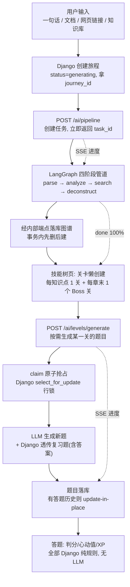
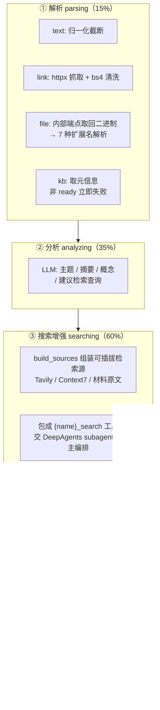
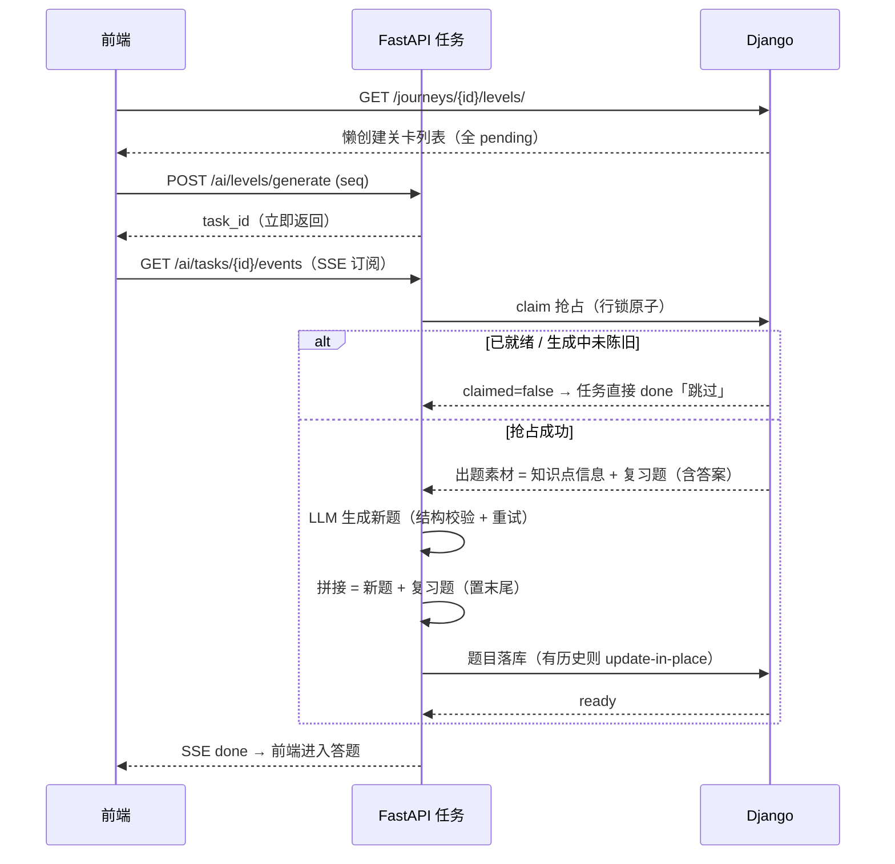
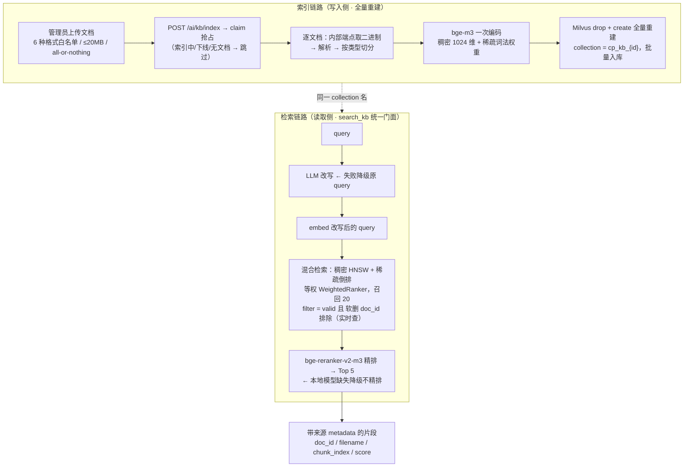
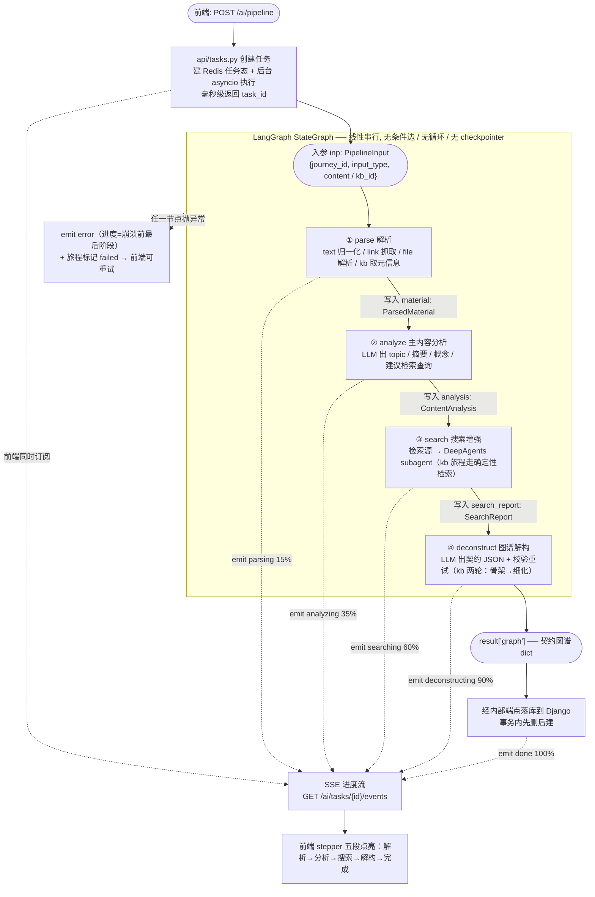
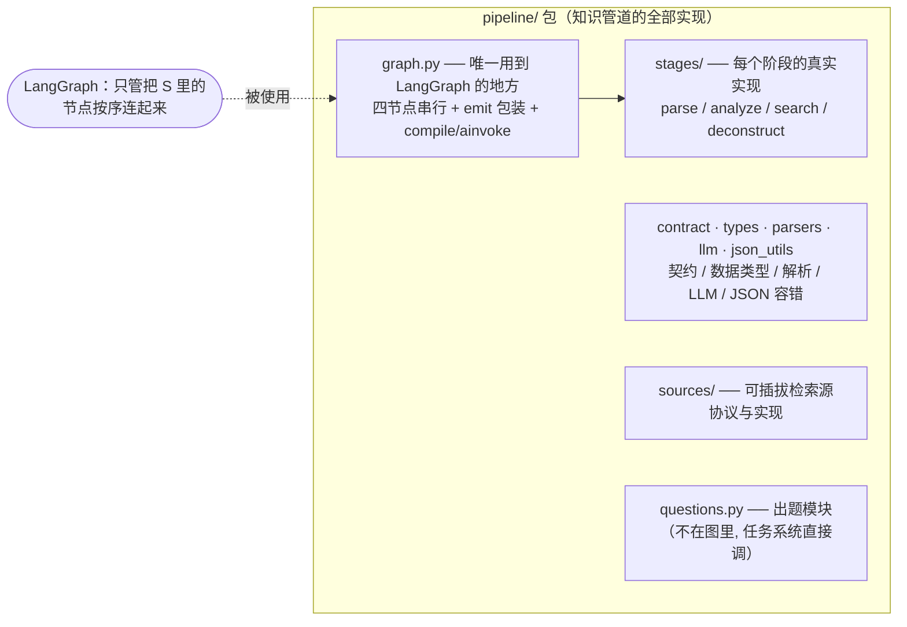
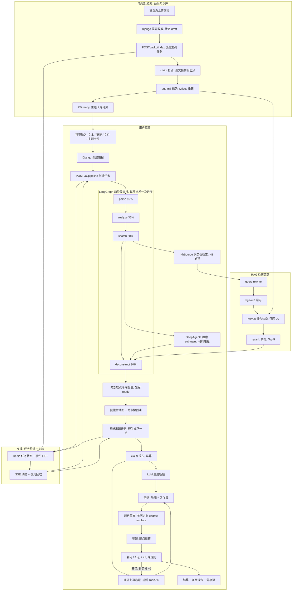

# 模拟面试归档 · CharPlot（2026-10-10）

> **性质**：一次完整模拟面试的全量存档 —— 先是一份可直接上简历的项目经历描述，之后是 16 轮问答的逐轮记录（面试官提问 → 作答）。
> **范围**：`app/charplot` + `project/charplot`（CharPlot · AI 闯关学习网站，Django + FastAPI 双后端微服务）—— 服务职责划分 / FastAPI 端框架设计 / 知识管道与出题全流程 / RAG 全链路 / DeepAgents 选型取舍 / pipeline 与 LangGraph 的分工 / 全项目架构串联 / 知识库的使用边界与出题的数据依赖 / 技术设计难点与深度参与的证据。
> **与同目录另两份的关系**：`CharAgent+CharApp.md` 是 agent 运行时（主线）的对话归档，`RAG+NL2SQL.md` 是 RAG 技术面的对话归档，本文件是「用主流框架把 AI 落成产品」的对话归档 —— 三份合起来覆盖简历上的三条经历。**引用细节以代码与 README 为准，引用对话过程以本文为准**。
> **图的说明**：正文七张图均为 Mermaid 代码块，在支持 Mermaid 的 Markdown 预览（GitHub、VS Code + Mermaid 插件、Typora 等）中自动渲染成图。

---

## 目录

**一、[简历项目经历描述](#一简历项目经历描述)**

**二、对话记录（16 轮）**

| # | 话题 | 跳到 |
|---|------|------|
| Q1 | 双后端各服务职责划分 | [→](#q1-双后端各服务职责划分) |
| Q2 | FastAPI 端框架设计 + 从输入到题库的全流程（3 图） | [→](#q2-fastapi-端框架设计与出题全流程) |
| Q3 | RAG 全链路：是什么 / 怎么运行 / 服务什么模块 | [→](#q3-rag-全链路) |
| Q4 | 为什么用 DeepAgents 而不是 LangChain agent / 裸模型调用 | [→](#q4-deepagents-选型取舍) |
| Q5 | LangGraph 全流程图（最直观版） | [→](#q5-langgraph-全流程图) |
| Q6 | pipeline 是做什么的 / 与 LangGraph 的分工区别 | [→](#q6-pipeline-与-langgraph-的分工) |
| Q7 | 一张图串起全项目运行路线（含 RAG / 双视角 / 渐进出题） | [→](#q7-全项目运行路线总图) |
| Q8 | search 阶段为什么走 RAG、在检索什么 | [→](#q8-search-阶段的-rag-检索) |
| Q9 | 知识库的使用范围（澄清误解：预设的是语料不是旅程） | [→](#q9-知识库的使用范围) |
| Q10 | 出题逻辑与输入来源无关（类型在图谱落库时被抹平） | [→](#q10-出题逻辑与输入来源无关) |
| Q11 | 出题一次即定（ready 是终态，重试只留给 failed） | [→](#q11-出题一次即定) |
| Q12 | 主题卡片 = 每次创建一个新旅程（共享索引 / 独立下游） | [→](#q12-主题卡片与新建旅程) |
| Q13 | 出题阶段的设计（七个环节与两道门） | [→](#q13-出题阶段的设计) |
| Q14 | 出题依据与知识库变更的影响（快照语义） | [→](#q14-出题依据与知识库变更的影响) |
| Q15 | 项目过程中的技术设计难点（五个） | [→](#q15-技术设计难点) |
| Q16 | 体现亲身参与深度设计的说辞 | [→](#q16-深度参与设计的证据) |

---

## 一、简历项目经历描述

**项目经历：CharPlot — AI 闯关学习网站（Django + FastAPI 双后端微服务，独立设计开发）**

> **一句话概括**：面向「任意知识 → 闯关学习」的全链路产品 —— 输入一句话 / 文档（7 种扩展名）/ 网页链接 / 管理员预建知识库，LangGraph 四阶段管道自动获取知识并解构成技能树图谱，按知识点渐进式生成闯关题（选择/判断/填空），Duolingo 式游戏化答题（心动值 / 连胜 / XP / 间隔复习），通关生成复盘报告与公开分享页。Django 承担状态与规则（账号 / 判分 / 游戏化 / 分享页），FastAPI 承担 AI 能力（知识管道 / RAG / 出题 / 任务系统），Vue 3 前端 11 页；两侧以 13 个内部端点构成严格单向的服务边界。测试合计 366 用例（FastAPI 89 全离线 + Django 277）。

**核心亮点与难点：**

1. **架构判断：LLM 不参与答题路径** —— 判分 / 心动值 / XP / 连胜 / 间隔复习全部是 Django 纯规则 + 预生成讲解，AI 能力全部收在 FastAPI：答题交互的延迟与成本恒定、行为确定可测。RAG 只返回带来源的片段、不生成答案，「生成依据」（检索）与「生成动作」（图谱 / 题目 / 讲解）拆开，配合 prompt 只许基于检索片段出题、来源引用展示、「题目有问题」反馈标记（同题同人去重）构成三层幻觉防护。服务间认证一律 X-Internal-Token 且 fail closed（常量时间比较、非 ASCII token 不崩成 500），不存在 Django → FastAPI 的反向调用。

2. **知识管道：LangGraph 四阶段 + 可插拔检索源 + DeepAgents 检索 subagent** —— 解析（二进制经内部端点取回、FastAPI 侧统一归一化）→ 主内容分析（提炼主题与建议检索查询，为「材料也联网补全」服务）→ 搜索增强 → 图谱解构。检索源做成统一 Protocol（Tavily / Context7 官方文档 / 材料原文 / 知识库），按配置启停、单源失败自动降级，运行时动态生成 `{name}_search` 工具交给 DeepAgents 检索 subagent 自主编排 —— 结构化报告用 ToolStrategy（function calling）绕开 DeepSeek 不支持 json_schema response_format 的 400，并做三级兜底（结构化输出 → 扫消息文本解析 JSON → 空报告），保证管道永不因模型不守格式而中断。三件套各用其位：LangGraph 管编排、DeepAgents 管检索、LangChain 管 RAG 组件；出题与解构是裸 LLM 调用 + 结构校验，不滥用 agent。

3. **RAG 全链路与降级矩阵** —— 按文档类型调优切分（md 按标题层级递归、html 800/80、pdf/docx/pptx 600/60）；bge-m3 一次编码同时出稠密（1024 维）+ 稀疏双向量；Milvus 双路混合检索（HNSW + 稀疏倒排，WeightedRanker 等权融合，召回 20）→ LLM query rewrite → bge-reranker-v2-m3 精排 Top 5。两个降级决策体现取舍：embedding 缺失**报错**（把「模型库静默下载 2GB」变成用户的主动决策）、rerank 缺失**降级不精排**并由 `/ai/health` 暴露运行时事实（架构意图与运行时状态不打架）；软删**实时生效**（检索时实时取软删集构造 filter 排除，恢复即重新命中，不可达时宁可 503 也不返回脏数据）；改写失败降级原 query —— 检索永不因增强环节失败而失败。

4. **知识库两轮解构（先骨架后细化）** —— 整库几十万字一次解构必然超 token 上限：第一轮用概览检索建图谱骨架（章节 + 知识点粗结构），第二轮逐知识点精检索（KbSource × 5 片段）+ `asyncio.Semaphore(4)` 并发 LLM 细化依赖边与摘要，并以「id / 标题冻结 + prerequisites 必须引用骨架 id」的硬校验防 LLM 改名漂移，任一失败带中文校验错误回喂重试。检索先同步收集（同步阻塞链路并发无收益）、LLM 才并发 —— 把并发留给真异步的 I/O。

5. **任务系统：异步任务 + SSE 断线续推 + 孤儿任务回收** —— 三类长任务（管道 / 出题 / 索引）用 Redis 承载：HASH 存状态、LIST 存事件且**下标即 SSE 帧 id**，断线重连按 Last-Event-ID 增量续推（等价 offset 语义，无重复消费）。核心难点是失败面：「FastAPI 重启后 Redis 里任务仍 running、执行体已死、前端无限空转」—— 订阅时判定「无新事件 + 执行体不在进程注册表 + 状态 running」即孤儿，写终止 error 事件 + 经内部端点把实体（旅程/关卡/知识库）推回失败态，用户点「重试」立刻可跑，不必等 10 分钟陈旧锁；单进程部署这一前提与代价写进文档而非藏着。

6. **并发幂等：权威落在 MySQL 行锁** —— 「出题 / 索引」的重复触发（用户重试 / 预生成 / 多端）由 `select_for_update` + 状态条件转移收敛：已就绪拒绝、生成中未陈旧拒绝，否则抢占并记录 latest_task_id；FastAPI 侧拿到 claimed=false 立即 done 跳过、不烧一次 LLM 调用。10 分钟陈旧超时防永久卡死（服务重启后可重新抢占）；latest_task_id + 陈旧标记守卫保证旧任务的失败回调不覆盖新任务的运行；题目落库在有答题历史时 update-in-place 保住历史 Attempt（删题会级联删答题记录）——重放安全由落库语义兜底。

7. **游戏化与间隔复习（纯规则，可注入时钟测试）** —— 判分三题型（填空 NFKC 归一化模糊匹配，畸形输入判错不抛异常）；5 心动值安全失败 + 断点续答（进度持久化在后端）；XP 十档等级；连胜与学习币兑换的冻结卡。**间隔复习**：易错分（答错 +2 / 答对 −1）× 时间衰减（priority = 易错分 ×（距上次复习天数 + 1），从未复习按 30 天计）排序取 Top 20% 易错知识点，以「该知识点答错最多的历史题」无感混入新关，复习题答错时易错分记回**来源知识点**形成衰减闭环；全部规则函数支持 today 注入，测试免 mock 时钟。

8. **质量纪律与边界诚实** —— FastAPI 侧 89 用例零外部依赖（Redis /15 隔离 + FakeChatModel / FakeEmbedder / FakeMilvusClient，不触网不加载真模型），易错点用测试钉住（工具闭包晚绑定、软删 filter 表达式、SSE 帧 id 连续性、孤儿回收幂等、活任务不误判）；双后端 12 表 41 路由与 13 个内部调用的数据契约逐条核对无断链；已实现 vs 未实现对照表、已知边界（同步推理跑在事件循环上、孤儿回收依赖单进程部署、agents 真实执行路径仅运行期验证）全部如实进 README —— 记录「不做」与记录「要做」同样重要。

---

## 二、对话记录

### Q1 双后端各服务职责划分

**面试官**：我看你这个项目是微服务框架，说说每个服务主要负责干什么（简单介绍即可）

**我**：一句话原则：**状态与规则归 Django，AI 能力归 FastAPI，前端只做展示交互** —— 三个进程，两条清晰的边界。

**Django（8000，业务与数据端）——「确定的都在这边」**
- 账号体系与 12 张表：用户 Profile、旅程 / 章节 / 知识点（自引用 M2M 前置依赖图）、关卡 / 题目 / 答题记录、知识库元数据、复盘报告、题目反馈标记；
- 闯关交互的**全部规则**：判分、5 心动值、断点续答、XP 等级、连胜冻结、间隔复习调度——纯 Python 规则 + 预生成讲解，**LLM 不参与答题路径**，所以答题延迟与成本恒定、行为可测；
- Dashboard 聚合（掌握度矩阵 / 活动统计 / 易错清单）、`/r/{slug}` 公开分享页（服务端渲染输出 OG 卡片）；
- 对外暴露 13 个内部端点（图谱落库、出题抢占 / 落库、索引抢占、软删清单、状态总结聚合等）给 FastAPI 调用。

**FastAPI（8004，AI 能力端）——「不确定的都圈在这边」**
- 知识管道：LangGraph 四阶段（解析 → 主内容分析 → 联网搜索增强 → 图谱解构），检索环节用 DeepAgents subagent 挂可插拔检索源；
- RAG 全链路：文档切分 → bge-m3 embedding → Milvus 索引与混合检索 → rerank（独立端点 + 供管道内部消费）；
- 渐进出题生成、LLM 状态总结；任务系统（Redis 状态 + SSE 进度推送）也在这边，因为长任务全是它自己的事。

**Vue 3（9004，前端）** — 11 个页面，Vite 代理分流：`/api` → 8000，`/ai` + SSE → 8004。

**服务间边界**：只存在 FastAPI → Django 单向调用（共享 token，fail closed），Django 从不反向调 FastAPI——所以索引 / 出题的触发由前端直调 `/ai/*`，写完的数据再经内部端点落回 Django。数据库 schema 归 Django ORM 管，FastAPI 不直连库；Redis 按库隔离（Django 缓存 /0，任务状态 /4）。

这么分的动机：LLM、本地模型、Milvus 这些重依赖和不稳定性，全被圈在 AI 端；业务端的规则、资金式结算（XP / 币）、数据一致性用纯代码和数据库事务保证，两边职责零重叠。

---

### Q2 FastAPI 端框架设计与出题全流程

**面试官**：我主要想知道的是 FastAPI 端的框架设计。关于这个知识管道，用户从输入开始，是怎么一步步生成题库的，详细讲述一下这个过程，并配上流程图直观的解释一下。

**我**：FastAPI 端的设计可以概括成一句：**「分层目录 + 一切长任务走异步任务化」**。先把结构摆出来，再顺着输入走一遍全流程。

**一、FastAPI 端的分层（五个包各管一段）**

| 包 | 职责 | 关键点 |
|---|---|---|
| `api/` | HTTP 层（8 个 `/ai/*` 端点）+ 任务系统 + Django 客户端 | 端点只做参数校验与创建任务，长活全部甩给后台任务 |
| `pipeline/` | LangGraph 四阶段编排 + 契约校验 + 检索源抽象 + 出题 | 每个阶段节点 = 一个纯函数，输入输出都过 pydantic |
| `agents/` | DeepAgents 检索 subagent + 检索源 → `@tool` 封装 | 只用在检索一环，出题/解构是裸 LLM 调用 |
| `rag/` | LangChain RAG 组件：切分 / embedding / Milvus / 改写 / 精排 | 独立门面 `search_kb()`，既能被端点直接调，也能被管道当检索源消费 |
| `prompt/` | 5 组提示词常量，与代码分离 | 每个 LLM 阶段的输出 schema 都写死在 prompt 里 |

**分层原则**：`api` 不碰业务逻辑，`pipeline` 不碰 HTTP，`rag` 不知道谁在调它。所有跨进程写记录（落库/抢占/失败标记）都收敛到 `api/django_client.py` 一个文件里，13 个内部调用集中管理。

**二、端到端主链路**



关键点：**HTTP 请求不承载长耗时**。`/ai/pipeline` 和 `/ai/levels/generate` 都是「创建任务 + 返回 task_id」就结束（毫秒级）；进度走 SSE 单独通道（Redis LIST 存事件、下标即帧 id、断线按 Last-Event-ID 续推）。这样 LLM 跑 30 秒也不会占死任何请求。

**三、逐阶段展开（第一次输入 → 图谱）**



每步的设计要点：

1. **解析**：四种输入归一化成同一种材料结构（`ParsedMaterial`）。文件解析刻意放在 FastAPI 侧（Django 只负责把二进制 base64 递出来）——「解析」属于 AI 能力端的职责。知识库旅程在这里做一次运行时快速失败（库被下线则直接报错，不浪费后续 LLM 调用）。
2. **分析**：这一步产出的 `suggested_queries` 是「材料也联网补全」的关键——即使是用户上传的文档，也要联网交叉验证，所以检索查询由 LLM 从材料内容里提炼，而不是固定模板。
3. **搜索增强**：检索源是可插拔的（Protocol 定义 `name/description/search`），按配置启停、单源失败自动降级；运行时把每个源动态包成一个工具交给 subagent 自主决定调谁。结构化报告用 `ToolStrategy`（function calling 路径）——因为 DeepSeek 不支持 json_schema 形态的 response_format，直传会 400；另配三级兜底保证「subagent 没按格式输出」不会把整条管道带崩。
4. **解构**：LLM 输出 → JSON 提取 → **FastAPI 侧本地契约校验**（章节/知识点 id 全局唯一、prerequisites 必须引用已定义 id）→ 失败把中文校验错误原文回喂重试。校验前移的理由：非法图谱不等到落库端点 400 才暴露；Django 落库端还有一次权威校验，两边防线一致。

**四、出题链路（图谱 → 题库）**

这是「生成题库」这一步，它的设计是**渐进式按需生成**，不是一次性全量生成：



三个值得讲的决策：

- **懒生成 + 预生成**：进入关卡列表只创建空关卡（pending），真正点开某一关才触发生成（3 分钟一关的粒度）；学当前关时前端后台预生成下一关，所以「进入下一关」通常零等待。
- **间隔复习题由 Django 在 claim 时塞进来**：Django 按「易错分 × 时间衰减」排序取 Top 20% 历史易错知识点，挑每个知识点「答错最多的历史题」复制一份，**含完整答案**一起透传给 FastAPI —— 复习题的答案全程只在服务间传递，落库后也永不下发前端。出题 LLM 只负责生成 `new_count` 道新题，不感知复习逻辑。
- **claim 是幂等的唯一权威**：重复触发（用户重试 / 预生成 / 多端打开）在 Django 侧被行锁收敛，FastAPI 拿到 `claimed=false` 就直接 done 跳过——**不烧一次 LLM 调用**。生成中卡死超过 10 分钟视为陈旧可重抢，防止关卡永久卡在「生成中」。

所以整个「题库」的形态是：图谱落库后按知识点拆成关卡，每关 6 题（Boss 8 题）在用户接近时才生成，其中约 20% 是系统按易错度悄悄混入的复习题——**生成在 AI 端，调度与判分在规则端**，这条边界就是整个项目的核心设计。

---

### Q3 RAG 全链路

**面试官**：RAG 全链路指的是什么，怎么运行的，在这个项目中负责什么功能模块

**我**：**RAG 全链路 = 写入侧的索引链路 + 读取侧的检索链路，端到端一套**。在这个项目里它不是一个独立功能，而是「知识库模块」的引擎——管理员预建主题库，学习者从主题卡片直达由它驱动的旅程。

**全链路一张图**



**索引侧怎么运行（写入）**

1. **入口是管理端**：上传在校验层就卡住（扩展名白名单≥content_type，防伪造；单文件 20MB；一批文件 all-or-nothing，任一非法整批不落库）。
2. **索引是异步任务**：状态机 `draft → indexing → ready`（failed 可重试、ready 可下线、任何变更触发全量重建），`claim` 用行锁保证同一知识库同时只有一个索引任务，per-doc 推送 SSE 进度（parsing 15 → 每文档 chunking/embedding 交替 40→85 → indexing 90 → done）。
3. **切分按文档类型调优**：md 用标题层级/代码围栏作分隔符 500/50（不硬切代码块）、html 800/80（网页段落长）、pdf/docx/pptx 600/60（折中），每个 chunk 都带上来源 metadata——这是后面引用溯源的第一环。
4. **一次编码出双向量**：bge-m3 同时产出稠密（1024 维、L2 归一化 → Milvus 里 IP 即余弦）和稀疏词法权重，省掉第二个模型和第二次推理。
5. **全量重建（drop + create）** 而不是增量更新：牺牲增量成本换「任何变更后数据零残留、绝对一致」，软删文档在这一步被物理剔除。

**检索侧怎么运行（读取）**

`search_kb(kb_id, query, top_k)` 是唯一对外门面，六步：改写 → 编码 → 查软删集合 → 混合召回 20 → 精排 5 → 返回片段。其中三处设计是面试点：

- **改写是增强不是依赖**：LLM 改写查询为更完整的检索表述（补全省略实体），但四种失败（关闭开关 / 调用异常 / 输出空 / 复述原文）全部降级回原 query——检索永远不因增强环节失败而失败。改写后的 query 同时用于 embedding 与 rerank，口径一致。
- **软删实时生效**：检索时实时向 Django 查「被软删的 doc_id 集合」，构造 `valid == true and doc_id not in [...]` 的 Milvus filter——删除立即不命中、恢复立即重新命中，不必等下次全量重建；Django 不可达时宁可报 503 也不静默返回已删数据。
- **两段式 Top-K**：召回量与精排后条数独立配置（20 → 5），每路各召回 20 再融合，保证精排有足够候选。

**它在项目里服务什么**

它支撑的是**「知识库功能模块」**，有两个消费方：

1. **知识库驱动的旅程（主消费方）**：主页主题卡片（管理员预建库）→ 点击开旅程 → 管道里的检索阶段不走 DeepAgents subagent，而是**确定性调 `KbSource`**（骨架轮需要确定产出，不赌 agent 输出）——概览检索建图谱骨架，再逐知识点精检索细化，这就是「两轮解构」里 RAG 的位置。
2. **可插拔检索源之一**：`KbSource` 实现了和 Tavily / Context7 / 材料原文同一个 `SearchSource` 协议，对管道而言它只是「又一个检索源」，新增源不用改管道代码。

另外它有一个独立的 `/ai/kb/search` 端点暴露同一门面，用于调试和独立调用。

**一条贯穿全链路的设计原则**

**RAG 只返回片段、不生成答案**——「生成依据」（检索）和「生成动作」（图谱/题目/讲解）刻意拆开：检索产出的每个片段带 doc_id/filename/chunk_index 来源信息，下游 LLM 生成时按编号引用（`sources: ["1","3"]`），落库到知识点和题目上，最终在答题页展示来源引用。这样幻觉防护不是靠一句 prompt，而是靠数据结构本身可溯源。

---

### Q4 DeepAgents 选型取舍

**面试官**：为什么要用这么重的 DeepAgents，而不是用简单的 LangChain agent 或者裸模型调用

**我**：结论先给：**因为「检索」是整条管道里唯一一个「任务空间不确定」的环节，agent 的重正好用在这；其余环节的任务性质决定了它们不该用 agent——所以 DeepAgents 在全项目只出现了一次**（`agents/search_agent.py`），这不是随手选的，是按任务性质切出来的。

**先看三类环节的任务性质**

| 环节 | 输入 | 输出 | 决策空间 | 选型 |
|---|---|---|---|---|
| 图谱解构 / 出题 | 确定的素材（材料+分析+检索报告） | 确定 schema 的 JSON | **一轮就能定**，错了是格式问题不是策略问题 | 裸 LLM 调用 + pydantic 校验 + 错误回喂重试 |
| 检索 | 主题 + 建议查询 | 结构化检索报告 | **不确定**：先搜哪个源、要不要换查询、哪条线索值得追、几个源够了 | DeepAgents subagent |
| LLM 状态总结 | 聚合好的事实 | 三段 markdown | 无决策 | 裸 LLM 调用 |

判据就一条：**任务要不要「根据中间结果决定下一步」**。解构和出题不需要——同样是「重试」，它们重试的是格式（把校验错误原文回喂当场改），不是策略。而检索需要：给一个主题，是先搜网络还是先查文档源、第一个查询结果不够要不要补一个、某个源失败了换哪个——这些只有看到中间结果才能定。裸模型调用要自己手写工具循环的状态机、消息历史管理、终止条件；这个项目里 LangGraph 已经用在管道编排上了，但检索是一个独立的「子任务」，用 agent 抽象直接描述比在管道里再手搓一层循环干净。

**为什么是 DeepAgents，而不是自己搭 LangChain agent**

诚实版：**DeepAgents 就是 LangChain 官方在 `create_agent` 之上的深 agent 封装，我用到的是它的基本盘**——agent loop、多工具编排、结构化输出，而不是它的 subagent/文件系统那套重型能力。`create_deep_agent` 的价值在「开箱即用 + 官方维护」：消息管理、工具调用循环、`recursion_limit`、结构化输出协议都是现成的。选它的一个小理由也在这：这个项目的定位是「用主流框架把 AI 能力落成产品」（与手写 Agent 运行时的主线项目互补），用官方高层封装是这个定位的一部分。

**代价我也认，而且代码里都留了痕迹**

1. **非确定性**是最贵的代价。最直接的证据：知识库旅程的检索**刻意绕开 subagent**，走确定性 `KbSource` 检索——代码注释写得很直白：「骨架轮需要确定的概览资料（subagent 是否产出报告不确定）」。哪里的产出影响下游全链路，哪里就不赌 agent。
2. **DeepSeek 适配坑**：它不支持 json_schema 形态的 response_format，所以结构化输出必须用 `ToolStrategy`（function calling 路径）而不是默认的 ProviderStrategy，否则直接 400；而且模型偶发不遵守 function calling、把结论当普通文本吐出来，所以做了三级兜底：结构化输出 → 扫描消息历史解析文本 JSON → 空报告兜底。这些额外处理成本，就是「用 agent 框架」换来的。
3. **测试只能覆盖接缝**：真实 `create_deep_agent` 执行路径需要真模型且输出非确定，单测用 Fake 替换，只钉住了工具闭包绑定这类能确定的部分（`test_search_tools.py`）——这个覆盖边界我写进了 README 的已知问题，而不是假装全覆盖。

**换个角度补充**

我在另一个主线项目里是**从 0 手写 agent loop** 的（工具循环、并行调用、错误回填、循环防护全部自实现，零 LLM 框架依赖）——所以这里用 DeepAgents 不是「只会用框架」，而是清楚它里面装的是什么：消息状态机、工具协议、终止条件这些机制我都自己写过一遍。选型的自由度就在这：哪一环值得上 agent 抽象（检索），哪一环裸调用最稳（解构/出题/总结），这条线是画出来的，不是套模板套出来的。

---

### Q5 LangGraph 全流程图

**面试官**：我还是不太清楚你整个 LangGraph 的流程，用一个最直观的流程图展示给我看

**我**：一张图看清：**LangGraph 部分就是一个「输入 → 四个串行节点 → 输出」的线性图，数据在 state 里逐键流动，每个节点开头发一次进度事件**。



**读这张图只要抓住四条线：**

1. **数据线（实线）**：`inp → material → analysis → search_report → graph`——每个节点的产出写进 `PipelineState` 的下一个键，下一个节点消费它。`StateGraph(PipelineState)` 的 state 就是一个 TypedDict，节点函数是 `(state) -> dict`（返回要合并的增量），没有别的作用。
2. **进度线（虚线 → SSE）**：`build_graph(emit)` 时把 emit 回调注入进来（实参是 `partial(emit, task_id)`），每个真实节点外再包一层「开头 emit 一次」。emit 写两处 Redis：更新任务 hash + 追加事件 LIST。前端 stepper 的 4 段就是这四个 emit，100% 是落库后的 done。
3. **控制线**：**没有条件边、没有循环、没有 checkpointer**，就是 `START → parse → analyze → search → deconstruct → END` 五条直线边。所有分支（kb vs 文件/链接/文本、单轮 vs 两轮解构）都沉在节点**内部的 if** 里，不放大到图拓扑——因为图拓扑一变，整个 SSE 阶段契约就跟着变，不值得。
4. **失败线**：节点不吞异常，向上抛给任务层 → 转 error 事件（进度取崩溃前那一阶段的真实值）+ 通知 Django 把旅程推回 failed。**不做断点续跑**——四阶段是短管道，失败语义是「整体重试」（前端重新 POST 即可，落库端点幂等），上 checkpointer 是过度设计。

一个实现细节顺带说：图是**每次调用重建**的（`run_pipeline` 里 `build_graph(emit)` 再 `compile()`），因为 emit 闭包按 task 绑定；构图成本可以忽略，所以不做全局单例。

---

### Q6 pipeline 与 LangGraph 的分工

**面试官**：项目中的 pipeline 是做什么的，和 LangGraph 有什么分工上的区别

**我**：先纠一个容易混的点：**`pipeline/` 是一个业务模块（代码包），LangGraph 是它内部用到的一个库**。「知识管道」这个业务概念的全部内容都在 `pipeline/` 里；LangGraph 只负责其中一件事——把四个阶段按顺序串起来。

**分工：一个管「编排」，一个管「每一步怎么做」**

| 职责 | 归谁 | 具体内容 |
|---|---|---|
| 节点按什么顺序执行、state 怎么在节点间传递、怎么启动一次执行 | **LangGraph**（只体现于 `pipeline/graph.py` 约 60 行） | `StateGraph(PipelineState)` + 4 条直线边 + `compile()` / `ainvoke()` |
| 每个阶段**真实干什么** | **pipeline**（`stages/`） | 解析 7 种格式、组装 prompt 调 LLM、JSON 提取、契约校验、错误回喂重试、检索源编排 |
| 数据长什么样 | **pipeline**（`types.py` / `contract.py`） | `PipelineState` / `ParsedMaterial` / `ContentAnalysis` / 图谱契约 v1 的 pydantic 模型 |
| LLM 怎么接 | **pipeline**（`llm.py` / `json_utils.py`） | DeepSeek 惰性单例、输出容错提取 |
| 检索从哪来 | **pipeline**（`sources/`）+ **agents** | 可插拔源协议与四个实现；subagent 是其中一个执行方式 |
| 出题 | **pipeline**（`questions.py`） | 注意：**它在四阶段图之外**——由任务系统直接调用，不是图上的节点 |



**两个「不知道」是解耦的证据**

- **节点不知道自己在图里**：`deconstruct_node(state) -> dict` 就是一个普通 async 函数，它完全不 import langgraph——在别处直接 `await` 它一样跑。
- **图不知道节点里做什么**：`graph.py` 只知道四个函数的名字和顺序，对「LLM 调用、校验、重试」零感知。

所以有个硬判据可以检验这个分工：**如果明天换掉 LangGraph（比如手写一个四行 `await` 的循环替代 `StateGraph`），只需要重写 `graph.py`，`stages/`、`contract.py`、`parsers.py` 一行不用动**——行为等价。这正说明了 pipeline 的业务资产和 LangGraph 的编排能力是两个可分离的东西。

**那为什么还要 LangGraph？（诚实版）**

这个项目对 LangGraph 的使用是**克制的**：只用了它的类型化 state + 串行拓扑 + 执行入口，条件边、并行、循环、checkpointer 一概没用——因为四阶段任务本来就没有这些需求（分支沉在节点内、失败语义是整体重试而非断点续跑）。

用它的理由是三条：一是声明式拓扑比手写流程更能表达「阶段契约」（阶段名/顺序就是 SSE 协议的来源）；二是与生态一致、后面要加**并行检索、HITL、断点续跑**这类能力时直接在拓扑层扩展，不用重构；三是本项目定位就是三件套各用其位——LangGraph 管编排、DeepAgents 管检索、LangChain 管 RAG 组件，而「用在哪、用到什么程度」本身就是我的工程判断：**框架提供语法，业务的具体内容一分都不外包给框架**。

---

### Q7 全项目运行路线总图

**面试官**：用一整个图画出整个项目的运行路线，包括知识管道 pipeline（包括其中的 LangGraph）详细的节点流转过程 + RAG 全链路；用户视角：生成旅程 + 答题 + 答题过程中渐进式题目生成；管理员视角：预设知识库 → 给到用户答题。把所有零散的路线串起来，汇总成一个整图。

**我**：一张总图，把管理员链路、用户链路、RAG 全链路、任务系统全部串上。



**读图三条线：**

1. **管理员的线（左上）**：上传 → 索引任务 → RAG 写入侧（切分/编码/Milvus 重建）→ ready → 变成用户首页的主题卡片。这条线只需跑一次，产物是「知识库」。
2. **用户的线（右侧主链）**：输入 → LangGraph 四阶段出图谱 → 技能树 + 关卡懒创建 → 渐进式出题 → 答题 → 复盘分享。其中**出题是「按需 + 预生成」**：点开哪关才生成哪关，学当前关时后台已经把下一关烘好，所以进下一关通常零等待。
3. **底座（RAG 检索 + 任务系统）**：RAG 检索既被 KB 旅程的解构阶段消费（骨架轮+细化轮），也是独立 `/ai/kb/search` 门面；三条长链（管道/出题/索引）全部挂在同一个任务系统上，进度走同一条 SSE 通道。

**两条关键闭环：**

- **间隔复习闭环**（底部长虚线）：答错 → 易错分 +2 记在来源知识点 → 下次出题时按「易错分 × 时间衰减」排进 Top 20% 混入新关 → 答对 −1、并更新 `last_reviewed_at` → 分数随时间衰减出候选池。复习调度完全由规则驱动，LLM 不参与。
- **写入↔检索闭环**：索引侧每次全量重建写入 Milvus（drop+create，软删物理剔除），检索侧实时排除软删——删文档立即不命中、恢复立即命中，两条线共用一个 collection 名 `cp_kb_{id}`。

**一眼可见的边界**：LLM 只出现在五个位置（分析、检索、解构、出题、改写），全部在 FastAPI 侧；判分 / 心动值 / 复习选题 / 结算全部在 Django 侧走纯规则。所有跨服务写记录走 `X-Internal-Token` 单向调用（FastAPI → Django），不存在反向调用——这就是整个项目的架构底线。

---

### Q8 search 阶段的 RAG 检索

**面试官**：langgraph 中的 search 为什么要走 RAG 流程，这是要检索什么？

**我**：先纠一个前提——**search 阶段不是「走 RAG 流程」，而是在不同旅程下走两条不同的路，RAG 只是其中一条**：

| 旅程类型 | search 阶段走什么 | 检索的是什么 |
|---|---|---|
| 材料旅程（text / file / link） | DeepAgents 检索 subagent + 联网检索源（Tavily / Context7 / 材料原文） | 互联网与官方文档——补全材料缺失、过时的知识面 |
| **知识库旅程（kb）** | **KbSource → RAG 检索（Milvus 混合检索 + 精排）** | **知识库自己的文档片段**——这个库讲的内容 |

为什么 KB 旅程要用 RAG、而且刻意绕开 subagent，代码注释里写了直白原因：「骨架轮需要确定的概览资料（subagent 是否产出报告不确定）」。展开是三层考虑：

**1. 知识边界是产品语义决定的。** 知识库旅程的定位就是「学这个库里的内容」——知识来源应该是这个库，而不是全互联网。所以 `build_sources(kb_id=...)` 里只注册一个源（KbSource），Tavily / Context7 全不挂。这跟材料旅程相反：材料旅程没有自己的知识边界，所以要靠联网补全。

**2. 检索什么：为图谱解构准备「素材之外的依据」。** search 阶段的下游是 deconstruct——LLM 要把主题解构成章节 → 知识点 + 依赖边，几十万字的知识库不可能整库塞进 prompt（窗口放不下），所以必须先「从大库里捞出与主题相关的片段」。这正是 RAG 的用途。具体两轮捞的东西不同：

- **骨架轮**：拿 analyze 阶段产出的建议查询（取前 3 个），逐个对知识库检索（每查询 5 条、总量上限 20 条）——捞的是「这个库大致讲什么」的**概览片段**，供 LLM 建图谱骨架（章节 + 知识点粗结构）；
- **细化轮**：骨架定下来后，对**每个知识点标题**单独精检索（每个 5 条片段）——捞的是「这个具体知识点」的**针对性片段**，供 LLM 细化依赖边、摘要和 sources 引用。

两轮都是确定性调用：对给定查询返固定的 top-k 片段，条数与内容可控。

**3. 确定性要求高于智能编排。** 这是和材料旅程最关键的分歧：KB 旅程的骨架错了，后面全错（细化轮、关卡、题库全建在骨架上）。subagent 的产出量取决于它自己想调几次工具、怎么组织查询——今天可能搜 3 次、明天可能搜 6 次，甚至偶尔不产出结构化报告；而 `_kb_overview_report` 是「对建议查询逐个检索、失败就跳过、总量封顶」——**结果可预期、可测试、失败面小**。材料旅程的搜索质量影响的是「知识点丰富度」（错了可以再来一次），KB 旅程的搜索质量影响的是「骨架正确性」（错了全盘返工）——风险等级不同，所以一边敢赌 agent 的自主性，一边不赌。

**检索结果的去向**：无论哪条路，产出都是同一个结构——`SearchReport`（topic / queries / results / takeaway）→ 进 deconstruct 的 prompt 被编号成 `[1] [2] ...` → LLM 解构时每个知识点标注 `sources: ["1","3"]` 引用编号。这就是「RAG 只返回片段、不生成答案」在那条链路上的落点：RAG 提供依据，生成的活留给解构 LLM。

所以一句话总结：**search 阶段要检索的是「图谱解构的依据」；在知识库场景下，这个依据来自库内文档，用的手段就是 RAG 检索**——它不是为了让 search 走 RAG，而是「库内知识 + RAG」本来就是知识库旅程这套玩法的前提。

---

### Q9 知识库的使用范围

**面试官**：我一直以为的是知识库只是用于管理员上传文档 - 预设旅程用的，用户在输入后一直到生成旅程的过程中是从来不会从知识库中获取任何数据的。

**我**：你这个理解对了一半——分两个入口说清楚就顺了：

| 入口 | 用户动作 | 生成旅程时碰不碰知识库 |
|---|---|---|
| 材料入口 | 输入一句话 / 传文档 / 贴链接 | **完全不碰**（你对的就是这一半） |
| 主题卡片入口 | 在首页点管理员预建的知识库卡片 | **全程依赖**——RAG 检索就是它的知识来源 |

关键在「预设」这个词的含义：**知识库里预设的是「语料 + 向量索引」，不是「旅程成品」**。旅程（图谱 / 关卡 / 题目）永远是用户点下去那一刻现生成的，只不过 KB 旅程在现生成的过程中，解构所需的知识素材是从知识库里 RAG 检索出来的——而不是像材料旅程那样去联网。代码里的分流非常硬：

- 用户输入 text/file/link → `PipelineInput.kb_id = None` → `build_sources(material_text=...)` → 挂 Tavily / Context7 / 材料原文——**KbSource 不在列表里**，一道库都不查；
- 用户点主题卡片 → `input_type="kb"` + `kb_id` → `build_sources(kb_id=...)` 只返回 `[KbSource(kb_id)]` → search 阶段对知识库做两轮确定性检索（骨架轮概览查询 ×3、细化轮逐知识点 ×5 片段）→ 这些片段进解构 prompt 被编号引用，成为图谱的依据。

所以「知识库 → 用户」这条路的完整形态是：

```
管理员上传文档 → 索引（Milvus 存放语料 chunk）
                        │
用户点主题卡片 ──────────┘
   → 管道 parse 取库名/描述做材料
   → search 阶段: RAG 检索本库（这才是「取数据」发生的时刻）
   → deconstruct: 两轮解构出图谱（现生成, 不是预存的）
   → 关卡 / 题目继续现生成
```

另外两个边界，顺手把话说死：

1. **用户自己输入的内容不会被写进任何知识库**——file 输入只是取出来解析成材料（存在 `journey.source_file`），用完即弃，两个通道完全隔开；
2. **出题阶段也不碰知识库**——看代码就知道：出题任务的素材只有「知识点标题/概述/前置依赖 + Django 透传的复习题」，没有检索调用（题目的 `sources` 字段目前是预留位，恒为空）。所以全项目里 RAG 的消费者只有一个：**KB 旅程的解构环节**（外加一个调试用的 `/ai/kb/search` 端点）。

为什么不做成「管理员把整个旅程预设好、用户点开直接学」？因为同一个库可以被不同用户学，图谱的粒度、深度、依赖边都是解构时按需生成的产物——把「库」做成预设资产、把「旅程」做成按需生成，才是这个双入口设计的分工。

---

### Q10 出题逻辑与输入来源无关

**面试官**：所以无论是用户自己输入材料，还是点击已有的主题卡片，出题逻辑都是一样的？

**我**：是的，**完全一样**——而且这不是巧合，是结构上的必然。看代码就知道：出题任务的函数签名是 `_run_level_generation_task(journey_id, level_seq)`，出题素材由 Django 的 `build_level_generation_input(level)` 组装——**这个载荷里根本没有「输入类型」这个字段**：

```python
{
  "journey_id", "level_id", "level_seq",
  "level_type": "regular" | "boss",
  "difficulty": "high" | "medium",
  "question_count": 6 或 8,  "new_count": ...,
  "kp_infos": [知识点: 标题 / 概述 / 前置依赖标题],   # ← 唯一的素材来源
  "review_questions": [间隔复习题(含答案)],
}
```

出题任务既不读 `journey.input_type`，也不查知识库、不联网、不检索——它眼里只有「关卡 + 挂着的知识点」。原因在于**输入类型在管道结束那一刻就被抹平了**：

```
text / file / link / kb   ← 四种"来源"，只在管道层有意义
      │  LangGraph: parse → analyze → search → deconstruct
      │  （来源的差异全被消化在这一层：联网 / 解析 / RAG 检索）
      ▼
统一产物：章节 → 知识点（+依赖边）落进 charplot_chapter / charplot_knowledge_point
      ▼
出题只认这个统一结构 —— 与旅程怎么来的彻底无关
```

所以「来源多样性」被严格限制在管道层，图谱落库之后，整条下游（技能树 / 出题 / 答题 / 判分 / 间隔复习 / 复盘）全部面向同一种数据结构，一份代码。这是刻意设计的解耦点：**要加第五种输入来源（比如视频转写），只需要动管道的 parse 阶段，出题以下一行代码都不用改。**

两点值得注意的细节：

1. **唯一的差异是素材内容质量，不是逻辑**：kb 旅程的知识点 summary 来自库内片段，材料旅程来自联网+材料——一样的东西长得不同而已，进入出题 prompt、走 pydantic 校验、失败带错误回喂重试，这些路径逐行相同；
2. **容易混淆的两个差异其实与来源无关**：常规关 6 题 / Boss 关 8 题 + `difficulty=high` + 整章知识点素材，这是**关卡类型**的差异；混入的复习题来自**本旅程** error_score 排序——两者对 text 旅程和 kb 旅程一视同仁。

反过来看这个题也很有价值：如果要给某类旅程做出题差异化（比如 kb 旅程要求题目必须引用库内原文片段），改动点也很清楚——在那份载荷里透传「来源信息 + 可用片段」，让 prompt 与校验按它分支。当前不做的原因就是那句老话：**没有需求之前，把所有来源都收敛成一个形状，是让下游保持一份代码的唯一办法。**

---

### Q11 出题一次即定

**面试官**：管理员预设的主题用户点击后 + 出题完成后，后续再重新点进去不会重新出题了吧，出题一次后就定了是不？

**我**：对——但要先把「重新点进去」拆成两种，结论不同：

**情况一：重新点主题卡片 → 这是一个全新旅程，不是「重新出题」**

每点一次主题卡片，前端就 `createJourney({input_type: 'kb', kb_id})` **新建一条 journey**——新图谱、新关卡、新题目，管道和出题全部从头再跑一遍。这是在「开新档」，不是在原旅程上重算。这也正是上一轮说的：预设的是语料与索引，旅程（图谱/题）每次现生成，所以同一个库点两次就是两份独立的旅程，互不影响。

**情况二：同一旅程里再进关卡 → 不会重新出题，「出题一次就定了」**

这个结论对，而且是**双层保障，后端才是真闸**：

1. **前端省流**：进入关卡先看 `questions_status`——`ready` 就直接进答题，根本不会去调 `/ai/levels/generate`；
2. **后端强拦（关键）**：就算被触发了（多端打开、误触、任务重试），Django 的 `claim_level_generation` 在行锁里检查状态——**`READY` 一律拒绝**，返回 `claimed=false (reason=ready)`，FastAPI 侧拿到就立刻 done 跳过，**一次 LLM 调用都不烧**。所以「ready 即终态」是数据库行锁级别的承诺，不依赖前端自觉。

**「定了」的准确边界**——有三件事不会动已 ready 的题目：

- **重开**（心动值扣完点重开）：只重置 `hearts` 和 `current_index`，题目保持原题库（docstring 明说「题目保持已生成题库」），Attempt 历史也保留；
- **复习调度**：间隔复习的混入是**生成那一刻的快照**——某个知识点将来易错分再高，也只会影响**之后新生成关卡**的选题，不会回头改已就绪关卡的题；
- **迟到任务**：失败标记有 `latest_task_id` 守卫（陈旧标记直接丢弃），旧任务打不到新状态。

**唯一的「再生成」口子：关卡处于 `failed`（或 pending）时。** 生成失败、或服务重启被孤儿回收推回 failed 之后，前端会显示「生成失败 · 重试 / 生成已中断 · 重新生成」——这时点击才会真的重跑一次出题（也是幂等 claim 放行的唯一入口）。除此之外，全项目没有任何「清空题库重新出题」的按钮或端点。

所以整个生命周期是：`pending → generating → ready`（终态，永久）或 `→ failed`（唯一的可重试态）。设计意图就一句话：**出题是有 LLM 成本的操作，用户的每一次「想看题」都不该换来一次生成**——所以状态机收紧到「ready 即上锁」，重试的窄门只留给真失败。

---

### Q12 主题卡片与新建旅程

**面试官**：我懂了，主题只是管理员预设的一个选项而已，选定主题后只是重新创建一个新的旅程，多点几次主题，就可以根据现有的知识库创建新旅程。

**我**：对，就是这个模型。补三个边界，把它说得更死一点：

**1. 共享的是「索引」，独立的是「一切下游」**

多个旅程从同一知识库出发时，共享的只有 Milvus 里那一份索引（`cp_kb_{id}`，所以删文档/重建索引对所有旅程同时生效）；而**图谱、章节、知识点、关卡、题目、答题进度全部是每个旅程私有的**——连图谱都可能每次不同（解构是 LLM 现跑的，章节切法、知识点粒度有自然波动）。这正是「知识库 = 预设语料、旅程 = 现生成产物」的完整含义。

**2. 知识库下线/删除不影响已有旅程（SET_NULL 设计）**

`Journey.knowledge_base` 用的是 `SET_NULL`——管理员下线或删除库，已有旅程记录保留（能看图谱、能继续答题、题库已生成的不受影响）。但两条路会断：

- **新旅程**：创建时校验 `status == ready`，库下线了就点不出新旅程（serializer 拦一道，服务层再防御性复校验一道）；
- **旧旅程重生成**（图谱生成失败后点重试）：管道 parse 阶段取库元信息，`status != ready` 直接快速失败；如果库已被物理删除，前端直接提示「知识库已删除，无法重新生成该旅程」。

**3. 「多点几次」是有成本的，这是设计上认的账**

每点一次 = 管道真跑一遍（LLM 分析 + 解构，kb 旅程还有两轮检索）。前端只有一个创建中的瞬态防连点（`startingKbId`），没有「同一主题同一天只能开 N 个」这类配额——单机自用场景下，这就是「每次开旅程都是独立现生成」的定价：**换来的是每个旅程可以独立演化（错了重开不污染别的档案），代价是重复点击真的重复烧 token**。如果将来要做配额，落点也很清楚——创建旅程的 serializer 层加计数器，与出题 claim 是同一套状态机思路。

---

### Q13 出题阶段的设计

**面试官**：旅程创建好后，出题阶段是怎么设计的？

**我**：出题阶段的设计可以概括成一句话：**「按需触发 + 规则端备料 + AI 端生成 + 落库一次定终身」**，七个环节各有一个明确的防守点。按生命周期过一遍：

**① 关卡懒创建（图谱落库后第一次进关卡列表时）**

`GET /journeys/{id}/levels/` 幂等地为每个知识点建 1 个常规关、每章末尾建 1 个 Boss 关，全部 `questions_status=pending`（空关、无题）。**关卡先行、题目后置**——图谱落库后你立刻能看到完整的技能树和关卡列表，不会被 20 多个知识点的出题卡住。

**② 触发：点开才生成 + 提前一步预生成**

- 点开某一关 → 状态不为 ready 才发 `POST /ai/levels/generate`；
- **学当前关时后台预生成下一关**（fire-and-forget，失败静默）——所以「进入下一关」通常零等待。这是出题体验的关键设计：把生成耗时藏在用户答上一关的几分钟里。

**③ 创建任务（毫秒级返回）**：和三长任务共用一个任务系统，Redis 状态 + SSE 进度（preparing 10 → generating 60 → saving 90 → done 100）。

**④ claim 抢占——幂等的唯一闸门**：Django `select_for_update` 行锁里做状态条件转移（ready 拒、生成中未陈旧拒、陈旧 10 分钟可重抢）。因为触发点有三个（点开关卡 / 预生成 / 失败重试 / 甚至多端同时打开），**收敛点只设一个**：抢不到就地 done 跳过，不烧 LLM。

**⑤ 备料——复习题由 Django 在 claim 时就算好**，这是整个设计里最「反直觉」的一步：

- 出题素材 = 知识点素材（标题 / 概述截断 600 / 前置依赖标题）+ **复习题（含完整答案）**；
- 复习题的选题是规则账：`error_score > 0` 的知识点按 `易错分 × (距上次复习天数 + 1)` 排序取 Top 20%（常规关 1 题 / Boss 关 2 题），每选中的知识点挑「答错最多的历史题」复制一份、附 `source_kp_id`；
- **答案全程只在服务间传递**——落库后永不下发前端；出题 LLM 也看不见复习题（它只管生成 `new_count` 道新题，Django 透传的是 `new_count = 总题数 − 复习题数`）。

**⑥ LLM 生成 + 结构校验（FastAPI 侧）**：

- prompt 约束：题型必须混合（选择/判断/填空各至少 1）、干扰项要与知识点相关、讲解要能自证对错、**只基于给定知识点素材禁止臆造**；
- 输出走 `extract_json → pydantic` 严格校验：选择≥3 选项且不重复、答案必须是单个非 bool 下标且在界内、判断 true/false、填空非空字符串数组、**题数必须等于 new_count**；
- 校验失败把**中文错误原文回喂**下一次 attempt（LLM_RETRIES=1，共 2 次），超限抛 RuntimeError → 任务 error。

**⑦ 拼接与落库**：`final = [新题..., 复习题...]`（复习题固定置末尾）→ Django 落库端点逐题**双边复校验**（与 FastAPI 同规则，权威在 Django）→ 事务内写入：

- **有关卡答题历史 → update-in-place**（复用旧题 id 按序覆盖，多删少增，尾部多余旧题逐题确认无 Attempt 才删）——因为 `Attempt.question` 是 CASCADE，删题会连带删历史；
- 无历史 → 整库 delete + create；
- 置 `ready` + `latest_task_id`；复习题来源知识点 `last_reviewed_at=now`（**衰减闭环**就闭合在这一步）。

**⑧ 失败面**：任一环节抛错 → SSE error（进度报崩溃前那一阶段，不恒 0）+ best-effort 标记 failed；`latest_task_id` 守卫保证旧任务的失败回调打不到新任务；前端 failed 态给「重试 / 返回」，重试走的是同一条 claim→生成→落库流水线（幂等且放行）。

**收束成一句**：出题阶段的设计核心是三条边界——**触发归前端（按需+预生成）、调度用规则、生成用 LLM**，三者之间用「claim 幂等关」和「落库双边校验关」两道门连接；成本只在用户真正要看题时才发生，而且每个关卡一辈子只发生一次（ready 即终态）。

---

### Q14 出题依据与知识库变更的影响

**面试官**：出题的依据是什么，依赖知识库吗，如果知识库重建、删除、更新，会影响已创建旅程的出题吗？

**我**：结论先行：**出题不依赖知识库，依据只有两样——本旅程的图谱和本旅程的答题历史**；知识库的重建 / 更新 / 软删 / 下线，对已创建旅程的出题**一律零影响**。分三层说清楚：

**一、出题的依据（代码里的完整清单）**

`build_level_generation_input` 组装的素材只有这些：

| 素材 | 来源表 | 说明 |
|---|---|---|
| 知识点标题 / 概述 / 前置依赖标题 | `charplot_knowledge_point`（**本旅程的图谱**） | 常规关取本关知识点；Boss 关取整章 |
| 难度 / 题数 / 是否 Boss | `charplot_level`（关卡类型） | medium/6 题 或 high/8 题 |
| 间隔复习题（含答案） | `charplot_question` + `charplot_attempt`（**本旅程的作答历史**） | 易错分排序 Top 20% 的错题复制 |

整个载荷里**没有任何字段指向知识库**——出题那一刻不查 Milvus、不调 KbSource、不碰任何 KB 端点。

**二、为什么「创建时用过库、出题时却不用」——物化（快照）机制**

关键在于：RAG 检索发生在**图谱解构那一刻**（管道创建旅程时），而它的产物已经被**物化**进知识点表了——原来从库里检索出的片段，被 LLM 提炼成了 `knowledge_point.summary`，落库后就是这条旅程的私有数据。此后：

```
知识库 ──(旅程创建时: RAG 检索 → 解构)──▶ 知识点表(快照)
                                            │
                                  出题只读这里，永不回查库
```

**三、四种库变更 × 三种场景，穷举一遍**

| 库的操作 | 已创建旅程的**出题** | 已创建旅程的**重生成**（图谱失败重试） | **新建**旅程 |
|---|---|---|---|
| 重建索引 / 上传新文档 | 无影响 | 用重建后的新内容重新解构 | 用新索引 |
| 软删文档 | 无影响（旧图谱快照里仍有点，属快照语义） | 检索实时排除，新图谱不含已删文档 | 不含 |
| 下线（offline） | 无影响 | **拦**：parse 取元信息发现非 ready，直接快速失败 | **拦**：创建时就要求 ready |
| 删除知识库 | 无影响（`knowledge_base` 是 SET_NULL，旅程保留） | **拦**：前端直接提示「知识库已删除，无法重新生成该旅程」 | **拦**（库已不存在） |

注意表里的规律：**库的变更只影响「要重新解构」的场景，永远不影响「已解构完」的旅程**。因为解构是唯一读库的环节，出题、答题、判分全在下游、全不读库。

**四、这个设计的取舍（为什么接受快照语义）**

代价是明确的：管理员今天给知识库补了新文档，**老旅程不会自动「更新知识」**——它停在创建那一刻的图谱上，想拿新内容只能新开一条旅程。

换来的是**旅程内的自洽**：题目的讲解与它对着的知识点摘要永远同源（都是同一份快照），不会出现「题是按旧文档出的、知识点摘要却已经被新文档覆盖」这种中途换血式的错位。对学习产品来说，一次旅程是个「档案」——档案中途被后台改写，比档案过时糟糕得多。

一个诚实的边界顺带说：知识库硬删（admin 后台直删）时，Milvus 里那份 collection 不会自动清（项目里库级只有「下线」端点、没有硬删端点，正常路径碰不到；真删了需要手工清理 collection）。

---

### Q15 技术设计难点

**面试官**：项目过程中有什么技术设计难点？

**我**：这个项目的难度不在「接 LLM」——调用 API 谁都行；难点全在**怎么让三样不确定的东西（LLM 的输出、长任务的生死、并发触发）被一套确定的状态机管住**。挑五个真实卡过我的讲：

**1. 把 LLM 的输出变成可信数据（不确定性治理）**

LLM 是不可靠的协作者，工程上必须假设「它一定会给错东西」。三层防线：`extract_json` 容错提取（```json 块、前后叙述包裹都处理）→ pydantic 契约校验（不止类型，还有语义规则：选择题答案必须是非 bool 的单个下标且在界内、选项不重复、填空至少一个非空答案、**题目数必须精确等于请求数**）→ 失败把**中文错误原文回喂**下一次尝试（错误消息是「知识点 kp_3 引用了未知的前置知识点」，不是栈，模型能照着改）。这套模板在分析/解构/出题三处统一复用。最绕的一处是 DeepAgents 的结构化输出：DeepSeek 不支持 json_schema 形态的 response_format，必须换 `ToolStrategy`（function calling 路径），而模型偶发不守 function calling、把结论当普通文本吐出来——所以做了三级兜底（结构化字段 → 扫消息历史解析文本 JSON → 空报告），保证管道永不因一次格式失误整体崩掉。

**2. 服务重启后的任务「尸体」（孤儿回收——真机跑出来的问题）**

现象：重启 FastAPI 后 Redis 里的任务 hash 还是 running，但执行体已经死了——前端进度条永远 0%、无限空转，还没有恢复入口。难点在于任务**有意不做持久化**，所以没有任何「执行体还活着吗」的直接信号。解法是把「进程内任务注册表」当存活判据：订阅时若「无新事件 + 任务不在注册表 + 状态仍 running」→ 判孤儿 → 写终止 error 事件（前端走既有失败分支）+ 经内部端点把实体（旅程/关卡/知识库）推回 failed——用户点重试立刻真跑，不必等 10 分钟陈旧锁。衍生的两个坑都是修复过程中撞出来的：① 回收器会并发触发，旧任务的失败回调可能覆盖新任务的运行 → 加 `latest_task_id` 陈旧守卫；② error 事件的进度原本恒 0 → 改成报「崩溃前那一阶段的进度」。代价我没藏：判据依赖单进程部署，这条写进了 README 的已知边界。

**3. 并发触发的幂等 claim（既防重复、又能复活）**

出题的触发源有三个（点开关卡 / 预生成下一关 / 失败重试），还叠加「任务可能死掉」——状态机要同时满足「重复触发不烧第二次 LLM」和「卡死的任务不能永久占位」。解法：幂等权威放 MySQL 行锁（`select_for_update` + 状态条件转移），Redis 只存状态不参与协调；`ready` 无条件拒绝、`generating` 未陈旧拒绝、**超过 10 分钟视为陈旧允许重抢**（把「进程崩了」的锁自动释放——这是没有消息队列时的必要补偿）；`latest_task_id` 兼作 fencing token，保证旧任务的一切回调打不到新任务的状态。

**4. 几十万字知识库的解构（分层降载 + 防 LLM 漂移）**

整库一次解构必然爆 token 上限。解法是「先粗后细」两轮：骨架轮用概览检索（确定性调用，不赌 agent——骨架错了后面全错）建章节+知识点粗结构；细化轮逐知识点精检索（每点 5 片段）再细化依赖边。难点没结束在第一轮——**第二轮如何让 LLM 不乱改骨架**：细化输出的 id/标题必须与骨架完全一致、prerequisites 只能引用骨架内已定义 id，违反就打回重试；另外并发边界也是判断过的：检索是同步阻塞链路（并发无收益、还会卡事件循环）所以先串行收集，只让纯异步的 LLM 调用并发（Semaphore 限 4）。

**5. 跨存储的一致性，每一处都要主动划界**

- **向量库 vs 关系库**：Milvus 是批式全量重建的，但「删文档」要求立即生效——解法是检索时实时向 Django 查软删集合、构造 filter 排除；Django 不可达宁可 503，**绝不静默返回已删数据**（脏读比不可用更糟）。
- **快照 vs 源头**：旅程创建时把库的知识物化成知识点摘要，此后库的任何变更都不回写老旅程——主动选择「快照语义」换旅程内部自洽（不会题按旧文档出、摘要被新文档覆盖）。
- **重生成 vs 历史**：`Attempt.question` 是 CASCADE，重新生成题目会连带删掉答题历史——所以落库在有历史时走 update-in-place（复用旧题 id 按序覆盖、尾部逐题确认无 Attempt 才删）。这个是数据模型的隐含约束**驱动**出来的实现，不是先想到的。

**共同模式**：五个难点的解法其实是同一个动作——**把不确定性收敛成可判定的状态机**：LLM 输出收敛成契约、任务生死收敛成注册表判据、并发收敛成行锁状态转移、跨存储收敛成显式的边界决策。这跟我另一条主线（从 0 手写 agent 运行时）是同一种思路，只是这边用主流框架实现、那边全手写。

---

### Q16 深度参与设计的证据

**面试官**：有什么能体现亲身参与了项目技术的深度设计的说辞？

**我**：这个问题我反着想：面试官鉴别「深度参与」和「背稿」，看的不是功能清单（谁都能复述），而是三类**只可能来自真做过设计的痕迹**——① 设计被现实修正过的痕迹；② 知道哪里可以不做的论证；③ 代价和前提被显式记账。我拿项目里的真事给：

**1. 「我第一版设计是错的，而且是实测才发现」——孤儿任务回收**

设计初版：FastAPI 重启后前端探测任务 404 就兜底重新生成。**真机一测，这条路径根本碰不到**——重启不会删 Redis 里的任务 hash（24h TTL），`GET /ai/tasks/{id}` 依然返回 200 + running，404 分支永远走不到，页面照样空转 0%。于是推翻重来：把「进程内任务注册表」当存活判据，订阅时判定「无新事件 + 任务不在注册表 + 状态 running」即重启遗留 → 写终止事件 + 把实体推回失败态。然后这个修复**自己引入了新失败面**：回收器会被并发订阅触发两次，旧任务的失败标记可能把正在跑的新任务打成 failed——补 `latest_task_id` 陈旧守卫；再后来评审时判定这个并发回收本身是**良性竞态**（两次写入同一终态），明确论证了「不加 SETNX 锁」，因为先占标记反而引入「占了标记但事件没写成、任务再也回收不了」的新坑。最后把「判据依赖单进程部署」写进已知边界。这一段讲完，v1 为什么错、v2 怎么设计、v2 的代价是什么——是真的从测试环境里长出来的。

**2. 「我知道哪里可以不做，也说得清为什么」**

review 里发现「并发订阅可能各自回收一次」，我没有条件反射地上分布式锁，而是给出判据：两次写入的是同一个终态、实体标记幂等、客户端收到第一帧就终止流——**收益为零、代价是引入新的失败面**，所以不做。同类还有：`agents/` 的真实执行路径不写自动化测试（需要真模型、输出非确定），判为「核实后不做」，把覆盖边界写进文档而不是假装全覆盖。

**3. 「每个数字我说得出它的来源」**

规则参数表里每个值我都能交代出身：`priority = 易错分 ×（距上次复习天数+1）` 是推导的（时间衰减与错误权重相乘，保证「老错误」有机会翻身）；`REVIEW_NEVER_DAYS=30` 是拍的上界（从未复习按最久算）；`GENERATING_STALE_MINUTES=10` 是估的任务最长合理时长，而且和孤儿回收**配合**——回收让用户不必等这 10 分钟。还有一处口径修正很能说明「真核对过」：复习衰减原来用 UTC 的 `.date()`、Dashboard 用 `localdate()`，**本地凌晨会差一天**——两处都是我的代码，是逐条核对口径时才揪出来统一的。

**4. 「业务算法里有个自锁陷阱，我提前拆了」**

间隔复习的闭环：复习题答错时，易错分必须记在**来源知识点**（`source_kp`）上，而不是当前关卡的知识点。代码注释里留了原话——「否则来源知识点的易错分永远降不下来，永远在复习候选 Top 20%」。这是个不上心就会埋进去的自锁调度：错题反复出现、分数永远不减、候选池被少数几个点占死。这类「闭环必须闭合在正确的锚点上」的发现，是我认为最能体现**业务+算法一起设计**的地方。

**5. 「降级行为是我主动选的，不是碰巧的」**

同样是本地模型缺失，**embedding 报错、rerank 降级**——不是实现不一致，是故意分层：缺 embedding 整个 RAG 没有意义，缺 rerank 只是少一层精排。报错的文案里直接给出 modelscope 下载命令，因为这里挡的是 pymilvus **静默从 HuggingFace 重下 2GB** 的默认行为——把隐式下载变成用户的主动决策。而且「架构意图」（README 写 rerank 是必配）和「运行时事实」（缺了会降级）不打架的方式是：`/ai/health` 直接暴露 `rerank: {degraded, reason}` 字段。同一个原则还用在「拒绝零引用死代码」上——README 里的「有意保留」在评审者眼里和「忘了删」分不出来，所以 stub 全部清出仓库。

如果只让我留一句总结进面试官记忆：**我的每个设计都能回答三个问题——它防的是什么失败、代价是什么、什么条件下该推翻它**。防的是什么失败要具体到可复现的场景；代价要写进 README 而不是藏起来；推翻条件比如「如果上多 worker 部署，孤儿回收的判据必须换成跨进程心跳」——这句话本身就是「我参与了设计」最好的人证。

---

> **归档时间**：2026-10-10 ｜ **图源**：正文图片均为 Mermaid 代码块（GitHub / VS Code + Mermaid 插件等预览可直接渲染）｜ **维护者**：Claude Code (charlotte)
