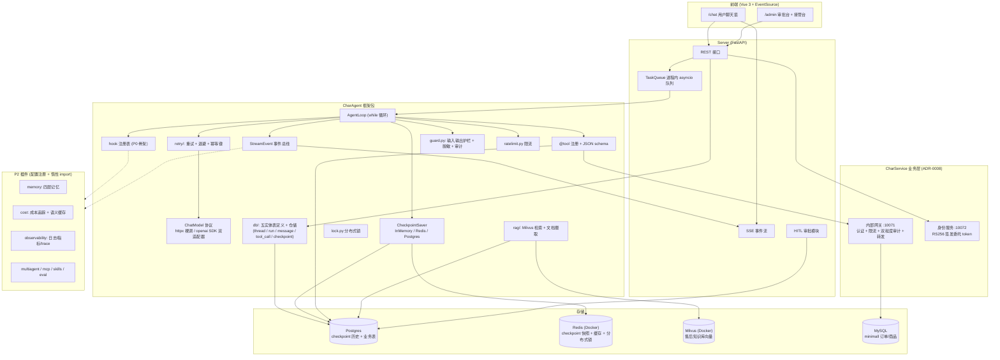

# 01 架构总览

> 设计文档索引：[02-data-model.md](02-data-model.md) / [03-api.md](03-api.md) / [04-test-plan.md](04-test-plan.md) / [05-roadmap.md](05-roadmap.md)
> 决策索引：`docs/adr/`（0001-0010）

## 1. 项目定位

从零手写的轻量 AI Agent 运行时框架 + 电商售后智能客服 demo。目标：吃透 agent loop 底层原理（循环、状态、流式、安全、成本、可观测、测试、评估），覆盖 70 个编号难点，三阶段（P0 / P1 / P2）实施。

| 层 | 职责 | 阶段 |
|----|------|------|
| 框架层 `CharAgent/` | 业务无关的 agent runtime（model / tool / agent / stream / checkpoint / guard / ratelimit / lock / rag） | P0-P2 |
| 服务层 `CharAgent/server/` | **通用运行时** HTTP 层：FastAPI + SSE + TaskQueue，以 router 工厂交付、由应用组装 | P1 |
| 业务层 `CharService/`（仓库根） | 电商售后客服：业务端点 + 工具集 + 内部网关 + 身份服务。**2026-09-18 自框架包外移**（ADR-0008） | P1 |
| 前端 `CharService/frontend/` | Vue 3 + EventSource：`/chat` 用户端 + `/admin` 审批/接管台 | P1 |
| P2 插件 `plugins/` | multiagent / mcp / skills / memory / cost / observability / eval / 上下文工程 | P2 |

## 2. 系统架构



## 3. 核心 agent loop

```text
while not done:
    response = model.generate(messages, tools)        # 模型决策：给答案 or 调工具
    emit(thinking)                                     # 事件总线：thinking
    if response.has_tool_calls:
        emit(tool_call)                                # 事件总线：tool_call
        results = gather(execute_tool(tc) for tc in response.tool_calls)   # 并行执行
        for r in results:
            if r.failed:
                emit(tool_result, error=actionable_error(r))   # 可操作错误 → 自纠错
            else:
                emit(tool_result, ok)
        messages.append(tool_results)                  # 以 tool_result 消息回填，保持并行语义
    elif response.finish_reason == length:
        handle_truncation()                            # #10 length 截断：续写或精简
    else:
        emit(final)
        done = True
```

防护：`LoopGuard`（max_turns / token 预算 / wall-clock）+ kill switch（`asyncio.Task.cancel` 即时打断）。每 Turn 结束 checkpoint 落盘。

异常结束（guard 刹车 / 上游中断 / 输出被拦截）由同一个终局出口改发 `error`（不发 `final`），
最终事件的选择规则见 [03-api.md §2.2](03-api.md)。

**存档在 loop 里，进度不在 loop 对象里**（difficulties #5 / ADR-0002）：`AgentLoop`
配了 `saver` + `thread_id` 时，每 Turn 结束（`_record_turn`）把进度落成一帧快照
（完整历史 + 计数器 + 正文片段，存哪儿由 `checkpoint/` 的三实现决定）；没配则一个字节
都不落，行为与 issue 04/05 完全一致。续跑走 `await loop.resume(checkpoint)`：以快照里的
历史为起点、计数器接着数（轮数 / token 预算跨断点仍然算数），已经做完的事都在历史里，
所以不会重做；从**老**快照恢复时新帧的 `parent_id` 指向它，历史就此岔出一条新分支
（time-travel，要求存储留得住历史：内存 / Postgres 天然支持，Redis 的 `mode="history"`（默认，Stream 流水账）也支持，只有 `mode="latest"` 会明确报能力错）。翻历史拿到的帧还带着「观察值」（来源 / 本轮 token 与耗时 / 工具），`checkpoint/utils/history.py` 的 `format_history` 能把一串帧渲染成可读表格（哪一步最贵、哪一帧是从老快照分叉出来的，一眼可见）。快照停在
「工具还没有结果」的半路（HITL 挂起点）时，`resume` 先补做欠下的调用再继续 —— 不重复问模型
一次（#25「恢复而非重跑」的机制 P0 就位；挂起触发通道归 P1-15，审批流程归 P1-7）。落盘失败**向上抛**
（与 `event_sink` 同一条规矩），不吞。

**重试不在 loop 里**（difficulties #13）：瞬态失败（429 / 5xx / 连接失败 / 超时）的重试在
**模型调用层**完成 —— `RetryingChatModel`（`retry/` 包）以组合方式包装 ChatModel
（ADR-0001 的 SPI 用法），按 `RetryPolicy` 指数退避 + jitter 重试，耗尽才把失败交出去。
故 loop 零改动：异常耗尽时它照旧上抛且不发终局事件（由 server 按 §4 降级），响应耗尽
（上游中断）时照旧判 `SERVER_INTERRUPTED`。同一层还提供幂等键与进程内登记簿
（`IdempotencyKey` / `IdempotencyStore`，#17 的 P0 形态）—— 重试要安全，真实动作必须
幂等，两者是一件事的两面。重试烧掉的 token 由 `on_retry` 回调（`RetryAttempt`）暴露，
预算裁决归 P1-11（P0 只把账目摊开，不给假账）。

## 4. 扩展点设计（ADR-0007）

三类轻量扩展机制，核心零 import P2：

### 4.1 事件总线

`StreamEvent` 事件（P0）：`thinking` / `tool_call` / `tool_result` / `reasoning` / `final` / `error`；前五类之外 `error` 用于异常结束（`approval_required` 由 P1-7 追加）。事件带 `seq` 序号，由 `EventBus` 做状态机校验（配对 / 终局唯一），经 `event_sink` 推给 server，P2 模块（observability / cost）订阅同一事件流。

事件 schema 与状态机不变量见 [03-api.md §2](03-api.md)；实现落点 `CharAgent/stream/`。

### 4.2 hook 点

| hook | 触发时机 | 载荷 | P2 消费者 |
|------|---------|------|----------|
| `before_turn` | 每 Turn 模型调用前 | turn, messages（活引用）, tools | memory（注入记忆）、上下文工程 |
| `after_turn` | 每 Turn 记录快照后 | turn, response, messages, tokens, elapsed_ms | memory（写入决策）、cost |
| `on_model_call` | 模型请求发出前 / 响应返回后 | phase, turn, messages, tools, response / usage / elapsed_ms（仅 after） | cost（token 计量）、observability |
| `on_tool_executed` | 每条工具执行完成 | turn, call, execution | observability（工具成功率）、audit |
| `on_event` | 每个 StreamEvent 分发后 | event | observability（trace 采集） |

注册表骨架 P0 落地（`CharAgent/hooks/`，实现见 `registry.py`）：空注册零开销（无回调调用、
无 await 挂起点）；插件抛 `Exception` 被隔离并记入 `registry.failures`（不拖垮核心），
`CancelledError` 直接传播（插件不得挡住 kill switch，#3）。

### 4.3 SPI（可替换接口）

| 接口 | P0/P1 实现 | P2 新增实现 |
|------|-----------|------------|
| `ChatModel` | DeepSeek httpx 裸调 / openai SDK（ADR-0003） | — |
| `CheckpointSaver` | InMemory / Redis / Postgres（ADR-0002；P0-6 落地，能力差异经 `capabilities` 声明） | — |
| `EmbeddingProvider` | CloseAI `text-embedding-3-large` | 本地 BGE |
| `ModelRouter` | 默认直连（单模型 `deepseek-flash`） | 分级路由（#36） |
| `SemanticCache` | 无（P1 不启用） | 语义缓存（#36） |

### 4.4 P2 挂载机制

- P2 模块目录：`CharAgent/plugins/<module>/`（multiagent / mcp / skills / memory / cost / observability / eval / context_engineering）
- 启用方式：配置 `PLUGINS={"memory": {}, "cost": {...}}` + 惰性 import（`importlib` 按配置加载）
- 依赖方向：**P2 → 核心**单向依赖，核心只提供 hook 点与 SPI

## 5. 关键技术决策摘要

| 决策 | 内容 | ADR |
|------|------|-----|
| ChatModel 协议 | 薄协议，P0 仅 DeepSeek | 0001 |
| Checkpoint | Redis + Postgres 双实现，配置切换 | 0002 |
| LLM 接入 | httpx 裸调 + openai SDK 双适配器 | 0003 |
| Demo 形态 | 通用框架 + 电商售后客服（业务代码外移 `CharService/`） | 0004 + 0008 |
| 流式 | SSE 单向推送 | 0005 |
| 队列 | 进程内 asyncio 起步，TaskQueue 抽象预留 MQ | 0006 |
| P2 形态 | 轻量扩展点（事件总线 + hook + SPI），配置注册 | 0007 |
| 向量库 | 直接上 Milvus（本机 Docker），embedding 用 CloseAI `text-embedding-3-large` | 访谈决策（2026-08-18） |
| 模型 | 单模型 deepseek-flash（推理模型，reasoning_content 真实存在） | 0003 补充 |
| 数据访问层 | 五实体表定义 + ORM 实体 + 仓储统一走 SQLAlchemy，表定义唯一定义处 `db/schema.py`；**同步引擎 + `asyncio.to_thread`**（async 驱动在 Windows 默认事件循环上不可用） | issue 08（P0-7） |
| 业务对接 | 三层：minimall `internal/support` API + 内部网关（唯一入口）+ 身份服务（签委托 token）；agent 不持业务凭证、不直连库 | 0008 |
| 委托身份 | 会话绑定 `user_id`，工具签名无 `user_id`（运行时注入）；身份服务持私钥、网关持公钥，agent 无签发权 | 0009 |
| 写操作分级 | L0 只读自由 / L1 可逆写直接执行 / L2 终态或资金写走确认（内部审批「金额分层 + 角色分离」与用户确认「`confirm_token`」两条路径） | 0009 |
| 业务存储 | CharService 自有表（Ticket / Escalation / Approval / AuditLog）落 Postgres（alembic）；退款单 + 余额流水落 MySQL（minimall 侧新增，经 internal API 访问） | 0008/0009 |

## 6. P1 部署拓扑

```
单机部署（业务侧见 .scratch/CharService/PRD.md）：
├── CharService 主服务（uvicorn，:10070）—— 组装 CharAgent 的 runtime router
│   ├── 通用运行时端点（会话 / run / SSE / 取消）+ 业务端点（审批台 / 接管台 / 工单）
│   ├── SSE 端点（EventSource 消费）
│   ├── TaskQueue（进程内 asyncio）
│   └── 工具注册：商品/订单/物流/FAQ 只读 + 加购（L1）+ 退款（L2 审批）+ 取消（L2 确认）+ 转人工
├── 内部网关（:10071）: 验委托 token + 限流 + 双粒度审计 + 转发
├── 身份服务（:10072）: RS256 签发委托 token（私钥仅在此）
├── 退款后台 worker: 推进退款单状态（同事务改余额 + 写流水 + 置状态）
├── Postgres（本机）: checkpoint 历史（charagent_ 前缀的表，框架自有迁移链）
│                                    + CharService 自有表（charservice_ 前缀：tickets / escalations /
│                                      approvals / audit_logs，**独立迁移链 + 独立版本表**，同库不同链）
├── Redis（Docker）: checkpoint 快照 + 分布式锁 + 幂等键
├── Milvus（Docker）: 售后知识库（售后政策 / 退换货规则 / 常见问题）
├── MySQL: minimall 订单/商品/退款单/余额流水（**经网关访问 internal/support API**）
└── Vue 前端（:10079）: /chat + /admin
```

> agent 工具层不知道 MySQL 地址、不持有业务凭证——它只能调网关。这是「限流与审计不可绕过」的实现基础。
