# RAG 16 种方案总结（含流程图）

> **来源文章**：《RAG 是什么？16 种 RAG 方案一次讲清！AI 应用开发必学 | 万字干货》
> **作者**：程序员鱼皮（编程导航 codefather.cn，2026-04-22）
> **原文链接**：https://www.codefather.cn/post/2047162931736592386
> **总结日期**：2026-08-23
>
> 本文档包含 16 种 RAG 方案的规范总结与 Mermaid 流程图。文档开头先给出「全景汇总图」（15 种方案对比 Naive RAG 的改进）与「企业级 SOTA 流程图」，随后是各方案详解。建议使用支持 Mermaid 渲染的编辑器（如 VSCode + Markdown Preview Mermaid Support）查看。

---

## 目录

1. [全景汇总：16 种方案 vs Naive RAG](#1-全景汇总16-种方案-vs-naive-rag)
2. [企业级 SOTA RAG 流程图](#2-企业级-sota-rag-流程图)
3. [背景：为什么需要 RAG](#3-背景为什么需要-rag)
4. [16 种方案总览](#4-16-种方案总览)
5. [方案详解](#5-方案详解)
   - [5.1 标准 RAG 及变体](#51-标准-rag-及变体)
   - [5.2 提升检索质量](#52-提升检索质量)
   - [5.3 RAG 反思机制](#53-rag-反思机制)
   - [5.4 结构化知识增强](#54-结构化知识增强)
   - [5.5 智能体驱动 RAG](#55-智能体驱动-rag)
   - [5.6 RAG 能力扩展](#56-rag-能力扩展)
6. [选型指南](#6-选型指南)

---

## 1. 全景汇总：16 种方案 vs Naive RAG

> 下图以 **Naive RAG 主干流程**（橙色节点 + 橙色实线）为基线，15 种改进方案（浅蓝节点 + 蓝色虚线挂载）分别改进主干上的某一环节（挂载点即改进环节）。其中**绿色节点**表示该方案已被企业级 SOTA RAG 流程图（§2）采用，属于生产系统实战组合的核心。每个节点左对齐标注：方案中英文名、改进、优点、缺点、总结；详细流程图与说明见 §5 对应小节。
>
> 阅读口诀：**改哪里看挂载点，改什么看"改进"，值不值看"优点/缺点 + 总结"。**

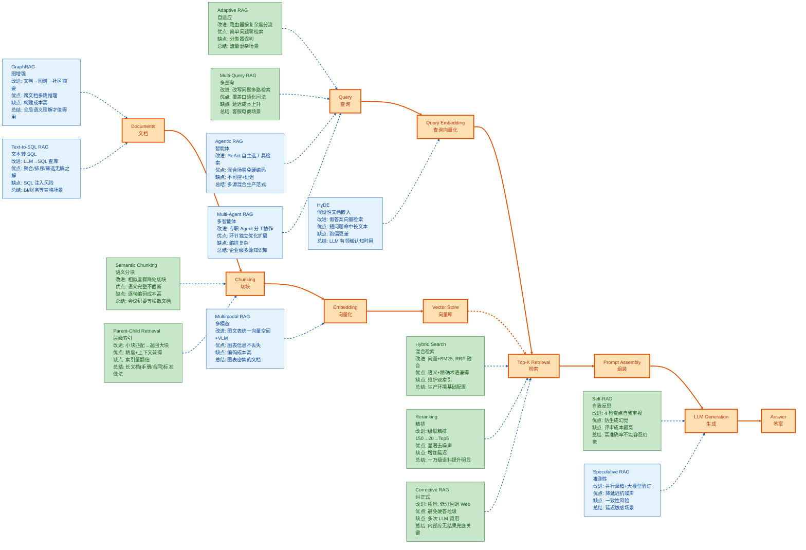

> **图例**：🟢 绿色节点 = 企业级 SOTA RAG 流程图（§2）采用的方案（语义分块 / 层级索引 / 混合检索 / 自适应 / 多查询 / 精排 / 纠正式 / 自我反思）

### 汇总速查表

| 改进环节 | 挂载的方案（详解见 §5） | 改进维度 |
|------|------|------|
| 查询前 | Adaptive RAG | 要不要检索、怎么检索 |
| 查询 | Multi-Query RAG / Agentic RAG / Multi-Agent RAG | 问法覆盖、动态调度、分工协作 |
| 查询向量 | HyDE | 问法与文档的语义空间对齐 |
| 切块 / 索引 | Semantic Chunking / Parent-Child / Multimodal RAG | 切块质量、上下文完整、模态覆盖 |
| 数据源 | GraphRAG / Text-to-SQL RAG | 非结构化→图谱、结构化→SQL |
| 检索 | Hybrid Search / Reranking | 召回广度和精度 |
| 检索后 | Corrective RAG | 质检与兜底 |
| 生成 | Self-RAG / Speculative RAG | 幻觉控制、延迟优化 |

---

## 2. 企业级 SOTA RAG 流程图

> 当前企业级 RAG 生产系统广泛采用的技术栈（SOTA 组合）：**离线数据管道 + 在线服务链路**。离线侧负责高质量分块与双索引构建；在线侧采用「自适应路由 → 查询改写 → 混合检索 → 精排 → 相关性质检 → 引用生成 → 忠实度校验」的级联流水线，并以监控评估形成反馈闭环。

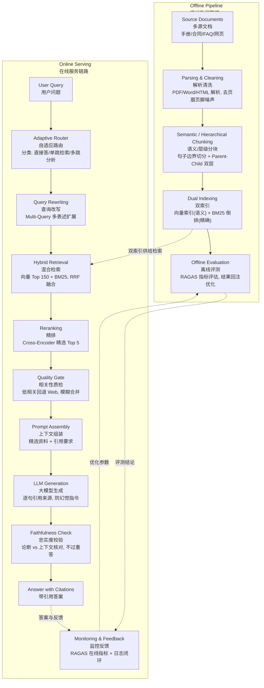

### SOTA 架构元素 ↔ 16 种方案对照

| SOTA 环节 | 对应方案（详见 §5） | 说明 |
|------|------|------|
| 语义/层级分块 | Semantic Chunking（行 324）、Parent-Child Retrieval（行 351） | 离线切块质量决定检索上限 |
| 双索引（向量 + BM25） | Hybrid Search（行 381） | 生产环境基础配置 |
| 自适应路由 | Adaptive RAG（行 500） | 按问题复杂度分流，控制成本 |
| 查询改写 | Multi-Query RAG（行 252） | 扩展问法覆盖 |
| 精排 | Reranking（行 407） | 级联粗检 + Cross-Encoder |
| 相关性质检 + 回退 | Corrective RAG（行 437） | 内部库无结果时 Web 兜底 |
| 忠实度校验 | Self-RAG（行 465） | 防生成幻觉的最后防线 |
| 引用溯源 | 贯穿全部方案 | 生产审计要求 |

> 注：上表行号随文档行数精确对应，若编辑过本文件导致行数变化，请重新校准。

---

## 3. 背景：为什么需要 RAG

AI 大模型存在三大硬伤：

1. 知识有截止日期
2. 会一本正经地胡说八道（幻觉）
3. 缺乏私有知识，不了解内部文档内容

**RAG（Retrieval-Augmented Generation，检索增强生成）** 的核心思想是**先搜再答**——让大模型在回答之前先检索相关资料，再基于检索到的知识组织答案。

> 长上下文窗口（百万 token）能否替代 RAG？**不能，反而用得更多了。** 原因：
> - 把所有文档塞进上下文，token 费用高
> - 大模型存在 "Lost in the Middle" 问题——对超长上下文中间部分的注意力明显下降
>
> 最佳实践是两者互补：**先用 RAG 提供相对精确的资料，再利用长上下文做针对性分析推理。**

---

## 4. 16 种方案总览

| 分类 | 方案 | 英文名称 | 一句话定位 |
|------|------|----------|-----------|
| 标准 RAG 及变体 | 1. 朴素 RAG | Naive RAG | 切块 → 向量化 → 检索 → 生成，一切方案的基础 |
| | 2. 多查询 RAG | Multi-Query RAG | LLM 改写多种问法分别检索，合并去重 |
| | 3. 假设性文档嵌入 | HyDE (Hypothetical Document Embeddings) | 用 LLM 编的假答案向量去检索 |
| 提升检索质量 | 4. 语义分块 | Semantic Chunking | 按句子相似度骤降处切块，保证语义完整 |
| | 5. 层级索引 | Parent-Child Retrieval | 小块匹配、返回大块，兼顾精度与上下文 |
| | 6. 混合检索 | Hybrid Search | 向量 + BM25 双路召回，RRF 融合排序 |
| | 7. 精排 | Reranking | 粗检 → 轻量初筛 → Cross-Encoder 精排 |
| RAG 反思机制 | 8. 纠正式 RAG | Corrective RAG (CRAG) | 检索后质检，低相关回退 Web 搜索 |
| | 9. 自我反思 RAG | Self-RAG | 四个检查点全程自我审视，防生成幻觉 |
| | 10. 自适应 RAG | Adaptive RAG | 路由器按问题复杂度分三条路线 |
| 结构化知识增强 | 11. 图增强 RAG | GraphRAG | 实体关系图谱 + 社区摘要，支持多跳推理 |
| | 12. 文本转 SQL RAG | Text-to-SQL RAG | LLM 把自然语言翻译成 SQL 查库 |
| 智能体驱动 RAG | 13. 智能体 RAG | Agentic RAG | Agent Loop 自主决策检索策略与工具 |
| | 14. 多智能体 RAG | Multi-Agent RAG | 多专职 Agent 分工协作（路由/检索/质检/润色） |
| RAG 能力扩展 | 15. 多模态 RAG | Multimodal RAG | 文本/图片/表格统一向量空间，VLM 生成 |
| | 16. 推测性 RAG | Speculative RAG | 小模型并行生成草稿，大模型验证选优降延迟 |

---

## 5. 方案详解

### 5.1 标准 RAG 及变体

> 本组方案解决「**能不能搜到**」的问题。

#### 1. Naive RAG（朴素 RAG）

**核心思想**：最基本的 RAG 实现——文档离线切块向量化入库，在线检索相似块拼 Prompt 生成。Naive 意为"朴素"，不代表"牛"。

**流程图**：

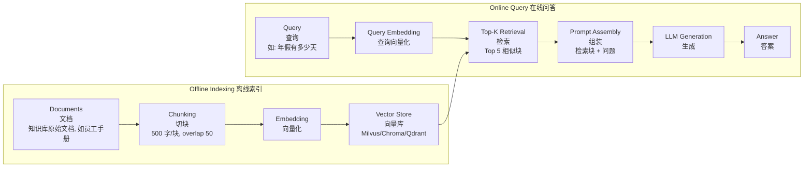

**工作流程**：
- 离线索引：切块（chunk_size=500, chunk_overlap=50）→ Embedding 向量化 → 向量 + 原文入库
- 在线问答：问题向量化 → 检索 Top 5 → 拼 Prompt → LLM 生成

**局限**（后续方案均围绕解决这些问题演化）：
- 切块方式粗暴，可能从一句话中间截断完整语义
- 检索质量完全依赖 embedding 模型，搜不到就没辙
- 搜到垃圾文档也不过滤，直接导致错误答案

---

#### 2. Multi-Query RAG（多查询 RAG）

**核心思想**：一种问法搜不全，就让 LLM 把原始问题改写成多种表述分别检索，最后合并去重。解决用户口语化提问与文档术语不一致的问题。

**流程图**：

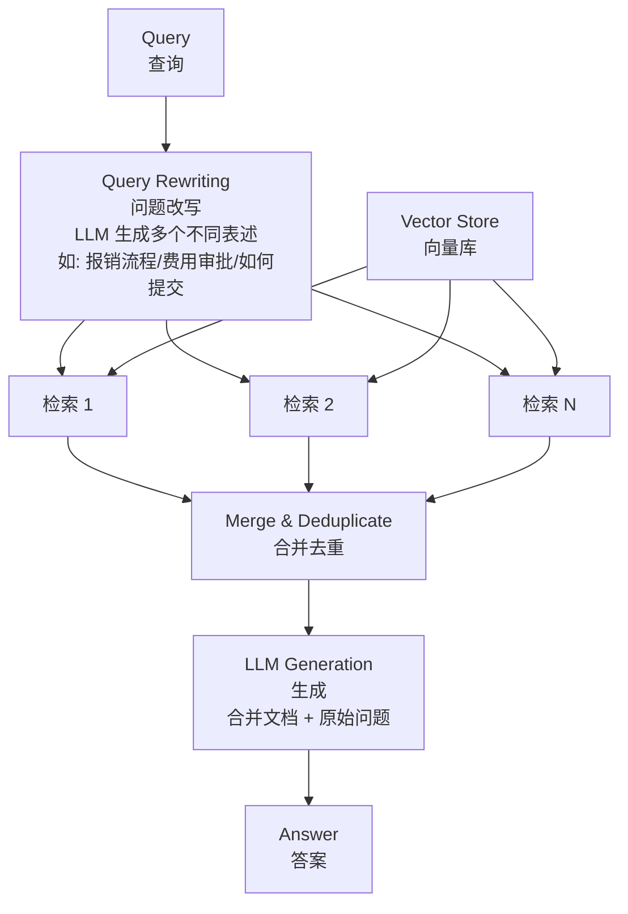

**代价与风险**：
- 每次提问多一次 LLM 改写调用 + N 次向量检索，延迟和成本增加
- LLM 改写方向跑偏会把无关文档带进来，影响答案质量

**适用场景**：面向普通用户的客服、电商等口语化提问场景；术语规范的专业领域收益有限。

---

#### 3. HyDE（Hypothetical Document Embeddings，假设性文档嵌入）

**核心思想**：用户提问往往很短（如 "KV Cache 是什么？"），与文档中的长篇技术描述在 embedding 空间离得远。HyDE 让 LLM 先凭空写一段"假答案"（不必准确），用假答案的向量去检索——假答案与真实文档文体接近，向量距离也更近。

**流程图**：

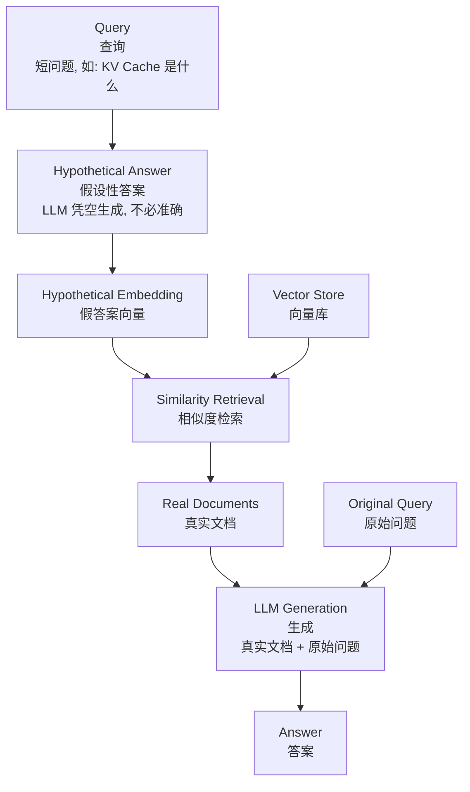

**风险**：假答案方向完全跑偏（如把 KV Cache 理解成 Redis 缓存），检索结果会更差。

**适用场景**：LLM 对问题领域有基本认知的场景；冷门领域、企业私有术语慎用。

---

### 5.2 提升检索质量

> 前面的方法解决「能不能搜到」，本组解决「**搜到的资料质量好不好**」。

#### 4. 语义分块（Semantic Chunking）

**核心思想**：Naive RAG 按固定字数切块可能切在句子中间（如把"超过 5 天需要"和"部门经理审批"分到两个块）。语义分块按句子拆分，计算相邻句子的 embedding 相似度，相似度骤降（话题切换）处切块，保证语义完整。

**流程图**：

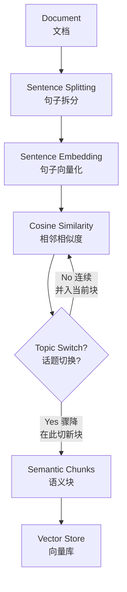

**代价**：每句话都要算一次 embedding，成本与耗时高于按字数切分；相似度阈值难调。

**适用场景**：结构松散、话题变化快的文档（会议纪要、访谈记录）；有清晰章节结构的技术手册、产品说明直接按标题切效果也不差且更便宜。

---

#### 5. 层级索引（Parent-Child Retrieval）

**核心思想**：切块存在天然矛盾——小块检索精度高但上下文不足，大块上下文丰富但噪声大。方案是**两层都要**：文档先切大块、大块内再切小块；检索用小块精确匹配，命中后返回所属大块作为上下文。相当于在书里搜到一句话，把整个章节都拿来看。

**流程图**：

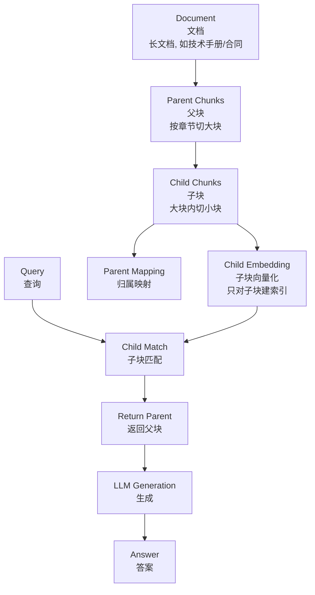

**适用场景**：长文档——技术手册、法律合同、产品文档等需要连带上下文理解的内容。

---

#### 6. Hybrid Search（混合检索）

**核心思想**：纯向量检索无法精确术语匹配（如 "ERROR_CODE_4012" 这种编码无语义），BM25 关键词检索擅长精确匹配但不理解语义（搜"退款"搜不到"退货及返还货款流程"）。Hybrid Search 双路并行，用 **RRF（Reciprocal Rank Fusion，倒数排序融合）** 合并排序：`score = Σ 1 / (60 + rank)`。

**流程图**：

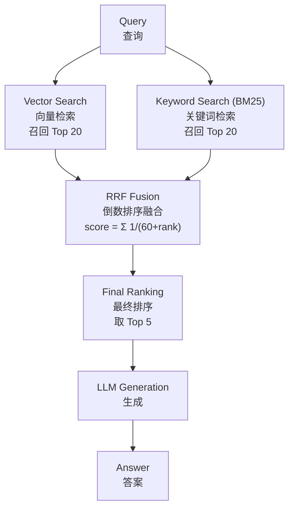

**结论**：几乎所有生产环境都建议用 Hybrid Search 替代纯向量搜索，尤其技术文档、医疗、法律等术语密集领域。

---

#### 7. Reranking（精排）

**核心思想**：检索结果总混着"看起来相关但实际没用"的噪声。在检索与生成之间加精排步骤：embedding 模型是分别编码再比距离（快但粗糙），Reranker 把 (query, doc) 拼在一起送进模型打分（慢但精准）。

**生产实践 —— 级联检索（语料库 chunk 十万级以上时效果显著）**：

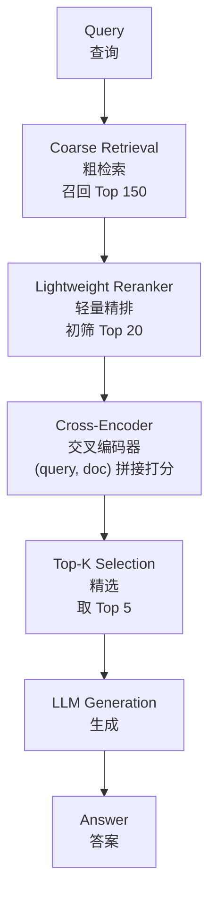

**为什么要分层**：粗检索只捞 20 个，大型语料库容易漏掉关键文档；一次捞 150 个全送 Cross-Encoder 算力扛不住。分层在召回率与计算成本之间取平衡。

**类比**：与推荐系统的粗排/精排一样——粗检索负责不遗漏，精排负责不掺假。

> **结论**：语义分块 + Hybrid Search + Reranking 三板斧，就是大多数生产级 RAG 系统的基础配置。

---

### 5.3 RAG 反思机制

> 前置问题：如果搜到的全是垃圾，模型还是会一本正经地基于垃圾内容生成答案——"开卷考试带错了书，还照着抄"。

#### 8. Corrective RAG（CRAG，纠正式 RAG）

**核心思想**：在检索与生成之间插入"质检员"，逐个审查检索文档与问题的相关性，按审查结果走不同分支，防止硬着头皮用垃圾内容回答。

**流程图**：

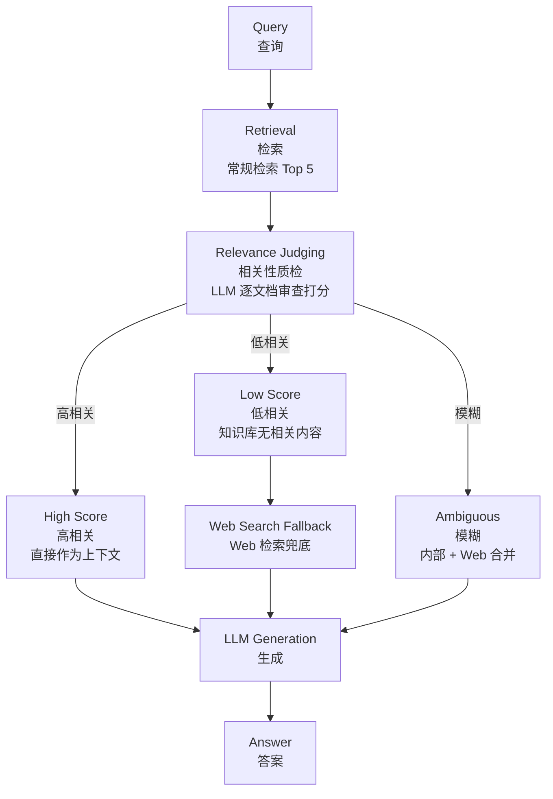

**关键**：最值钱的是"低相关"分支——内部知识库搜不到有用信息时，自动回退到 Web 搜索兜底（也可换成其他检索策略）。

---

#### 9. Self-RAG（自我反思 RAG）

**核心思想**：CRAG 只质检了检索阶段，但模型完全可能拿到正确资料却在回答时"夹带私货"（生成阶段幻觉）。Self-RAG 在全程设置四个检查点，每步让模型自我审视。

**流程图**：

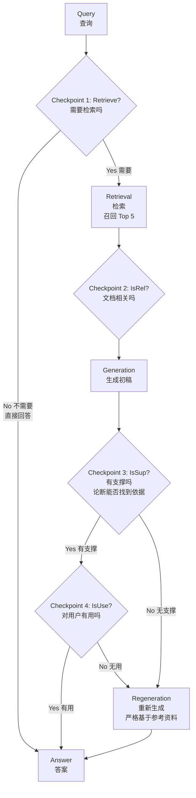

**四个检查点**：
1. Retrieve？——这个问题需要检索吗？
2. IsRel？——检索到的文档相关吗？
3. IsSup？——我的回答有文档支撑吗？
4. IsUse？——这个答案对用户有用吗？

**结论**：第三个检查点（支撑性检查）价值相对最高，能在一定程度上避免 AI 幻觉。

---

#### 10. Adaptive RAG（自适应 RAG）

**核心思想**：CRAG / Self-RAG 每问必跑完整检索 + 质检 + 生成流程，成本高——问"今天星期几"也跑全套流程是"开着坦克去买菜"。Adaptive RAG 在最前面加一个路由器（分类器）判断问题复杂度，分流到不同路线。

**流程图**：

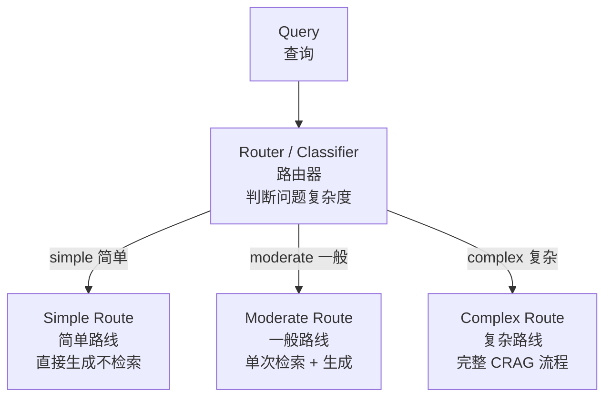

**适用场景**：流量混杂的场景——既有"公司地址在哪"这种一句话能答的问题，又有"对比 A 和 B 两个方案的优缺点"这种需要多文档综合分析的复杂问题。

---

### 5.4 结构化知识增强

> 前面方法处理的都是非结构化文本。当数据是**关系网络或表格**时，需要下面的方法。

#### 11. GraphRAG（图增强 RAG）

**核心思想**：答案必须落在某一个文档块里是传统 RAG 的共同问题。跨文档多跳推理（如"张三是 AI 部门负责人" + "AI 部门属于技术中心" → "张三属于哪个中心？"）需要串联推理。GraphRAG（Microsoft Research 2024 年提出）先把文档变成知识图谱，再基于图谱检索推理。

**流程图**：

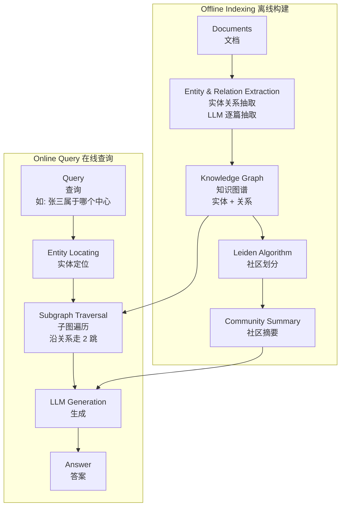

**评测结论（微软）**：全局语义理解类问题上，GraphRAG 答案的全面性和多样性显著优于传统向量 RAG；但简单事实查询两者差不多，没必要用。

**警告**：LLM 逐篇抽实体关系，图谱构建成本远高于向量索引，查询延迟也更大——使用前必须评估是否必要。

---

#### 12. Text-to-SQL RAG（文本转 SQL RAG）

**核心思想**：结构化表格数据（销售数据、行为日志、财务报表）做 embedding 低效，聚合/排序/筛选类问题向量搜索完全无招。方案是让 LLM 把自然语言直接翻译成 SQL，执行查询，再把查询结果作为上下文回答。

**流程图**：

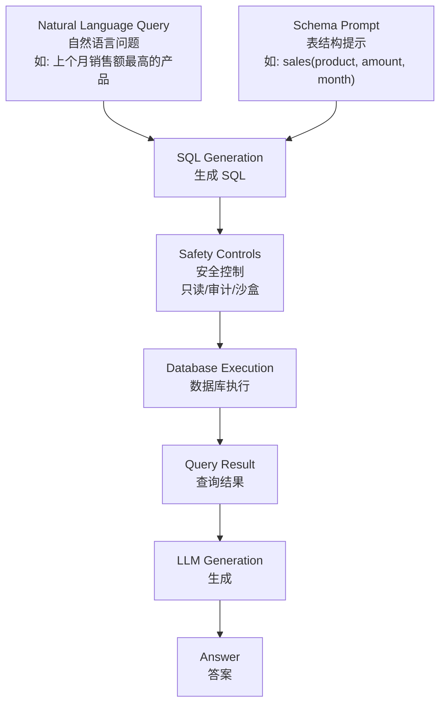

**适用场景**：所有数据分析类需求——BI 看板问答、数据库运维助手、财务报表查询，本质是用 LLM 替代手写 SQL。

**安全红线**：生产环境**绝不允许 LLM 生成的 SQL 直接执行**，必须配备只读权限控制、SQL 语法审计、沙盒隔离，防止 SQL 注入。

---

### 5.5 智能体驱动 RAG

> 前面多数方法都是预定义好的 pipeline，流程是死的。真实问题千变万化——有的需要搜向量库，有的该查数据库，有的应搜 Web，有的根本不需要检索。Agent 让系统自己判断怎么做。

#### 13. Agentic RAG（智能体 RAG）

**核心思想**：让一个 AI Agent 自动调度，根据问题自主决定每一步该怎么做。给 Agent 配一组检索工具，它先搜搜看 → 看结果够不够 → 不够就换方式 / 换关键词再搜 → 够了就生成。

**流程图**：

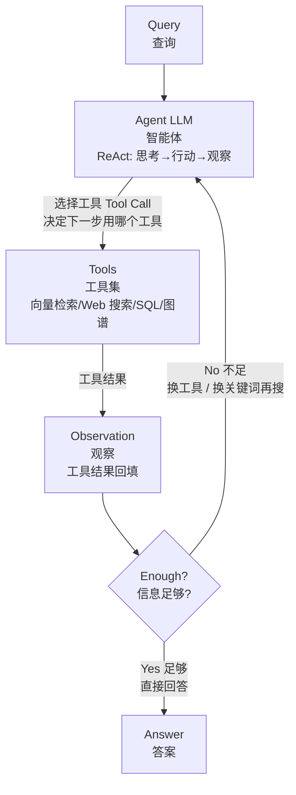

**现状**：Agentic RAG 已是比较主流的生产范式，知名 AI 编程工具 Cursor 采用的就是这种方式——AI 自主决定如何搜集信息。

---

#### 14. Multi-Agent RAG（多智能体 RAG）

**核心思想**：单个 Agent 要同时兼顾理解意图、选择策略、验证质量、生成答案，Prompt 又长又复杂，决策质量下降——"一个人又当程序员、又教人打篮球、又当说唱歌手"。Multi-Agent RAG 拆分为多个专职 Agent，各自负责一部分任务。

**流程图**：

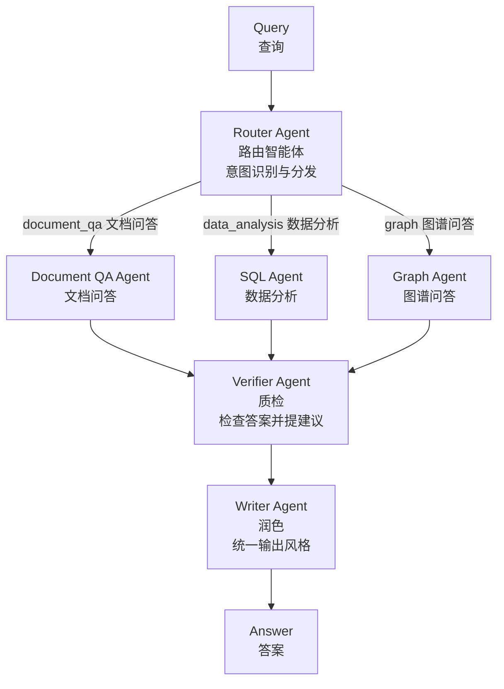

**适用场景**：数据源多、权限复杂、语言多样的企业级知识库。每个环节可独立优化和扩展，不会牵一发而动全身。

---

### 5.6 RAG 能力扩展

#### 15. 多模态 RAG（Multimodal RAG）

**核心思想**：传统 RAG 只处理文本，但企业文档中充满图表、流程图、架构图、产品照片，纯文本处理会丢失全部视觉信息。多模态 RAG 把图片、表格、文本统一编码到同一个向量空间，检索时跨模态匹配，生成阶段用视觉语言模型（VLM）处理混合模态上下文。

**流程图**：

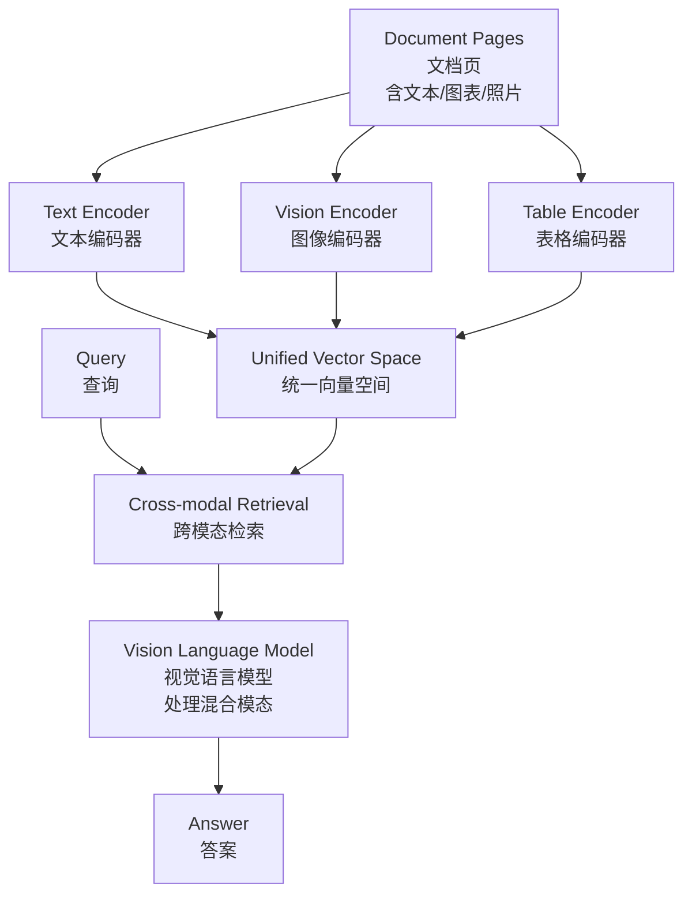

**关键点**：普通纯文本 LLM 看不懂图片，生成阶段必须使用视觉语言模型。

---

#### 16. Speculative RAG（推测性 RAG）

**核心思想**：把所有检索文档塞进同一个 Prompt 会拖慢推理、且一个噪声文档会带偏整个生成。Speculative RAG 借鉴推测性解码（Speculative Decoding）思想，核心目标是**降低延迟**：文档拆成多个子集，多个专家小模型从每个子集**并行**生成候选草稿，最后由一个更强的大模型做一次验证选出最佳答案。

**流程图**：

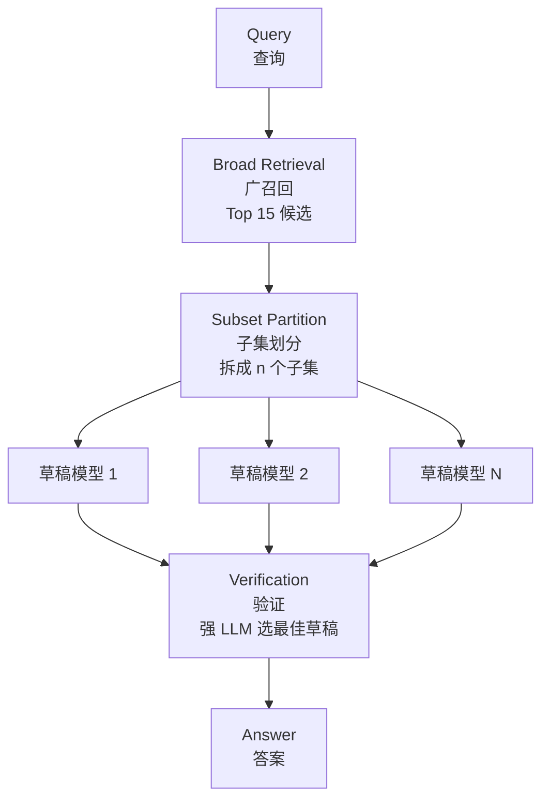

**类比**：团队做项目——多位开发并行干活、各自验证，产品经理最后只需简单验证，大幅缩短总时长，问题也更容易被发现。

---

## 6. 选型指南

### 6.1 方案选型对照表

| 你的情况 | 推荐方案 |
|------|------|
| 标准文本知识库，追求基本可用 | Naive RAG |
| 用户提问风格多变、口语化 | Multi-Query RAG 或 HyDE |
| 生产环境，追求检索质量 | Hybrid Search + Reranking |
| 对准确率要求高，不能容忍幻觉 | Corrective RAG 或 Self-RAG |
| 查询复杂度差异大 | Adaptive RAG 路由 |
| 需要跨文档多跳推理 | GraphRAG |
| 数据以结构化表格为主 | Text-to-SQL RAG |
| 文档包含大量图表/图片 | 多模态 RAG |
| 多数据源、多类型混合 | Agentic RAG / Multi-Agent RAG |
| 延迟敏感 | Speculative RAG |

### 6.2 起步建议

**从简单开始，逐步完善**：先跑通 Naive RAG，发现哪个环节出了问题，再针对性地选用对应方案。

- 搜不到 → Multi-Query / HyDE / Hybrid Search
- 搜到的质量差 → 语义分块 / Parent-Child / Reranking
- 搜到垃圾还硬答 → CRAG / Self-RAG / Adaptive RAG

千万不要一上来就搞 "Multi-Agent + GraphRAG + 多模态全家桶"——实现成本高，效果不一定更好。

### 6.3 效果评估（RAGAS）

| 指标 | 含义 |
|------|------|
| 忠实度 Faithfulness | 回答有没有瞎编 |
| 答案相关性 Answer Relevance | 答的是不是你问的 |
| 上下文精确率 Context Precision | 搜到的有多少是有用的 |
| 上下文召回率 Context Recall | 该搜到的搜到了吗 |

先评估效果再优化，而不是仅凭感觉调参数。

### 6.4 RAG 生态主流技术

- 编排框架：LangChain / LangGraph、LlamaIndex
- 一体化平台：Dify、RAGFlow
- 向量数据库：Chroma、Milvus、Qdrant

---

> 本文档基于程序员鱼皮原创文章整理，仅供学习参考。原文收录于开源教程《AI 编程零基础入门教程》（https://github.com/liyupi/ai-guide）。
