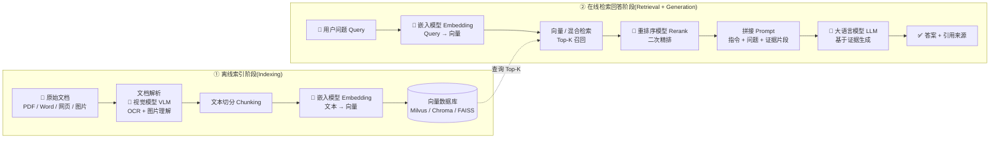

# RAG 知识笔记

> Retrieval-Augmented Generation(检索增强生成)

---

## 1. 什么是 RAG

RAG 在 LLM 生成答案**之前**, 先从外部知识库(向量数据库 / 搜索引擎 / 文档库)检索出与问题相关的片段, 再把这些片段作为上下文注入 prompt, 让模型基于[检索到的证据]生成答案.

核心思想:**把[知识存储]与[模型生成]解耦**, 用检索结果弥补模型自身知识的不足(私有数据, 时效数据, 精确事实).

```
用户问题 → 检索(Retrieval) → 相关片段 → 拼接进 prompt → 生成(Generation) → 带来源的答案
```

---

## 2. 标准流程

| 阶段 | 做什么 | 关键点 |
|------|--------|--------|
| **Indexing(离线索引)** | 文档切分 → embedding → 写入向量库 | chunk_size / chunk_overlap 调优, metadata 保留 |
| **Retrieval(检索)** | query embedding → 相似度检索 → 返回 Top-K | 向量检索 + 关键词/混合检索(BM25 + dense) |
| **Augmentation(增强)** | 片段排序(rerank) → 拼进 prompt | rerank 提升相关性, 去重, 去噪 |
| **Generation(生成)** | LLM 基于上下文生成答案 | 附引用来源, 降低幻觉 |

可选增强: **Rerank**(二次精排), **Hybrid Search**(稠密向量 + 稀疏关键词融合), **Query Rewriting**(改写/扩写 query), **HyDE**(假设文档嵌入).

### 2.1 全流程示意图



### 2.2 Tips: 全流程用到的模型

一条 RAG 链路通常涉及 **4 类模型**, 各司其职:

| 模型 | 作用环节 | 作用 | 典型选择 |
|------|----------|------|----------|
| **嵌入模型** Embedding | 离线索引 + 在线 query 编码 | 把文本/问题转成向量, 用于语义相似度检索 | OpenAI `text-embedding`, BGE, Cohere embed, Voyage |
| **重排序模型** Rerank | 检索后精排 | 对召回 Top-K 二次打分, 把最相关的排前面 | Cohere Rerank, `bge-reranker`, cross-encoder |
| **大语言模型** LLM | 生成阶段 | 基于检索到的证据生成最终回答 | GPT / Claude / DeepSeek / Qwen |
| **视觉模型** VLM | 文档解析 | OCR + 图片理解, 把文档中的图片/扫描件转成可检索文本 | GPT-4o, Claude Vision, Qwen-VL |

> 注意: **视觉模型不是每次必用** -- 只有当文档包含图片(扫描 PDF, 图表, 截图)时才需要, 把图片内容转成文本描述后再走 embedding. 纯文本文档只需 3 类模型.

### 2.3 Hybrid Search: 稠密向量 + 稀疏检索

[可选增强]里提到的 **Hybrid Search(混合检索)**, 本质是把两种互补的检索方式融合. 要理解它, 先分清两种[向量]:

#### 稠密向量 vs 稀疏向量

| 维度 | 稀疏向量 / 关键词检索 | 稠密向量 / 语义检索 |
|------|----------------------|---------------------|
| 别称 | Lexical Search, Keyword Search | Semantic Search, Dense Retrieval |
| 代表算法 | BM25, TF-IDF | Embedding 模型(BERT, BGE, text-embedding) |
| 向量形态 | 高维稀疏(如词典大小几十万维), **绝大多数值为 0** | 低维稠密(如 768/1024/1536 维), **每维都有非零值** |
| 匹配原理 | 字面/词频统计: query 与文档[共同出现的词]越多越相关 | 语义相似: query 与文档[语义距离]越近越相关 |
| 擅长 | 精确匹配: 专有名词, 型号, 编号, 错误码, 人名, 低频词 | 语义理解: 同义词, 改写, 口语化表达, 跨语言 |
| 短板 | 不懂语义: [手机]匹配不到[iPhone], [怎么退货]匹配不到[退款流程] | 漏掉精确词: 型号[X1-Pro]这类长尾 token 可能被 embedding 稀释 |

- **稠密向量(Dense)**: Embedding 模型把文本压成一个连续, 低维, 满值的向量, 语义相近的文本在向量空间里距离近. 能跨字面理解意思, 但精确关键词/编号可能被[平均]掉.
- **稀疏向量(Sparse)**: 基于词频的表示, 维度对应词典里的每个词, 命中的词才有值(其余为 0), 因此[稀疏]. 精确匹配极强, 但字面不同就检索不到.

#### 为什么融合(Hybrid Search)

两种方式**互补**: 关键词检索擅长[精确命中], 语义检索擅长[理解意图]. 单独用任何一方都会漏召回:

- 只有稠密: 用户搜[iPhone 15 多少钱], 语义能命中[苹果手机价格], 但可能漏掉原文中明确写着[iPhone 15]的精确段落.
- 只有稀疏: 用户问[怎么退货], 字面匹配不到文档里写的[退款流程].

**Hybrid Search 同时跑两条检索, 再把结果融合**, 召回率最高. 主流融合方式:

- **RRF(Reciprocal Rank Fusion, 倒数排名融合)**: 对每个文档在两条检索里的排名取倒数求和 `1/(k + rank)` 再排序, 简单, 无需调权重, 业界最常用.
- **加权打分**: `score = α·dense_score + β·sparse_score`, 需手动调 α/β.

> 一句话: **稠密向量管[意思对不对], 稀疏向量管[字面对不对], Hybrid Search 两者都要, 再按排名融合.** 支持混合检索的向量库: Milvus, Weaviate, Qdrant, Elasticsearch 等.

---

## 3. 争议: [上下文窗口足够大, RAG 会被淘汰]

### 3.1 争议的由来

近年来长上下文模型进展迅速(Gemini 2M, Claude 200K, GPT 系列等), 于是有观点认为: **既然模型一次能读进几百万 token, 直接把整份知识库塞进 prompt 就行, 何必还要做检索, 切分, 向量化这一整套 RAG 管道?**

这个观点的成立前提是: *[能装下] == [能有效利用], 且[装得越多] == [答得越好]*. 但这两个前提都不成立.

### 3.2 为什么[长上下文]不能替代 RAG

| # | 长上下文的局限 | 说明 |
|---|---|---|
| 1 | **Lost in the Middle(中间迷失)** | 研究(Liu et al., 2023) 证实: 信息放在超长上下文的**开头或结尾**时, 模型能准确引用; 放在**中间**时准确率显著下降. 长上下文 ≠ 有效利用, 检索精度随上下文变长而衰减. |
| 2 | **成本与延迟随长度线性增长** | 把全量文档塞进 prompt, 每次请求的输入 token 都按文档规模计费; 首 token 延迟(TTFT)和整体推理速度也随长度上升. RAG 每次只注入相关片段, 成本稳定可控. |
| 3 | **知识规模无上限 vs 窗口有上限** | 企业知识库动辄 TB/PB 级, 向量检索是近似检索(O(log n) 级别), 可无限扩展; 上下文窗口再大也是硬上限, 永远装不下[无限知识]. |
| 4 | **幻觉可控性与可溯源** | RAG 把答案绑定到**明确的检索证据**, 能标注引用, 可审计[模型到底用了哪段]; 长上下文里模型[似乎读过了]但无法证明它真正引用了, 也难以定位错误来源. |
| 5 | **知识与模型解耦(时效性)** | RAG 的知识库可随时增删改, 无需重训/微调模型; 长上下文方案每次数据变化都要重新构造 prompt, 重新注入, 且无法做版本管理. |
| 6 | **权限与安全隔离** | RAG 可在**检索阶段**做权限过滤, 只检索用户有权访问的文档(多租户, 分级授权); 把全部数据塞进上下文存在数据越权与泄露风险. |
| 7 | **可调试, 可评测, 可替换** | RAG 的每个环节(chunk, embedding, retrieval, rerank)都能独立评测, 独立优化, 独立替换; 长上下文是一个黑盒, 出问题难以定位到具体环节. |

### 3.3 正确的关系: 互补, 而非二选一

业界共识已经收敛: **长上下文是 RAG 的补充, 不是替代**.

- 两者解决的是**不同问题**: RAG 解决[从海量知识中**找到**相关的], 长上下文解决[把找到的**装下并理解**].
- 实际工程几乎都是**组合使用**: 先用 RAG 检索出候选片段(缩小范围, 控成本), 再用长上下文承载这些片段 + 多轮对话历史(提升连贯性, 减少遗漏).

> 一句话总结争议: **[上下文窗口变大]让 RAG 的[能装下]不再是瓶颈, 但 RAG 的价值从来不只是[装下], 而是[精准检索, 成本可控, 可溯源, 可扩展] -- 这些是长上下文无法替代的.**

---

## 4. RAG 的优势与必要性

### 4.1 相对[纯长上下文]的优势

| 优势 | 说明 |
|------|------|
| **成本可控** | 只计费相关片段, 不随知识库规模线性增长 |
| **低延迟** | prompt 更短, 首 token 与整体生成更快 |
| **精度更高** | 检索聚焦相关证据, 避免长上下文注意力稀释(Lost in the Middle) |
| **可溯源** | 答案绑定证据片段, 可引用, 可审计, 可追溯错误 |
| **知识解耦** | 更新知识库无需重训模型, 秒级生效 |
| **可扩展** | 向量库可水平扩展到 PB 级, 不受窗口上限约束 |
| **安全隔离** | 检索阶段做权限过滤, 实现数据访问控制 |

### 4.2 相对[模型微调(Fine-tuning)]的优势

| 维度 | RAG | 微调 |
|------|-----|------|
| 知识更新 | 秒级(改知识库) | 需重新训练, 耗时长 |
| 成本 | 低(向量化 + 检索) | 高(训练算力 + 数据) |
| 事实准确性 | 高(引用原文) | 中(知识固化进权重, 易过时/幻觉) |
| 可解释性 | 强(能指出证据) | 弱(黑盒权重) |
| 适用场景 | 频繁更新的知识, 需溯源 | 学习固定风格/格式/行为模式 |

两者也可结合: 微调学[怎么用检索结果], RAG 提供[最新事实].

### 4.3 RAG 的必要性(什么时候必须用 RAG)

RAG 在以下场景**几乎不可替代**:

1. **私有/企业内部知识**: 模型训练数据里没有的专有文档, 内部规范, 代码库.
2. **强时效性数据**: 新闻, 价格, 政策, 日志 -- 模型知识有截止日期, RAG 提供实时性.
3. **事实精确与可溯源**: 法律, 医疗, 金融合规场景, 要求[回答必须引用原文依据].
4. **大规模知识库**: 超出上下文窗口上限的 TB/PB 级语料.
5. **权限隔离需求**: 不同用户能访问的知识不同, 需在检索层过滤.

---

## 5. 什么时候[长上下文]就够了(可以不用 RAG)

- 知识总量**很小**且**稳定**(几万字以内, 很少变动).
- 一次性任务: 把一份文档, 一篇文章直接丢进去分析, 总结, 问答.
- 多轮对话: 需要承载**完整对话历史**以保持连贯(此时长上下文是 RAG 的天然搭档).

> 判断标准: **知识量是否超出窗口, 是否需要溯源, 是否频繁更新, 是否在意成本与延迟** -- 只要满足任意一条, RAG 就有必要.

---

## 6. 一句话总结

> **长上下文让[装下]不再是问题, 但 RAG 解决的是[找得准, 花得起, 查得到, 扩得动, 隔得开] -- 这些是上下文窗口无法替代的能力. 长上下文是 RAG 的补充, 不是替代; RAG 不会被淘汰, 只会和长上下文更深度地融合.**
