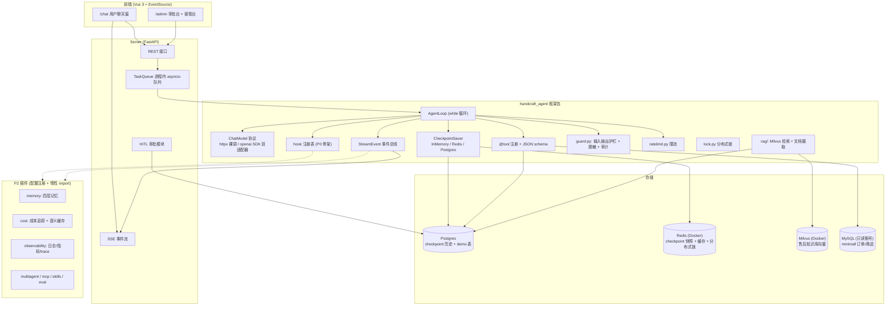

# 01 架构总览

> 设计文档索引：[02-data-model.md](02-data-model.md) / [03-api.md](03-api.md) / [04-test-plan.md](04-test-plan.md) / [05-roadmap.md](05-roadmap.md)
> 决策索引：`docs/adr/`（0001-0007）

## 1. 项目定位

从零手写的轻量 AI Agent 运行时框架 + 电商售后智能客服 demo。目标：吃透 agent loop 底层原理（循环、状态、流式、安全、成本、可观测、测试、评估），覆盖 70 个编号难点，三阶段（P0 / P1 / P2）实施。

| 层 | 职责 | 阶段 |
|----|------|------|
| 框架层 `handcraft_agent/` | 业务无关的 agent runtime（model / tool / loop / stream / checkpoint / guard / ratelimit / lock / rag） | P0-P2 |
| 服务层 `server/` | FastAPI + SSE + TaskQueue，承载 RAG 检索与客服业务工具注册 | P1 |
| Demo 层 `demo/` | 电商售后客服：Ticket / Escalation / HITL 审批，业务工具集 | P1 |
| 前端 | Vue 3 + EventSource：`/chat` 用户端 + `/admin` 审批/接管台 | P1 |
| P2 插件 `plugins/` | multiagent / mcp / skills / memory / cost / observability / eval / 上下文工程 | P2 |

## 2. 系统架构



## 3. 核心 agent loop

```text
while not done:
    response = model.generate(messages, tools)        # 模型决策：给答案 or 调工具
    emit(thinking)                                     # 事件总线：thinking
    if response.has_tool_calls:
        emit(tool_call)                                # 事件总线：tool_call
        results = gather(execute_tool(tc) for tc in response.tool_calls)   # 并行执行
        for r in results:
            if r.failed:
                emit(tool_result, error=actionable_error(r))   # 可操作错误 → 自纠错
            else:
                emit(tool_result, ok)
        messages.append(tool_results)                  # 以 tool_result 消息回填，保持并行语义
    elif response.finish_reason == length:
        handle_truncation()                            # #10 length 截断：续写或精简
    else:
        emit(final)
        done = True
```

防护：`LoopGuard`（max_turns / token 预算 / wall-clock）+ kill switch（`asyncio.Task.cancel` 即时打断）。每 Turn 结束 checkpoint 落盘。

## 4. 扩展点设计（ADR-0007）

三类轻量扩展机制，核心零 import P2：

### 4.1 事件总线

`StreamEvent` 四类事件（P0）：`thinking` / `tool_call` / `tool_result` / `final`；`reasoning` 流式增量单独一类（#11）。P2 模块（observability / cost）订阅同一事件流。

事件 schema 定义见 [03-api.md §2](03-api.md)。

### 4.2 hook 点

| hook | 触发时机 | P2 消费者 |
|------|---------|----------|
| `before_turn` | 每 Turn 模型调用前 | memory（注入记忆）、上下文工程 |
| `after_turn` | 每 Turn 结束后 | memory（写入决策）、cost |
| `on_model_call` | 模型请求发出前/响应后 | cost（token 计量）、observability |
| `on_tool_executed` | 工具执行完成 | observability（工具成功率）、audit |
| `on_event` | 每个 StreamEvent 产生 | observability（trace 采集） |

注册表骨架 P0 落地（`handcraft_agent/hooks.py`，空注册零成本）。

### 4.3 SPI（可替换接口）

| 接口 | P0/P1 实现 | P2 新增实现 |
|------|-----------|------------|
| `ChatModel` | DeepSeek httpx 裸调 / openai SDK（ADR-0003） | — |
| `CheckpointSaver` | InMemory / Redis / Postgres（ADR-0002） | — |
| `EmbeddingProvider` | CloseAI `text-embedding-3-large` | 本地 BGE |
| `ModelRouter` | 默认直连（单模型 `deepseek-v4-flash`） | 分级路由（#36） |
| `SemanticCache` | 无（P1 不启用） | 语义缓存（#36） |

### 4.4 P2 挂载机制

- P2 模块目录：`handcraft_agent/plugins/<module>/`（multiagent / mcp / skills / memory / cost / observability / eval / context_engineering）
- 启用方式：配置 `PLUGINS={"memory": {}, "cost": {...}}` + 惰性 import（`importlib` 按配置加载）
- 依赖方向：**P2 → 核心**单向依赖，核心只提供 hook 点与 SPI

## 5. 关键技术决策摘要

| 决策 | 内容 | ADR |
|------|------|-----|
| ChatModel 协议 | 薄协议，P0 仅 DeepSeek | 0001 |
| Checkpoint | Redis + Postgres 双实现，配置切换 | 0002 |
| LLM 接入 | httpx 裸调 + openai SDK 双适配器 | 0003 |
| Demo 形态 | 通用框架 + 电商售后客服（minimall 只读 + PG 自有表） | 0004 |
| 流式 | SSE 单向推送 | 0005 |
| 队列 | 进程内 asyncio 起步，TaskQueue 抽象预留 MQ | 0006 |
| P2 形态 | 轻量扩展点（事件总线 + hook + SPI），配置注册 | 0007 |
| 向量库 | 直接上 Milvus（本机 Docker），embedding 用 CloseAI `text-embedding-3-large` | 访谈决策（2026-08-18） |
| 模型 | 单模型 deepseek-v4-flash（推理模型，reasoning_content 真实存在） | 0003 补充 |
| demo 存储 | Ticket 等 demo 表落 Postgres（alembic），订单只读 MySQL（只读账号，演示 #24） | 0004 补充 |

## 6. P1 部署拓扑

```
单机部署：
├── FastAPI server（uvicorn，默认 8000）
│   ├── SSE 端点（EventSource 消费）
│   ├── TaskQueue（进程内 asyncio）
│   └── 工具注册：订单查询（只读 MySQL）/ 物流 / 退款审批（HITL）/ FAQ / 知识库检索（Milvus）/ 转人工
├── Postgres（本机）: checkpoint 历史 + tickets / escalations / approvals / audit_logs
├── Redis（Docker）: checkpoint 快照 + 分布式锁 + 幂等键
├── Milvus（Docker）: 售后知识库（售后政策 / 退换货规则 / 常见问题）
└── Vue 前端（npm run dev）: /chat + /admin
```
