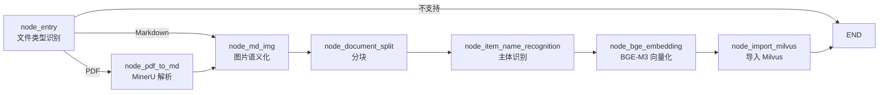
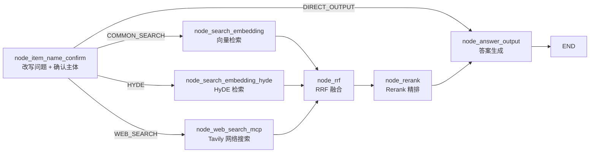

# rag_knowledge — 基于 LangGraph 的工业级 RAG 知识库问答系统

> 面向产品说明书 / 技术文档等**垂直领域知识库**的问答系统: 离线加载构建索引, 在线检索生成答案。
> 核心思路: **主体识别（item_name）+ 多路召回（向量 / HyDE / Web）+ 融合排序（RRF）+ 精排（Rerank）+ 溯源回答**。

---

## 1. 项目概览

| 能力 | 说明 |
|------|------|
| 文档加载 | PDF / Markdown 解析, 图片语义化, 标题级分块, 主体识别, 混合向量入库 |
| 问答检索 | 问题改写 + 主体确认, 三路并行召回, RRF 融合, Rerank 精排, 流式输出 |
| 会话能力 | 多轮对话（指代消解）, 历史记录存储（MongoDB） |
| 输出形式 | 文本答案 + 引用图片, 支持 SSE 流式 |
| 评估体系 | golden 题库 + 分层检索指标（精确率/召回率/必命中率/MRR@5/NDCG@5）, 报告落盘 artifacts/ |

### 技术栈

| 组件 | 技术 |
|------|------|
| 流程编排 | LangGraph 1.x（StateGraph, 两个图: `load_graph` / `query_graph`） |
| LLM / VL | DeepSeek（OpenAI 兼容, ChatDeepSeek）, 视觉模型用于图片语义化 |
| Embedding | BGE-M3（稠密 1024 维 + 稀疏向量, 双路混合检索） |
| Rerank | bge-reranker-large（FlagReranker） |
| 向量库 | Milvus（`chunks` + `item_name` 两个集合, HNSW + 稀疏倒排索引） |
| PDF 解析 | MinerU 远程解析服务（上传 → 轮询 → 下载 zip） |
| 对象存储 | MinIO（文档图片, 生成可访问 URL） |
| 会话历史 | MongoDB（`chat_message` 集合, session_id + ts 复合索引） |
| 网络搜索 | Tavily（补充本地知识库不足） |
| API 层 | FastAPI（端口 8100, SSE 流式, 原生 HTML 页面） |

---

## 2. 目录结构

```
project/rag_knowledge/
├── app/
│   ├── api/                        # FastAPI 接口层
│   │   ├── server.py               #   路由: 上传 / 提问 / SSE 流 / 历史 / 状态轮询
│   │   ├── schema.py               #   Pydantic 请求/响应模型
│   │   └── html/                   #   原生 HTML 页面（index / upload / query）
│   ├── infra/                      # 基础设施门面（单例, 业务层唯一入口）
│   │   ├── config.py               #   聚合所有配置的 InfraConfig
│   │   ├── milvus.py               #   Milvus 客户端 + 混合检索封装（InfraMilvus）
│   │   ├── minio.py                #   MinIO 上传 + URL 构建（InfraMinio）
│   │   └── model.py                #   模型门面（llm / vision / embedding / reranker）
│   ├── process/                    # LangGraph 图定义层（节点 + 图 + state）
│   │   ├── load/                   # 加载图（离线建索引）
│   │   │   ├── agent/
│   │   │   │   ├── state.py        #   LoadState（TypedDict + 默认模板）
│   │   │   │   └── main_graph.py   #   图结构 + 条件路由
│   │   │   └── nodes/              #   _01_entry ~ _07_import_milvus
│   │   └── query/                  # 查询图（在线问答）
│   │       ├── agent/
│   │       │   ├── state.py        #   QueryState
│   │       │   └── main_graph.py   #   图结构 + 条件路由（并行分支）
│   │       └── nodes/              #   _08_item_name_confirm ~ _12_answer_output
│   ├── prompts/                    # 提示词模板（.prompt, 支持 $var 占位符）
│   │   ├── item_name_recognition.prompt          # 文档加载: 主体识别
│   │   ├── rewritten_query_and_itemnames.prompt  # 查询: 问题改写 + 主体提取（JSON）
│   │   ├── hyde_prompt.prompt                    # 查询: HyDE 假设性答案
│   │   ├── answer_out.prompt                     # 查询: 最终回答生成
│   │   ├── image_summary.prompt                  # 加载: 图片语义总结（VL）
│   │   ├── rerank_text_refine.prompt             # 查询: Rerank 前长文本压缩
│   │   └── product_recognition_system.prompt     # 辅助
│   ├── rag/                        # 业务服务层（节点调用的具体实现）
│   │   ├── load/                   #   加载服务
│   │   │   ├── entry_service.py    #     文件类型识别 / 路径校验
│   │   │   ├── pdf_parse_service.py#     MinerU 上传 / 轮询 / 解压
│   │   │   ├── enrich_markdown_images.py  # 图片扫描 / VL 总结 / MinIO 上传 / 引用替换
│   │   │   ├── split_service.py    #     标题语义切块 + 递归切割 + 小块合并
│   │   │   ├── item_name_service.py#     LLM 主体识别 + item_name 集合写入
│   │   │   ├── embedding_service.py#     BGE-M3 批量向量化
│   │   │   ├── index_service.py    #     chunks 集合创建 + 数据导入
│   │   │   └── config.py           #     分块 / 批量 / 上下文参数
│   │   └── query/                  #   查询服务
│   │       ├── item_name_confirm_service.py  # 问题改写 + 主体确认 + 候选决策
│   │       ├── embedding_search_service.py   # 普通向量混合检索
│   │       ├── hyde_search_service.py        # HyDE 检索
│   │       ├── web_search_service.py         # Tavily 搜索
│   │       ├── rrf_service.py                # RRF 加权融合
│   │       ├── rerank_service.py             # Rerank 打分 / 排序 / 动态 TopK
│   │       ├── answer_service.py             # 答案生成 + SSE 推送 + 历史保存
│   │       └── config.py           #     阈值 / TopK / Rerank 参数
│   ├── rag_eval/                   # RAG 评估子系统（评测样本 + 指标 + 执行）
│   │   ├── dataset.py              #   测试知识 / 题库定义与读写
│   │   ├── metrics.py              #   指标计算（主体命中率 / P / R / 必命中率 / MRR@5 / NDCG@5）
│   │   ├── runner.py               #   评估执行: 数据入库 -> 批量评测 -> 汇总报告
│   │   ├── tester.py               #   RagEvalTester 统一入口类
│   │   └── artifacts/              #   题库 eval_cases.json + 评测报告 eval_report.json
│   └── shared/                     # 共享层（跨业务复用的基础能力）
│       ├── clients/                #   milvus_utils（混合检索）/ mongo_utils（历史 CRUD）
│       ├── config/                 #   各组件环境变量配置（llm / embedding / reranker / milvus / mineru / minio / mongo）
│       ├── model/                  #   llm_utils（客户端缓存）/ embedding_utils（BGE-M3 单例）/ reranker_utils
│       ├── runtime/                #   logger（节点日志装饰器）/ load_prompt（模板渲染）
│       ├── tool/                   #   工具占位
│       └── utils/                  #   sse_utils（SSE 队列）/ task_utils（任务状态）/ rate_limit_utils / path_utils
├── assets/                         # 上传的源文档（按日期目录归档）
├── output/                         # 加载产物
│   ├── <文档名>/                   #   解压目录: markdown + images/
│   ├── zip/                        #   MinerU 返回的 zip 包
│   └── ...
├── logs/                           # 运行日志
├── tests/                          # 图级冒烟测试 + 评测最小调用样例（test_rag_eval_tester）
└── .env                            # 环境变量（RK_ 前缀, 不提交）
```

### 分层设计

```
api (FastAPI 路由)
  └─> process (LangGraph 图 / 节点)      ← 只做状态流转 + 日志埋点
        └─> rag (业务服务层)             ← 具体实现, 逐步日志
              └─> infra / shared         ← 基础设施门面 + 共享工具
```

节点层与业务层分离: 节点代码仅负责「取 state → 调服务 → 更新 state」, 可单独以 `python -m` 方式调试单个节点（每个节点文件自带 `__main__` 测试入口）。

---

## 3. 核心流程

系统由两个 LangGraph 图组成: **加载图（load_graph）** 负责离线构建知识索引, **查询图（query_graph）** 负责在线问答。

### 3.1 加载图（load_graph）— 离线索引构建



| 节点 | 服务实现 | 职责 | 关键细节 |
|------|----------|------|----------|
| `_01 node_entry` | `entry_service.resolve_input_file` | 识别输入文件类型, 校验路径 | 按扩展名设置 `is_md_read_enabled` / `is_pdf_read_enabled`; 不支持的类型抛异常; 记录 `file_title` |
| `_02 node_pdf_to_md` | `pdf_parse_service.parse_pdf_to_markdown` | 调用 MinerU 将 PDF 解析为 Markdown | 三步: ① 创建上传 URL + batch_id → ② `requests.Session`（`trust_env=False` 防止请求头污染）上传 → ③ 轮询 `extract-results` 直到 `state=done`, 下载 zip 解压, `full.md` 重命名为 `<title>.md` |
| `_03 node_md_img` | `enrich_markdown_images` | 处理 Markdown 中的图片: 让图片"可被检索" | ① 扫描 md 引用的图片及其前后 100 字符上下文 → ② VL 视觉模型总结图片含义 → ③ 上传 MinIO 获取 URL → ④ 把 `` 替换为 ``, 产物写入 `<title>_new.md`; 图片目录为空则跳过 |
| `_04 node_document_split` | `split_service.split_document` | 文档分块（语义切块 + 长度控制 + 可追溯） | ① **按多级标题切割**（连续标题拼接为父子链; 无标题内容归属下一个标题; 代码块整体保留）→ ② 超过 `CHUNK_SIZE=600` 用 RecursiveCharacterTextSplitter 递归切割（overlap=50, 分隔符: 段落→句子→标点）→ ③ 小于 `CHUNK_MIN=400` 且同父标题的相邻块合并（上限 `CHUNK_MAX_SIZE=1000`）→ ④ 补齐 `parent_title` / `part` 元数据 → ⑤ 备份 chunks 到 `<title>.json` |
| `_05 node_item_name_recognition` | `item_name_service.recognize_and_index_item_name` | 识别文档核心主体名称（如"HAK_180烫金机"） | ① LLM 基于前 5 个 chunk（≤2000 字符）识别 item_name（失败降级用 file_title）→ ② 写入每个 chunk → ③ 创建 `item_name` 集合（稠密 HNSW + 稀疏倒排）→ ④ item_name 向量化后入库（先按 `file_title` 删旧再插入） |
| `_06 node_bge_embedding` | `embedding_service.generate_chunk_embeddings` | BGE-M3 批量向量化（稠密 + 稀疏） | 按 `EMBEDDING_BATCH_SIZE=5` 分批; 向量化文本为 `item_name + "_" + content`, 让主体信息参与语义匹配; 稀疏向量转 `{idx: weight}` 字典便于 Milvus 存储 |
| `_07 node_import_milvus` | `index_service.index_chunks` | 将向量数据导入 Milvus `chunks` 集合 | 集合含 `chunk_id / content / file_title / item_name / title / parent_title / part / dense_vector / sparse_vector`; 先按 `file_title` 删除旧文档数据再插入（幂等重传） |

### 3.2 查询图（query_graph）— 在线问答



> `router_after_item_name_confirm` 返回三个路由目标时, LangGraph 会**并行**执行三路召回, 汇总到 `node_rrf`。

| 节点 | 服务实现 | 职责 | 关键细节 |
|------|----------|------|----------|
| `_08 node_item_name_confirm` | `item_name_confirm_service.confirm_item_name` | 改写问题 + 确认知识库中存在的主体 | ① 取最近 10 条历史 → ② LLM（JSON 模式）提取 `item_names` + 改写 `rewritten_query`（指代消解 / 去口语化, ≤100 字符）→ ③ 每个 item_name 向量化后在 `item_name` 集合混合检索（稠密 0.4 / 稀疏 0.6）→ ④ 阈值判定: score ≥ **0.70** 为确定主体, ≥ **0.60** 为候选主体 → ⑤ 写状态并保存用户提问历史。**路由决策**: 有确定主体 → 三路并行检索; 仅候选 → 直接把候选列表作为答案输出; 无主体 → 提示"未检测到主体" |
| `_09-1 node_search_embedding` | `embedding_search_service.search_by_embedding` | 普通向量混合检索（第一路） | `rewritten_query` 向量化 → Milvus 稠密 + 稀疏混合检索（权重 0.7 / 0.3, 偏向稠密语义）, `expr="item_name in [...]"` 过滤主体, 取 Top 10 候选 → 最终 Top 5 |
| `_09-2 node_search_embedding_hyde` | `hyde_search_service.search_by_hyde` | HyDE 检索（第二路, 提高召回） | ① LLM 先生成一段假设性答案（≤300 字）→ ② `问题 + 假设性答案` 拼接后向量检索 → 同样的 expr 过滤。弥补问题表述不清、向量匹配不足的场景 |
| `_09-3 node_web_search_mcp` | `web_search_service.search_by_web` | Tavily 网络搜索（第三路, 补充知识库不足） | `rewritten_query` 直接搜索, 过滤 `score > 0.5`, 取前 10 条; 结果标记 `type=web_search` 带 URL |
| `_10 node_rrf` | `rrf_service.fuse_by_rrf` | RRF 加权融合排序 | `rrf_score = w * (1 / (k + rank))`, k=60; embedding 与 hyde 各 0.5 权重; 按 chunk_id 去重累加, 取 Top 5 |
| `_11 node_rerank` | `rerank_service.rerank_documents` | bge-reranker 精确打分重排 | ① RRF 结果与 Web 结果合并统一格式 → ② 超长文本（超过 512 token 窗口）先用 LLM 压缩 → ③ reranker 对「问题-文本」对打分（normalize）→ ④ 排序后**动态 TopK**: 从第 3 名起检测"断崖"（相邻分差 > 0.2 或降幅 > 20%）, 断崖即截断, 上限 10 条 |
| `_12 node_answer_output` | `answer_service.generate_answer` | 生成最终答案 | ① 若 state 已有 answer（主体未确认分支）直接返回 → ② 组装 prompt（参考内容 + 置信度 + 来源 + 历史对话 + 主体）→ ③ 模型生成（流式则 SSE `DELTA` 逐字推送）→ ④ 从命中 chunk 提取图片 URL → ⑤ 保存助手回答到 MongoDB |

---

## 4. API 一览

服务入口: `python -m project.rag_knowledge.app.api.server`（`uvicorn`, 127.0.0.1:8100）。

| 方法 | 路径 | 说明 |
|------|------|------|
| GET | `/` | 首页导航 |
| POST | `/upload` | 上传 PDF/MD 文件, 后台异步执行加载图, 返回 `task_ids` |
| GET | `/status/{task_id}` | 轮询加载任务状态（`done_list` / `running_list`） |
| GET | `/query/frontend` | 提问页面 |
| POST | `/query` | 提问: `is_stream=false` 同步返回答案; `is_stream=true` 异步执行 + SSE 推送 |
| GET | `/query/stream/{session_id}` | SSE 流式通道（`DELTA` 增量 / `FINAL` 结束 / `ERROR` 异常） |
| GET | `/query/health` | 健康检查 |
| GET | `/history/{session_id}` | 查询会话历史（默认最近 10 条） |
| DELETE | `/history/{session_id}` | 清空会话历史 |

---

## 5. 召回率 / 准确率偏低排查手册

> 召回率 = 该检索到的内容是否都被检索到（查全）; 准确率 = 检索/回答的内容是否真正相关、正确（查准）。
> 建议按「数据 → 分块 → 检索 → 融合 → 生成」的链路逐层排查, 每层可用 `logs/` 中节点日志与 `output/<title>.json`（chunks 备份）验证。

### 5.1 召回率低（该有的内容没捞回来）

| # | 可能原因 | 定位方法 | 解决方向 |
|---|----------|----------|----------|
| 1 | **主体识别错误/失败**（最关键） | 查 `_05` 输出 item_name 与文档实际主体是否一致; 查 `_08` 的 `item_names` 与 `confirm` 结果 | `expr="item_name in [...]"` 是**硬过滤**, item_name 对不上 → 文档被整体排除。改进: 修正识别 prompt; 增加多个 item_name 别名; 失败时降级为不带过滤的全文检索 |
| 2 | **item_name 确认阈值过高** | `_08` 日志中候选/确认分布 | `ITEM_NAME_CONFIRM_THRESHOLD=0.70` 过高时, 正确主体落入候选区 → 直接输出候选列表而非检索。用测试集实测分布后调整阈值 / 归一化 |
| 3 | **分块粒度不当** | 查看 `<title>.json` 中 chunk 的 title/content | chunk 过大（标题下内容混入多主题）→ 语义稀释; chunk 过小 → 上下文断裂。调整 `CHUNK_SIZE`（600）与合并阈值（`CHUNK_MIN=400` / `CHUNK_MAX_SIZE=1000`） |
| 4 | **重叠不足导致跨块信息断裂** | 检查交界处问题（如"参数"在上一块,"含义"在下一块） | 调大 `CHUNK_OVERLAP`（当前 50）; 或对表格/列表类文档改按行块切分 |
| 5 | **TopK 截断太狠** | `MILVUS_CHUNK_RRF_TOP_K=5` 仅 5 条进 RRF | 增大召回 TopK（如 10~20）, 让 Rerank 阶段做更充分的"重捞" |
| 6 | **查询改写质量差** | 检查 `_08` 的 `rewritten_query` | 改写失真（丢失关键限定词 / 主体错位）→ 向量检索偏题。优化改写 prompt; 或对简单问题直接使用原问题检索 |
| 7 | **向量匹配能力不足** | 用目标领域术语测试 BGE-M3 检索效果 | 领域专有名词 / 口语 vs 书面语差异大时, 补充 BM25 关键词路（Milvus 全文索引）; 或换更强的领域微调 embedding |
| 8 | **HyDE 假设性答案质量差** | 查看 `_09-2` 生成的假设性答案 | 假设答案编造细节会带偏检索。改进 hyde_prompt 约束; 或降级为仅拼接改写问题 |
| 9 | **源文档本身不完整** | 对比 pdf 与 `<title>_new.md` 内容 | MinerU 解析丢页 / 丢表格; 图片内容只靠 VL 摘要（信息密度低）。换解析模型版本 / 补 OCR 校验 |
| 10 | **知识库数据量不足** | 统计 Milvus 集合行数 | 该领域文档没入库是召回率低的第一大来源; 建立文档覆盖度清单 |

### 5.2 准确率低（捞回来的内容不相关 / 回答错误）

| # | 可能原因 | 定位方法 | 解决方向 |
|---|----------|----------|----------|
| 1 | **Rerank 输入被截断** | `_11` 日志中压缩触发频率 | 长 chunk 被 LLM 压缩后丢失细节 → 精排失真。提高 `RERANK_MAX_INPUT_TOKENS`（512, 视模型而定）; 或分片精排后聚合 |
| 2 | **动态 TopK 断崖误判** | 检查 `_11` 截断位置与分数分布 | `RERANK_GAP_ABS / RERANK_GAP_RATIO = 0.2` 过敏感时把"相关但不连续"的内容截掉。用测试集校准或放宽阈值 |
| 3 | **多主体混合污染** | 提问涉及多个 item_name 时检查 expr 结果 | `in` 匹配多个文档, 内容相近时答案混乱。按主体拆分多轮检索; 或让 Rerank 时强制同主体聚合 |
| 4 | **Web 结果干扰** | 检查 `web_search_docs` 是否挤占 TopK | Tavily 结果与本地文档表述不一致 → 稀释本地答案。降低 web 权重 / 仅做兜底（本地检索为空才启用） |
| 5 | **分块内容含噪音** | 查看 chunk 内容是否有页眉页脚 / 目录残留 | MinerU 产物中的页眉页脚、目录、版权页进入 chunk → 语义污染。加载时增加清洗节点 |
| 6 | **生成阶段幻觉** | 核对答案与 `reranked_docs` 是否一致 | 上下文不足时模型会编造。强化 `answer_out.prompt` 约束（仅基于参考内容）; 答案附引用（chunk 标题 + 置信度）, 便于人工核验 |
| 7 | **历史对话误导** | 检查 `history_text` 组装 | 历史中错误信息被带入当前回答。限制历史条数（`QUERY_HISTORY_LIMIT=10`）; 仅保留高置信主体的历史 |
| 8 | **图片摘要噪音** | 查看 `_new.md` 中图片替换文本 | VL 摘要错误会把错误"事实"注入 chunk。提高 VL 提示词约束; 摘要前增加图片相关性判断 |
| 9 | **向量检索 TopK 内噪声多** | 检查 `_09` 返回 chunk 的 score 分布 | 混合权重（稠密 0.7 / 稀疏 0.3）不适配当前文档类型时低分噪声混入。调权重 / 加最低分数过滤 |
| 10 | **指标无法量化** | 查看 `app/rag_eval/artifacts/eval_report.json` 的 4 层指标 | 评估体系已落地（见 §6）: 用题库 + 分层指标定位薄弱层, 调优后重跑评测对比基线 |

---

## 6. 评估体系

基于 **golden dataset（题库）+ 分层检索指标** 的离线评测: 测试数据与查询链路均走**真实执行**, 报告落盘 `app/rag_eval/artifacts/`。对外只暴露 `RagEvalTester` 一个入口类。

### 6.1 指标

| 指标 | 含义 | 公式 |
|------|------|------|
| 主体命中率 (item_name_hit_rate) | 识别出的主体与题库标注主体的重合度 | 交集数 / 预期主体数 |
| 精确率 (precision) | 检索结果中真正相关 chunk 的占比 | 命中相关数 / 检索结果数 |
| 召回率 (recall) | 标注相关 chunk 中被找回的占比 | 命中相关数 / 标注相关数 |
| 必命中率 (must_hit_rate) | 标注为"关键"的 chunk 是否打中 | 命中关键数 / 标注关键数 |
| MRR@5 / NDCG@5 | 正确答案在 Top5 中的排序质量 | 首个命中位置倒数 / 位置折扣累积 |

### 6.2 评估流程（两步, 全部走真实链路）

1. **评测数据入库** (`run_insert_test_data`): 读取真实加载产物 `output/hak180产品安全手册/hak180产品安全手册_new.json` → 走真实导入链路（`_05` 主体识别 / `_06` 向量化 / `_07` 导入 Milvus, 完成后 flush 保证检索可见）→ 查询真实 chunk_id, 生成题库 `artifacts/eval_cases.json`（含 `gold_chunk_ids` 相关标注 + `must_hit_chunk_ids` 关键标注）
2. **批量评测** (`run_eval`): 逐条走真实查询链路（`_09-1` 普通检索 / `_09-2` HyDE / `_10` RRF / `_11` Rerank）→ 每层独立计算指标 → 汇总平均 → 报告落盘 `artifacts/eval_report.json`（汇总 + 每题分层详情）

### 6.3 稳定性设计

- **固定 LLM 不确定性**: 主体识别与 HyDE 输出用 `patch` 固定（题库直接注入 `expected_item_names`, HyDE 输出固定文案）, 排除模型随机性对检索指标的影响
- **4 层独立评估**: 普通检索 / HyDE 检索 / RRF 融合 / 最终重排结果分别算分, 可定位"哪一层拖了后腿"（基础召回差 / 融合后掉了 / rerank 选错）
- **Web 占位**: 联网检索用固定占位结果, 避免网络波动干扰, 评测重点聚焦本地召回链路

### 6.4 当前基线（50 用例, 2026-09-01）

| 层级 | 精确率 | 召回率 | 必命中率 | MRR@5 | NDCG@5 |
|------|--------|--------|----------|-------|--------|
| 普通检索 | 0.544 | 0.669 | 0.780 | 0.859 | 0.672 |
| HyDE 检索 | 0.488 | 0.598 | 0.740 | 0.778 | 0.614 |
| RRF 融合 | 0.536 | 0.660 | 0.760 | 0.834 | 0.660 |
| 最终重排结果 | 0.625 | 0.562 | 0.760 | 0.792 | 0.586 |

主体命中率 1.0。可读结论: Rerank 提升精确率（0.536 → 0.625）但牺牲召回率（0.660 → 0.562）, 动态 TopK 断崖截断是主要原因（见 §5.2-2）; 可结合 §7 改进方向继续迭代。

### 6.5 运行方式

```bash
cd project/rag_knowledge   # 评测代码使用 app 包内导入, 需在此目录下运行

# 方式一: 最小调用样例（先入库, 再评测）
python -m tests.test_rag_eval_tester

# 方式二: 代码内调用
python -c "
from app.rag_eval import RagEvalTester
tester = RagEvalTester()
tester.run_insert_test_data()   # 首次或知识变更后执行
tester.run_eval()               # 输出汇总指标, 报告落盘 artifacts/eval_report.json
"
```

> 前置依赖: Milvus + BGE-M3 可用; 批量评测额外要求 reranker 模型; 知识库变更后需先重新入库再评测。

---

## 7. 可拓展与改进点

按优先级排序, 每项给出方案参考。

### 7.1 完善评估体系（基础版已落地, 见 §6）

- **现状**: 基于 golden dataset 的分层检索评测已落地（`app/rag_eval/`, 50 用例, 4 层检索指标, 见 §6）, "调优无量化指标"的问题已解决。
- **方案参考**: 引入 **RAGAS** 或 LlamaIndex 评测框架, 补充生成质量指标 `faithfulness`（忠实度）/ `answer_relevancy`（回答相关性）; 题库扩充多主体 / 跨文档问题; 自定义题库可直接传 `run_batch_eval(case_list=...)`。

### 7.2 增加 BM25 关键词检索路（提升召回率）

- **问题**: 单一向量检索对专有名词 / 精确匹配不敏感（§5.1-7）。
- **方案参考**: Milvus 2.5+ 内置全文索引（BM25）; 在 `_09` 增加第三路检索（向量 + 稀疏 + 关键词）, 三路统一进 `_10` RRF 融合, 每路动态权重。

### 7.3 查询意图路由与查询扩展

- **问题**: 所有问题走同一检索链路, 简单问题成本高、复杂问题召回不足。
- **方案参考**: 在 `_08` 后增加意图分类（事实型 / 操作型 / 比较型）; 事实型走轻量单路检索, 操作型启用 HyDE + Web; 检索前做查询扩展（同义词、英文缩写补全, 与 item_name 集合做别名映射）。

### 7.4 引用溯源与可解释回答

- **问题**: 答案无出处, 无法核验, 也难以发现错误来源。
- **方案参考**: 生成阶段要求模型按 `[引用序号]` 标注; 返回 `reranked_docs` 的 title / parent_title / score 作为引用元数据; 前端渲染成可点击的引用高亮（chunk 命中片段高亮）。数据已具备（`answer_service` 已提取来源与置信度）。

### 7.5 增量更新与知识库管理

- **问题**: 目前是全量重传（`file_title` 删旧插新）, 文档版本升级无感知。
- **方案参考**: 引入文档版本号 / 哈希去重; 建立文档管理后台（上架/下架/更新）; 增量只重建变更文档; Milvus 集合按知识域分片隔离。

### 7.6 多主体消歧与用户确认交互

- **问题**: 候选主体（0.60~0.70 区间）目前直接作为答案输出, 交互断裂（§5.1-2）。
- **方案参考**: `_08` 检测到候选主体时返回候选列表 + 引导用户选择; 前端提供候选点击确认后二次检索（`item_name_confirm_service` 已预留候选逻辑, 前端 query.html 需配套）。

### 7.7 记忆与个性化增强

- **问题**: 多轮依赖 MongoDB 原始记录, 无长程记忆。
- **方案参考**: 引入 LangGraph checkpointer（`PostgresSaver`）管理对话状态; 定期用 LLM 为会话生成摘要压缩长期记忆; 用户画像（偏好主体）辅助检索重排。

### 7.8 缓存与性能优化

- **问题**: 相同问题反复检索, LLM 调用成本高。
- **方案参考**: 相似问题缓存（问题 embedding 相似度 > 0.95 直接复用答案, Redis 存储）; BGE-M3 / reranker 已做单例缓存, 可再加服务化（部署为独立推理服务, 多进程共享）; 大文档解析异步化（Celery / 任务队列）。

### 7.9 GraphRAG（图谱增强）

- **问题**: 当前为纯向量 RAG, 多跳推理（"A 部件与 B 部件是否兼容"）能力弱。
- **方案参考**: 在加载阶段用 LLM 抽取实体-关系三元组构建知识图谱（如 Neo4j / Milvus GraphRAG 模块）; 检索阶段先图召回（实体扩展、多跳路径）再向量召回, 两者融合进 RRF。

### 7.10 多知识库与权限控制

- **问题**: 单一 chunks 集合, 无租户隔离。
- **方案参考**: Milvus 集合按知识库分区（partition）; 检索 expr 增加 `kb_id` 过滤; API 层接入鉴权（JWT）, 控制可见知识域。

---

## 8. 快速开始

```bash
# 1. 配置环境变量（参考 .env, 所有变量 RK_ 前缀）
#    RK_DEEPSEEK_BASE_URL / RK_DEEPSEEK_API_KEY / RK_LLM_DEFAULT_MODEL / RK_VL_MODEL
#    RK_BGE_M3 / RK_BGE_M3_PATH / RK_BGE_DEVICE / RK_BGE_FP16
#    RK_BGE_RERANKER_LARGE / RK_BGE_RERANKER_DEVICE
#    RK_MILVUS_URL / RK_CHUNKS_COLLECTION / RK_ITEM_NAME_COLLECTION / RK_EMBEDDING_DIM
#    RK_MINERU_BASE_URL / RK_MINERU_API_TOKEN / RK_MINERU_MODEL_VISION
#    RK_MINIO_ENDPOINT / RK_MINIO_ACCESS_KEY / RK_MINIO_SECRET_KEY / RK_MINIO_BUCKET_NAME
#    RK_MONGO_URL / RK_MONGO_DB_NAME
#    RK_LOG_*（日志开关/级别/保留）

# 2. 启动服务（项目根目录, 依赖 .venv）
python -m project.rag_knowledge.app.api.server
# 访问 http://127.0.0.1:8100

# 3. 单节点调试（每个节点自带测试入口）
python -m project.rag_knowledge.app.process.load.nodes._05_item_name_recognition
python -m project.rag_knowledge.app.process.query.nodes._08_item_name_confirm

# 4. 图级测试
python -m pytest project/rag_knowledge/tests/

# 5. RAG 评估（详见 §6, 需在子项目目录下运行）
cd project/rag_knowledge && python -m tests.test_rag_eval_tester
```

> 前置依赖: Milvus、MongoDB、MinIO 服务需先就绪; MinerU 为远程解析服务（可按部署笔记自建）; BGE-M3 模型本地路径或自动下载。

---

> 最后更新: 2026-09-01
