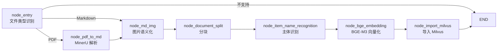
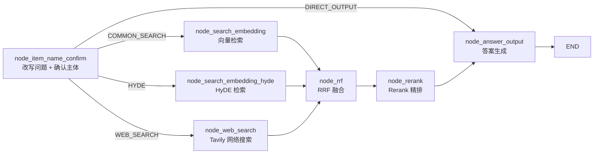

# rag_knowledge — 基于 LangGraph 的工业级 RAG 知识库问答系统

> 面向**垂直领域知识库**的问答系统: 离线加载构建索引, 在线检索生成答案。当前评测语料是「网络与数据合规」的 15 篇政府公开文本（见 §6.4）。
> 核心思路: **主体识别（item_name）+ 三路并行召回（向量 / HyDE / Web）+ RRF 融合前两路 + 精排合并第三路（Rerank）+ 溯源回答**。

---

## 速览（门面）

**一行启动**（依赖 Milvus / MongoDB / MinIO + BGE-M3 与 reranker 两个本地模型, 明细见 §8）:

```bash
python -m project.rag_knowledge.app.api.server     # http://127.0.0.1:8100
```

```text
浏览器（原生 HTML）
   │ HTTP / SSE
   ▼
FastAPI :8100 ──► 查询图 query_graph ──► Milvus（chunks / item_name 两集合）
   │                主体确认 → 三路并行召回 → RRF → 精排 → 溯源回答
   └─────────────► 加载图 load_graph ──► MinerU（PDF 解析）/ MinIO（图片）/ Milvus
```

**已实现 vs 未实现** —— 状态: ✅ 已实现 · 🟡 部分 · ⬜ 未做（明细在各节与 ticket）

| 能力 | 状态 | 一句话 |
|------|------|--------|
| 加载图（离线索引） | ✅ | PDF（MinerU）/ MD → 图片语义化（VL + MinIO）→ 标题级分块 → 主体识别 → BGE-M3 混合向量 → Milvus（§3.1） |
| 查询图（在线问答） | ✅ | 问题改写 + 主体确认 → 三路并行召回（RRF 只融前两路, 联网在精排层并入）→ Rerank → 流式溯源回答（§3.2） |
| 会话历史 | ✅ | MongoDB 存储, 多轮指代消解（最近 10 条） |
| 评估体系 | ✅ | 83 题 / 15 篇语料 / 4 层检索指标 + **rerank 开/关消融**（§6.4） |
| 工程韧性（C02/C17） | ✅ | 单路为空 / 单路失败**降级不 500**；分块器两处真 bug 修复；Milvus 返回值契约；主体识别内容兜底把入口从 29/79 提到 68/79（C17 诊断轮口径，见下） |
| 引用溯源 | 🟡 | 链接进了 prompt、模型会写 `[参考来源]`；**前端仍按 textContent 渲染, 链接不可点**（C02 显式未做） |
| 生成质量指标 | ⬜ | faithfulness / answer_relevancy（RAGAS 那一类）不做 —— 质量靠落盘报告 + 人工判读（§6.3 末条） |
| 增量索引 / 版本 | ⬜ | 目前全量重传（按 `file_title` 删旧插新）, 无文档版本感知 |
| 多主体消歧交互 | ⬜ | 候选主体（0.60~0.70 区间）直接作为答案输出, 引导选择未做（§7.6） |

**关键决策**（每条一行, 细节见括号里的出处）:

1. **主体识别是链路入口, 也是最大瓶颈** —— `expr="item_name in [...]"` 是硬过滤, 认不出主体整条检索链不跑；C17 加了简称归一化 + 内容兜底（阈值 0.65 是量出来的）, 入口通过率 29/79 → 68/79（C17 诊断轮, 79 题口径；§5.1-1 / [C17](../../.scratch/Charlotte/issues/C17-rag-knowledge-eval-expansion.md)）。
2. **必命中率是门槛不是覆盖率** —— 捞到任意一条关键 chunk 就算过；一条都没标的拒答题记 `null`、排除出分母（§6.1）。
3. **交付条数按量出来的最优取 top-1** —— 1 条 0.922/0.870 vs 2 条 0.507/0.916（参数扫描口径, 与 §6.4 的 83 题基线不是同一分母）；断崖判据留着但不参与（§6.3 / [C17](../../.scratch/Charlotte/issues/C17-rag-knowledge-eval-expansion.md)）。
4. **评测里的随机性要冻住** —— HyDE 假设答案逐题落盘重放（冻的是那一次真 LLM 生成, 不是占位文字）；主体识别走真实链路, 只给原始问题（§6.3 / [C02](../../.scratch/Charlotte/issues/C02-rag-knowledge-hard-fixes.md)）。
5. **参数跟着语料走** —— 文档标题片打折（0.7）是上一版语料上扫出来的, 换法规语料后重扫发现有害、改回 1.0；换语料必须重扫（§5.2-11 / §6.3）。
6. **质量与延迟用报告 + 人工判读, 不进 pytest** —— 自动化用例只钉确定性的部分（分块 / 阈值分支 / 指标公式 / 耗时汇总）（§6.3 末条 / [C18](../../.scratch/Charlotte/issues/C18-rag-knowledge-ci-and-perf.md)）。

**测试规模**: **141 个用例**, 纯函数与纯链路, **不连 Milvus / LLM / Mongo**；4 个手工跑图脚本挂 `pytest.mark.integration` 且默认排除。

```bash
cd project/rag_knowledge && python -m pytest
```

**已知边界**: 详见 §5（召回率低 / 准确率低排查手册）与 §7（可拓展与改进点）；三条最要紧的 —— ① 索引是手工全量重建（改一篇要重跑, 且本机 Milvus 要活着, §3.3）· ② 线上 TTFT 被「联网结果进精排池」拖到 ~51 s（查清了原因, 优化未做, §3.3）· ③ 前端引用链接不可点（§1 表）。

---

## 1. 项目概览

| 能力 | 说明 |
|------|------|
| 文档加载 | PDF / Markdown 解析, 图片语义化, 标题级分块, 主体识别, 混合向量入库 |
| 问答检索 | 问题改写 + 主体确认, 三路并行召回（RRF 只融前两路, Web 在精排层并入）, Rerank 精排, 流式输出 |
| 会话能力 | 多轮对话（指代消解）, 历史记录存储（MongoDB） |
| 输出形式 | 文本答案 + 引用图片, 支持 SSE 流式 |
| 评估体系 | golden 题库 + 分层检索指标（召回率/必命中率/MRR@K/NDCG@K, 精确率只报最终层）, 报告落盘 artifacts/ |

### 技术栈

| 组件 | 技术 |
|------|------|
| 流程编排 | LangGraph 1.x（StateGraph, 两个图: `load_graph` / `query_graph`） |
| LLM / VL | DeepSeek（OpenAI 兼容, ChatDeepSeek）, 视觉模型用于图片语义化 |
| Embedding | BGE-M3（稠密 1024 维 + 稀疏向量, 双路混合检索） |
| Rerank | bge-reranker-v2-m3（FlagReranker; 环境变量名里的 `LARGE` 是历史原因, 见 `reranker_config.py` 注释） |
| 向量库 | Milvus（`chunks` + `item_name` 两个集合, HNSW + 稀疏倒排索引） |
| PDF 解析 | MinerU 远程解析服务（上传 → 轮询 → 下载 zip） |
| 对象存储 | MinIO（文档图片, 生成可访问 URL） |
| 会话历史 | MongoDB（`chat_message` 集合, session_id + ts 复合索引） |
| 网络搜索 | Tavily（补充本地知识库不足） |
| API 层 | FastAPI（端口 8100, SSE 流式, 原生 HTML 页面） |

---

## 2. 目录结构

```
project/rag_knowledge/
├── app/
│   ├── api/                        # FastAPI 接口层
│   │   ├── server.py               #   路由: 上传 / 提问 / SSE 流 / 历史 / 状态轮询
│   │   ├── schema.py               #   Pydantic 请求/响应模型
│   │   └── html/                   #   原生 HTML 页面（index / upload / query）
│   ├── infra/                      # 基础设施门面（单例, 业务层唯一入口）
│   │   ├── config.py               #   聚合所有配置的 InfraConfig
│   │   ├── milvus.py               #   Milvus 客户端 + 混合检索封装（InfraMilvus）
│   │   ├── minio.py                #   MinIO 上传 + URL 构建（InfraMinio）
│   │   └── model.py                #   模型门面（llm / vision / embedding / reranker）
│   ├── process/                    # LangGraph 图定义层（节点 + 图 + state）
│   │   ├── load/                   # 加载图（离线建索引）
│   │   │   ├── agent/
│   │   │   │   ├── state.py        #   LoadState（TypedDict + 默认模板）
│   │   │   │   └── main_graph.py   #   图结构 + 条件路由
│   │   │   └── nodes/              #   _01_entry ~ _07_import_milvus
│   │   └── query/                  # 查询图（在线问答）
│   │       ├── agent/
│   │       │   ├── state.py        #   QueryState
│   │       │   └── main_graph.py   #   图结构 + 条件路由（并行分支）
│   │       └── nodes/              #   _08_item_name_confirm ~ _12_answer_output
│   ├── prompts/                    # 提示词模板（.prompt, 支持 $var 占位符）
│   │   ├── item_name_recognition.prompt          # 文档加载: 主体识别
│   │   ├── rewritten_query_and_itemnames.prompt  # 查询: 问题改写 + 主体提取（JSON）
│   │   ├── hyde_prompt.prompt                    # 查询: HyDE 假设性答案
│   │   ├── answer_out.prompt                     # 查询: 最终回答生成
│   │   ├── image_summary.prompt                  # 加载: 图片语义总结（VL）
│   │   └── product_recognition_system.prompt     # 辅助
│   ├── rag/                        # 业务服务层（节点调用的具体实现）
│   │   ├── load/                   #   加载服务
│   │   │   ├── entry_service.py    #     文件类型识别 / 路径校验
│   │   │   ├── pdf_parse_service.py#     MinerU 上传 / 轮询 / 解压
│   │   │   ├── enrich_markdown_images.py  # 图片扫描 / VL 总结 / MinIO 上传 / 引用替换
│   │   │   ├── split_service.py    #     标题语义切块 + 递归切割 + 小块合并
│   │   │   ├── item_name_service.py#     LLM 主体识别 + item_name 集合写入
│   │   │   ├── embedding_service.py#     BGE-M3 批量向量化
│   │   │   ├── index_service.py    #     chunks 集合创建 + 数据导入
│   │   │   └── config.py           #     分块 / 批量 / 上下文参数
│   │   └── query/                  #   查询服务
│   │       ├── item_name_confirm_service.py  # 问题改写 + 主体确认 + 候选决策
│   │       ├── embedding_search_service.py   # 普通向量混合检索
│   │       ├── hyde_search_service.py        # HyDE 检索
│   │       ├── web_search_service.py         # Tavily 搜索
│   │       ├── rrf_service.py                # RRF 加权融合
│   │       ├── rerank_service.py             # Rerank 打分 / 排序 / 动态 TopK
│   │       ├── answer_service.py             # 答案生成 + SSE 推送 + 历史保存
│   │       └── config.py           #     阈值 / TopK / Rerank 参数
│   ├── rag_eval/                   # RAG 评估子系统（评测样本 + 指标 + 执行）
│   │   ├── dataset.py              #   测试知识 / 题库定义与读写
│   │   ├── metrics.py              #   指标计算（主体命中率 / 召回率 / 必命中率 / MRR@K / NDCG@K）
│   │   ├── runner.py               #   评估执行: 走真实查询链路 -> 分层算分 -> 汇总报告
│   │   ├── compare.py              #   rerank 开/关两臂对照（按报告里的臂名分组 + 臂内极差, C17）
│   │   ├── tester.py               #   RagEvalTester 统一入口类
│   │   ├── latency.py              #   逐节点耗时汇总 P50/P95 (C18, 见 §3.3)
│   │   └── artifacts/              #   题库源 cases_src.json（文本片段）+ 解析产物 eval_cases.json
│   │                               #   + 冻结的 HyDE 假设答案 hyde_answers.json
│   │                               #   + 报告 eval_report_<时间戳>.json / compare.{json,md}
│   │                               #   + 耗时报告 latency_<时间戳>.json (C18)
│   └── shared/                     # 共享层（跨业务复用的基础能力）
│       ├── clients/                #   milvus_utils（混合检索）/ mongo_utils（历史 CRUD）
│       ├── config/                 #   各组件环境变量配置（llm / embedding / reranker / milvus / mineru / minio / mongo）
│       ├── model/                  #   llm_utils（客户端缓存）/ embedding_utils（BGE-M3 单例）/ reranker_utils
│       ├── runtime/                #   logger（节点日志装饰器）/ load_prompt（模板渲染）
│       ├── tool/                   #   工具占位
│       └── utils/                  #   sse_utils（SSE 队列）/ task_utils（任务状态）/ rate_limit_utils / escape_milvus_string_utils
├── assets/                         # 语料: eval_corpus/（15 篇法规, C17 评测语料 + SOURCES.md）
│                                   #   + test_corpus/（样本解读目录）
├── scripts/                        # 语料与题库的构建脚本（build_eval_corpus / build_eval_cases /
│                                   #   load_eval_corpus / measure_ttft）
├── output/                         # 加载产物
│   ├── <文档名>/                   #   解压目录: markdown + images/
│   ├── zip/                        #   MinerU 返回的 zip 包
│   └── ...
├── logs/                           # 运行日志
├── tests/                          # 141 个纯函数回归用例 + 4 个手工跑图脚本（test_load_graph 等,
│                                   #   已标 __test__ = False 并挂 pytest.mark.integration / 默认排除）
└── .env                            # 环境变量（RK_ 前缀, 不提交）
```

### 分层设计

```
api (FastAPI 路由)
  └─> process (LangGraph 图 / 节点)      ← 只做状态流转 + 日志埋点
        └─> rag (业务服务层)             ← 具体实现, 逐步日志
              └─> infra / shared         ← 基础设施门面 + 共享工具
```

节点层与业务层分离: 节点代码仅负责「取 state → 调服务 → 更新 state」, 可单独以 `python -m` 方式调试单个节点（每个节点文件自带 `__main__` 测试入口）。

---

## 3. 核心流程

系统由两个 LangGraph 图组成: **加载图（load_graph）** 负责离线构建知识索引, **查询图（query_graph）** 负责在线问答。

### 3.1 加载图（load_graph）— 离线索引构建


```mermaid
graph LR
    A[node_entry<br/>文件类型识别] -->|Markdown| C[node_md_img<br/>图片语义化]
    A -->|PDF| B[node_pdf_to_md<br/>MinerU 解析]
    A -->|不支持| X[END]
    B --> C
    C --> D[node_document_split<br/>分块]
    D --> E[node_item_name_recognition<br/>主体识别]
    E --> F[node_bge_embedding<br/>BGE-M3 向量化]
    F --> G[node_import_milvus<br/>导入 Milvus]
    G --> X
```

| 节点 | 服务实现 | 职责 | 关键细节 |
|------|----------|------|----------|
| `_01 node_entry` | `entry_service.resolve_input_file` | 识别输入文件类型, 校验路径 | 按扩展名设置 `is_md_read_enabled` / `is_pdf_read_enabled`; 不支持的类型抛异常; 记录 `file_title` |
| `_02 node_pdf_to_md` | `pdf_parse_service.parse_pdf_to_markdown` | 调用 MinerU 将 PDF 解析为 Markdown | 三步: ① 创建上传 URL + batch_id → ② `requests.Session`（`trust_env=False` 防止请求头污染）上传 → ③ 轮询 `extract-results` 直到 `state=done`, 下载 zip 解压, `full.md` 重命名为 `<title>.md` |
| `_03 node_md_img` | `enrich_markdown_images` | 处理 Markdown 中的图片: 让图片"可被检索" | ① 扫描 md 引用的图片及其前后 100 字符上下文 → ② VL 视觉模型总结图片含义 → ③ 上传 MinIO 获取 URL → ④ 把 `` 替换为 ``, 产物写入 `<title>_new.md`; 图片目录为空则跳过 |
| `_04 node_document_split` | `split_service.split_document` | 文档分块（语义切块 + 长度控制 + 可追溯） | ① **按多级标题切割**（连续标题拼接为父子链; 无标题内容归属下一个标题; 代码块整体保留; 同时用**标题栈**给每块记下祖先链 `section_path`）→ ② 超过 `CHUNK_SIZE=600` 用 RecursiveCharacterTextSplitter 递归切割（overlap=50, 分隔符: 段落→句子→标点）→ ③ 小于 `CHUNK_MIN=400` 且同父标题的相邻块合并（上限 `CHUNK_MAX_SIZE=1000`）→ ④ 补齐 `parent_title` / `part` 元数据 → ⑤ **把祖先链替换进检索正文首行**（`### 5.2 环境变量` → `## 5. 快速开始 > ### 5.2 环境变量`; 必须排在 ②③ 之后, 那两个判据依赖 content 以标题行开头; 文档 H1 不入链）→ ⑥ 备份 chunks 到 `<title>.json` |
| `_05 node_item_name_recognition` | `item_name_service.recognize_and_index_item_name` | 识别文档核心主体名称（如"HAK_180烫金机"） | ① LLM 基于前 5 个 chunk（≤2000 字符）识别 item_name（失败降级用 file_title）→ ② 写入每个 chunk → ③ 创建 `item_name` 集合（稠密 HNSW + 稀疏倒排）→ ④ item_name 向量化后入库（先按 `file_title` 删旧再插入） |
| `_06 node_bge_embedding` | `embedding_service.generate_chunk_embeddings` | BGE-M3 批量向量化（稠密 + 稀疏） | 按 `EMBEDDING_BATCH_SIZE=5` 分批; 向量化文本为 `item_name + "_" + content`, 让主体信息参与语义匹配; 稀疏向量转 `{idx: weight}` 字典便于 Milvus 存储 |
| `_07 node_import_milvus` | `index_service.index_chunks` | 将向量数据导入 Milvus `chunks` 集合 | 集合含 `chunk_id / content / file_title / item_name / title / parent_title / part / dense_vector / sparse_vector`; 先按 `file_title` 删除旧文档数据再插入（幂等重传） |

### 3.2 查询图（query_graph）— 在线问答


```mermaid
graph LR
    A[node_item_name_confirm<br/>改写问题 + 确认主体] -->|DIRECT_OUTPUT| G[node_answer_output]
    A -->|COMMON_SEARCH| B[node_search_embedding<br/>向量检索]
    A -->|HYDE| C[node_search_embedding_hyde<br/>HyDE 检索]
    A -->|WEB_SEARCH| D[node_web_search<br/>Tavily 网络搜索]
    B --> E[node_rrf<br/>RRF 融合]
    C --> E
    D --> E
    E --> F[node_rerank<br/>Rerank 精排]
    F --> G[node_answer_output<br/>答案生成]
    G --> X[END]
```

> `router_after_item_name_confirm` 返回三个路由目标时, LangGraph 会**并行**执行三路召回, 三条边都汇到 `node_rrf`。
> **但 `node_rrf` 只融合前两路**（向量 / HyDE, 各 0.5 权重）—— 联网那一份只是**穿过**这个节点, 真正并入是在 `node_rerank` 的 `_merge_rrf_and_web` 里。别把「三条边汇到 RRF」读成「RRF 融了三路」。

| 节点 | 服务实现 | 职责 | 关键细节 |
|------|----------|------|----------|
| `_08 node_item_name_confirm` | `item_name_confirm_service.confirm_item_name` | 改写问题 + 确认知识库中存在的主体 | ① 取最近 10 条历史 → ② LLM（JSON 模式）提取 `item_names` + 改写 `rewritten_query`（指代消解 / 去口语化, ≤100 字符）→ ③ 每个 item_name 向量化后在 `item_name` 集合混合检索（稠密 0.4 / 稀疏 0.6）→ ④ 阈值判定: score ≥ **0.70** 为确定主体, ≥ **0.60** 为候选主体 → ⑤ 写状态并保存用户提问历史。**路由决策**: 有确定主体 → 三路并行检索; 仅候选 → 直接把候选列表作为答案输出; 无主体 → 提示"未检测到主体" |
| `_09-1 node_search_embedding` | `embedding_search_service.search_by_embedding` | 普通向量混合检索（第一路） | `rewritten_query` 向量化 → Milvus 稠密 + 稀疏混合检索（权重 0.7 / 0.3, 偏向稠密语义）, `expr="item_name in [...]"` 过滤主体, 取 Top 10 候选 → 最终 Top 5 |
| `_09-2 node_search_embedding_hyde` | `hyde_search_service.search_by_hyde` | HyDE 检索（第二路, 提高召回） | ① LLM 先生成一段假设性答案（≤300 字）→ ② `问题 + 假设性答案` 拼接后向量检索 → 同样的 expr 过滤。弥补问题表述不清、向量匹配不足的场景 |
| `_09-3 node_web_search` | `web_search_service.search_by_web` | Tavily 网络搜索（第三路, 补充知识库不足） | `rewritten_query` 直接搜索（`max_results=5`）, 过滤 `score > 0.5`; 结果标记 `type=web_search` 带 URL |
| `_10 node_rrf` | `rrf_service.fuse_by_rrf` | RRF 加权融合排序 | `rrf_score = w * (1 / (k + rank))`, k=60; embedding 与 hyde 各 0.5 权重; 按 chunk_id 去重累加, 取 Top 5 |
| `_11 node_rerank` | `rerank_service.rerank_documents` | bge-reranker 精确打分重排 | ① RRF 结果与 Web 结果合并统一格式 → ② 按本批最长文本选窗口档位（1024 / 2048, 见 `RERANK_LENGTH_TIERS`）→ ③ reranker 对「问题-文本」对打分（normalize, **超窗口直接截断, 不做 LLM 压缩**）→ ④ 与 RRF 先验**加权融合**（`RERANK_FUSION_ALPHA`）, 其中**文档标题片再打折**（`DOC_HEAD_SCORE_FACTOR`, 见 §5.2-11）→ ⑤ 排序后**动态 TopK**: 从 `RERANK_MIN_TOPK` 起检测"断崖"（相对**第 1 名**的累计衰减 > 0.2）, 断崖即截断, 上限 `RERANK_MAX_TOPK` |
| `_12 node_answer_output` | `answer_service.generate_answer` | 生成最终答案 | ① 若 state 已有 answer（主体未确认分支）直接返回 → ② 组装 prompt（参考内容 + 置信度 + 来源 + 历史对话 + 主体）→ ③ 模型生成（流式则 SSE `DELTA` 逐字推送）→ ④ 从命中 chunk 提取图片 URL → ⑤ 保存助手回答到 MongoDB |

### 3.3 延迟拆解（C18 立装置 · C17 填数字）

```bash
cd project/rag_knowledge
python -m app.rag_eval.runner --report-name eval_arm_on_run1.json   # 真跑一遍评测 (83 题)
python -m app.rag_eval.latency         # 从日志汇总逐节点 P50/P95 → artifacts/latency_*.json
python scripts/measure_ttft.py         # 流式提问的首字时间 (TTFT)
```

读数字之前先认口径（都写在 `app.rag_eval.latency` 的 docstring 里）：

- 耗时取自 `@node_log` 打的 `耗时=Nms`，**逐节点**；一次问答 = 一个追踪 ID。
- 评测跑批器里 `_09_1 普通检索` 与 `_09_2 HyDE 检索` 是**串行调用**的，而线上查询图里
  它们是**并行**的两条边 —— 所以「单次合计」是评测口径的**上界**，不是用户等待时间。
- 评测链路**不含** `_09_3 联网` 与 `_12 作答生成`。

**逐节点耗时（评测口径，2026-10-06，83 题）**

| 节点 | P50 | 均值 |
|---|---|---|
| `node_item_name_confirm` 主体识别 | 1.31 s | 1.44 s |
| `node_search_embedding` 普通检索 | 0.55 s | 0.57 s |
| `node_search_embedding_hyde` HyDE 检索 | 0.84 s | 0.92 s |
| `node_rrf` 融合 | 0.12 s | 0.13 s |
| **`node_rerank` 精排** | **15.78 s** | 14.83 s |

**精排占掉整条链路的 ~85%** —— 检索本身是毫秒级的，瓶颈全在 CPU 上跑 bge-reranker-v2-m3。

**TTFT（线上口径，5 次流式提问）**: **P50 = 51.5 s**（最快 38.8 s / 最慢 54.8 s）。

比评测口径大一倍多的原因**查清了**：线上多跑 `_09_3 联网`，而联网结果会进精排池
（`_merge_rrf_and_web`）—— 池子从 10 条涨到 10+N 条，且联网文档更长会把
`_pick_rerank_max_length` 顶到更高的窗口档，同一趟实测 `node_rerank` **P50 = 50.3 s**
（评测口径只有 15.8 s）。所以「让用户等 51 秒」的不是检索、也不是作答，是**精排把不相干
的联网结果也一起精排了**。

> 这是一条**尚未动手的优化线索**（如实记下，不在本票范围内）：联网那一路要么不进精排、
> 要么先按它自己的分数截一道再进池 —— 按评测口径（不含联网）该能让 TTFT 回到 20 s 量级。
> 动它要先补一条「联网进池值不值」的对照，与 rerank 开/关同一套做法。

**为什么没做并发优化**（C18 已逐条查证，与本票的数字互相印证）：

| 候选 | 结论 |
|------|------|
| 三路召回「逐关键词串行」 | **本项目没有这样的循环** —— 那是 C18 票面把 rag_text2sql 的代码写成了本项目的文件名。三路召回在这里是查询图的**三条并行边**，每一路只对**一条**文本做嵌入（`infra_model.embedding([text])`），没有批可批 |
| 加载侧嵌入批量 | 已是 `EMBEDDING_BATCH_SIZE=5` 分批（`_06`） |
| Milvus 批量插入 | 已是**一次** `insert(data=embeddings)` 全量插入（`_07`）；`item_name` 那条一文档一条，是设计如此 |
| 精排批量化 | `FlagReranker.compute_score` **本来就吃 `pairs` 列表**，已经是批量的。**现在有了消融数据**：精排净赚 2.4 个点（§6.4），值这 15 秒 —— 但候选池里混着联网结果这一条**值得单独查**（见上） |

---

## 4. API 一览

服务入口: `python -m project.rag_knowledge.app.api.server`（`uvicorn`, 127.0.0.1:8100）。

| 方法 | 路径 | 说明 |
|------|------|------|
| GET | `/` | 首页导航 |
| POST | `/upload` | 上传 PDF/MD 文件, 后台异步执行加载图, 返回 `task_ids` |
| GET | `/status/{task_id}` | 轮询加载任务状态（`done_list` / `running_list`） |
| GET | `/query/frontend` | 提问页面 |
| POST | `/query` | 提问: `is_stream=false` 同步返回答案; `is_stream=true` 异步执行 + SSE 推送 |
| GET | `/query/stream/{session_id}` | SSE 流式通道（`DELTA` 增量 / `FINAL` 结束 / `ERROR` 异常） |
| GET | `/query/health` | 健康检查 |
| GET | `/history/{session_id}` | 查询会话历史（默认最近 10 条） |
| DELETE | `/history/{session_id}` | 清空会话历史 |

---

## 5. 召回率 / 准确率偏低排查手册

> 召回率 = 该检索到的内容是否都被检索到（查全）; 准确率 = 检索/回答的内容是否真正相关、正确（查准）。
> 建议按「数据 → 分块 → 检索 → 融合 → 生成」的链路逐层排查, 每层可用 `logs/` 中节点日志与 `output/<title>.json`（chunks 备份）验证。

### 5.1 召回率低（该有的内容没捞回来）

| # | 可能原因 | 定位方法 | 解决方向 |
|---|----------|----------|----------|
| 1 | **主体识别错误/失败**（最关键） | 查 `_05` 输出 item_name 与文档实际主体是否一致; 查 `_08` 的 `item_names` 与 `confirm` 结果 | `expr="item_name in [...]"` 是**硬过滤**, item_name 对不上 → 文档被整体排除。改进: 修正识别 prompt; 增加多个 item_name 别名; 失败时降级为不带过滤的全文检索 |
| 2 | **item_name 确认阈值过高** | `_08` 日志中候选/确认分布 | `ITEM_NAME_CONFIRM_THRESHOLD=0.70` 过高时, 正确主体落入候选区 → 直接输出候选列表而非检索。用测试集实测分布后调整阈值 / 归一化 |
| 3 | **分块粒度不当** | 查看 `<title>.json` 中 chunk 的 title/content | chunk 过大（标题下内容混入多主题）→ 语义稀释; chunk 过小 → 上下文断裂。调整 `CHUNK_SIZE`（600）与合并阈值（`CHUNK_MIN=400` / `CHUNK_MAX_SIZE=1000`） |
| 4 | **重叠不足导致跨块信息断裂** | 检查交界处问题（如"参数"在上一块,"含义"在下一块） | 调大 `CHUNK_OVERLAP`（当前 50）; 或对表格/列表类文档改按行块切分 |
| 5 | **TopK 截断太狠** | `MILVUS_CHUNK_RRF_TOP_K=5` 仅 5 条进 RRF | 增大召回 TopK（如 10~20）, 让 Rerank 阶段做更充分的"重捞" |
| 6 | **查询改写质量差** | 检查 `_08` 的 `rewritten_query` | 改写失真（丢失关键限定词 / 主体错位）→ 向量检索偏题。优化改写 prompt; 或对简单问题直接使用原问题检索 |
| 7 | **向量匹配能力不足** | 用目标领域术语测试 BGE-M3 检索效果 | 领域专有名词 / 口语 vs 书面语差异大时, 补充 BM25 关键词路（Milvus 全文索引）; 或换更强的领域微调 embedding |
| 8 | **HyDE 假设性答案质量差** | 查看 `_09-2` 生成的假设性答案 | 假设答案编造细节会带偏检索。改进 hyde_prompt 约束; 或降级为仅拼接改写问题 |
| 9 | **源文档本身不完整** | 对比 pdf 与 `<title>_new.md` 内容 | MinerU 解析丢页 / 丢表格; 图片内容只靠 VL 摘要（信息密度低）。换解析模型版本 / 补 OCR 校验 |
| 10 | **知识库数据量不足** | 统计 Milvus 集合行数 | 该领域文档没入库是召回率低的第一大来源; 建立文档覆盖度清单 |
| 11 | **子块缺父节语义**（聚合题的重灾区） | 取一个子节的 chunk, 看 content 首行是不是只有它自己那一级 | 问题问「快速开始包含哪些步骤」时, §5.2 那一段整段没有「快速开始」四个字, 向量和精排都认不出它属于那一节 —— 实测它在全文档 24 条候选里排第 23 名, 而同节的 §5.1（首行带父标题）排第 1。**已修**: 加载时为每块拼上祖先链（`## 5. 快速开始 > ### 5.2 环境变量`）; **旧索引要重建才生效** |

### 5.2 准确率低（捞回来的内容不相关 / 回答错误）

| # | 可能原因 | 定位方法 | 解决方向 |
|---|----------|----------|----------|
| 1 | **Rerank 输入被截断** | `_11` 日志中的窗口档位 | 候选超过模型窗口时被**截断**（不再走 LLM 压缩 —— 压缩稿和评测标注的原文本对不上）。当前窗口 2048, 语料最长约 1250 token, 一般不触发; 真超了就换窗口更大的模型或把分块调细 |
| 2 | **动态 TopK 断崖误判** | 检查 `_11` 截断位置与分数分布 | `RERANK_GAP_ABS / RERANK_GAP_RATIO = 0.2` 过敏感时把"相关但不连续"的内容截掉。用测试集校准或放宽阈值 |
| 3 | **多主体混合污染** | 提问涉及多个 item_name 时检查 expr 结果 | `in` 匹配多个文档, 内容相近时答案混乱。按主体拆分多轮检索; 或让 Rerank 时强制同主体聚合 |
| 4 | **Web 结果干扰** | 检查 `web_search_docs` 是否挤占 TopK | Tavily 结果与本地文档表述不一致 → 稀释本地答案。降低 web 权重 / 仅做兜底（本地检索为空才启用） |
| 5 | **分块内容含噪音** | 查看 chunk 内容是否有页眉页脚 / 目录残留 | MinerU 产物中的页眉页脚、目录、版权页进入 chunk → 语义污染。加载时增加清洗节点 |
| 6 | **生成阶段幻觉** | 核对答案与 `reranked_docs` 是否一致 | 上下文不足时模型会编造。强化 `answer_out.prompt` 约束（仅基于参考内容）; 答案附引用（chunk 标题 + 置信度）, 便于人工核验 |
| 7 | **历史对话误导** | 检查 `history_text` 组装 | 历史中错误信息被带入当前回答。限制历史条数（`QUERY_HISTORY_LIMIT=10`）; 仅保留高置信主体的历史 |
| 8 | **图片摘要噪音** | 查看 `_new.md` 中图片替换文本 | VL 摘要错误会把错误"事实"注入 chunk。提高 VL 提示词约束; 摘要前增加图片相关性判断 |
| 9 | **向量检索 TopK 内噪声多** | 检查 `_09` 返回 chunk 的 score 分布 | 混合权重（稠密 0.7 / 稀疏 0.3）不适配当前文档类型时低分噪声混入。调权重 / 加最低分数过滤 |
| 10 | **指标无法量化** | 查看 `app/rag_eval/artifacts/` 下最新一份评测报告的 4 层指标 | 评估体系已落地（见 §6）: 用题库 + 分层指标定位薄弱层, 调优后重跑评测对比基线（报告带时间戳, 旧基线不会被覆盖） |
| 11 | **文档标题片挤占** | 看最终结果里有没有「通篇讲这一篇文档的头部块」, 以及它是不是 gold | 上一版语料（项目说明文档）上确有此事: 与任何带主体名的问题字面重合度都最高, 40 题里 35 题进候选池而真正是答案的只有 2 题。当时的处置是**降权而非排除**（`DOC_HEAD_SCORE_FACTOR=0.7`）。**换成法规语料后重扫, 打折反而有害**（0.870/0.818 对不打折 0.922/0.870）→ 参数改回 `1.0`（C17）。**参数跟着语料走, 换语料就得重扫** —— 这条比任何单个取值都重要 |

---

## 6. 评估体系

基于 **golden dataset（题库）+ 分层检索指标** 的离线评测: 测试数据与查询链路均走**真实执行**, 报告落盘 `app/rag_eval/artifacts/`。对外只暴露 `RagEvalTester` 一个入口类。

### 6.1 指标

| 指标 | 含义 | 公式 |
|------|------|------|
| 主体命中率 (item_name_hit_rate) | 识别出的主体与题库标注主体的重合度 | 交集数 / 预期主体数 |
| 精确率 (precision) | 检索结果中真正相关 chunk 的占比 | 命中相关数 / 检索结果数 |
| 召回率 (recall) | 标注相关 chunk 中被找回的占比 | 命中相关数 / 标注相关数 |
| 必命中率 (must_hit_rate) | 标注了关键 chunk 的题里，**至少捞到一条**的占比 | 捞到任意一条记 1，一条都没有记 0 |
| MRR@K / NDCG@K | 正确答案在 Top-K 中的排序质量 | 首个命中位置倒数 / 位置折扣累积 |

> **三个口径提示**（读数字之前先看这里）：
> - **精确率只报最终层**。前几层的「检索条数」是我们自己设的召回池（不是最终交付的列表），精确率的分母因此是人为的 —— 池子设多大，数就是多大分之一，它测的是池子而不是检索准不准。最终层才是真正交给作答链路的内容。
> - **精确率与召回率是一对刻度**：`最终层精确率 = 命中数 / 交付条数`。同样一批命中，交付 1 条时精确率是交付 2 条的两倍。**读精确率之前先看这一层交付了几条**（报告里每一层都带 `检索结果数量`），跨交付长度比精确率是没有意义的。
> - **MRR / NDCG 的 K 取 `RERANK_MAX_TOPK`**（交付条数上限），字段名会跟着变（当前是 `MRR@1`）。固定的 @5 会和「实际交付几条」脱节。
>
> **必命中率是门槛，不是覆盖率**（2026-10-06 / C17 改）：标注了 N 条关键 chunk 的题，捞到其中**任意一条**就算过。用「命中数 / 标注数」的话，同一条链路标 1 条时是 1.0、标 3 条时是 0.33 —— 数字随标注习惯变，不可比。**一条都没标的题（「该答不知道」那类）记 `null`，汇总时排除出分母**，既不算打中也不算打漏。

### 6.2 评估流程（全部走真实链路）

1. **建索引**: 知识文档由真实加载链路（`load_graph`）建进 Milvus。评测包**不自己导数据** —— 早先那套「评测数据入库」会把同一篇文档二次灌库, 题库的 `gold_chunk_ids` 指向一份只有评测才存在的副本; 现在题库指向的就是线上检索会命中的那些 chunk。
2. **准备题库**: `artifacts/eval_cases.json`, 每条含 `question` / `expected_item_names` / `gold_chunk_ids`（答案**实际所在**的 chunk, 1~5 条）/ `must_hit_chunk_ids`（缺了就答不出来的那一条）。精确题 gold 少、聚合题 gold 多, 两类混着放。
3. **冻结 HyDE 假设答案**（题库新增题目后跑一次）: 跑评测时带上 `--capture-hyde`, 它先逐题把缺的假设答案补齐落盘（`artifacts/hyde_answers.json`）, 再照常跑 —— **补齐之后本趟就是纯冻结重放, 数字照常可用**。抓取是**独立的一步**, 不在评测链路里顺手做: 那条路要为每道题跑完检索 + 精排（实测精排 15 秒/题）, 而抓取只要一次 LLM 调用, 79 道题差着二十分钟。为什么要冻见 §6.3。
4. **批量评测** (`run_eval`): 逐条走真实查询链路（`_09-1` 普通检索 / `_09-2` HyDE / `_10` RRF / `_11` Rerank）→ 每层独立计算指标 → 汇总平均 → 报告落盘 `artifacts/eval_report_<时间戳>.json`（分层汇总 + 每题详情）。带时间戳是为了留痕: 口径或配置一变两组数字就不可比, 覆盖式写盘会让「上一版多少分」查无对证。

### 6.3 口径与稳定性设计

> 这一节 2026-09-30（issue C02）改过口径, 改动写在每条里 —— **读数字之前先读这里**。

- **主体识别走真实链路**: 只给原始问题, **不再注入 `expected_item_names`**。
  此前是注进去的, 于是那一层根本没跑, 报告里的"主体命中率 1.0"是**构造出来的数**,
  不代表系统能力。现在命中率是真测出来的; 若主体没确认出来, 这一题如实记成全 0。
  （历史读写被替换为空: 要测的是「给定这句话能不能认出主体」, 不是多轮指代消解,
  真读写还会让同一题第二次跑的结果和第一次不一样。）
- **HyDE 的假设答案冻结重放**（2026-10-06 改, 理由在下面）: HyDE 这一路只有**一处**
  LLM 调用（生成假设性答案）, 之后全是确定性的向量检索。逐题把那次生成的结果落盘
  （`artifacts/hyde_answers.json`, 随题库一起提交）, 重跑时复用 —— 检索仍打真实 Milvus,
  冻的只是那一次 LLM 调用。
  **为什么**: 不冻的话同一道题两次跑生成不同答案 → 检索文本不同 → 候选池不同 → 精排看到的
  10 条也不同。本票要量的是「精排开/关」两臂之差, 臂内方差被 LLM 抖动喂大之后, 两臂之差
  就归因不到精排头上。同款手法在 `rag_text2sql` 那边已经用过（C18: 冻结关键词扩展结果重放）。
  **和 2026-09-30 那次改动的区别**: 那时是把 HyDE **固定成一段占位文字** —— 那是造假,
  占位文字不是这道题的假设答案, 而且那不叫"消除随机性"（检索文本里仍拼着原问题, HyDE
  退化成了普通检索的近似, RRF 融合跟着变成同义反复, 报告里两层数字几乎相同就是证据）。
  现在存的是**这道题真实生成出来的答案**。**代价**是那一次采样的好坏被固化 —— 换题或
  换知识库时要连同题库一起重抓。
- **交付条数：按量出来的最优取 top-1**（2026-10-06 / C17 改）。此前由**断崖**决定 ——
  精排打分后按「相对头部的累计衰减」找断点（跌破 `head - RERANK_GAP_ABS` 或
  `head * (1 - RERANK_GAP_RATIO)` 就断开），上下限是 `RERANK_MAX_TOPK` / `RERANK_MIN_TOPK`。
  实测（79 题，同一排序上截前 k 条）：

  | 交付 | 精确率 | 召回率 | 第 k 条是答案的概率 |
  |---|---|---|---|
  | 1 条 | 0.922 | 0.870 | — |
  | 2 条 | 0.507 | 0.916 | 约 1/3 |
  | 3 条 | 0.342 | 0.928 | 约 1/6 |

  多带一条只多换回约 5 个点的召回，却把精确率砍掉一半 —— 法条问答的答案基本落在单条
  条文里。于是 `RERANK_MAX_TOPK` 定为 1，断崖不再参与（上限等于下限）。判据与参数留着：
  哪天要把交付放宽（比如作答需要更多上下文），它仍是决定"放宽到几条"的机制。
- **联网那一路不参与评测**: 评测对象是本地知识库召回。此前 rerank 强制要求 web 非空,
  评测里塞过一条**假文档**; 空值降级落地后这条约束没有了, 假文档也不再注入
  （它本来会真的进精排池抢名次）。
- **4 层独立评估**: 普通检索 / HyDE 检索 / RRF 融合 / 最终重排结果分别算分, 可定位"哪一层拖了后腿"（基础召回差 / 融合后掉了 / rerank 选错）
- **模型质量不做自动化断言**（C18 明确决定）: 答复质量要真模型、输出非确定 —— 想把它变成一条每次都绿的用例，只能把断言放宽到"没崩"，
  那种断言没有信息量，还会给人"质量被测住了"的错觉。本项目的自动化用例只钉**确定性的那部分**（分块、阈值分支、字段映射、指标公式、耗时汇总），
  质量与延迟用**落盘报告 + 人工判读**（§3.3 / §6.4），不混进 pytest。

### 6.4 基线（2026-10-06 · issue C17）

> **语料**: 15 篇政府公开文本（网络与数据合规: 3 部法律 + 3 部行政法规 + 9 部部门规章,
> 612 条 / 约 7.8 万字 / 138 个 chunk）, 出处见 `assets/eval_corpus/SOURCES.md`。
> **题库**: 83 题，覆盖全部 15 篇。**跑批**: 每臂两趟，两趟**逐位相同**（见下）。
>
> | 题型 | 题数 | | 难度 | 题数 |
> |---|---|---|---|---|
> | 单文档事实题 | 66 | | 简单 | 22 |
> | 术语别名题 | 8 | | 中等 | 40 |
> | 跨文档对比题 | 4 | | 困难 | 21 |
> | 多跳题 | 3 | | | |
> | 拒答题 | 2 | | | |
>
> 「拒答题」问的是知识库范围之外的事（如「酒后驾驶怎么处罚」），**正确行为是识别不出
> 主体**，所以它不进检索指标（gold 为空，记 `null`），只作为边界用例留在题库里。

**精排 ON（当前线上配置）**

| 层 | 精确率 | 召回率 | 必命中率 | MRR@1 | NDCG@1 |
|---|---|---|---|---|---|
| 普通检索 | — | 0.9036 | 0.9259 | 0.8554 | 0.8554 |
| HyDE 检索 | — | 0.9036 | 0.9259 | 0.8675 | 0.8675 |
| RRF 融合 | — | 0.9036 | 0.9259 | 0.8675 | 0.8675 |
| **最终重排（交付 1 条）** | **0.8916** | **0.8434** | **0.9136** | **0.8916** | **0.8916** |

主体识别命中率 **0.9259**。（精确率只报最终层，见 §6.1。）

**rerank 开/关对照** —— 同一批题、同一套参数、**交付长度都是 1 条**：

| 最终层指标 | 精排 ON | 精排 OFF | 差 |
|---|---|---|---|
| 召回率 | **0.8434** | 0.8193 | −0.0241 |
| 必命中率 | **0.9136** | 0.8889 | −0.0247 |
| MRR@1 | **0.8916** | 0.8675 | −0.0241 |
| NDCG@1 | **0.8916** | 0.8675 | −0.0241 |
| 精确率 | **0.8916** | 0.8675 | −0.0241 |

**精排净赚约 2.4 个点。** 检索那三层（普通检索 / HyDE / RRF）两臂完全相同 —— 精排只
影响最终层，所以这是一个干净的对照。

**代价也一并量了**（`artifacts/latency_*.json`，逐节点、按臂分组）：单次问答合计
**ON 臂 P50 = 21.4 s，OFF 臂 P50 = 3.3 s** —— 精排每题要多花约 18 秒。**用 18 秒换 2.4 个点**，
这笔账值不值取决于场景（离线批处理显然值；面向用户的在线问答要另算，见 §3.3 的 TTFT）。

> **臂内极差 = 0（两趟逐位相同）—— 这不是"系统很稳"**，而是链路里已经没有随机源：
> HyDE 假设答案冻结了（§6.3），embedding / Milvus / rerank 都是确定性的，唯一还在调的
> LLM（主体识别）两次给了一样结果。**所以第二趟没有增加信息量**；真想要方差，得放开
> 冻结或换随机采样，那是另一个实验。

> **跨题库的数字不可直接比**：语料 / 分块 / 题库 / 交付条数任一变化，两组数字就不在同一把
> 尺子上。这份基线之前的每一轮（50 用例 hak180 手册、40 用例 4 份项目文档）都因语料或
> 分块变更而作废。报告里也写着同一句（`REPORT_CAVEATS`）—— 引用历史数字时先看它的语料版本。

### 6.5 运行方式

```bash
cd project/rag_knowledge   # 评测代码使用 app 包内导入, 需在此目录下运行

# 步骤 0（仅题库有变动时需要）: 补齐冻结的 HyDE 假设答案, 然后正常跑
#   题目改过了也算"缺" —— 冻结的那份是给旧问题生成的, 拿来用会答非所问
python -m app.rag_eval.runner --capture-hyde --report-name eval_arm_on_run1.json

# 消融的另一臂: 跳过精排与断崖, 按 RRF 顺序取前 N 条
python -m app.rag_eval.runner --no-rerank --report-name eval_arm_off_run1.json

# 两臂对照（每层指标 + 臂内极差）
python -m app.rag_eval.compare app/rag_eval/artifacts/eval_arm_*.json

# 方式一: 最小调用样例（知识库与题库都已就位后直接跑评测）
python -m tests.test_rag_eval_tester

# 方式二: 代码内调用
python -c "
from app.rag_eval import RagEvalTester
tester = RagEvalTester()
tester.run_eval()               # 输出汇总指标, 报告落盘 artifacts/eval_report_<时间戳>.json
"
```

> 前置依赖: Milvus + BGE-M3 可用, 知识库已由真实加载链路建好, 题库已就位。
> 知识库变更（重新分块/换文档）后, 题库里的 `gold_chunk_ids` 会全部失效, 需要重建题库。

---

## 7. 可拓展与改进点

按优先级排序, 每项给出方案参考。

### 7.1 完善评估体系（基础版已落地, 见 §6）

- **现状**: 基于 golden dataset 的分层检索评测已落地（`app/rag_eval/`, 83 题 / 15 篇语料, 4 层检索指标 + rerank 开/关消融, 见 §6）, "调优无量化指标"的问题已解决。
- **方案参考**: 引入 **RAGAS** 或 LlamaIndex 评测框架, 补充生成质量指标 `faithfulness`（忠实度）/ `answer_relevancy`（回答相关性）; 题库继续扩充多主体 / 跨文档问题; 自定义题库可直接传 `run_batch_eval(case_list=...)`。

### 7.2 增加 BM25 关键词检索路（提升召回率）

- **问题**: 单一向量检索对专有名词 / 精确匹配不敏感（§5.1-7）。
- **方案参考**: Milvus 2.5+ 内置全文索引（BM25）; 在 `_09` 增加第三路检索（向量 + 稀疏 + 关键词）, 三路统一进 `_10` RRF 融合, 每路动态权重。

### 7.3 查询意图路由与查询扩展

- **问题**: 所有问题走同一检索链路, 简单问题成本高、复杂问题召回不足。
- **方案参考**: 在 `_08` 后增加意图分类（事实型 / 操作型 / 比较型）; 事实型走轻量单路检索, 操作型启用 HyDE + Web; 检索前做查询扩展（同义词、英文缩写补全, 与 item_name 集合做别名映射）。

### 7.4 引用溯源与可解释回答

- **问题**: 答案无出处, 无法核验, 也难以发现错误来源。
- **方案参考**: 生成阶段要求模型按 `[引用序号]` 标注; 返回 `reranked_docs` 的 title / parent_title / score 作为引用元数据; 前端渲染成可点击的引用高亮（chunk 命中片段高亮）。数据已具备（`answer_service` 已提取来源与置信度）。

### 7.5 增量更新与知识库管理

- **问题**: 目前是全量重传（`file_title` 删旧插新）, 文档版本升级无感知。
- **方案参考**: 引入文档版本号 / 哈希去重; 建立文档管理后台（上架/下架/更新）; 增量只重建变更文档; Milvus 集合按知识域分片隔离。

### 7.6 多主体消歧与用户确认交互

- **问题**: 候选主体（0.60~0.70 区间）目前直接作为答案输出, 交互断裂（§5.1-2）。
- **方案参考**: `_08` 检测到候选主体时返回候选列表 + 引导用户选择; 前端提供候选点击确认后二次检索（`item_name_confirm_service` 已预留候选逻辑, 前端 query.html 需配套）。

### 7.7 记忆与个性化增强

- **问题**: 多轮依赖 MongoDB 原始记录, 无长程记忆。
- **方案参考**: 引入 LangGraph checkpointer（`PostgresSaver`）管理对话状态; 定期用 LLM 为会话生成摘要压缩长期记忆; 用户画像（偏好主体）辅助检索重排。

### 7.8 缓存与性能优化

- **问题**: 相同问题反复检索, LLM 调用成本高。
- **方案参考**: 相似问题缓存（问题 embedding 相似度 > 0.95 直接复用答案, Redis 存储）; BGE-M3 / reranker 已做单例缓存, 可再加服务化（部署为独立推理服务, 多进程共享）; 大文档解析异步化（Celery / 任务队列）。

### 7.9 GraphRAG（图谱增强）

- **问题**: 当前为纯向量 RAG, 多跳推理（"A 部件与 B 部件是否兼容"）能力弱。
- **方案参考**: 在加载阶段用 LLM 抽取实体-关系三元组构建知识图谱（如 Neo4j / Milvus GraphRAG 模块）; 检索阶段先图召回（实体扩展、多跳路径）再向量召回, 两者融合进 RRF。

### 7.10 多知识库与权限控制

- **问题**: 单一 chunks 集合, 无租户隔离。
- **方案参考**: Milvus 集合按知识库分区（partition）; 检索 expr 增加 `kb_id` 过滤; API 层接入鉴权（JWT）, 控制可见知识域。

---

## 8. 快速开始

```bash
# 1. 配置环境变量（参考 .env, 所有变量 RK_ 前缀）
#    RK_DEEPSEEK_BASE_URL / RK_DEEPSEEK_API_KEY / RK_LLM_DEFAULT_MODEL / RK_VL_MODEL
#    RK_BGE_M3 / RK_BGE_M3_PATH / RK_BGE_DEVICE / RK_BGE_FP16
#    RK_BGE_RERANKER_LARGE / RK_BGE_RERANKER_DEVICE
#    RK_MILVUS_URL / RK_CHUNKS_COLLECTION / RK_ITEM_NAME_COLLECTION / RK_EMBEDDING_DIM
#    RK_MINERU_BASE_URL / RK_MINERU_API_TOKEN / RK_MINERU_MODEL_VISION
#    RK_MINIO_ENDPOINT / RK_MINIO_ACCESS_KEY / RK_MINIO_SECRET_KEY / RK_MINIO_BUCKET_NAME
#    RK_MONGO_URL / RK_MONGO_DB_NAME
#    RK_LOG_*（日志开关/级别/保留）

# 2. 启动服务（项目根目录, 依赖 .venv）
python -m project.rag_knowledge.app.api.server
# 访问 http://127.0.0.1:8100

# 3. 单节点调试（每个节点自带测试入口）
python -m project.rag_knowledge.app.process.load.nodes._05_item_name_recognition
python -m project.rag_knowledge.app.process.query.nodes._08_item_name_confirm

# 4. 回归测试（纯函数, 不需要 Milvus / LLM / Mongo）
cd project/rag_knowledge && python -m pytest

# 5. RAG 评估（详见 §6, 需在子项目目录下运行）
cd project/rag_knowledge && python -m tests.test_rag_eval_tester
```

> 前置依赖: Milvus、MongoDB、MinIO 服务需先就绪; MinerU 为远程解析服务（可按部署笔记自建）; BGE-M3 模型本地路径或自动下载。

---

> 最后更新: 2026-10-06（C17: 语料换 15 篇法规 + 题库 83 题 + rerank 开/关消融（净赚 2.4 个点 / 每题多花 18 秒）+ 主体识别三处修复 + 交付取 top-1 · C18: 测试覆盖到 141 个（全部离线）+ 延迟装置 · C19: 速览块与口径对齐）
>
> 更早: 2026-09-30（C02: 分块两处真 bug 修复 · 单路为空降级而非 500 · Milvus 返回值契约 · 联网链接不再丢 · 过滤表达式转义 · 评测口径改为「主体识别真跑」· 死代码清理 · 测试骨架）
