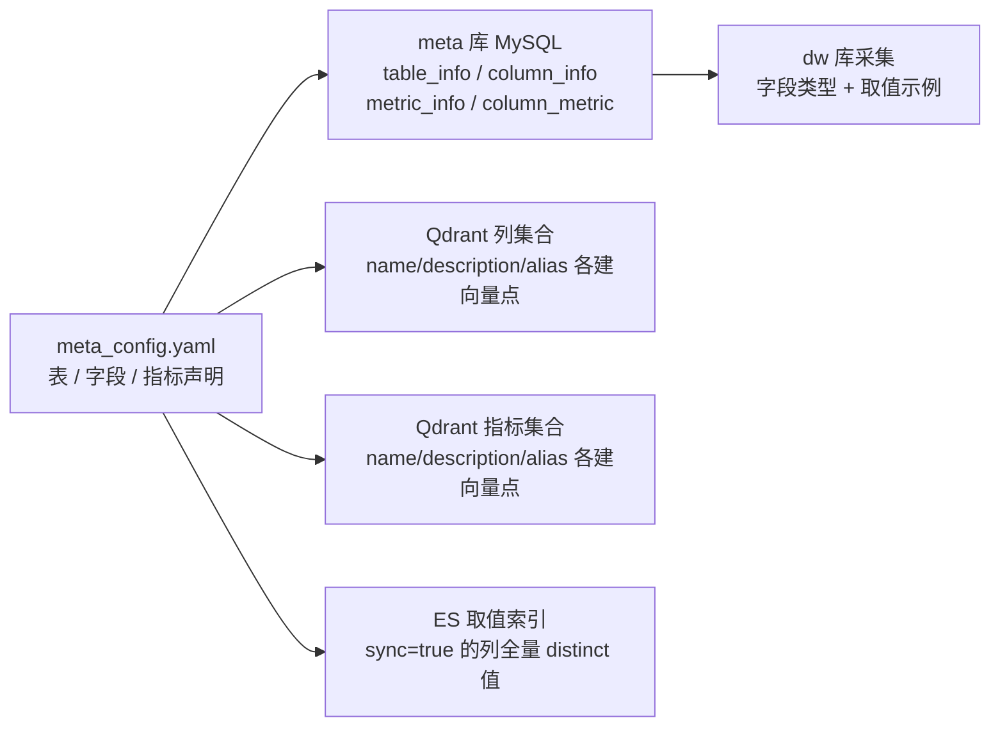
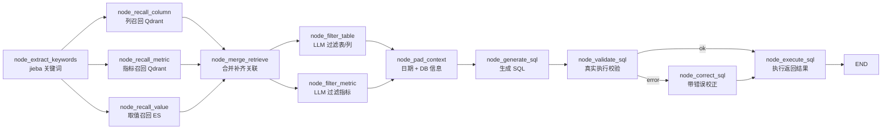

# rag_text2sql — 基于 LangGraph 的 RAG Text2SQL 数据查询智能体

> 面向**数据仓库 / 指标分析场景**的自然语言转 SQL 系统: 离线把库表元数据与指标知识建成**多级语义索引**, 在线将用户问题通过「关键词抽取 → 三级召回（列 / 指标 / 取值）→ LLM 过滤 → 生成 SQL → 执行校验」的 Agent 链路转换为可执行的 SQL 并返回结果。
>
> 核心思路: **元数据索引化（列 / 指标 / 字段取值三路 RAG）+ Schema Linking 过滤 + 生成-校验-校正闭环**。

---

## 1. 项目概览

| 能力 | 说明 |
|------|------|
| 元数据建模 | MySQL 双库（`meta` 元数据库 + `dw` 数仓）, yaml 声明式建模表 / 字段 / 指标 |
| 三级语义索引 | 列信息 / 指标信息向量化入 Qdrant, 字段取值全量同步入 ES, 供三路并行召回 |
| 自然语言查询 | jieba 关键词 + LLM 语义扩展 → 列 / 指标 / 取值并行召回 → 指标-字段关联补齐 → LLM 过滤无关表字段 |
| SQL 生成 | 基于召回 schema 的上下文生成, 附当前日期与数据库方言信息 |
| 校验闭环 | 真实执行校验 → 失败自动校正一次 → 再执行, SSE 流式返回执行结果 |
| 前端 | Vue 3 + Vite 聊天界面（步骤 / 结果表格 / 错误分型展示） |

### 技术栈

| 组件 | 技术 |
|------|------|
| 流程编排 | LangGraph 1.x（StateGraph, 单图 9 节点, `stream_mode="custom"` 流式阶段上报） |
| LLM | DeepSeek（OpenAI 兼容, temperature=0）, 用于关键词扩展 / 过滤 / SQL 生成 / 校正 |
| Embedding | bge-large-zh-v1.5（1024 维）, 本地 OpenAI 兼容服务（TEI 风格, 端口 8088） |
| 向量库 | Qdrant（`rag-text2sql-column` / `rag-text2sql-metric` 两集合, 余弦距离） |
| 全文检索 | Elasticsearch（`rag-text2sql-value`, ik_max_word 分词, 存字段枚举取值） |
| 数据库 | MySQL（asyncmy 驱动, `meta` 元数据 + `dw` 业务数据, 端口 3307） |
| 日志 | loguru（文件轮转 + 控制台, request_id 链路关联） |
| 配置 | OmegaConf（dataclass 结构化校验, conf/*.yaml） |
| API 层 | FastAPI（端口 8200, POST `/api/query`, SSE 流式） |

---

## 2. 目录结构

```
project/rag_text2sql/
├── main.py                          # FastAPI 入口 (端口 8200)
├── app/
│   ├── agent/                       # Agent 编排层
│   │   ├── graph.py                 #   LangGraph 图定义 (9 节点 + 条件路由)
│   │   ├── state.py                 #   DataAgentState / 表结构 / 指标 等 TypedDict
│   │   ├── context.py               #   DataAgentContext (依赖注入到节点的仓库集合)
│   │   ├── llm.py                   #   LLM 单例
│   │   ├── prompt_loader.py         #   prompt 文件加载器
│   │   └── nodes/                   #   9 个节点 (见 §3.2)
│   │       ├── _1_extract_keywords.py
│   │       ├── _2_1_recall_column.py
│   │       ├── _2_2_recall_metric.py
│   │       ├── _2_3_recall_value.py
│   │       ├── _3_merge_retrieve.py
│   │       ├── _4_1_filter_table.py
│   │       ├── _4_2_filter_metric.py
│   │       ├── _5_pad_context.py
│   │       ├── _6_generate_sql.py
│   │       ├── _7_validate_sql.py
│   │       ├── _8_correct_sql.py
│   │       └── _9_execute_sql.py
│   ├── api/                         # FastAPI 接口层
│   │   ├── query_router.py          #   POST /api/query (SSE)
│   │   ├── query_schema.py          #   Pydantic 请求模型
│   │   └── dependencies.py          #   FastAPI 依赖注入 (仓库实例化)
│   ├── clients/                     # 基础设施客户端 (单例)
│   │   ├── mysql.py                 #   连接池 + 会话工厂 (dw_client / meta_client)
│   │   ├── qdrant.py                #   AsyncQdrantClient
│   │   ├── es.py                    #   AsyncElasticsearch
│   │   └── embedding.py             #   OpenAIEmbeddings -> TEI 兼容服务
│   ├── conf/                        # 配置结构定义
│   │   ├── app_config.py            #   运行时配置 AppConfig (OmegaConf)
│   │   └── meta_config.py           #   元数据声明配置 MetaConfig
│   ├── core/                        # 框架层
│   │   ├── lifespan.py              #   启动/关闭时初始化与释放客户端
│   │   ├── log.py                   #   loguru 配置 (request_id 注入)
│   │   └── context.py               #   ContextVar (request_id)
│   ├── models/                      # ORM / TypedDict 实体
│   │   ├── mysql.py                 #   table_info / column_info / metric_info / column_metric
│   │   ├── qdrant.py                #   ColumnInfoQdrant / MetricInfoQdrant
│   │   └── es.py                    #   ValueInfoEs
│   ├── repositories/                # 数据访问层 (按存储拆分)
│   │   ├── mysql/
│   │   │   ├── meta.py              #   元数据库 CRUD (全量重建幂等 / 主外键查询)
│   │   │   └── dw.py                #   数仓只读查询 (类型 / 取值 / SQL 执行)
│   │   ├── qdrant/
│   │   │   ├── column.py            #   字段集合: 重建 / 批量 upsert / 向量检索 (阈值 0.6)
│   │   │   └── metric.py            #   指标集合: 重建 / 批量 upsert / 向量检索 (阈值 0.7)
│   │   └── es/
│   │       └── value.py             #   取值索引: 重建 / 批量写入 / ik 分词检索
│   ├── services/                    # 业务服务层
│   │   ├── meta.py                  #   元数据索引构建 MetaService (yaml -> 三存储)
│   │   └── query.py                 #   查询服务 QueryService (图执行 + SSE)
│   └── scripts/
│       └── build_meta.py            #   元数据索引构建入口
├── conf/                            # 本地私有配置 (根 .gitignore *.yaml 已忽略, 不提交)
│   ├── app_config.yaml              #   运行时配置: 数据库 / Qdrant / ES / Embedding / LLM
│   └── meta_config.yaml             #   元数据声明: 表字段与指标的语义建模
├── prompts/                         # 提示词模板 (节点名 .prompt)
│   ├── extend_keywords_for_column_recall.prompt  # 列语义扩展 (Schema 推断专家)
│   ├── extend_keywords_for_metric_recall.prompt  # 指标概念扩展
│   ├── extend_keywords_for_value_recall.prompt   # 取值候选扩展
│   ├── filter_table_info.prompt                  # 表/字段裁剪 (查询规划专家)
│   ├── filter_metric_info.prompt                 # 指标裁剪
│   ├── generate_sql.prompt                       # SQL 生成
│   ├── correct_sql.prompt                        # SQL 错误校正
│   └── plan_sql.prompt                           # (实验性) 查询规划, 暂未挂载
├── frontend/                       # Vue 3 + Vite 前端 (端口 8201, /api 代理到 8200)
│   └── src/App.vue                 #   单文件聊天页: 步骤流 / 结果表格 / 错误展示
└── logs/                           # 运行日志 (app.log, 本地, 不提交)
```

### 分层设计

```
main / api (FastAPI 路由 + 依赖注入)
  └─> agent (LangGraph 图 / 节点)          ← 只做状态流转 + stream_writer 阶段上报
        └─> repositories (数据访问层)       ← 具体存储实现, 逐步日志
              └─> clients / conf / models  ← 基础设施单例 + 配置 + 实体
```

查询侧没有独立的「服务实现层」: 业务逻辑即图节点本身, 存储访问收敛在 repository, 与 rag_knowledge 的「节点-服务」两层结构略有差异（该项目的节点直接调用 repository）。每个节点可单独以 `python -m` 方式调试（无 `__main__` 的节点可参照 `app.agent.graph` 的测试入口）。

---

## 3. 核心流程

系统分为两个阶段: **离线元数据索引构建**（对 `meta_config.yaml` 建模的三类知识建立三级索引）与**在线查询 Agent**（单图 9 节点）。

### 3.1 元数据索引构建 — `python -m app.scripts.build_meta`



| 步骤 | 实现 | 关键细节 |
|------|------|----------|
| 加载配置 | `MetaService.build` | OmegaConf 加载 + dataclass 结构化校验 |
| 表字段入 meta 库 | `_save_table_info_to_meta_db` | `dw_mr` 采集每列**类型**（`SHOW COLUMNS`）与**取值示例**（`distinct ... limit 10`, 写入 `examples` JSON）; meta 库保存前先 `delete` 全表再写入, **重复构建幂等** |
| 字段向量入 Qdrant | `_save_column_info_to_qdrant` | 每个字段的 `name` / `description` / 每条 `alias` 各生成一个向量点（payload 相同, id 随机 uuid）, 批量 10 个 embedding → upsert; 24 个字段约 98 个向量点 |
| 取值入 ES | `_save_column_value_to_es` | 仅 `sync: true` 的维度列（如 `province` / `category` / `brand`）, 从 dw 拉取**全量 distinct 值**（上限 100000）写入 ES, `value` 字段 ik_max_word 分词 |
| 指标入 meta + Qdrant | `save_metric_info_to_meta_db` + `_save_metric_info_to_qdrant` | 指标表 + 指标-字段关联表（`column_metric`, 支撑 merge 阶段**按指标补列**）; 指标同样按 name/description/alias 三路向量点入库 |

> 知识模型三类: **表/字段**（角色区分 `primary_key` / `foreign_key` / `dimension` / `measure`）、**指标**（`GMV` / `AOV` 等, 声明关联字段与别名）、**字段取值**（维度列枚举值）。字段与指标的 id 采用业务唯一键（`表名.字段名` / 指标名）, ES 文档 id 为 `字段id.取值`, 便于追溯去重。

### 3.2 查询 Agent — 在线自然语言转 SQL



> `extract_keywords` 之后, LangGraph 并行执行三路召回, 汇总到 `merge_retrieve`; 同理 `merge_retrieve` 后并行执行表过滤与指标过滤。

| 节点 | 职责 | 关键细节 |
|------|------|----------|
| `extract_keywords` | jieba 关键词抽取 | `extract_tags(topK=20)`, 词性白名单（名词/地名/机构/动词/英文/成语等）; 把**完整问题也并入关键词**避免分词丢语义 |
| `recall_column` | 字段语义召回（Qdrant） | ① LLM 按 `extend_keywords_for_column_recall` 扩展**列级业务字段名**（Schema 推断: 时间/人群/状态等语义必须补对应字段）→ ② 每个关键词 embedding 后检索列集合（`score_threshold=0.6`, 默认 top10）→ ③ 按 payload `id` 去重（同列多个别名向量点可能重复命中） |
| `recall_metric` | 指标概念召回（Qdrant） | ① LLM 扩展**指标概念关键词**（度量目标 + 同义词, 如 成交额≈GMV）→ ② 检索指标集合（`score_threshold=0.7`, 阈值高于列）→ ③ 按 `id` 去重 |
| `recall_value` | 字段取值召回（ES） | ① LLM 扩展**取值候选**（枚举值/实体/时间语义词）→ ② 对每个关键词 `match` 检索 `value` 字段（ik 分词, 默认 10 条）→ ③ 按文档 `id` 去重 |
| `merge_retrieve` | 合并三路结果并补齐 | ① **指标→关联字段**: 召回指标的 `relevant_columns` 缺失时按 id 回 meta 库补列 ② **取值→所属列**: value 的 `column_id` 缺失时补列, 并把该 value 追加进列 `examples` ③ 对涉及的表**补主外键**（保证 JOIN 可行）④ 组装 `table_infos`（表→字段树）与 `metric_infos` |
| `filter_table` | LLM 裁剪表与字段 | `filter_table_info` prompt: 只能从候选中选择, 删掉未被实际使用的字段; 规则强制保留主外键关联、时间/人群/状态类语义字段; 输出 JSON `{表名: [字段...]}`, 代码按结果双向裁剪 |
| `filter_metric` | LLM 裁剪指标 | `filter_metric_info` prompt: 仅保留实际度量诉求对应指标, 可返回 `[]`（无度量时不选） |
| `pad_context` | 补充生成上下文 | 当前日期 `date` / 星期 / 季度（当日实取）+ dw 库 `SELECT VERSION()` 版本与方言（MySQL 8.0） |
| `generate_sql` | 生成 SQL | `generate_sql` prompt: 表/字段信息、指标口径、日期、方言全部 yaml 注入; 约束仅用真实表字段 / 只读 / 单条 / 无 Markdown 围栏 |
| `validate_sql` | 真实执行校验 | 直接对生成的 SQL 执行一次（不取结果）, 异常则写入 `error` 走 `correct_sql`, 否则置 `error=None` 执行 |
| `correct_sql` | 错误驱动校正 | `correct_sql` prompt: 注入错误信息最小修复, 强制保持原业务语义 / 结构稳定, 返回修正 SQL 后进入执行 |
| `execute_sql` | 执行并返回 | 执行 `text(sql)`, 结果以 `{"result": [...]}` 经 stream_writer 推送 SSE |

---

## 4. API 一览

服务入口: `python main.py`（项目根 `.venv`, 端口 8200, reload=True）。

| 方法 | 路径 | 说明 |
|------|------|------|
| POST | `/api/query` | 提问, body `{"query": "..."}`, SSE 流式返回: `{"stage": 阶段名}` / `{"result": 查询结果}` / `{"error": 错误}` |
| GET | `/docs` | FastAPI 自带 OpenAPI 文档 |

前端: `frontend/` 下 `npm run dev`（端口 8201, `/api` 代理到 8200）。

---

## 5. 快速开始

### 5.1 前置服务

| 服务 | 地址 | 说明 |
|------|------|------|
| MySQL | localhost:3307 | 两个库: `meta`（元数据）+ `dw`（数仓业务数据, 需预置星型模型样例数据: dim_region / dim_customer / dim_product / dim_date / fact_order） |
| Qdrant | localhost:6333 | 向量库, 运行时自动建集合 |
| Elasticsearch | localhost:9200 | 需安装 **ik 分词插件**（索引 mapping 使用 `ik_max_word`） |
| Embedding 服务 | localhost:8088 | OpenAI 兼容接口, 预加载 `BAAI/bge-large-zh-v1.5`（1024 维, 无鉴权） |

### 5.2 配置文件（本地私有, 不入库）

根目录 `.gitignore` 第 17 行 `*.yaml` 已忽略本子项目的 conf 文件, 需自行创建。参考结构:

```yaml
# conf/app_config.yaml —— 运行时配置
logging: { file: { enable: true, level: INFO, path: logs, rotation: "10 MB", retention: "7 days" },
           console: { enable: true, level: INFO } }
db_meta: { host: localhost, port: 3307, user: <user>, password: <pwd>, database: meta }
db_dw:   { host: localhost, port: 3307, user: <user>, password: <pwd>, database: dw }
qdrant:  { host: localhost, port: 6333, embedding_size: 1024,
           collection_name_column: rag-text2sql-column, collection_name_metric: rag-text2sql-metric }
embedding: { host: localhost, port: 8088, model: BAAI/bge-large-zh-v1.5 }
es: { host: localhost, port: 9200, index_name: rag-text2sql-value }
llm: { model_name: <模型名>, api_key: <密钥> }   # DeepSeek 等 OpenAI 兼容服务
```

```yaml
# conf/meta_config.yaml —— 元数据声明 (示意, 完整结构见 app/conf/meta_config.py)
tables:
  - name: dim_region
    role: dim                      # dim / fact
    description: 地区维度表, 用于描述订单发生的地理区域信息。
    columns:
      - name: province
        role: dimension            # primary_key / foreign_key / dimension / measure
        description: 订单所属的省份名称。
        alias: [ 省份, 省, 所在省份 ]
        sync: true                 # true: 全量取值同步到 ES, 供取值召回
metrics:
  - name: GMV
    description: 全称 Gross Merchandise Value, 表示所有订单的成交金额总和。
    relevant_columns: [ fact_order.order_amount ]   # 合并阶段按此补列
    alias: [ 成交总额, 订单总额 ]
```

### 5.3 构建与启动

```bash
# 0. 前置: 项目根目录 .venv 已含全部依赖 (asyncmy / qdrant-client / elasticsearch / langchain / langgraph / omegaconf / loguru / jieba 等)

# 1. 进入子项目目录 (代码以 app 为顶层包导入, 必须在子项目目录下运行)
cd project/rag_text2sql

# 2. 构建元数据索引 (幂等, 可重复执行; 依赖 MySQL meta/dw + Qdrant + ES + Embedding 服务)
python -m app.scripts.build_meta

# 3. 启动后端
python main.py            # http://127.0.0.1:8200

# 4. 启动前端 (可选)
cd frontend && npm install && npm run dev    # http://127.0.0.1:8201

# 5. 图级自测 (graph.py 自带测试入口, 问题: 统计华北地区的销售总额)
python -m app.agent.graph

# 6. curl 验证
curl -N -X POST http://127.0.0.1:8200/api/query -H "Content-Type: application/json" -d '{"query": "统计华北地区的销售总额"}'
```

---

## 6. 召回率 / 准确率偏低排查手册

> 本系统语境下: **召回率 = 回答问题所必需的列 / 表 / 指标是否都被找回来**（Schema Linking 查全）; **准确率 = 召回内容是否真正相关、生成 SQL 是否语义正确、执行结果是否可答所问**（查准）。
>
> 检索链路在查询日志 `logs/app.log` 中全量可查（每个节点 INFO 级输出中间结果）: `_1` 关键词 → `_2_1/_2_2/_2_3` 扩展后关键词与召回 id 列表 → `_3` 合并出的表集合 → `_4` 过滤结果 → `_6` 生成 SQL → `_7` 校验异常。按日志逐层对照即可定位丢在哪一层。

### 6.1 召回率低（必需的列 / 表 / 指标没捞回来）

| # | 可能原因 | 定位方法（看日志） | 解决方向 |
|---|----------|----------|----------|
| 1 | **元数据语义覆盖不足**（最根本） | 问题关键词与召回结果对不上, `_2_x` 返回空或缺失目标列 | 列向量点只有 `name / description / alias`, **examples 取值示例不参与列向量化**。改进: 给列补别名（`meta_config.yaml`）; 让 examples 参与向量文本; 检查 description 是否含口语高频说法（如"销售额"应在 `order_amount` 的 description/alias 中出现） |
| 2 | **指标库太薄 / 关联配错** | `_2_2` 召回的指标集合; 例: 问"卖了多少台"只召回 `GMV` 而非销量类指标 | 当前指标仅 2 个（GMV/AOV）, 无销量类指标定义; 且 `AOV` 描述为"平均订单金额", `relevant_columns` 却声明为 `order_quantity`, 声明与描述不一致会误导合并阶段补齐的字段。扩充指标并核对关联列 |
| 3 | **LLM 扩展关键词失败** | `_2_x` 日志中扩展列表为空或异常（历史出现过 `'NoneType' object is not subscriptable` 与"召回失败"） | 扩展是**整条链路的命门**: JSON 输出解析失败即节点抛异常短路全图。改进: 解析失败降级用原关键词; 对每个关键词独立 try 检索; 扩展 prompt 增加失败兜底 |
| 4 | **jieba 词性白名单过滤过狠** | `_1` 输出关键词缺失时间词/数词（白名单无 `t`/`m` 词性, "最近三个月 / 去年"易丢） | 白名单补时间词、数词; 当前已把完整 query 并入关键词缓解; 可改为 LLM 抽取 + jieba 双路合并 |
| 5 | **阈值 / TopK 截断** | 召回 id 列表无目标列, 但该列与关键词确实相关 | `_2_1` 阈值 0.6 / `_2_2` 阈值 **0.7**（指标更严, 描述文本短更易漏）; Qdrant `query_points` 未显式指定 `limit`, 每关键词仅取默认 top10。用测试集实测分数分布后调阈值 / 加大 limit / 做多关键词轮询合并 |
| 6 | **取值路只能捞到枚举值** | `_2_3` 命中 ES 的 value, 但列集合无对应别名（如 "iphone" 命中 `product_name` 取值但 `product_name` 列向量不含 iphone 语义） | 这是**设计使然的三级互补**: 值→列靠 `_3` 补列兜底。改进: 给高频值列的列向量叠加其取值向量（列语义 = name+description+alias+典型值）; ES 检索加 `column_name` 字段 boost, 提高值→列链路的健壮性 |
| 7 | **ES 取值索引只覆盖 sync=true 的列** | 目标过滤列（如日期、customer_name）无取值索引 | `meta_config.yaml` 确认列的 `sync` 标记; 时间维/ID 列是否同步需按业务取舍 |
| 8 | **指标补列依赖配置** | `_3` 合并出的表缺事实表 | 指标→关联列补齐依赖 `metric.relevant_columns` 声明完整; 声明缺失时靠主外键补充兜底, 但**指标计算列缺失则 SQL 无米下锅** |
| 9 | **知识库（dw 样例）本身不全** | 库中无对应表/数据 | 验证 dw 样例库覆盖度; 新增表后重跑 `build_meta` |

### 6.2 准确率低（召回内容不相关 / SQL 生成错误 / 结果不可信）

| # | 可能原因 | 定位方法（看日志） | 解决方向 |
|---|----------|----------|----------|
| 1 | **召回噪声进候选, LLM 过滤是唯一闸门** | `_3` 合并表集合包含无关表（别名短向量命中同义词, 如 `category.alias="分类"` 泛命中） | 阈值调优（见 6.1-5）; `_4_1` 过滤 prompt 已规则化（时间/人群/主外键必留、冗余必删）, 但候选过大时仍可能误留/误删。改进: 过滤前按关键词做一次**规则保底剪枝**, 与 LLM 结果取交集 |
| 2 | **过滤阶段误删必需字段 → 生成幻觉** | `_4_1` 结果中缺关键列, 而 `_6` 生成 SQL 仍出现该列 | 过滤输出与 `_1` 关键词/`_3` 合并结果**交叉校验**, 缺列则回退补齐再生成; 目前无此回退, LLM 可能编造未提供字段 |
| 3 | **指标口径与 SQL 语义脱节** | `_6` 生成的 SQL 聚合/过滤与 query 意图不符（问数量却 SUM 金额, 日志中"卖了多少台"一度召回 GMV 指标） | 指标元数据只有 description + 关联列, **无口径模板**（聚合函数/单位/过滤规则）; 扩展为「指标口径注册表」后在 generate prompt 中以规则注入, 减少 LLM 自行解读 |
| 4 | **校验只查执行, 不查语义** | `_7` 通过但结果明显错误（如丢 WHERE、忘 GROUP BY 维度） | `validate_sql` 仅真实执行一遍, 语法/运行通过即放行。改进: ① 校验 LIMIT/只读/未引用候选外字段等硬规则 ② 增加 LLM 语义一致性双检（SQL ↔ query ↔ 召回 schema） |
| 5 | **校正只有一轮, 无循环上限与兜底** | `correct_sql` 一次后仍失败则 `execute_sql` 返回 error（日志中 `division by zero` 跨多天反复出现） | 改为 `validate → correct` **最多 N 轮**后终止; 达到上限时输出"生成失败 + 最后错误", 而非裸错误流; 除零类运行时错误可在 prompt 中显式要求 `NULLIF` 防护 |
| 6 | **时间语义裸交给 LLM** | `_5` 只提供今天日期/季度; "去年 / 上季度 / 最近三个月"由 LLM 自译, 且 dim_date 与事实表关联方式未显式注入 | 增加**时间解析节点**: 相对时间 → 绝对区间并翻译成 `date_id BETWEEN` 条件; 事实表日期关联字段（外键）在 `_4` 后显式保留 |
| 7 | **无对话历史与澄清机制** | 歧义问题（"华北"指 region_name 还是 province 某值）直接生成 | 召回不确定时**追问澄清**（列出候选取值让用户选）或返回候选列表而非硬生成; 前端已有步骤流, 可扩展选择交互 |
| 8 | **无 few-shot 与历史复用** | 同类问题每次重新生成, 波动大 | 沉淀「query ↔ SQL 样例库」, 生成前检索相似问题作为 few-shot 注入; 同一会话内缓存 |
| 9 | **指标误用无法被检出** | 端到端无人核对结果与 query | 指标判定（要什么度量）与过滤（用哪些字段）分层输出可解释的**依据链**, 供前端/用户核验; 评估体系落地后自动检出（见 §7） |

---

## 7. 评估体系搭建建议（当前未落地）

系统目前无自动化评估（logs 中为手工试问记录）。Text2SQL 评估与纯 RAG 检索评估不同: 终点不是"答对", 而是 **SQL 可执行且结果正确**。建议自建轻量评测框架, 分三层建模:

### 7.1 评测分层与指标

| 层级 | 评测对象 | 建议指标 | 说明 |
|------|----------|----------|------|
| L1 Schema 召回 | `_2` 召回 + `_3` 合并 + `_4` 过滤后的表/列/指标集合 | 列精确率 / 列召回率 / 表必命中率 / 指标命中率 | 题库标注 **gold 列集合与 gold 表集合**; 对照三处输出分别算分, 可定位"召回丢列 vs 过滤误删" |
| L2 SQL 生成 | `_6` 生成 + `_7`/`_8` 校正后的最终 SQL | 可执行率（EX）/ 结果正确率（EEX: 与 gold SQL 执行结果逐行对比, 忽略列序）/ SQL 文本匹配率 | 参考 Spider / BIRD 的 execution accuracy 口径; 结果对比是**无模型的主观性指标**, 应为第一判据 |
| L3 端到端 | 最终结果对用户问题的回答质量 | LLM-as-Judge（正确性 / 完整性 / 口径明确性 1-5 分）或人工抽检 | 覆盖口径类问题（"销售额含退货吗"）与语义类问题 |

### 7.2 题库结构（golden dataset）

```json
{
  "query": "统计华北地区的销售总额",
  "gold_columns": ["fact_order.order_amount", "dim_region.region_name", "fact_order.region_id", "dim_region.region_id"],
  "gold_tables": ["fact_order", "dim_region"],
  "gold_metric": "GMV",
  "gold_sql": "SELECT SUM(fo.order_amount) FROM fact_order fo JOIN dim_region r ON fo.region_id = r.region_id WHERE r.region_name = '华北'",
  "notes": "口径: 按 region_name 归属, 非 province"
}
```

建议 30~50 条起步, 覆盖: 单表聚合 / 多表 JOIN 聚合 / 时间区间 / 相对时间 / 维度过滤值 / 指标别名问法 / 无指标列表型问题 / 歧义问题（记录预期行为）。

### 7.3 稳定性设计与落地路径

- **隔离 LLM 随机性**: L1 评测时对 `_1` 扩展关键词 / `_4` 过滤用固定输出注入（直接喂题库关键词或 patch LLM）, 让检索链路可复现; L2 生成层单独全量跑 LLM 看真实分布
- **逐节点快照**: 为每题记录 9 个节点的输入输出 JSON（一次执行收集全链 trace）, 指标异常时能直接定位到层
- **真实执行**: SQL 统一在只读事务 / `LIMIT` 保护下执行, 结果序列化对比
- 落地路径（三个里程碑）:
  1. 题库 + 执行器脚本（跑题 → 收集 trace → 算 L1/L2 指标 → 落盘 JSON 报告）
  2. 基线报告 + 分层定位（调阈值 / 改 prompt 后重跑对比基线, 全部指标量化）
  3. 接入 L3 LLM-Judge 与 CI（提交前跑 50 题回归, 失败即拦截）

> 成熟后可与 rag_knowledge 的 `rag_eval` 思路对齐: 统一入口类 + 报告落盘 `artifacts/`, 但指标口径需按 Text2SQL 语义另行定义（见 §7.1）。

---

## 8. 可拓展与改进点

按优先级排序（低序号先做）, 每项给出方案参考。

### 8.1 建立 Text2SQL 评测闭环

- **问题**: 无量化手段, 调参/改 prompt 全凭手工试问（§7 已给完整方案）。
- **方案参考**: 按 §7.3 里程碑落地; 召回阈值（0.6 / 0.7）、TopK、prompt 版本的每次变更都留基线对比。

### 8.2 空召回与失败兜底

- **问题**: 三路召回全空或过滤后为空时, 仍进入 generate_sql → LLM 在空 schema 上必然幻觉。
- **方案参考**: `_3` 后增加路由: 表集合为空 → 直接输出"无法定位可用数据表"并结束, 或带关键词二次宽召回（降阈值重试一次）; 图级 HITL（interrupt 让用户补充）。

### 8.3 召回质量增强（列语义 + 混合检索）

- **问题**: 列向量只含 name/description/alias（§6.1-1）; 单路稠密检索对专有名词/缩写不敏感。
- **方案参考**: 列向量文本追加 **examples 典型值**; Qdrant 引入 **BM25 稀疏向量**（`QdrantSparse`）做向量+关键词双路; ES 取值路补 `column_name` / `column_description` 多字段 `multi_match` + boost, 提高值→列链路。

### 8.4 SQL 语义一致性双检与多轮校正

- **问题**: 校验只查执行不查语义, 校正仅一轮（§6.2-4/5）。
- **方案参考**: `_7` 后增加规则检查（强制 LIMIT / 只读白名单 / 字段名 ∈ 候选集）; `_8` 循环上限 N=3; 最后增加一次 LLM 复核节点: 把 query、SQL、召回 schema 三者对照, 输出一致/不一致原因。

### 8.5 指标口径注册表升级

- **问题**: 指标仅 description + 关联列, 口径靠 LLM 自解（§6.2-3）。
- **方案参考**: 扩展 `MetricConfig` 为完整口径模型（`aggregation` / `measure_column` / `filters` / `date_column` / `单位` / `口径说明`）, 并在 generate prompt 中以「指标计算规则」结构化注入; 支持指标模板（周同比 / 月环比）。

### 8.6 时间语义显式化

- **问题**: 相对时间与 dim_date 关联裸交给 LLM（§6.2-6）。
- **方案参考**: `_5` 升级为时间解析节点（正则 + LLM 双重识别相对时间 → 绝对 `[start, end]`）; 生成 SQL 时注入显式区间与日期外键链（`fact_order.date_id → dim_date`）。

### 8.7 澄清交互与可解释性

- **问题**: 歧义直接硬生成（§6.2-7）。
- **方案参考**: `_4` 前对命中多取值/多候选列（如"华北"既可能是 region 也可能是 province 取值）生成候选问题列表, interrupt 用户选择后继续; 前端渲染步骤链已具备, 补 SQL 展示与"为什么选这张表"的依据摘要。

### 8.8 few-shot 与查询缓存

- **问题**: 同构问题每次全量重跑, 成本高且结果波动（§6.2-8）。
- **方案参考**: 维护「query embedding ↔ 成功 SQL」样例库, 生成前相似检索 top3 注入 generate prompt; 高置信同问题直接缓存结果（Redis）。

### 8.9 工程化收尾

- **问题**: 配置明文（conf/*.yaml 虽被 gitignore, 仍含密码与密钥）、无测试、prompt 存在实验性遗留（`plan_sql.prompt` 未挂载）。
- **方案参考**: 敏感项迁移环境变量（与子项目 `.env` 模式对齐, 提供 `.env.example`）; 补元数据构建与单节点的自动化测试（HTTP seam / mock 存储）; 清理未用 prompt; 分支开发走根仓库 pre-commit 规范。

---

> 最后更新: 2026-09-07
