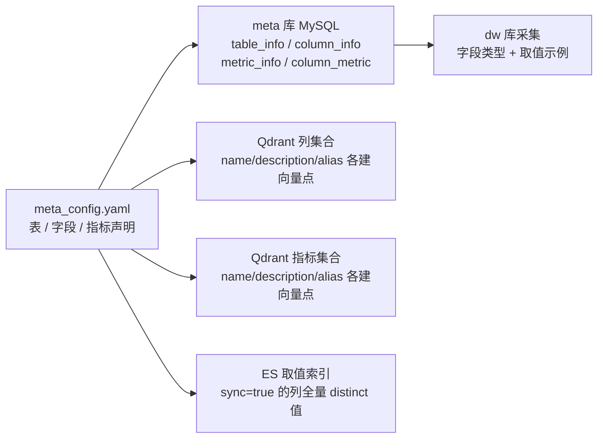
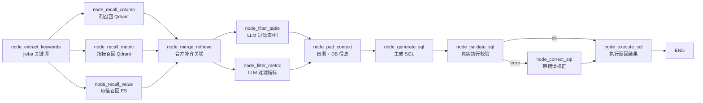

# rag_text2sql — 基于 LangGraph 的 RAG Text2SQL 数据查询智能体

> 面向**数据仓库 / 指标分析场景**的自然语言转 SQL 系统: 离线把库表元数据与指标知识建成**多级语义索引**, 在线将用户问题通过「关键词抽取 → 三级召回（列 / 指标 / 取值）→ LLM 过滤 → 生成 SQL → 执行校验」的 Agent 链路转换为可执行的 SQL 并返回结果。
>
> 核心思路: **元数据索引化（列 / 指标 / 字段取值三路 RAG）+ Schema Linking 过滤 + 生成-校验-校正闭环**。

---

## 速览（门面）

**一行启动**（依赖 MySQL 3307 双库 + Qdrant + Elasticsearch（ik 分词）+ Embedding 服务, 明细见 §5）:

```bash
cd project/rag_text2sql && python main.py          # http://127.0.0.1:8200
```

```text
浏览器（Vue 3, 8201）
   │ POST /api/query（SSE 步骤流）
   ▼
FastAPI :8200 ──► LangGraph 单图: 12 个节点 / 9 个逻辑阶段（§3.2）
   │   关键词 → 三路召回（列/指标/取值）→ 合并补齐 → LLM 过滤 → 生成 → 校验 → 校正 → 执行
   ├──► Qdrant（列 / 指标向量）   ├──► ES（字段取值）   └──► MySQL（meta 元数据 + dw 数仓）
```

**两个数字**（评估口径, 详见 §7）: **L1 列召回率 90.5% · L2 SQL 可执行率 100%**（39 题 × 3 次, 真模型）。

**已实现 vs 未实现** —— 状态: ✅ 已实现 · 🟡 部分 · ⬜ 未做

| 能力 | 状态 | 一句话 |
|------|------|--------|
| 元数据三级索引 | ✅ | `meta_config.yaml` 声明式建模 → meta 库 + Qdrant（列 / 指标按 name/description/alias 各建向量点）+ ES（`sync` 列全量取值）, 幂等重建（§3.1） |
| 查询链路 | ✅ | 单图 12 节点 / 9 阶段, SSE 阶段上报; 召回 / 合并 / 过滤 / 生成 / 校验 / 校正 / 执行（§3.2） |
| **执行护栏**（C16） | ✅ | 只读白名单（含可执行注释 `/*!*/` 与 `--x` 两个绕过点的处置）+ LIMIT 补齐/收紧 + 只读事务 + 语句预算 + LLM 调用预算（§3.3） |
| **评估体系**（C15） | ✅ | golden set 39 题（人工写 + 人工确认口径）+ L1/L2 报告 + 每题 3 次与臂内极差 + EEX + `--merge-into` 复跑并回（§7） |
| **召回优化**（C18） | ✅ | 三路召回节点从「逐关键词串行」改成一次批量嵌入 + 带上限并发; P50 **−37% / −46% / −55%**, 召回 id 集合零变化（§3.4） |
| L3 端到端质量 | ⬜ | LLM-as-judge **不做**（引 judge 会把非确定性引进判据）; 报告如实写明（§7.2） |
| SQL 语义一致性 | ⬜ | 校验只查执行不查语义; 校正**只有一轮**、无循环上限（§8.4） |
| 澄清交互 | ⬜ | 歧义问题直接硬生成; 不设计歧义题（决策见 §7.3） |
| 时间语义 | ⬜ | 相对时间裸交给 LLM, 无时间解析节点（§8.6） |
| 引用 / 可解释性 | ⬜ | 无「为什么选这张表」的依据链（§8.7） |

**关键决策**（每条一行, 细节见括号里的出处）:

1. **golden set 人工写问题 + 人工确认口径, 绝不用系统跑通的 SQL 反推** —— 反推等于把当前缺陷固化成"正确答案"（§7.3, PLAN D4）。
2. **打真模型、每题跑 N 次、报告给臂内极差** —— 一次跑出来的差不能当结论（L4 的教训）；LLM-as-judge 不做（§7.2 / §7.4）。
3. **护栏落在「执行咽喉」而不是节点里** —— `DwMysqlRepository` 一处实现同时覆盖校验与执行两个节点, 跑批器复用同一份；被拒理由是给校正节点看的可操作文本（§3.3）。
4. **LIMIT 用文本补 / 收, 不用派生表包裹** —— 外层包裹会把两表同名列的合法 JOIN 变成 1060 语法错（实测）（§3.3）。
5. **只读事务是兜底, 不是唯一闸** —— asyncmy 默认开着 `MULTI_STATEMENTS`（实测 `SELECT 1; SELECT 2` 都执行）, 所以「只允许单条语句」是承重判据（§3.3）。
6. **LLM 重试交给 SDK 的 `max_retries`**（判据同源: 只重瞬态）, 不自己再包一层退避（§3.3）。
7. **要 A/B 就先冻住 LLM** —— 关键词扩展的结果冻结重放、精排打分落盘后离线扫参: LLM 抖动不该混进对照（§3.4）。

**测试规模**: **208 个用例**, 全部**离线可跑**（假 repository + httpx 假上游, 不连 MySQL / Qdrant / ES / 模型）。

```bash
cd project/rag_text2sql && python -m pytest
```

**已知边界**: 详见 §6（召回率 / 准确率偏低排查手册）与 §8（改进点）。三条最要紧的 —— ① 校正只有一轮、无循环上限与兜底（§8.4/§6.2-5）· ② 时间语义裸交给 LLM, 相对时间没有显式解析（§8.6）· ③ 无澄清机制, 歧义问题硬生成（§8.7）。另: 配置在本地私有 `conf/*.yaml`, 本子项目**不依赖 `.env`**（§5.2）。

---

## 1. 项目概览

| 能力 | 说明 |
|------|------|
| 元数据建模 | MySQL 双库（`meta` 元数据库 + `dw` 数仓）, yaml 声明式建模表 / 字段 / 指标 |
| 三级语义索引 | 列信息 / 指标信息向量化入 Qdrant, 字段取值全量同步入 ES, 供三路并行召回 |
| 自然语言查询 | jieba 关键词 + LLM 语义扩展 → 列 / 指标 / 取值并行召回 → 指标-字段关联补齐 → LLM 过滤无关表字段 |
| SQL 生成 | 基于召回 schema 的上下文生成, 附当前日期与数据库方言信息 |
| 校验闭环 | 真实执行校验 → 失败自动校正一次 → 再执行, SSE 流式返回执行结果 |
| 前端 | Vue 3 + Vite 聊天界面（步骤 / 结果表格 / 错误分型展示） |

### 技术栈

| 组件 | 技术 |
|------|------|
| 流程编排 | LangGraph 1.x（StateGraph, 单图 **12 个节点 / 9 个逻辑阶段**, `stream_mode="custom"` 流式阶段上报） |
| LLM | DeepSeek（OpenAI 兼容, temperature=0）, 用于关键词扩展 / 过滤 / SQL 生成 / 校正 |
| Embedding | bge-large-zh-v1.5（1024 维）, 本地 OpenAI 兼容服务（TEI 风格, 端口 8088） |
| 向量库 | Qdrant（`rag-text2sql-column` / `rag-text2sql-metric` 两集合, 余弦距离） |
| 全文检索 | Elasticsearch（`rag-text2sql-value`, ik_max_word 分词, 存字段枚举取值） |
| 数据库 | MySQL（asyncmy 驱动, `meta` 元数据 + `dw` 业务数据, 端口 3307） |
| 日志 | loguru（文件轮转 + 控制台, request_id 链路关联） |
| 配置 | OmegaConf（dataclass 结构化校验, conf/*.yaml） |
| API 层 | FastAPI（端口 8200, POST `/api/query`, SSE 流式） |

---

## 2. 目录结构

```
project/rag_text2sql/
├── main.py                          # FastAPI 入口 (端口 8200)
├── app/
│   ├── agent/                       # Agent 编排层
│   │   ├── graph.py                 #   LangGraph 图定义 (12 节点 + 条件路由)
│   │   ├── state.py                 #   DataAgentState / 表结构 / 指标 等 TypedDict
│   │   ├── context.py               #   DataAgentContext (依赖注入到节点的仓库集合)
│   │   ├── llm.py                   #   LLM 单例
│   │   ├── prompt_loader.py         #   prompt 文件加载器
│   │   └── nodes/                   #   12 个节点 / 9 个逻辑阶段 (见 §3.2)
│   │       ├── _1_extract_keywords.py
│   │       ├── _2_1_recall_column.py
│   │       ├── _2_2_recall_metric.py
│   │       ├── _2_3_recall_value.py
│   │       ├── _3_merge_retrieve.py
│   │       ├── _4_1_filter_table.py
│   │       ├── _4_2_filter_metric.py
│   │       ├── _5_pad_context.py
│   │       ├── _6_generate_sql.py
│   │       ├── _7_validate_sql.py
│   │       ├── _8_correct_sql.py
│   │       └── _9_execute_sql.py
│   ├── api/                         # FastAPI 接口层
│   │   ├── query_router.py          #   POST /api/query (SSE)
│   │   ├── query_schema.py          #   Pydantic 请求模型
│   │   └── dependencies.py          #   FastAPI 依赖注入 (仓库实例化)
│   ├── clients/                     # 基础设施客户端 (单例)
│   │   ├── mysql.py                 #   连接池 + 会话工厂 (dw_client 带只读档案 / meta_client)
│   │   ├── qdrant.py                #   AsyncQdrantClient
│   │   ├── es.py                    #   AsyncElasticsearch
│   │   └── embedding.py             #   OpenAIEmbeddings -> TEI 兼容服务
│   ├── conf/                        # 配置结构定义
│   │   ├── app_config.py            #   运行时配置 AppConfig (OmegaConf)
│   │   └── meta_config.py           #   元数据声明配置 MetaConfig
│   ├── core/                        # 框架层
│   │   ├── lifespan.py              #   启动/关闭时初始化与释放客户端
│   │   ├── log.py                   #   loguru 配置 (request_id 注入)
│   │   ├── context.py               #   ContextVar (request_id)
│   │   └── sql_guard.py             #   SQL 护栏判据 (只读白名单 / LIMIT 补齐收紧)
│   ├── models/                      # ORM / TypedDict 实体
│   │   ├── mysql.py                 #   table_info / column_info / metric_info / column_metric
│   │   ├── qdrant.py                #   ColumnInfoQdrant / MetricInfoQdrant
│   │   └── es.py                    #   ValueInfoEs
│   ├── repositories/                # 数据访问层 (按存储拆分)
│   │   ├── mysql/
│   │   │   ├── meta.py              #   元数据库 CRUD (全量重建幂等 / 主外键查询)
│   │   │   └── dw.py                #   数仓只读查询; 模型生成的 SQL 从这里过护栏
│   │   ├── qdrant/
│   │   │   ├── column.py            #   字段集合: 重建 / 批量 upsert / 向量检索 (阈值 0.6)
│   │   │   └── metric.py            #   指标集合: 重建 / 批量 upsert / 向量检索 (阈值 0.7)
│   │   └── es/
│   │       └── value.py             #   取值索引: 重建 / 批量写入 / ik 分词检索
│   ├── services/                    # 业务服务层
│   │   ├── meta.py                  #   元数据索引构建 MetaService (yaml -> 三存储)
│   │   └── query.py                 #   查询服务 QueryService (图执行 + SSE)
│   ├── eval/                        # 评估体系 (C15, 见 §7)
│   │   ├── golden.py                #   题库加载与严格校验
│   │   ├── golden_set.yaml          #   39 题 (人工写问题 + 人工确认口径, 随仓库提交)
│   │   ├── metrics.py               #   L1 计分 / 极差 / EEX 结果比对 (纯函数)
│   │   ├── runner.py                #   跑批器 + CLI (--check-gold 验题库 / --merge-into 复跑并回)
│   │   ├── latency.py               #   召回节点耗时测量 + CLI (C18, 见 §3.4)
│   │   ├── fixtures/                #   冻结的关键词扩展结果 (重放用, 见 §3.4)
│   │   ├── report.py                #   JSON + Markdown 双报告渲染
│   │   └── reports/                 #   落盘报告 (baseline.json/md + after-c16.json/md
│   │                                #   + latency_recall_{before,after}.json)
│   └── scripts/
│       └── build_meta.py            #   元数据索引构建入口
├── conf/                            # 本地私有配置 (根 .gitignore *.yaml 已忽略, 不提交)
│   ├── app_config.yaml              #   运行时配置: 数据库 / Qdrant / ES / Embedding / LLM
│   └── meta_config.yaml             #   元数据声明: 表字段与指标的语义建模
├── prompts/                         # 提示词模板 (节点名 .prompt)
│   ├── extend_keywords_for_column_recall.prompt  # 列语义扩展 (Schema 推断专家)
│   ├── extend_keywords_for_metric_recall.prompt  # 指标概念扩展
│   ├── extend_keywords_for_value_recall.prompt   # 取值候选扩展
│   ├── filter_table_info.prompt                  # 表/字段裁剪 (查询规划专家)
│   ├── filter_metric_info.prompt                 # 指标裁剪
│   ├── generate_sql.prompt                       # SQL 生成
│   └── correct_sql.prompt                        # SQL 错误校正
├── frontend/                       # Vue 3 + Vite 前端 (端口 8201, /api 代理到 8200)
│   └── src/App.vue                 #   单文件聊天页: 步骤流 / 结果表格 / 错误展示
└── logs/                           # 运行日志 (app.log, 本地, 不提交)
```

### 分层设计

```
main / api (FastAPI 路由 + 依赖注入)
  └─> agent (LangGraph 图 / 节点)          ← 只做状态流转 + stream_writer 阶段上报
        └─> repositories (数据访问层)       ← 具体存储实现, 逐步日志
              └─> clients / conf / models  ← 基础设施单例 + 配置 + 实体
```

查询侧没有独立的「服务实现层」: 业务逻辑即图节点本身, 存储访问收敛在 repository, 与 rag_knowledge 的「节点-服务」两层结构略有差异（该项目的节点直接调用 repository）。每个节点可单独以 `python -m` 方式调试（无 `__main__` 的节点可参照 `app.agent.graph` 的测试入口）。

---

## 3. 核心流程

系统分为两个阶段: **离线元数据索引构建**（对 `meta_config.yaml` 建模的三类知识建立三级索引）与**在线查询 Agent**（单图 12 个节点 / 9 个逻辑阶段）。

### 3.1 元数据索引构建 — `python -m app.scripts.build_meta`


```mermaid
graph LR
    A[meta_config.yaml<br/>表 / 字段 / 指标声明] --> B[meta 库 MySQL<br/>table_info / column_info<br/>metric_info / column_metric]
    B --> C[dw 库采集<br/>字段类型 + 取值示例]
    A --> D[Qdrant 列集合<br/>name/description/alias 各建向量点]
    A --> E[Qdrant 指标集合<br/>name/description/alias 各建向量点]
    A --> F[ES 取值索引<br/>sync=true 的列全量 distinct 值]
```

| 步骤 | 实现 | 关键细节 |
|------|------|----------|
| 加载配置 | `MetaService.build` | OmegaConf 加载 + dataclass 结构化校验 |
| 表字段入 meta 库 | `_save_table_info_to_meta_db` | `dw_mr` 采集每列**类型**（`SHOW COLUMNS`）与**取值示例**（`distinct ... limit 10`, 写入 `examples` JSON）; meta 库保存前先 `delete` 全表再写入, **重复构建幂等** |
| 字段向量入 Qdrant | `_save_column_info_to_qdrant` | 每个字段的 `name` / `description` / 每条 `alias` 各生成一个向量点（payload 相同, id 随机 uuid）, 批量 10 个 embedding → upsert; 24 个字段约 98 个向量点 |
| 取值入 ES | `_save_column_value_to_es` | 仅 `sync: true` 的维度列（如 `province` / `category` / `brand`）, 从 dw 拉取**全量 distinct 值**（上限 100000）写入 ES, `value` 字段 ik_max_word 分词 |
| 指标入 meta + Qdrant | `save_metric_info_to_meta_db` + `_save_metric_info_to_qdrant` | 指标表 + 指标-字段关联表（`column_metric`, 支撑 merge 阶段**按指标补列**）; 指标同样按 name/description/alias 三路向量点入库 |

> 知识模型三类: **表/字段**（角色区分 `primary_key` / `foreign_key` / `dimension` / `measure`）、**指标**（`GMV` / `AOV` 等, 声明关联字段与别名）、**字段取值**（维度列枚举值）。字段与指标的 id 采用业务唯一键（`表名.字段名` / 指标名）；**ES 侧不做显式 `_id`**（bulk 时不传 `_id`, 由 ES 自动生成）, 去重靠文档体内的 `id` 字段。

### 3.2 查询 Agent — 在线自然语言转 SQL


```mermaid
graph LR
    A[node_extract_keywords<br/>jieba 关键词] --> B[node_recall_column<br/>列召回 Qdrant]
    A --> C[node_recall_metric<br/>指标召回 Qdrant]
    A --> D[node_recall_value<br/>取值召回 ES]
    B --> E[node_merge_retrieve<br/>合并补齐关联]
    C --> E
    D --> E
    E --> F[node_filter_table<br/>LLM 过滤表/列]
    E --> G[node_filter_metric<br/>LLM 过滤指标]
    F --> H[node_pad_context<br/>日期 + DB 信息]
    G --> H
    H --> I[node_generate_sql<br/>生成 SQL]
    I --> J[node_validate_sql<br/>真实执行校验]
    J -->|error| K[node_correct_sql<br/>带错误校正]
    J -->|ok| L[node_execute_sql<br/>执行返回结果]
    K --> L
    L --> X[END]
```

> `extract_keywords` 之后, LangGraph 并行执行三路召回, 汇总到 `merge_retrieve`; 同理 `merge_retrieve` 后并行执行表过滤与指标过滤。

| 节点 | 职责 | 关键细节 |
|------|------|----------|
| `extract_keywords` | jieba 关键词抽取 | `extract_tags(topK=20)`, 词性白名单（名词/地名/机构/动词/英文/成语等）; 把**完整问题也并入关键词**避免分词丢语义 |
| `recall_column` | 字段语义召回（Qdrant） | ① LLM 按 `extend_keywords_for_column_recall` 扩展**列级业务字段名**（Schema 推断: 时间/人群/状态等语义必须补对应字段）→ ② 每个关键词 embedding 后检索列集合（`score_threshold=0.6`, 默认 top10）→ ③ 按 payload `id` 去重（同列多个别名向量点可能重复命中） |
| `recall_metric` | 指标概念召回（Qdrant） | ① LLM 扩展**指标概念关键词**（度量目标 + 同义词, 如 成交额≈GMV）→ ② 检索指标集合（`score_threshold=0.7`, 阈值高于列）→ ③ 按 `id` 去重 |
| `recall_value` | 字段取值召回（ES） | ① LLM 扩展**取值候选**（枚举值/实体/时间语义词）→ ② 对每个关键词 `match` 检索 `value` 字段（ik 分词, 默认 10 条）→ ③ 按文档 `id` 去重 |
| `merge_retrieve` | 合并三路结果并补齐 | ① **指标→关联字段**: 召回指标的 `relevant_columns` 缺失时按 id 回 meta 库补列 ② **取值→所属列**: value 的 `column_id` 缺失时补列, 并把该 value 追加进列 `examples` ③ 对涉及的表**补主外键**（保证 JOIN 可行）④ 组装 `table_infos`（表→字段树）与 `metric_infos` |
| `filter_table` | LLM 裁剪表与字段 | `filter_table_info` prompt: 只能从候选中选择, 删掉未被实际使用的字段; 规则强制保留主外键关联、时间/人群/状态类语义字段; 输出 JSON `{表名: [字段...]}`, 代码按结果双向裁剪 |
| `filter_metric` | LLM 裁剪指标 | `filter_metric_info` prompt: 仅保留实际度量诉求对应指标, 可返回 `[]`（无度量时不选） |
| `pad_context` | 补充生成上下文 | 当前日期 `date` / 星期 / 季度（当日实取）+ dw 库 `SELECT VERSION()` 版本与方言（MySQL 8.0） |
| `generate_sql` | 生成 SQL | `generate_sql` prompt: 表/字段信息、指标口径、日期、方言全部 yaml 注入; 约束仅用真实表字段 / 只读 / 单条 / 无 Markdown 围栏 |
| `validate_sql` | 真实执行校验 | 直接对生成的 SQL 执行一次（不取结果）, 异常则写入 `error` 走 `correct_sql`, 否则置 `error=None` 执行; 执行前**过护栏**（白名单 + LIMIT, 见 §3.3）, 被拒时把可操作理由回填给校正节点 |
| `correct_sql` | 错误驱动校正 | `correct_sql` prompt: 注入错误信息最小修复, 强制保持原业务语义 / 结构稳定, 返回修正 SQL 后进入执行 |
| `execute_sql` | 执行并返回 | 执行 `text(sql)`, 结果以 `{"result": [...]}` 经 stream_writer 推送 SSE; 同样**过护栏** |

### 3.3 执行护栏（C16）

链路执行的是**模型生成的 SQL**，所以「能不能进数据库」不靠 prompt 里的一句话，而是三层闸门：

| 层 | 位置 | 行为 |
|----|------|------|
| **语句级白名单** | `app/core/sql_guard.py` + `DwMysqlRepository` | 只放行单条 `SELECT` / `WITH` 查询（词表挡藏在子句里的写操作、开头判定挡多语句）；扫描前先屏蔽字符串字面量与**惰性**注释，避免误杀；**被拒的语句不下发数据库**，拒绝理由是给校正节点看的可操作文本 |
| **LIMIT 补齐 / 收紧** | 同上 | 没有 `LIMIT` 的查询在末尾补默认 200；带 `LIMIT` 超过上限 1000 的收紧到上限；都没超就原样放行。**只动数字、不重写语句**（早先的派生表包裹会让两表同名列的合法 JOIN 报 1060）；留痕记「补过 / 收紧过 / 原样」 |
| **数据库侧兜底** | `app/clients/mysql.py` 的 dw 连接档案 | 每个池连接建立时就 `SET SESSION TRANSACTION READ ONLY` + `max_execution_time`（默认 10s）+ `read_timeout` / `connect_timeout`；写操作报 1792，慢查询报 3024 且连接仍可用 |

四个实测出来的细节，都写进了判据与用例：

- **`/*! … */` 是可执行注释**：MySQL 会执行里面的内容，所以它不能被当作惰性注释屏蔽掉（否则 `SELECT 1 /*!80000 ; DROP … */` 能绕过白名单）；同理 `--x` 在 MySQL 里不是注释（要求 `--` 后跟空白），把它当注释会让后面的内容隐形
- **asyncmy 默认开着 `MULTI_STATEMENTS`**（实测 `SELECT 1; SELECT 2` 两条都执行）—— 所以白名单里「只允许单条语句」那条检查是承重的，不是形式
- 只读事务连 `SELECT ... FOR UPDATE` 这类锁定读也一并拒掉（1792）
- 被 `max_execution_time` 掐断的只是那条语句，**连接不会废**，校正节点能接着走（3024 之后同一会话照常查询）

单节点重试与 LLM 预算：`DwMysqlRepository` 只在**连接失效**时重试一次（语句错不重试，它该走校正节点）；LLM 调用显式给了 `timeout`（默认 60s）与 `max_retries`（默认 2，交给 OpenAI SDK —— 只重 429/5xx/连接/超时，外加 408/409 这两个幂等可重的，其余 4xx 直接放弃）。

### 3.4 召回节点的延迟拆解（C18）

三路召回节点内部此前是**逐关键词串行**：每个关键词一次 `aembed_query` + 一次检索，N 个关键词就是 2N 个 RTT 相加。关键词个数实测（39 题，去重后**实际送检索**的个数）：jieba 那层 2~7 个（中位 4）；加上 LLM 扩展词后列召回 3~8（中位 5）、指标召回 7~16（中位 11）、取值召回 2~10（中位 4）。C18 改成**一次批量嵌入 + 带上限地并发检索**，上限是 `app_config.recall.concurrency`（默认 4）。

量法：`python -m app.eval.latency`（39 题 × 5 次，2026-10-06，报告落盘 `app/eval/reports/latency_recall_{before,after}.json`）：

```bash
cd project/rag_text2sql
python -m app.eval.latency --capture                # 抓一次冻结词表 (要真 LLM, 约 20 分钟)
python -m app.eval.latency --mode recall --repeat 5 # 只量「嵌入 + 检索」: A/B 用这一档
```

**为什么这里的数字只来自 recall 档**：节点里还有一次**真 LLM** 的关键词扩展调用
（实测 1.5~5.1 秒、上游偶发挂起时会飙到 20 秒以上），它的随机性会盖住被改的那几百毫秒。
`--mode recall` 把那次调用换成**冻结结果** —— 前后两趟输入完全一致，差只可能来自代码。

`--mode node` 保留着（跑整个节点、含真 LLM，想看"线上一个节点大概几秒"时用它），
**但它的报告不入库、也不要拿来做前后对照**：两趟的输入不同、LLM 抖动可达 20 秒，
摆在一起看会得出反的结论（2026-10-06 真被这么读过一次，报告已从仓库移走）。
它落盘的文件里带一句 `notes` 写着这件事。

| 节点 | 优化前 P50 / P95 (ms) | 优化后 P50 / P95 (ms) | P50 变化 |
|------|----------------------|----------------------|----------|
| `recall_column` | 752 / 1172 | 473 / 772 | **−37%** |
| `recall_metric` | 1601 / 2063 | 870 / 1310 | **−46%** |
| `recall_value` | 22 / 36 | 10 / 15 | **−55%** |

> 表里是同一台机器上**连跑两趟**的第二趟；两趟的比例一致（−37/−46/−55 与 −34/−44/−49）。逐题配对（每题先取 5 次的**中位数**，再算「后 / 前」）的比值中位数是 **0.62 / 0.53 / 0.44**，39 题里**没有一题变慢**（最差的一题也只到 0.85）。机器负载会漂（同一侧两趟之间的绝对值差 15%~36%），所以看的是**同一趟的前后配对**，不是跨趟的绝对值。

**先看结果有没有被换掉，再看省了多少。** 117 组（39 题 × 3 节点）召回 id 的**集合全部一致**（一个没多、一个没少）；其中 30 组顺序不同 —— 那不是这次改动的产物：`merged_keywords = list(set(keywords + result))` 的迭代顺序由**进程内的字符串哈希**决定，同一份代码换一个进程重跑，40/117 组同样会顺序不同（实测）。顺序会影响「同一字段被多个关键词召回时留哪一份」，属既有行为，本票没动它。

**省不动的地方要如实说。** 剩下的大头是**嵌入推理本身**，不是并发度。微基准（同一台机器、TEI 服务、`bge-large-zh-v1.5`、CPU）：

| 调用 | 耗时 |
|------|------|
| `aembed_documents` × 1 条 | 110 ms |
| `aembed_documents` × 4 条 | 180 ms（45 ms/条） |
| `aembed_documents` × 8 条 | 336 ms（42 ms/条） |
| `aembed_query` 逐条 × 4 | 504 ms（126 ms/条） |

批量化省掉的是逐条调用那 2/3 的往返与排空开销；**再往上加并发没有意义** —— 检索本身很快（`recall_value` 那一路只有检索、没有嵌入，P50 只有 10 ms，单次检索约 1~2 ms），把上限从 4 调到 8 能省的只有几十毫秒的排队，代价却是把嵌入服务/向量库的连接池压力放大。真要再快只剩换更快的嵌入硬件或服务（GPU / 批内并行），那是部署问题不是代码问题。

<details>
<summary>那张微基准怎么复核（同一台机器，服务起着就能重跑）</summary>

```bash
cd project/rag_text2sql && python -c "
import asyncio, time
from app.clients.embedding import embedding_client
async def main():
    embedding_client.init(); emb = embedding_client.embeddings
    await emb.aembed_documents(['预热'])
    texts = ['销售总额','大区','销售额','成交额','总金额','订单数','客户数','省份']
    for n in (1, 4, 8):
        t0 = time.perf_counter(); await emb.aembed_documents(texts[:n])
        print(n, round((time.perf_counter()-t0)*1000), 'ms')
    t0 = time.perf_counter()
    for t in texts[:4]: await emb.aembed_query(t)
    print('逐条 4:', round((time.perf_counter()-t0)*1000), 'ms')
asyncio.run(main())"
```
</details>

**这段优化在整条链里占多大分量**：召回节点整节的耗时大头是「关键词扩展」那次 LLM 调用（秒级起，
同一题两次跑能差几倍），召回段只在几百毫秒量级 —— 所以这次优化**改善的是那条链的稳定下限，
不是端到端秒数**。端到端的等待时间要动的是 LLM（并发、流式、缓存），不属于本票。

---

## 4. API 一览

服务入口: `python main.py`（项目根 `.venv`, 端口 8200, reload=True）。

| 方法 | 路径 | 说明 |
|------|------|------|
| POST | `/api/query` | 提问, body `{"query": "..."}`, SSE 流式返回: `{"stage": 阶段名}` / `{"result": 查询结果}` / `{"error": 错误}` |
| GET | `/docs` | FastAPI 自带 OpenAPI 文档 |

前端: `frontend/` 下 `npm run dev`（端口 8201, `/api` 代理到 8200）。

---

## 5. 快速开始

### 5.1 前置服务

| 服务 | 地址 | 说明 |
|------|------|------|
| MySQL | localhost:3307 | 两个库: `meta`（元数据）+ `dw`（数仓业务数据, 需预置星型模型样例数据: dim_region / dim_customer / dim_product / dim_date / fact_order） |
| Qdrant | localhost:6333 | 向量库, 运行时自动建集合 |
| Elasticsearch | localhost:9200 | 需安装 **ik 分词插件**（索引 mapping 使用 `ik_max_word`） |
| Embedding 服务 | localhost:8088 | OpenAI 兼容接口, 预加载 `BAAI/bge-large-zh-v1.5`（1024 维, 无鉴权） |

### 5.2 配置文件（本地私有, 不入库）

根目录 `.gitignore` 第 17 行 `*.yaml` 已忽略本子项目的 conf 文件, 需自行创建。参考结构:

```yaml
# conf/app_config.yaml —— 运行时配置
logging: { file: { enable: true, level: INFO, path: logs, rotation: "10 MB", retention: "7 days" },
           console: { enable: true, level: INFO } }
db_meta: { host: localhost, port: 3307, user: <user>, password: <pwd>, database: meta }
db_dw:   { host: localhost, port: 3307, user: <user>, password: <pwd>, database: dw }
qdrant:  { host: localhost, port: 6333, embedding_size: 1024,
           collection_name_column: rag-text2sql-column, collection_name_metric: rag-text2sql-metric }
embedding: { host: localhost, port: 8088, model: BAAI/bge-large-zh-v1.5 }
es: { host: localhost, port: 9200, index_name: rag-text2sql-value }
llm: { model_name: <模型名>, api_key: <密钥>,   # DeepSeek 等 OpenAI 兼容服务
       timeout_s: 60.0, max_retries: 2 }        # C16 的调用预算 (缺省即可, 见 §3.3)
dw_guard: { statement_timeout_ms: 10000,        # dw 连接的加固档位 (缺省即可)
            read_timeout_s: 30, connect_timeout_s: 5 }
recall: { concurrency: 4 }                      # C18 三路召回节点内的并发上限 (缺省即可, 见 §3.4)
```

```yaml
# conf/meta_config.yaml —— 元数据声明 (示意, 完整结构见 app/conf/meta_config.py)
tables:
  - name: dim_region
    role: dim                      # dim / fact
    description: 地区维度表, 用于描述订单发生的地理区域信息。
    columns:
      - name: province
        role: dimension            # primary_key / foreign_key / dimension / measure
        description: 订单所属的省份名称。
        alias: [ 省份, 省, 所在省份 ]
        sync: true                 # true: 全量取值同步到 ES, 供取值召回
metrics:
  - name: GMV
    description: 全称 Gross Merchandise Value, 表示所有订单的成交金额总和。
    relevant_columns: [ fact_order.order_amount ]   # 合并阶段按此补列
    alias: [ 成交总额, 订单总额 ]
```

### 5.3 构建与启动

```bash
# 0. 前置: 项目根目录 .venv 已含全部依赖 (asyncmy / qdrant-client / elasticsearch / langchain / langgraph / omegaconf / loguru / jieba 等)

# 1. 进入子项目目录 (代码以 app 为顶层包导入, 必须在子项目目录下运行)
cd project/rag_text2sql

# 2. 构建元数据索引 (幂等, 可重复执行; 依赖 MySQL meta/dw + Qdrant + ES + Embedding 服务)
python -m app.scripts.build_meta

# 3. 启动后端
python main.py            # http://127.0.0.1:8200

# 4. 启动前端 (可选)
cd frontend && npm install && npm run dev    # http://127.0.0.1:8201

# 5. 图级自测 (graph.py 自带测试入口, 问题: 统计华北地区的销售总额)
python -m app.agent.graph

# 6. 跑评估 (见 §7; 要真模型, 39 题 x 3 次约 35 分钟; 只验题库用 --check-gold)
python -m app.eval.runner

# 7. curl 验证
curl -N -X POST http://127.0.0.1:8200/api/query -H "Content-Type: application/json" -d '{"query": "统计华北地区的销售总额"}'
```

---

## 6. 召回率 / 准确率偏低排查手册

> 本系统语境下: **召回率 = 回答问题所必需的列 / 表 / 指标是否都被找回来**（Schema Linking 查全）; **准确率 = 召回内容是否真正相关、生成 SQL 是否语义正确、执行结果是否可答所问**（查准）。
>
> 检索链路在查询日志 `logs/app.log` 中全量可查（每个节点 INFO 级输出中间结果）: `_1` 关键词 → `_2_1/_2_2/_2_3` 扩展后关键词与召回 id 列表 → `_3` 合并出的表集合 → `_4` 过滤结果 → `_6` 生成 SQL → `_7` 校验异常。按日志逐层对照即可定位丢在哪一层。

### 6.1 召回率低（必需的列 / 表 / 指标没捞回来）

| # | 可能原因 | 定位方法（看日志） | 解决方向 |
|---|----------|----------|----------|
| 1 | **元数据语义覆盖不足**（最根本） | 问题关键词与召回结果对不上, `_2_x` 返回空或缺失目标列 | 列向量点只有 `name / description / alias`, **examples 取值示例不参与列向量化**。改进: 给列补别名（`meta_config.yaml`）; 让 examples 参与向量文本; 检查 description 是否含口语高频说法（如"销售额"应在 `order_amount` 的 description/alias 中出现） |
| 2 | **指标库太薄 / 关联配错** | `_2_2` 召回的指标集合; 例: 问"卖了多少台"只召回 `GMV` 而非销量类指标 | 当前指标仅 2 个（GMV/AOV）, 无销量类指标定义。`AOV` 的 `relevant_columns` 曾在旧配置里误声明为 `order_quantity`（描述是"平均订单金额"）, 已修正为 `order_amount`（**改指标配置要重建索引**）—— 声明与描述不一致会误导合并阶段补齐的字段, 加指标时逐条核对 |
| 3 | **LLM 扩展关键词失败** | `_2_x` 日志中扩展列表为空或异常（历史出现过 `'NoneType' object is not subscriptable` 与"召回失败"） | 扩展是**整条链路的命门**: JSON 输出解析失败即节点抛异常短路全图。改进: 解析失败降级用原关键词; 对每个关键词独立 try 检索; 扩展 prompt 增加失败兜底 |
| 4 | **jieba 词性白名单过滤过狠** | `_1` 输出关键词缺失时间词/数词（白名单无 `t`/`m` 词性, "最近三个月 / 去年"易丢） | 白名单补时间词、数词; 当前已把完整 query 并入关键词缓解; 可改为 LLM 抽取 + jieba 双路合并 |
| 5 | **阈值 / TopK 截断** | 召回 id 列表无目标列, 但该列与关键词确实相关 | `_2_1` 阈值 0.6 / `_2_2` 阈值 **0.7**（指标更严, 描述文本短更易漏）; Qdrant `query_points` 未显式指定 `limit`, 每关键词仅取默认 top10。用测试集实测分数分布后调阈值 / 加大 limit / 做多关键词轮询合并 |
| 6 | **取值路只能捞到枚举值** | `_2_3` 命中 ES 的 value, 但列集合无对应别名（如 "iphone" 命中 `product_name` 取值但 `product_name` 列向量不含 iphone 语义） | 这是**设计使然的三级互补**: 值→列靠 `_3` 补列兜底。改进: 给高频值列的列向量叠加其取值向量（列语义 = name+description+alias+典型值）; ES 检索加 `column_name` 字段 boost, 提高值→列链路的健壮性 |
| 7 | **ES 取值索引只覆盖 sync=true 的列** | 目标过滤列（如日期、customer_name）无取值索引 | `meta_config.yaml` 确认列的 `sync` 标记; 时间维/ID 列是否同步需按业务取舍 |
| 8 | **指标补列依赖配置** | `_3` 合并出的表缺事实表 | 指标→关联列补齐依赖 `metric.relevant_columns` 声明完整; 声明缺失时靠主外键补充兜底, 但**指标计算列缺失则 SQL 无米下锅** |
| 9 | **知识库（dw 样例）本身不全** | 库中无对应表/数据 | 验证 dw 样例库覆盖度; 新增表后重跑 `build_meta` |

### 6.2 准确率低（召回内容不相关 / SQL 生成错误 / 结果不可信）

| # | 可能原因 | 定位方法（看日志） | 解决方向 |
|---|----------|----------|----------|
| 1 | **召回噪声进候选, LLM 过滤是唯一闸门** | `_3` 合并表集合包含无关表（别名短向量命中同义词, 如 `category.alias="分类"` 泛命中） | 阈值调优（见 6.1-5）; `_4_1` 过滤 prompt 已规则化（时间/人群/主外键必留、冗余必删）, 但候选过大时仍可能误留/误删。改进: 过滤前按关键词做一次**规则保底剪枝**, 与 LLM 结果取交集 |
| 2 | **过滤阶段误删必需字段 → 生成幻觉** | `_4_1` 结果中缺关键列, 而 `_6` 生成 SQL 仍出现该列 | 过滤输出与 `_1` 关键词/`_3` 合并结果**交叉校验**, 缺列则回退补齐再生成; 目前无此回退, LLM 可能编造未提供字段 |
| 3 | **指标口径与 SQL 语义脱节** | `_6` 生成的 SQL 聚合/过滤与 query 意图不符（问数量却 SUM 金额, 日志中"卖了多少台"一度召回 GMV 指标） | 指标元数据只有 description + 关联列, **无口径模板**（聚合函数/单位/过滤规则）; 扩展为「指标口径注册表」后在 generate prompt 中以规则注入, 减少 LLM 自行解读 |
| 4 | **校验只查执行, 不查语义** | `_7` 通过但结果明显错误（如丢 WHERE、忘 GROUP BY 维度） | `validate_sql` 真实执行一遍即放行 —— **执行前的硬规则已补**（只读白名单 + LIMIT, 见 §3.3）; 仍缺「未引用候选外字段」检查与 LLM 语义一致性双检（SQL ↔ query ↔ 召回 schema） |
| 5 | **校正只有一轮, 无循环上限与兜底** | `correct_sql` 一次后仍失败则 `execute_sql` 返回 error（日志中 `division by zero` 跨多天反复出现） | 改为 `validate → correct` **最多 N 轮**后终止; 达到上限时输出"生成失败 + 最后错误", 而非裸错误流; 除零类运行时错误可在 prompt 中显式要求 `NULLIF` 防护 |
| 6 | **时间语义裸交给 LLM** | `_5` 只提供今天日期/季度; "去年 / 上季度 / 最近三个月"由 LLM 自译, 且 dim_date 与事实表关联方式未显式注入 | 增加**时间解析节点**: 相对时间 → 绝对区间并翻译成 `date_id BETWEEN` 条件; 事实表日期关联字段（外键）在 `_4` 后显式保留 |
| 7 | **无对话历史与澄清机制** | 歧义问题（"华北"指 region_name 还是 province 某值）直接生成 | 召回不确定时**追问澄清**（列出候选取值让用户选）或返回候选列表而非硬生成; 前端已有步骤流, 可扩展选择交互 |
| 8 | **无 few-shot 与历史复用** | 同类问题每次重新生成, 波动大 | 沉淀「query ↔ SQL 样例库」, 生成前检索相似问题作为 few-shot 注入; 同一会话内缓存 |
| 9 | **指标误用无法被检出** | 端到端无人核对结果与 query | 指标判定（要什么度量）与过滤（用哪些字段）分层输出可解释的**依据链**, 供前端/用户核验; 评估体系（§7）能测出"该调的指标有没有召回", 但"SQL 是否按该口径算"仍要靠 EEX / 人核 |

---

## 7. 评估体系（已落地: golden set + L1/L2 报告）

> 重跑日期 **2026-10-05**（模型 `deepseek-v4-flash`, 39 题 x 3 次, 用时 32.6 分钟）;
> 2026-10-06 复跑首轮超时的 2 道题并回基线（`--cases … --merge-into …`, 其余题不重掷）。
> 一键命令: `python -m app.eval.runner`（要真模型）; 只验题库不调模型: `--check-gold`。
> 报告落盘 `app/eval/reports/baseline.{json,md}` —— JSON 给程序 diff, Markdown 给人看。
> 2026-10-06 **C16 加固后全量重跑**：`app/eval/reports/after-c16.{json,md}`（对比结论见 §7.6）。

### 7.1 两个数字（验收口径）

| 指标 | 数值 | 读法 |
|------|------|------|
| **L1 列召回率** | **90.5%** | 过滤后的候选集里, gold 必需列找回多少 |
| **L2 SQL 可执行率（EX）** | **100%**（117/117） | 最终 SQL 在 dw 库跑得通的比例 |
| └ 其中「没跑完」的 run | **0** | 首轮曾有 2 次 240s 超时, 复跑全部成功并回基线（现场与根因见 §7.5） |

配套数字: 列精确率 97.4%（臂内极差 1.3pp）· 表必命中率 82.1% · 指标命中率 100% ·
召回@merge 94.5%（诊断行）· 运行失败率 0% · EEX 9 道手算题 100% · 生成 SQL 撞执行护栏被拒 0 次。

### 7.2 评测分层与判据

| 层级 | 评测对象 | 指标 | 状态 |
|------|----------|------|------|
| L1 Schema 召回 | `filter_table` / `filter_metric` **之后**的候选集（读节点输出, 不读最终 SQL） | 列精确率 / 召回率 · 表必命中率 · 指标命中率 · 召回@merge（诊断） | ✅ 已落地 |
| L2 SQL 生成 | 最终 SQL 在 dw 库的执行 | 可执行率 EX（全部题）· EEX 结果完全一致（9 道能手算的题） | ✅ 已落地 |
| L3 端到端 | 结果对问题的回答质量 | LLM-as-judge | ❌ 不做（理由落在报告"不做什么"节: 引 judge 会把非确定性引进判据） |

- 候选集**读节点输出**而不是最终 SQL 文本: 报告里 "召回@merge → 过滤后" 两行一比, 就知道列是丢在召回还是丢在过滤
- **EX 对运行失败的题计 0**（没有 SQL 可执行）, 失败率单独给一行, 两个数字可分解
- EEX 只在前 7 道能手算的题上做: 30~50 题的规模上逐题人工确认结果集的性价比不成立, 如实说明范围比硬凑数字好

### 7.3 题库（golden set）

- `app/eval/golden_set.yaml`, **39 题**, 七类覆盖: 单表聚合 5 / 多表 JOIN 8 / 时间区间 5 / 相对时间 4 / 维度取值 8 / 指标别名 4 / 无指标列表 5
- **标准答案来源: 人工写问题 + 人工确认口径**（PLAN D4）。gold 表/列/SQL 照 `meta_config.yaml` 与 dw 数据语义手写, **绝不用系统跑通的 SQL 反推** —— 否则等于把当前缺陷固化成"正确答案", 题库就永远测不出问题
- 每题带 `notes` 口径说明; 加载期严格校验（未知字段 / 重复 id / 类别枚举 / "表名.列名" 格式）
- `--check-gold` 自检全部 gold SQL 可执行（本次 39/39）; 另有测试把 gold 标识符与 `meta_config.yaml` 交叉核对
- 两个已定边界: **不扩 dw 数据**（时间维止于 2025-03-31, 空窗口题如实记录）; **不设计歧义题**（当前定位是简单问答统计, 系统也尚无澄清机制, 记"有没有反问"会是恒定 0）

### 7.4 跑批器与稳定性

| 设计 | 做法 |
|------|------|
| 每题跑 N 次 | 默认 N=3, 报告给每题均值与**臂内极差**; 本次 L1 极差全为 0（temperature=0 的产物 —— 按 L4 的教训, "极差为 0"不能读成"稳定"） |
| 逐节点快照 | `stream_mode=["custom","updates"]` 接住每个节点的增量, 逐 run 落 keywords / 召回 id / merge 候选 / 过滤后候选 / SQL / 校验错误 —— 失败时能定位到哪一层 |
| 快照深拷贝 | `filter_table` 是**原地**改 `table_infos` 的; 不深拷贝的话"召回@merge"会被过滤步骤改掉, 诊断行整个失效（有回归用例钉住） |
| 执行护栏 | 跑批**直接用生产链路的执行咽喉**（`DwMysqlRepository` + §3.3 的三层闸门）—— C15 那版跑批侧子护栏已在 C16 删除, 图内图外同一份实现; 档位也与生产同档（补 200 / 上限 1000） |
| 失败隔离 | 单题超时 240s / 图抛错都记进报告并继续整批; 每题用独立的只读会话 |
| 命令行 | `--times N` / `--cases a,b` 局部跑 · `--check-gold` 只验题库不调模型 · `--merge-into` 复跑指定题并回已落盘报告（其余题不重掷）· `--max-rows` / `--limit-cap` 换护栏档位 · `--out` / `--stem` 换落盘位置 |

### 7.5 本次读出来的结论

- **时间类（time_range / relative_time）表必命中率 20% / 25% 不是召回失败**: merge 阶段 dim_date 已召回（79% / 73%）, 是 `filter_table` 把它裁掉、系统改走 `fact_order.date_id` 直接取范围（逐 run 数: dim_date 在两类题里分别缺 12/15、9/12 次, 而最终 SQL **0 次**引用它）
- **两种时间写法等价这件事是量出来的, 不是推的**: time-01 / relative-01 开 EEX 直接比对结果集（通过）; 另用独立口径 SQL（只对 `fact_order.date_id` 取区间, 不经过任何节点）手工复核 6 道时间/相对时间题 x 3 次, 结果全部一致
- **无指标列表题列精确率 79%**: merge 会给涉及的表补主外键, 过滤后仍留下未被使用的列（最差两道多带 `dim_customer.customer_id` 等, 由报告现算）
- **首轮 2 次 240s 超时都卡在同一处, 复跑全部成功**: 两次都挂在 `recall_value`（取值召回）的那次 LLM 调用上 —— 该节点的两条日志一条都没打出来, 而并行的列召回 / 指标召回都在几秒内完成（app.log 时间窗核对）; 该调用正常只要 2~20s（探针 12 次实测）, 复跑同题 6 次全部 8.6~17.1s 通过。**根因是上游偶发挂起**: 客户端读超时 600s、`max_retries=2`, 240s 内既没报错也没重试记录 —— 请求一直在飞; prompt 仅 1.6KB、只要一个小 JSON, 排除"生成太长"。与 C16 的"无超时与重试"是同一条, 现场位置已记进 C16
- 那两题的 SQL 与结果本来也是对的一次（超时那跑没产出 SQL, 不是算错）: 复跑后 `single-04` 仍是 622 件、`nom-05` 仍是 20 位客户
- 117 次里模型没有生成过非只读语句（护栏 0 次命中 —— 0 次也是结论）

### 7.6 下一步

- ~~C16 加固后重跑对比~~ **已完成（2026-10-06）**: 加固（§3.3）后全量重跑, 可执行率 100% 不变、
  表必命中 / 指标命中 / 召回@merge / 失败率**完全不变**; 列召回率 90.5% → 90.3%、精确率 97.4% → 96.8%
  的三处逐题抖动都在**过滤阶段的候选集**（LLM 侧固有波动, 加固前那一批的臂内也出现过）——
  护栏本身 117 次全是「包裹」, 0 次拒绝
- §8.6 时间语义显式化落地后, 时间类的"策略差异"应变成口径一致 —— 本报告即其对照基线
- 题库扩容需要先扩 dw 数据（更丰富的时间跨度）, 本次按决策不扩

---

## 8. 可拓展与改进点

按优先级排序（低序号先做）, 每项给出方案参考。

### 8.1 ~~建立 Text2SQL 评测闭环~~（已完成, 见 §7）

- **原问题**: 无量化手段, 调参/改 prompt 全凭手工试问。
- **现状（2026-10-05）**: golden set（39 题）+ L1/L2 报告已落地, 基线数字与重跑命令见 §7。
- **后续纪律**: 召回阈值（0.6 / 0.7）、TopK、prompt 版本的每次变更, 都重跑 §7 的报告做前后对照（JSON 可直接 diff）。

### 8.2 空召回与失败兜底

- **问题**: 三路召回全空或过滤后为空时, 仍进入 generate_sql → LLM 在空 schema 上必然幻觉。
- **方案参考**: `_3` 后增加路由: 表集合为空 → 直接输出"无法定位可用数据表"并结束, 或带关键词二次宽召回（降阈值重试一次）; 图级 HITL（interrupt 让用户补充）。

### 8.3 召回质量增强（列语义 + 混合检索）

- **问题**: 列向量只含 name/description/alias（§6.1-1）; 单路稠密检索对专有名词/缩写不敏感。
- **方案参考**: 列向量文本追加 **examples 典型值**; Qdrant 引入 **BM25 稀疏向量**（`QdrantSparse`）做向量+关键词双路; ES 取值路补 `column_name` / `column_description` 多字段 `multi_match` + boost, 提高值→列链路。

### 8.4 SQL 语义一致性双检与多轮校正

- **问题**: 校验只查执行不查语义, 校正仅一轮（§6.2-4/5）。
- **已完成一半（C16，见 §3.3）**: 规则检查里的**强制 LIMIT 与只读白名单**已落地（执行咽喉 `DwMysqlRepository` + 数据库侧只读事务），拒绝理由回填给校正节点。
- **仍缺**: 「字段名 ∈ 候选集」的规则校验; `_8` 循环上限 N=3（现在仍是一轮）; LLM 语义复核节点（把 query、SQL、召回 schema 三者对照, 输出一致/不一致原因）。

### 8.5 指标口径注册表升级

- **问题**: 指标仅 description + 关联列, 口径靠 LLM 自解（§6.2-3）。
- **方案参考**: 扩展 `MetricConfig` 为完整口径模型（`aggregation` / `measure_column` / `filters` / `date_column` / `单位` / `口径说明`）, 并在 generate prompt 中以「指标计算规则」结构化注入; 支持指标模板（周同比 / 月环比）。

### 8.6 时间语义显式化

- **问题**: 相对时间与 dim_date 关联裸交给 LLM（§6.2-6）。
- **方案参考**: `_5` 升级为时间解析节点（正则 + LLM 双重识别相对时间 → 绝对 `[start, end]`）; 生成 SQL 时注入显式区间与日期外键链（`fact_order.date_id → dim_date`）。

### 8.7 澄清交互与可解释性

- **问题**: 歧义直接硬生成（§6.2-7）。
- **方案参考**: `_4` 前对命中多取值/多候选列（如"华北"既可能是 region 也可能是 province 取值）生成候选问题列表, interrupt 用户选择后继续; 前端渲染步骤链已具备, 补 SQL 展示与"为什么选这张表"的依据摘要。

### 8.8 few-shot 与查询缓存

- **问题**: 同构问题每次全量重跑, 成本高且结果波动（§6.2-8）。
- **方案参考**: 维护「query embedding ↔ 成功 SQL」样例库, 生成前相似检索 top3 注入 generate prompt; 高置信同问题直接缓存结果（Redis）。

### 8.9 工程化收尾

- **问题**: 配置明文（conf/*.yaml 虽被 gitignore, 仍含密码与密钥）、测试覆盖不全（**已完成大半**: 从 C01 的骨架一路扩到 C15/C16/C18 的 **208 个用例**（全离线）; 仍缺的是**元数据构建链路**（`build_meta` 对真 MySQL / Qdrant / ES）与部分单节点的端到端覆盖）。
- **方案参考**: 敏感项迁移环境变量（与子项目 `.env` 模式对齐, 提供 `.env.example`）; 补元数据构建与单节点的自动化测试（HTTP seam / mock 存储）; 清理未用 prompt; 分支开发走根仓库 pre-commit 规范。

---

> 最后更新: 2026-10-06（C15: 评估体系落地 —— golden set 39 题 + L1/L2 报告（列召回率 90.5% / 可执行率 100%）；复跑首轮超时的 2 题并回基线 · **C16: 执行护栏落地（§3.3: 只读白名单 + LIMIT 补齐/收紧 + 只读事务与语句预算 + LLM 调用预算），加固后全量重跑对比 100% 不变** · **C18: 三路召回批量嵌入 + 带上限并发（§3.4），P50 −37%/−46%/−55% 且召回集合零变化** · C19: 速览块与口径对齐）
